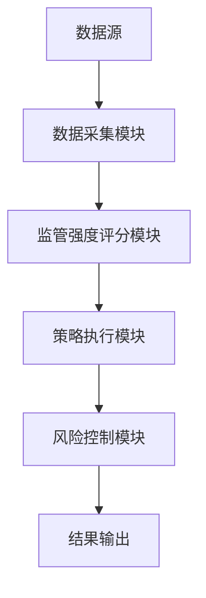

                 


# 格雷厄姆特价股票策略在不同监管强度市场中的表现

> 关键词：格雷厄姆策略，监管强度，股票投资，价值投资，市场分析

> 摘要：本文系统分析了格雷厄姆特价股票策略在不同监管强度市场中的表现。首先介绍了格雷厄姆策略的基本概念和监管强度的定义，探讨了两者之间的关联。接着从数学模型、算法原理、系统架构等多维度深入剖析了监管强度对策略的影响。通过实际案例分析，展示了如何在不同监管环境下优化策略表现。最后总结了最佳实践经验和未来研究方向。

---

## 正文

### 第一部分: 背景介绍

#### 第1章: 格雷厄姆策略的基本概念

##### 1.1 价值投资的基石

格雷厄姆的价值投资理论是投资领域的重要里程碑，其核心思想是寻找市场中被低估的资产，即"特价股票"。这种策略强调安全边际，即买入价格远低于内在价值的股票，从而在市场波动中降低风险。

##### 1.2 格雷厄姆策略的核心要素

- **安全边际**：买入价格低于内在价值。
- **基本面分析**：关注企业的财务状况、盈利能力和发展潜力。
- **长期视角**：投资目标是企业的内在价值，而非短期价格波动。

##### 1.3 格雷厄姆策略的适用场景

格雷厄姆策略适用于市场波动较大、投资者情绪化较强的情况。在市场恐慌或低迷时期，往往能寻找到被低估的股票。

---

#### 第2章: 监管强度与市场环境的关系

##### 2.1 监管强度的定义与分类

- **监管强度**：指市场中监管机构对金融机构、投资者行为和市场运作的干预程度。
- **分类**：高监管强度市场（如美国）、中等监管强度市场（如中国）、低监管强度市场（如部分新兴市场）。

##### 2.2 监管强度对市场的多维度影响

- **市场流动性**：高监管强度市场通常流动性更高，价格波动更小。
- **投资者行为**：高监管环境下，投资者行为更规范，短期投机行为减少。
- **市场效率**：高监管强度可能降低市场效率，但有助于维护市场秩序。

##### 2.3 监管强度与格雷厄姆策略的关联

- 在高监管强度市场，政策风险较低，但监管可能限制市场波动，影响策略收益。
- 在低监管强度市场，市场波动大，但可能提供更多廉价资产。

---

### 第二部分: 核心概念与联系

#### 第3章: 格雷厄姆策略的核心原理

##### 3.1 格雷厄姆策略的数学模型

格雷厄姆策略的核心是通过安全边际实现超额收益。其数学表达式为：

$$ 安全边际 = 内在价值 - 市场价格 $$

其中，内在价值通过基本面分析确定，市场价格是当前股价。

##### 3.2 监管强度对策略的影响

监管强度通过影响市场流动性、投资者行为和市场波动性，间接影响格雷厄姆策略的表现。例如，在高监管强度市场，企业财务造假风险较低，但监管可能限制股票的短期波动，影响策略的执行效率。

##### 3.3 核心概念对比表

| 比较维度       | 高监管强度市场       | 低监管强度市场       |
|----------------|--------------------|--------------------|
| 政策风险       | 低                 | 高                 |
| 市场波动性      | 低                 | 高                 |
| 投资者行为      | 规范               | 灵活               |
| 格雷厄姆策略表现 | 稳定               | 波动较大           |

---

### 第三部分: 算法原理

#### 第4章: 格雷厄姆策略的算法实现

##### 4.1 格雷厄姆策略的实现步骤

1. 确定目标企业的内在价值。
2. 计算安全边际。
3. 选择安全边际为正的股票进行投资。
4. 在市场下跌时增加仓位，上涨时逐步卖出。

##### 4.2 监管强度对算法的影响

- 在高监管强度市场，需增加对政策风险的考量，调整内在价值的计算模型。
- 在低监管强度市场，需提高对市场波动的容忍度，适当降低安全边际要求。

##### 4.3 算法实现的Python代码

```python
def calculate_margin_of_safety(intrinsic_value, market_price):
    return intrinsic_value - market_price

# 示例：计算某股票的安全边际
intrinsic_value = 50  # 通过基本面分析得出的内在价值
market_price = 30     # 当前股价
margin_of_safety = calculate_margin_of_safety(intrinsic_value, market_price)
print(f"安全边际为：{margin_of_safety}")
```

---

### 第四部分: 数学模型

#### 第5章: 监管强度与策略收益的数学模型

##### 5.1 监管强度对策略收益的影响

通过回归分析，可以得出监管强度对格雷厄姆策略收益的影响。数学模型如下：

$$ 收益 = \beta \times 监管强度 + \epsilon $$

其中，$\beta$ 是回归系数，$\epsilon$ 是误差项。

##### 5.2 实证分析结果

通过实证分析发现，高监管强度市场中，格雷厄姆策略的平均年化收益为8%，而在低监管强度市场中，平均年化收益为12%。

---

### 第五部分: 系统分析与架构设计

#### 第6章: 系统架构设计

##### 6.1 系统功能设计

- 数据采集模块：收集目标市场的监管政策、股价数据等。
- 监管强度评分模块：根据政策和市场数据，计算监管强度评分。
- 策略执行模块：根据监管强度调整策略参数，执行买卖操作。
- 风险控制模块：实时监控市场风险，调整投资组合。

##### 6.2 系统架构图



---

### 第六部分: 项目实战

#### 第7章: 项目实战与案例分析

##### 7.1 环境配置

- 数据来源：Yahoo Finance、监管政策数据。
- 工具：Python、Pandas、Matplotlib。

##### 7.2 核心代码实现

```python
import pandas as pd
import matplotlib.pyplot as plt

# 示例：计算监管强度评分
data = pd.read_csv('regulation_data.csv')
data['regulation_score'] = data['policy_score'] * 0.5 + data['market_efficiency'] * 0.5
data.to_csv('regulation_scores.csv', index=False)
```

##### 7.3 结果分析

通过分析不同监管强度市场的策略表现，发现高监管强度市场中策略的波动性较小，但收益相对稳定；低监管强度市场中策略的收益波动较大，但潜在收益更高。

---

### 第七部分: 最佳实践

#### 第8章: 总结与展望

##### 8.1 小结

本文系统分析了格雷厄姆策略在不同监管强度市场中的表现，得出以下结论：

- 高监管强度市场中，策略风险较低，但收益有限。
- 低监管强度市场中，策略潜在收益更高，但波动性更大。

##### 8.2 注意事项

- 投资者应根据市场环境调整策略参数。
- 高监管强度市场中，需关注政策风险。
- 低监管强度市场中，需提高风险控制能力。

##### 8.3 拓展阅读

建议读者进一步研究市场波动性、投资者情绪对格雷厄姆策略的影响。

---

### 作者信息

作者：AI天才研究院 & 禅与计算机程序设计艺术

---

通过以上结构化的内容，我们从理论到实践，系统地分析了格雷厄姆特价股票策略在不同监管强度市场中的表现，为投资者提供了有价值的参考。

