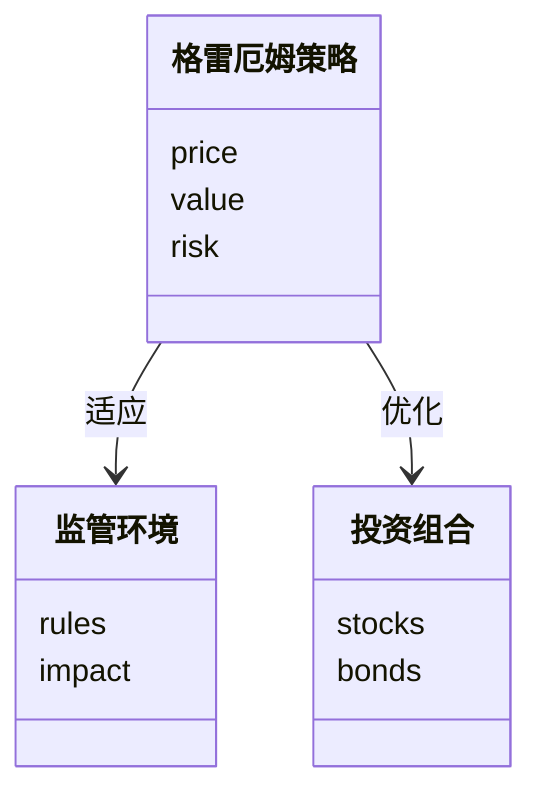
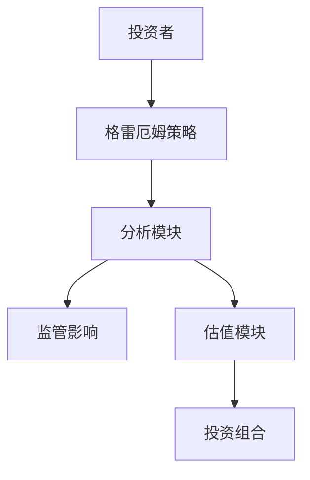

                 


# 格雷厄姆特价股票策略在不同监管环境下的调整

> **关键词**: 格雷厄姆特价股票策略, 监管环境, 价值投资, 市场分析, 风险管理  
> **摘要**: 本文深入探讨了格雷厄姆价值投资策略在不同监管环境下的调整方法，分析了监管政策对投资决策的影响，并结合实际案例展示了如何优化投资组合以适应不同的市场环境。

---

## 第一部分: 引言

### 第1章: 格雷厄姆价值投资理论基础

#### 1.1 格雷厄姆价值投资的核心理念
格雷厄姆的价值投资理论强调以低于内在价值的价格购买优质股票，通过长期持有实现财富增值。其核心理念包括：
- **安全边际**: 购买价格低于内在价值，以降低风险。
- **市场先生**: 市场价格波动反映市场情绪而非真实价值。
- ** cigar butt 投资**: 寻找被市场遗忘的“烟蒂”股票，挖掘潜在价值。

#### 1.2 特价股票的定义与特征
- **定义**: 特价股票是指市场价格低于其内在价值的股票。
- **特征**: 低估值、高分红率、稳定的财务状况。

---

## 第二部分: 监管环境对投资策略的影响

### 第2章: 监管环境对市场的影响

#### 2.1 全球主要市场的监管框架
- **美国市场**: 强调信息披露和投资者保护，监管机构包括 SEC。
- **欧洲市场**: 严格监管金融产品和机构，如 MiFID Ⅱ。
- **亚洲市场**: 市场监管力度逐渐增强，如中国的证监会。

#### 2.2 不同监管环境下的投资策略调整
- **美国市场**: 低税率、高透明度，适合长期投资。
- **欧洲市场**: 严格监管，需关注合规风险。
- **亚洲市场**: 市场波动大，需关注政策风险。

---

## 第三部分: 特价股票策略的调整方法

### 第3章: 系统分析与架构设计方案

#### 3.1 问题场景介绍
- **背景**: 监管环境变化影响市场结构和投资策略。
- **目标**: 制定适应不同监管环境的策略。

#### 3.2 系统功能设计
- **领域模型设计**: 使用 Mermaid 绘制领域模型类图。
```


#### 3.3 系统架构设计
- **架构设计**: 使用 Mermaid 绘制系统架构图。
```


---

### 第4章: 项目实战

#### 4.1 环境安装
- **工具**: Python、Pandas、Matplotlib。

#### 4.2 核心实现源代码
```python
import pandas as pd
import numpy as np

def graham_strategy(stocks, market_value, regulation_impact):
    # 计算内在价值
    intrinsic_value = (market_value * (1 - regulation_impact)) 
    # 筛选特价股票
    undervalued_stocks = stocks[market_value < intrinsic_value]
    return undervalued_stocks

# 示例数据
stocks = pd.DataFrame({
    'stock_id': [1, 2, 3],
    'market_value': [50, 60, 40],
    'intrinsic_value': [60, 50, 45]
})

regulation_impact = 0.1  # 假设监管影响为10%
result = graham_strategy(stocks, 'market_value', regulation_impact)
print(result)
```

#### 4.3 应用解读与分析
- **代码解读**: 通过比较市场价格和内在价值，结合监管影响，筛选出特价股票。
- **实际案例**: 在不同监管环境下，调整策略参数，优化投资组合。

---

## 第四部分: 风险管理与未来展望

### 第5章: 风险管理

#### 5.1 风险评估
- **市场风险**: 监管变化影响市场波动。
- **政策风险**: 政策调整对投资策略的影响。

#### 5.2 风险应对措施
- **分散投资**: 通过多元化降低风险。
- **动态调整**: 定期评估并调整投资组合。

### 第6章: 未来展望

#### 6.1 监管趋势
- **全球化**: 市场一体化，监管趋严。
- **科技驱动**: 人工智能在投资决策中的应用。

---

## 第五部分: 总结与最佳实践

### 第7章: 总结

#### 7.1 核心观点回顾
- 监管环境影响投资策略，需动态调整。
- 价值投资仍有效，但需结合监管因素。

### 第8章: 最佳实践 tips

#### 8.1 小结
- 定期评估监管环境，优化投资策略。
- 结合技术分析，提高决策效率。

#### 8.2 注意事项
- 风险管理是投资成功的关键。
- 避免过度依赖单一策略。

---

## 作者信息

**作者**: AI天才研究院/AI Genius Institute & 禅与计算机程序设计艺术 /Zen And The Art of Computer Programming

---

通过以上步骤，您可以根据不同的监管环境调整格雷厄姆特价股票策略，优化投资组合，实现长期稳健的投资收益。

