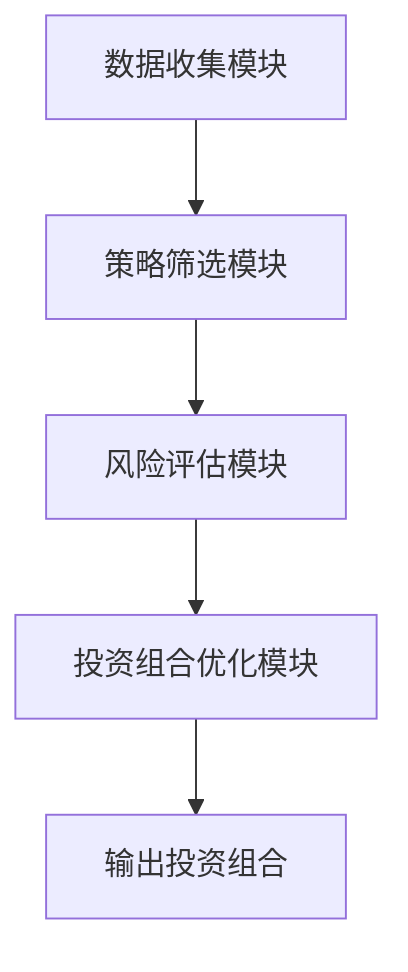
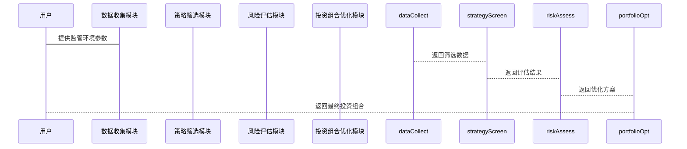

                 

# 格雷厄姆特价股票策略在不同监管环境下的适应

> 关键词：价值投资、格雷厄姆、监管环境、股票策略、安全边际、内在价值

> 摘要：本文深入探讨了格雷厄姆的价值投资策略在不同监管环境下的适应性。通过分析监管政策对市场结构和投资策略的影响，结合数学模型和实际案例，展示了如何在不同监管环境下调整和优化价值投资策略，以实现稳健的投资回报。

---

## 第一部分：价值投资概述

### 第1章：价值投资的定义与历史发展

#### 1.1 价值投资的基本定义

价值投资是一种以基本面分析为基础的投资策略，旨在通过识别市场价格低于其内在价值的股票，实现长期稳健的投资回报。其核心理念是购买被市场低估的资产，等待其价值回归。

- **1.1.1 价值投资的核心理念**
  - 市场先生理论：市场价格反映市场的非理性波动，而非内在价值。
  - 安全边际：买入价格低于内在价值，以降低投资风险。

- **1.1.2 价值投资的起源与发展**
  - 由本杰明·格雷厄姆在20世纪初提出，经过戴维·多德等人的发展，成为现代价值投资的基础。
  - 格雷厄姆的学生彼得·林奇和沃伦·巴菲特进一步完善了这一策略。

#### 1.2 格雷厄姆的投资策略

- **1.2.1 格雷厄姆的投资哲学**
  - 避免情绪化投资，注重理性分析。
  - 以安全边际为核心，降低投资风险。

- **1.2.2 安全边际的概念**
  - 安全边际=内在价值-市场价格。
  - 通过安全边际的计算，确保买入价格远低于内在价值，以应对市场的不确定性。

- **1.2.3 内在价值的计算方法**
  - 格雷厄姆采用现金流折现法，将未来现金流折现，计算出企业的内在价值。

- **1.2.4 格雷厄姆的经典筛选公式**
  - 格雷厄姆筛选法：通过一系列财务指标筛选出具有投资价值的股票。
  - 典型指标包括：市盈率低于15，市净率低于1.5，股息率稳定等。

---

### 第2章：监管环境对投资策略的影响

#### 2.1 不同国家的监管框架

- **2.1.1 美国的监管体系**
  - 美国证券交易委员会（SEC）负责监管资本市场，确保信息披露的透明性。
  - 投资基金需遵守严格的合规要求，如注册、披露和风险控制。

- **2.1.2 欧盟的监管体系**
  - 欧盟金融监管框架强调透明度和投资者保护，如《偿付能力指令》和《金融工具市场指令》（MiFID）。
  - 对机构投资者和散户投资者实行分类监管，确保市场公平。

- **2.1.3 新兴市场的监管特点**
  - 监管框架不完善，市场波动性大。
  - 政治和经济政策变化对市场影响显著，投资者需谨慎评估。

#### 2.2 监管政策对投资策略的影响

- **2.2.1 监管政策对市场结构的影响**
  - 市场结构的变化影响股票流动性，进而影响股票价格。
  - 例如，高频交易的普及可能导致市场短期波动加剧。

- **2.2.2 监管变化对投资策略的调整**
  - 新的监管政策可能导致某些投资策略的失效，需要及时调整。
  - 例如，金融杠杆的限制可能迫使投资者降低杠杆率，从而影响投资组合的构成。

---

## 第二部分：价值投资的核心概念

### 第3章：安全边际与内在价值

#### 3.1 安全边际的定义与作用

- **3.1.1 安全边际的定义**
  - 安全边际=内在价值-市场价格。
  - 通过安全边际的计算，确保买入价格远低于内在价值，以降低投资风险。

- **3.1.2 安全边际在不同市场环境下的应用**
  - 在牛市中，市场情绪高涨，安全边际较小，需谨慎选择投资标的。
  - 在熊市中，市场情绪低落，安全边际较大，可积极布局优质资产。

#### 3.2 内在价值的计算模型

- **3.2.1 现金流折现法**
  - 内在价值=Σ(FCF/ (1 + r)^t)
  - 其中，FCF为自由现金流，r为折现率，t为时间。

- **3.2.2 市盈率与市净率的应用**
  - 市盈率=股价/每股收益。
  - 市净率=股价/每股净资产。
  - 通过比较市盈率和市净率的合理范围，判断股票是否被低估。

---

### 第4章：公司基本面分析

#### 4.1 公司财务报表分析

- **4.1.1 利润表分析**
  - 收入、成本、利润的变化趋势。
  - 净利润是衡量公司盈利能力的核心指标。

- **4.1.2 资产负债表分析**
  - 资产、负债、所有者权益的结构。
  - 重点关注流动资产和流动负债，评估公司的短期偿债能力。

- **4.1.3 现金流量表分析**
  - 经营活动、投资活动、筹资活动的现金流情况。
  - 重点关注经营活动现金流，反映公司的盈利质量。

#### 4.2 行业分析与竞争地位评估

- **4.2.1 行业生命周期分析**
  - 行业处于幼稚期、成长期、成熟期还是衰退期。
  - 成熟期行业更具稳定性，衰退期行业风险较高。

- **4.2.2 竞争优势的评估方法**
  - 核心竞争力：技术、品牌、成本优势等。
  - 市场占有率：反映公司在行业中的地位。

---

## 第三部分：价值投资的数学模型

### 第5章：内在价值计算模型

#### 5.1 现金流折现法的数学模型

$$
\text{内在价值} = \sum_{t=1}^{n} \frac{\text{FCF}_t}{(1 + r)^t}
$$

- **公式说明：**
  - FCF_t：第t年的自由现金流。
  - r：折现率，通常采用WACC（加权平均资本成本）。
  - n：预测的年数，通常为5-10年。

#### 5.2 市盈率与市净率的应用

- **市盈率公式：**
$$
\text{市盈率} = \frac{\text{股价}}{\text{每股收益}}
$$

- **市净率公式：**
$$
\text{市净率} = \frac{\text{股价}}{\text{每股净资产}}
$$

- **合理范围：**
  - 市盈率低于15，市净率低于2，可能表明股票被低估。

---

## 第四部分：系统分析与架构设计

### 第6章：价值投资策略的算法实现

#### 6.1 问题场景介绍

- 投资者需要在不同监管环境下，筛选出具有投资价值的股票。
- 监管政策的变化可能影响股票的流动性、估值和风险。

#### 6.2 系统功能设计

- **数据收集模块：**
  - 收集历史股价、财务数据、监管政策等信息。
  - 使用数据库存储结构化数据，非结构化数据如新闻、评论进行文本挖掘。

- **策略筛选模块：**
  - 根据格雷厄姆筛选公式，筛选出符合条件的股票。
  - 计算安全边际，评估投资价值。

- **风险评估模块：**
  - 结合监管环境，评估投资风险。
  - 使用蒙特卡洛模拟等方法，预测可能的市场波动。

- **投资组合优化模块：**
  - 根据风险承受能力和收益目标，优化投资组合。
  - 考虑监管环境对组合的影响，如流动性和税收。

---

### 第7章：系统架构设计

#### 7.1 系统架构设计

#### 7.2 系统接口设计

- 数据接口：与金融数据源（如Yahoo Finance、彭博社）对接，获取实时数据。
- 用户接口：提供友好的操作界面，用户可输入参数，查看分析结果。

#### 7.3 系统交互流程

---

## 第五部分：项目实战与案例分析

### 第8章：不同监管环境下的策略调整

#### 8.1 美国市场的策略调整

- **案例分析：2020年新冠疫情后的市场**
  - 美国政府的财政刺激政策导致市场流动性增加，可能推高股价。
  - 格雷厄姆策略需调整：适当降低安全边际要求，但需警惕短期波动。

#### 8.2 欧盟市场的策略调整

- **案例分析：欧盟碳中和政策的影响**
  - 监管政策推动绿色能源投资，相关行业可能被市场低估。
  - 投资者需关注政策变化，提前布局受益行业。

#### 8.3 新兴市场的策略调整

- **案例分析：印度市场的数字支付行业**
  - 新兴市场监管政策变化快，需密切关注政策动向。
  - 投资策略：选择具有强大竞争优势和增长潜力的企业。

---

### 第9章：案例分析与经验总结

#### 9.1 案例分析

- **案例一：美国市场中的苹果公司**
  - 市盈率：低于行业平均水平。
  - 市净率：低于行业平均水平。
  - 结论：苹果公司具备较高的安全边际，适合价值投资。

- **案例二：新兴市场中的中国科技公司**
  - 市盈率较高，但市净率合理。
  - 结论：需关注监管政策变化，谨慎评估投资风险。

#### 9.2 经验总结

- 监管环境对投资策略的影响不容忽视。
- 在不同监管环境下，需灵活调整策略，结合定量分析与定性分析。
- 保持对市场和政策的敏感性，及时调整投资组合。

---

## 第六部分：最佳实践与注意事项

### 第10章：最佳实践

- **分散投资：** 不将所有资金投入单一行业或地区，降低风险。
- **定期评估：** 定期检查投资组合，调整以适应监管变化。
- **持续学习：** 关注监管政策变化和市场动态，提升投资能力。

### 第11章：小结与展望

- 小结：格雷厄姆的价值投资策略在不同监管环境下仍具有较强的适应性，但需结合监管政策进行调整。
- 展望：未来，随着全球化的深入，投资者需更加关注跨国监管协调和市场联动性。

---

## 第七部分：注意事项与拓展阅读

### 第12章：注意事项

- **监管风险：** 监管政策的变化可能对投资策略产生重大影响，需提前制定应对方案。
- **市场流动性：** 在新兴市场，市场流动性可能较低，影响股票交易的便捷性。
- **数据准确性：** 数据来源的可靠性直接影响分析结果，需选择权威数据源。

### 第13章：拓展阅读

- **书籍推荐：**
  - 《证券分析》（Benjamin Graham & David Dodd）
  - 《巴菲特的智慧》（Philip Fisher）
- **在线资源：**
  - 投资论坛（如雪球、巴菲特俱乐部）
  - 专业财经网站（如晨星、标普）

---

## 作者信息

作者：AI天才研究院/AI Genius Institute & 禅与计算机程序设计艺术 /Zen And The Art of Computer Programming

---

感谢您的耐心阅读，希望本文对您理解格雷厄姆价值投资策略在不同监管环境下的适应有所帮助！

