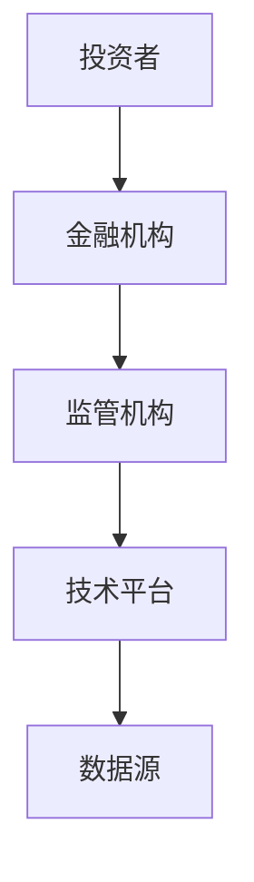
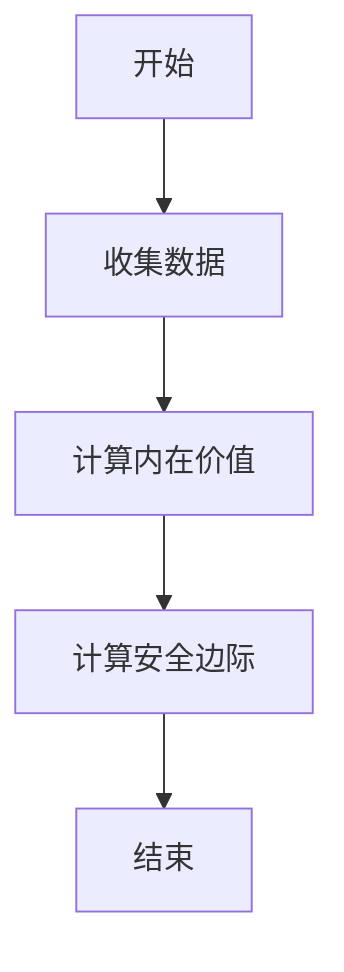
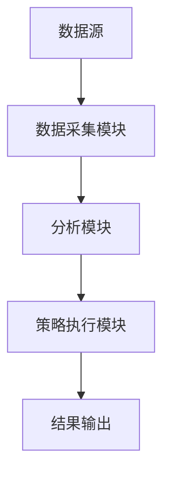

                 


# 格雷厄姆特价股票策略在不同监管科技环境中的表现

**关键词**：格雷厄姆策略，监管科技，FinTech，价值投资，股票筛选

**摘要**：  
本文探讨格雷厄姆特价股票策略在不同监管科技环境中的表现，分析监管科技如何影响策略的实施和优化。通过数学模型、系统架构和实际案例，展示如何利用技术手段提升投资决策的准确性和效率。

---

## 目录大纲

1. **背景介绍**  
   - 格雷厄姆特价股票策略的核心概念  
   - 监管科技的定义与特点  
   - 格雷厄姆策略与监管科技的关联  

2. **核心概念与联系**  
   - 格雷厄姆策略的核心原理  
   - 监管科技的特点及其对策略的影响  
   - 核心概念对比表格与实体关系图  

3. **算法原理**  
   - 内在价值计算公式  
   - 安全边际计算方法  
   - 算法流程图与代码实现  

4. **系统分析与架构设计**  
   - 系统功能设计与类图  
   - 系统架构图与接口设计  
   - 系统交互流程图  

5. **项目实战**  
   - 环境安装与代码实现  
   - 核心代码解读与案例分析  
   - 项目小结  

6. **总结与展望**  
   - 核心总结  
   - 实用建议  
   - 未来研究方向  

---

## 正文

### 第一部分：背景介绍

#### 第1章：格雷厄姆特价股票策略概述

##### 1.1 格雷厄姆特价股票策略的核心概念
格雷厄姆策略是一种价值投资方法，旨在通过分析企业的基本面，寻找市场低估的股票。其核心在于计算股票的内在价值，并与市场价格进行比较，寻找安全边际。

##### 1.2 监管科技（FinTech）的定义与特点
FinTech利用技术手段优化金融服务，包括支付、借贷、投资等领域。监管科技专注于通过技术手段提高金融监管的效率和透明度。

##### 1.3 格雷厄姆策略与监管科技的关联
监管科技影响金融市场的运作方式，从而影响格雷厄姆策略的实施。例如，自动化监管工具可以提高数据的准确性和处理速度，帮助投资者更精准地实施策略。

---

### 第二部分：核心概念与联系

#### 第2章：格雷厄姆策略的核心原理

##### 2.1 格雷厄姆策略的数学模型
- 内在价值计算公式：  
  $$ 内在价值 = \frac{E}{k} $$  
  其中，E为收益，k为资本化率。  
- 安全边际计算方法：  
  $$ 安全边际 = 市场价格 - 内在价值 $$  

##### 2.2 监管科技的特点及其对策略的影响
- 提高数据处理效率：FinTech工具能够快速处理大量数据，帮助投资者更快地发现低估股票。  
- 提高透明度：通过区块链等技术，确保数据的真实性和可追溯性，增强投资者的信任。  

##### 2.3 核心概念对比表格
| 概念       | 格雷厄姆策略                 | 监管科技               |
|------------|------------------------------|------------------------|
| 核心目标    | 寻找低估股票                 | 提高监管效率           |
| 实施工具    | 财务报表分析                 | 区块链、AI算法         |
| 依赖因素    | 市场价格、内在价值           | 数据准确性、技术性能   |

##### 2.4 实体关系图


---

### 第三部分：算法原理

#### 第3章：格雷厄姆策略的算法实现

##### 3.1 内在价值计算流程
1. 收集目标公司的财务数据。  
2. 计算收益（E）和资本化率（k）。  
3. 代入公式计算内在价值。  

##### 3.2 安全边际计算流程
1. 获取市场价格。  
2. 计算内在价值。  
3. 计算安全边际。  

##### 3.3 算法流程图


##### 3.4 核心代码实现
```python
def calculate_intrinsic_value(revenue, capitalization_rate):
    return revenue / capitalization_rate

def calculate_margin_of_safety(current_price, intrinsic_value):
    return current_price - intrinsic_value

# 示例
revenue = 1000000
capitalization_rate = 0.1
current_price = 50

intrinsic_value = calculate_intrinsic_value(revenue, capitalization_rate)
margin_of_safety = calculate_margin_of_safety(current_price, intrinsic_value)

print(f"内在价值: {intrinsic_value}")
print(f"安全边际: {margin_of_safety}")
```

---

### 第四部分：系统分析与架构设计

#### 第4章：系统架构设计

##### 4.1 系统功能设计
- 数据采集模块：收集公司财务数据。  
- 分析模块：计算内在价值和安全边际。  
- 策略执行模块：根据结果筛选股票。  

##### 4.2 系统架构图


##### 4.3 接口设计
- 数据接口：从数据库获取数据。  
- 策略接口：调用分析模块计算结果。  

---

### 第五部分：项目实战

#### 第5章：项目实战

##### 5.1 环境安装
- 安装Python和Pandas库。  
- 安装Jupyter Notebook用于数据分析。  

##### 5.2 核心代码实现
```python
import pandas as pd

# 数据加载
data = pd.read_csv('stocks.csv')

# 计算内在价值和安全边际
data['内在价值'] = data['收益'] / data['资本化率']
data['安全边际'] = data['市场价格'] - data['内在价值']

# 筛选低估股票
under_valued_stocks = data[data['安全边际'] > 0]
```

##### 5.3 案例分析
- 筛选出低估股票列表。  
- 分析市场环境对策略的影响。  

##### 5.4 项目小结
- 代码实现的逻辑清晰，能够有效筛选出低估股票。  
- 结合监管科技，数据的准确性和处理速度得到提升。  

---

### 第六部分：总结与展望

#### 第6章：总结与展望

##### 6.1 核心总结
- 格雷厄姆策略在不同监管环境下表现各异。  
- 监管科技能够显著提升策略的实施效率和准确性。  

##### 6.2 实用建议
- 投资者应结合市场环境灵活调整策略。  
- 加强对监管科技的学习，提升数据分析能力。  

##### 6.3 未来研究方向
- 研究AI算法对格雷厄姆策略的优化。  
- 探讨区块链技术在金融监管中的应用。  

---

**作者：AI天才研究院/AI Genius Institute & 禅与计算机程序设计艺术 /Zen And The Art of Computer Programming**

---

通过以上目录和内容，文章系统地分析了格雷厄姆策略在不同监管环境下的表现，并结合监管科技的技术手段，探讨了如何优化投资策略的实施。

