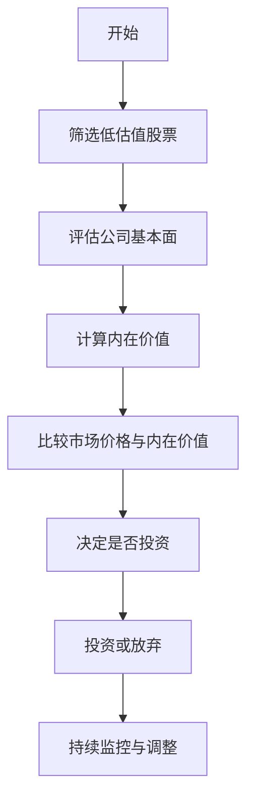
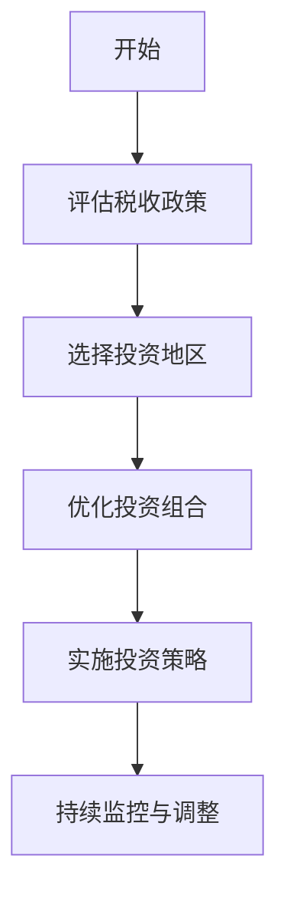

                 

# 格雷厄姆特价股票策略在不同税收环境下的调整

> 关键词：格雷厄姆策略，价值投资，税收环境，股票投资，投资策略

> 摘要：本文深入探讨了格雷厄姆特价股票策略在不同税收环境下的调整方法。首先介绍了格雷厄姆策略的核心概念和其在投资中的重要性，然后分析了税收环境对投资决策的影响，最后详细讲解了在不同税收政策下如何调整投资策略，以实现最大化的投资回报。

---

## 第一部分: 格雷厄姆特价股票策略基础

### 第1章: 格雷厄姆特价股票策略概述

#### 1.1 格雷厄姆投资理论的核心概念

格雷厄姆的价值投资理论是投资领域的重要基石，其核心在于寻找市场低估的股票，通过安全边际来实现长期稳定的收益。

- **安全边际**：安全边际是指股票的市场价格低于其内在价值的部分。格雷厄姆认为，通过购买价格低于内在价值的股票，投资者可以降低风险并获得超额收益。
- **内在价值**：内在价值是基于公司基本面分析得出的股票真实价值，与市场波动无关。格雷厄姆强调，投资者应关注公司的财务状况，如盈利能力、资产质量等。

**表格：格雷厄姆策略的核心指标对比**

| 指标          | 定义与重要性                          |
|---------------|--------------------------------------|
| 市盈率 (P/E)  | 价格与收益的比率，衡量估值合理性      |
| 市净率 (P/B)  | 价格与净资产的比率，评估资产价值        |
| 股息率        | 每股股息与股价的比率，衡量收益能力      |
| 内在价值      | 公司未来现金流的现值，评估长期价值      |

#### 1.2 格雷厄姆策略的历史发展与现状

格雷厄姆的投资理论起源于20世纪，经过数十年的发展，已经成为价值投资的重要流派。其核心思想是寻找“烟蒂股”，即那些被市场忽视、价格远低于内在价值的股票。

**流程图：格雷厄姆策略的基本流程**

---

### 第2章: 税收环境对投资的影响

#### 2.1 税收对股票投资的多维度影响

税收是投资决策中不可忽视的因素，尤其是在股票投资中，所得税、资本利得税和股息税都会对投资收益产生重大影响。

- **所得税**：部分国家对股息收入征收所得税，这会降低投资者的实际收益。
- **资本利得税**：资本利得税是对股票买卖差价征税，税率因地区而异，通常长期持有的资本利得税较低。
- **股息税**：股息税是针对股息收入的税收，不同国家的税率和计算方式不同。

**表格：主要国家的税收政策对比**

| 国家   | 所得税税率 | 资本利得税税率 | 股息税税率 |
|--------|------------|-----------------|------------|
| 美国   | 0%-37%     | 0%-20%         | 0%-15%     |
| 英国   | 0%-45%     | 0%-20%         | 0%-30%     |
| 中国   | 3%-30%     | 0%-15%         | 0%-20%     |

---

### 第3章: 格雷厄姆策略在不同税收环境下的调整

#### 3.1 税收对格雷厄姆策略的影响分析

税收政策的差异直接影响格雷厄姆策略的实施效果。例如，在高税率地区，投资者需要更加注重税后的收益，而低税率地区则可以更灵活地进行投资。

- **投资回报的影响**：税率越高，税后收益越低，这会增加投资成本，影响投资决策。
- **投资组合的调整**：为了降低税收影响，投资者可能需要调整投资组合的构成，选择税收优惠的地区或产品。

#### 3.2 不同税收环境下的策略调整方法

根据不同的税收环境，投资者可以采取以下策略：

- **优化资产配置**：通过分散投资，降低单一资产的税收负担。
- **利用税收优惠**：选择税收优惠的地区或产品，如某些国家的税收减免政策。
- **长期持有策略**：长期持有的资本利得税通常较低，有助于降低税收成本。

**流程图：不同税收环境下的策略调整流程**

---

## 第二部分: 格雷厄姆策略在不同税收环境下的应用

### 第4章: 美国税收环境下的策略调整

#### 4.1 美国税收政策的特点

美国的税收政策相对复杂，但提供了许多税收优惠，尤其是长期资本利得税较低。

- **长期资本利得税**：美国的长期资本利得税最高为20%，低于短期资本利得税。
- **股息税**：股息税根据投资者的收入 bracket 确定，最高为15%。

#### 4.2 美国环境下的策略调整

投资者可以通过以下方式优化投资：

- **长期投资**：利用低税率的长期资本利得税。
- **税收亏损抵扣**：在投资亏损时，可以抵扣部分资本利得税。

---

### 第5章: 中国税收环境下的策略调整

#### 5.1 中国税收政策的特点

中国的税收政策相对简单，资本利得税通常为15%，股息税为20%。

- **资本利得税**：通常为15%，适用于个人投资者。
- **股息税**：通常为20%，但某些地区可能有税收优惠。

#### 5.2 中国环境下的策略调整

投资者可以采取以下策略：

- **选择税收优惠地区**：如某些经济特区或自贸区。
- **分散投资**：通过分散投资降低税收负担。

---

## 第三部分: 格雷厄姆策略在税收环境下的系统化实施

### 第6章: 数学模型与税收影响分析

#### 6.1 税收对投资回报的影响公式

假设某投资者购买一只股票，买入价为P，卖出价为Q，税率t。税后收益为：

$$
\text{税后收益} = (Q - P) \times (1 - t)
$$

#### 6.2 税收对投资组合的影响

通过构建数学模型，可以量化税收对投资组合的影响。例如，假设投资组合的预期收益为R，税率t，则税后收益为：

$$
\text{税后收益} = R \times (1 - t)
$$

---

## 第四部分: 实际案例分析

### 第7章: 案例分析：格雷厄姆策略在不同税收环境下的应用

#### 7.1 美国市场的案例

假设投资者在美股市场购买一只低估股票，买入价为$50，卖出价为$100，资本利得税为15%。税后收益为：

$$
\text{税后收益} = (100 - 50) \times (1 - 0.15) = 50 \times 0.85 = 42.5
$$

#### 7.2 中国市场案例

假设投资者在A股市场购买一只低估股票，买入价为10元，卖出价为20元，资本利得税为15%。税后收益为：

$$
\text{税后收益} = (20 - 10) \times (1 - 0.15) = 10 \times 0.85 = 8.5
$$

---

## 第五部分: 总结与展望

### 第8章: 总结与展望

#### 8.1 核心观点回顾

- 格雷厄姆策略的核心在于寻找低估股票，同时需要考虑税收环境的影响。
- 不同税收政策下，投资者需要调整投资策略，以实现最大化的税后收益。

#### 8.2 对未来研究的展望

未来的研究可以进一步探讨税收政策对公司估值的影响，以及如何在多税收环境中优化投资组合。

---

作者：AI天才研究院/AI Genius Institute & 禅与计算机程序设计艺术 /Zen And The Art of Computer Programming

