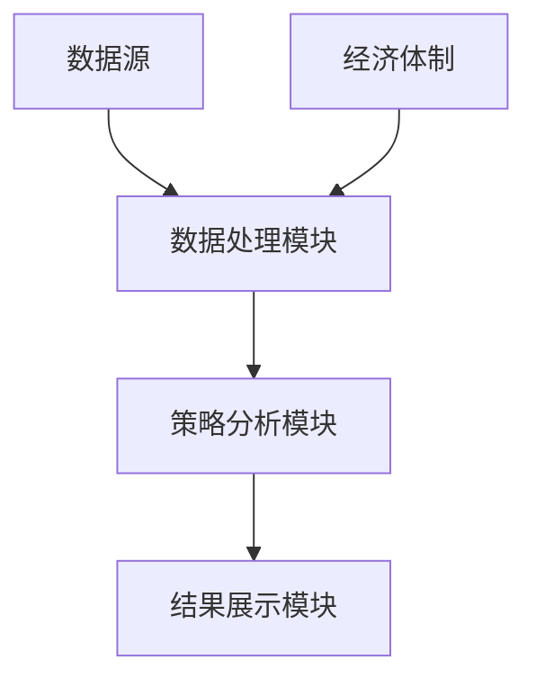

                 

# 格雷厄姆特价股票策略在不同经济体制下的表现

> 关键词：格雷厄姆、特价股票策略、经济体制、股票投资、价值投资

> 摘要：本文深入探讨了格雷厄姆的价值投资策略在不同经济体制下的表现，通过分析资本主义、社会主义和混合经济体制的特点，结合数学模型和实际案例，揭示了格雷厄姆策略在不同市场环境下的适用性和效果。

---

## 第1章 引言

### 1.1 格雷厄姆特价股票策略的背景

格雷厄姆的特价股票策略是价值投资的核心理念之一，强调通过分析企业的内在价值来寻找被市场低估的股票。这种策略在过去的几十年中被广泛应用于全球资本市场，并取得了显著的成果。然而，不同经济体制下的市场环境、政策干预和投资者行为可能会对策略的有效性产生重要影响。

### 1.2 研究的意义与价值

本文旨在探讨格雷厄姆策略在不同经济体制下的表现，分析其在不同市场环境中的适用性和效果。通过对比资本主义、社会主义和混合经济体制下的市场特点，本文试图为投资者提供更加全面和深入的投资策略指导。

### 1.3 文章结构

本文共分为以下几个部分：

1. 引言：介绍格雷厄姆策略的背景及其研究意义。
2. 核心概念与原理：详细讲解格雷厄姆策略的核心思想及其在不同经济体制下的表现。
3. 数学模型与算法原理：分析格雷厄姆策略的数学基础及其在不同经济体制下的应用。
4. 系统分析与架构设计：构建分析框架，展示不同经济体制下的市场特征。
5. 项目实战：通过具体案例分析，验证格雷厄姆策略在不同经济体制下的表现。
6. 总结与展望：总结研究成果并展望未来的研究方向。

---

## 第2章 核心概念与原理

### 2.1 格雷厄姆策略的核心思想

格雷厄姆的价值投资策略强调以低于内在价值的价格购买优质股票。他提出了“安全边际”概念，即以低于企业合理估值的价格进行投资，以降低风险并确保收益。

### 2.2 不同经济体制的特点

1. **资本主义经济体制**：市场自由、竞争充分，政府干预较少，市场效率较高。
2. **社会主义经济体制**：政府干预较多，市场由政策主导，经济稳定性较高。
3. **混合经济体制**：结合市场与政策，兼顾效率与公平。

### 2.3 经济体制对股票估值的影响

| 经济体制 | 核心特点 | 对股票估值的影响 | 对格雷厄姆策略的适用性 |
|----------|----------|------------------|-----------------------|
| 资本主义 | 市场自由、竞争充分 | 更依赖市场定价 | 高 |
| 社会主义 | 市场干预、政策导向 | 更受政策影响 | 中 |
| 混合经济 | 结合市场与政策 | 综合考虑市场与政策 | 中高 |

### 2.4 格雷厄姆策略与经济体制的关联性分析

1. **资本主义经济**：市场效率高，适合格雷厄姆策略的应用，但需警惕市场波动。
2. **社会主义经济**：政策干预较多，需关注政府动向，调整投资策略。
3. **混合经济**：结合市场与政策，适合灵活应用格雷厄姆策略。

---

## 第3章 数学模型与算法原理

### 3.1 格雷厄姆策略的数学模型

格雷厄姆策略的核心是计算股票的内在价值，通常使用市盈率、市净率等指标。公式如下：

$$
\text{市盈率} = \frac{\text{每股价格}}{\text{每股收益}}
$$

$$
\text{市净率} = \frac{\text{每股价格}}{\text{每股净资产}}
$$

### 3.2 不同经济体制下的数学模型应用

1. **资本主义经济**：市场定价主导，需关注市场情绪和市场效率。
2. **社会主义经济**：政策干预主导，需关注政府动向和政策变化。
3. **混合经济**：综合考虑市场与政策，需动态调整模型参数。

---

## 第4章 系统分析与架构设计

### 4.1 系统功能设计

1. **数据收集**：收集不同经济体制下的市场数据。
2. **数据处理**：清洗和转换数据，提取关键指标。
3. **策略分析**：应用格雷厄姆策略进行分析和比较。
4. **结果展示**：生成可视化报告，展示策略表现。

### 4.2 架构图

---

## 第5章 项目实战

### 5.1 美国市场案例分析

以美国市场为例，分析格雷厄姆策略在资本主义经济体制下的表现。通过具体数据和案例，验证策略的有效性。

### 5.2 中国市场案例分析

以中国市场为例，分析格雷厄姆策略在社会主义经济体制下的表现。通过对比分析，揭示政策干预对策略的影响。

### 5.3 日本市场案例分析

以日本市场为例，分析格雷厄姆策略在混合经济体制下的表现。通过动态调整模型参数，展示策略的灵活性和适应性。

---

## 第6章 总结与展望

### 6.1 研究总结

格雷厄姆策略在不同经济体制下的表现存在显著差异。资本主义经济体制下，策略表现最佳；社会主义经济体制下，策略需结合政策分析；混合经济体制下，策略具有较高的灵活性和适应性。

### 6.2 未来展望

未来研究可以进一步深入分析不同经济体制下的政策变化对策略的影响，探索更加灵活的投资策略，以应对复杂的市场环境。

---

## 第7章 注意事项和最佳实践

### 7.1 投资者注意事项

1. **市场干预**：关注政府政策和市场干预，及时调整投资策略。
2. **政策变化**：在政策主导的经济体制下，需动态调整策略。
3. **市场波动**：在市场主导的经济体制下，需警惕市场波动。

### 7.2 最佳实践

1. **多元化投资**：结合不同经济体制下的市场特点，进行多元化投资。
2. **动态调整**：根据市场变化和政策调整，及时优化投资组合。
3. **持续学习**：关注市场动态和政策变化，不断提升投资能力。

---

## 作者信息

作者：AI天才研究院/AI Genius Institute & 禅与计算机程序设计艺术 /Zen And The Art of Computer Programming

---

以上是《格雷厄姆特价股票策略在不同经济体制下的表现》的技术博客文章的完整大纲和内容。通过系统的分析和具体的案例，本文为投资者提供了在不同经济体制下应用格雷厄姆策略的深入指导。

