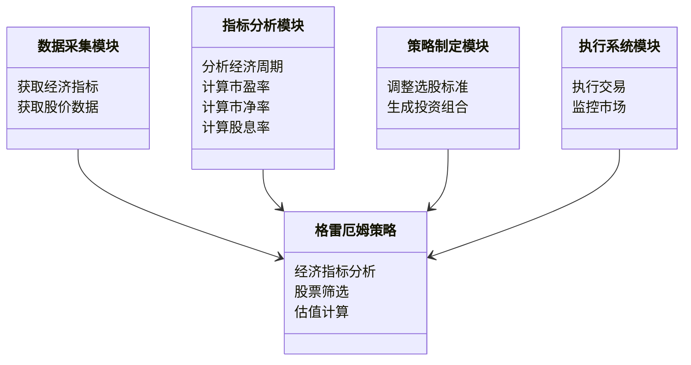

                 


# 格雷厄姆特价股票策略在不同经济周期的调整

**关键词**：格雷厄姆特价股票策略、经济周期、价值投资、市场分析、安全边际

**摘要**：本文深入探讨了格雷厄姆特价股票策略在不同经济周期中的应用与调整。通过分析经济周期对股市的影响，结合价值投资的核心理念，提出了在不同经济阶段优化选股标准和投资策略的方法。文章从理论基础、数学模型、系统架构到实战案例，全面阐述了如何在不同经济环境下有效应用格雷厄姆策略，帮助投资者在不同市场条件下实现稳健收益。

---

## 第1章: 格雷厄姆特价股票策略概述

### 1.1 格雷厄姆投资理论的核心思想

#### 1.1.1 价值投资的定义与核心理念
价值投资是一种以内在价值为导向的投资方法，强调以低于内在价值的价格买入优质资产。格雷厄姆在其著作《证券分析》中提出，股票不仅仅是一个数字，而是企业的一部分所有权。投资者应关注企业的基本面，寻找具有安全边际的股票。

**关键概念**：
- **内在价值**：股票的真实价值，基于企业的盈利能力、资产状况和行业地位。
- **安全边际**：买入价格与内在价值之间的差距，提供保护 against market volatility.

**对比表格**：

| 概念          | 描述                              |
|---------------|----------------------------------|
| 内在价值      | 股票的真实价值，基于企业基本面    |
| 安全边际      | 买入价格低于内在价值的部分        |

#### 1.1.2 格雷厄姆的安全边际概念
安全边际是格雷厄姆策略的核心，通过在市场恐慌时买入低估股票，降低投资风险。安全边际的存在使得投资者在市场下跌时仍能保持盈利。

#### 1.1.3 特价股票的定义与特点
特价股票是指市场价格远低于内在价值的股票，通常具有低市盈率、低市净率和高股息率的特点。这些股票往往被市场忽视或低估，具有较大的上涨潜力。

### 1.2 经济周期对投资策略的影响

#### 1.2.1 经济周期的定义与分类
经济周期分为四个阶段：繁荣、衰退、萧条和复苏。每个阶段的市场表现和企业盈利状况不同，影响股票的投资策略。

**对比表格**：

| 经济阶段   | 市场表现       | 企业盈利状况   |
|------------|---------------|----------------|
| 繁荣       | 股价上涨       | 盈利增长        |
| 衰退       | 股价下跌       | 盈利下降        |
| 萧条       | 股价底部震荡   | 盈利极低        |
| 复苏       | 股价逐步回升   | 盈利逐步恢复     |

#### 1.2.2 不同经济周期对股市的影响
在繁荣期，市场情绪乐观，股价上涨；衰退期，市场恐慌，股价下跌；萧条期，市场底部，股价震荡；复苏期，市场逐步回升，股价稳步增长。

#### 1.2.3 格雷厄姆策略在不同经济周期中的适用性
在繁荣期，格雷厄姆策略可能表现不佳，但在衰退和萧条期，其优势明显，能够捕捉低估股票。

---

## 第2章: 格雷厄姆特价股票策略的核心概念

### 2.1 格雷厄姆选股标准

#### 2.1.1 低市盈率股票的定义
市盈率（P/E）= 股价 / 每股收益。低市盈率股票通常被认为具有较高的安全边际。

**公式**：
$$ P/E = \frac{\text{股价}}{\text{每股收益}} $$

#### 2.1.2 低市净率股票的定义
市净率（P/B）= 股价 / 每股净资产。低市净率股票通常代表资产被低估。

**公式**：
$$ P/B = \frac{\text{股价}}{\text{每股净资产}} $$

#### 2.1.3 高股息率股票的定义
股息率 = 每股股息 / 股价。高股息率股票通常代表稳定的收益。

**公式**：
$$ \text{股息率} = \frac{\text{每股股息}}{\text{股价}} $$

### 2.2 经济周期与股票估值的关系

#### 2.2.1 股票估值的基本公式
内在价值 = 股东权益 + 流动资产 - 流动负债。

#### 2.2.2 经济周期对股票估值的影响
在衰退期，企业盈利下降，估值降低；在复苏期，企业盈利回升，估值上升。

#### 2.2.3 不同经济周期中的估值调整策略
根据经济周期调整估值模型参数，如在衰退期降低盈利预期。

---

## 第3章: 格雷厄姆特价股票策略的数学模型与算法

### 3.1 格雷厄姆价值评估模型

#### 3.1.1 市盈率模型
$$ P/E = \frac{\text{股价}}{\text{每股收益}} $$

#### 3.1.2 市净率模型
$$ P/B = \frac{\text{股价}}{\text{每股净资产}} $$

#### 3.1.3 股息率模型
$$ \text{股息率} = \frac{\text{每股股息}}{\text{股价}} $$

### 3.2 经济周期指标分析算法

#### 3.2.1 GDP增长率分析
GDP增长率是衡量经济周期的重要指标。当GDP增长率下降时，经济可能进入衰退期。

#### 3.2.2 失业率分析
高失业率通常对应经济衰退，低失业率对应经济繁荣。

#### 3.2.3 消费者价格指数（CPI）分析
高CPI表示通货膨胀，可能影响货币政策，进而影响股市。

### 3.3 格雷厄姆策略的数学公式

#### 3.3.1 市盈率计算公式
$$ P/E = \frac{\text{股价}}{\text{每股收益}} $$

#### 3.3.2 市净率计算公式
$$ P/B = \frac{\text{股价}}{\text{每股净资产}} $$

#### 3.3.3 内在价值计算公式
$$ \text{内在价值} = \text{股东权益} + \text{流动资产} - \text{流动负债} $$

---

## 第4章: 经济周期中的市场情绪分析

### 4.1 市场情绪对投资策略的影响

#### 4.1.1 市场情绪的定义与分类
市场情绪分为乐观和悲观两类，影响投资者的决策。

#### 4.1.2 市场情绪对股价的影响
在乐观情绪下，股价上涨；在悲观情绪下，股价下跌。

#### 4.1.3 市场情绪与格雷厄姆策略的结合
在市场恐慌时，格雷厄姆策略能够捕捉低估股票。

---

## 第5章: 系统分析与架构设计

### 5.1 问题场景介绍

#### 5.1.1 项目介绍
设计一个基于格雷厄姆策略的投资分析系统，能够根据经济周期调整选股标准。

### 5.1.2 系统功能设计

#### 5.1.2.1 领域模型（mermaid类图）


#### 5.1.3 系统架构设计（mermaid架构图）


---

## 第6章: 项目实战

### 6.1 环境安装

#### 6.1.1 安装Python和相关库
安装Python和Pandas、Matplotlib等库。

### 6.1.2 数据获取
从Yahoo Finance获取历史数据。

### 6.2 系统核心实现源代码

#### 6.2.1 经济指标分析
```python
import pandas as pd
import yfinance as yf

# 获取GDP数据
gdp_data = yf.download('GDP', start='2020-01-01')
```

#### 6.2.2 股票筛选
```python
def screen_stocks():
    stocks = ['AAPL', 'MSFT', 'GOOGL']
    data = yf.download(stocks, start='2020-01-01')
    # 计算市盈率
    pe = data['Adj Close'] / data['EPS']
    return pe
```

---

## 第7章: 总结与展望

### 7.1 总结
格雷厄姆策略在不同经济周期中的应用需要灵活调整选股标准，结合经济指标和市场情绪进行分析。

### 7.2 展望
未来的研究方向包括结合机器学习优化选股模型，以及探索多因子策略。

---

## 作者：AI天才研究院 & 禅与计算机程序设计艺术

---

**注意事项**：
- 在实际投资中，需结合多种因素进行决策。
- 本文仅为理论探讨，不构成投资建议。

---

