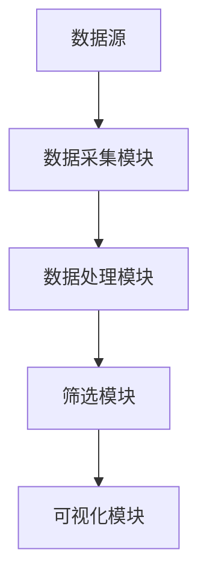
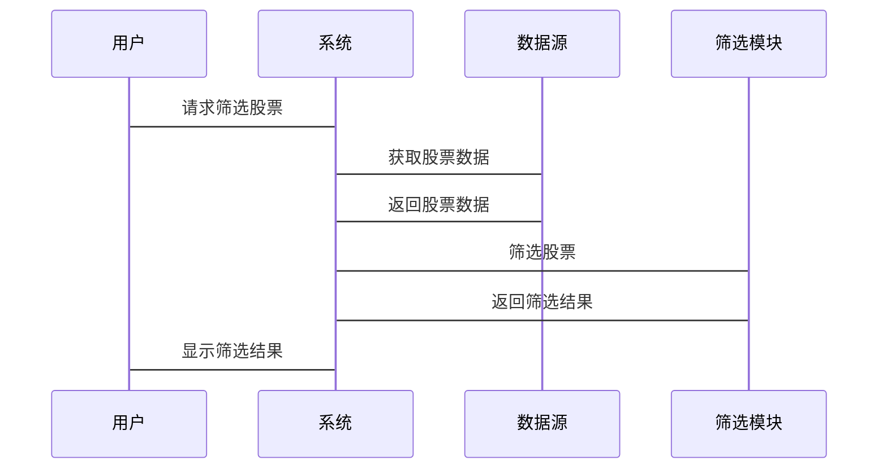

                 


# 格雷厄姆特价股票策略在不同规模公司中的应用

> 关键词：格雷厄姆投资理论，特价股票，价值投资，中小型企业，成长型企业，成熟企业

> 摘要：本文深入探讨了格雷厄姆的价值投资理论及其在不同规模公司中的应用。通过分析中小型企业、成长型企业及成熟企业的财务特征，结合数学模型和算法，详细讲解了格雷厄姆特价股票策略的实施方法，并通过实际案例分析，展示了如何在不同规模企业中应用该策略以实现投资收益最大化。

---

## 第一部分: 格雷厄姆特价股票策略概述

### # 第1章: 格雷厄姆价值投资理论基础

#### ## 1.1 价值投资的核心理念

##### ### 1.1.1 价值投资的定义与特点

价值投资是一种以公司基本面分析为基础的投资策略，强调购买价格低于其内在价值的股票。格雷厄姆是这一理论的奠基人，他提出的核心理念是“安全边际”。安全边际是指股票价格与内在价值之间的差距，通过寻找这种差距较大的股票，投资者可以在市场波动中获得超额收益。

**关键点：**
- **内在价值**：股票的真实价值，基于公司的财务状况和未来盈利能力。
- **安全边际**：股票价格与内在价值之间的差异，提供风险缓冲。

##### ### 1.1.2 格雷厄姆投资理论的起源与发展

格雷厄姆的投资理论起源于20世纪初，他在《证券分析》一书中系统阐述了价值投资的方法。他的理论强调对公司的财务报表进行深入分析，寻找那些被市场低估的股票。格雷厄姆的学生巴菲特进一步发展了他的理论，使其成为现代价值投资的基石。

**关键点：**
- **格雷厄姆的贡献**：奠定了价值投资的基础。
- **巴菲特的发展**：将格雷厄姆的理论应用于实际投资，取得了巨大成功。

##### ### 1.1.3 格雷厄姆投资理论的核心原则

格雷厄姆的理论主要包括以下核心原则：
1. **安全边际**：购买价格低于内在价值。
2. **长期视角**：关注公司的长期盈利能力。
3. **分散投资**：通过投资组合降低风险。

**关键点：**
- **安全边际**：确保投资的安全性。
- **长期视角**：关注公司基本面，而非短期市场波动。
- **分散投资**：通过多样化降低风险。

#### ## 1.2 特价股票的定义与特征

##### ### 1.2.1 特价股票的定义

特价股票是指市场价格显著低于其内在价值的股票。这类股票通常被市场忽视或低估，具有较大的上涨潜力。

**关键点：**
- **市场价格**：低于内在价值。
- **低估原因**：市场情绪、短期波动或公司困境。

##### ### 1.2.2 特价股票的主要特征

特价股票通常具有以下特征：
1. **低市盈率**：市盈率低于行业平均水平。
2. **低市净率**：市净率低于行业平均水平。
3. **高股息率**：股息率较高，表明公司回报股东的意愿。

**关键点：**
- **低估值指标**：市盈率和市净率低于行业水平。
- **高股息率**：表明公司盈利稳定，愿意回馈股东。

##### ### 1.2.3 特价股票与非特价股票的对比分析

以下是特价股票与非特价股票的对比：

| 特性               | 特价股票         | 非特价股票       |
|--------------------|------------------|------------------|
| 市盈率             | 低于行业水平     | 高于或等于行业水平 |
| 市净率             | 低于行业水平     | 高于或等于行业水平 |
| 股息率             | 较高             | 较低             |
| 市场情绪           | 被忽视或看空     | 受关注或看多       |
| 上涨潜力           | 较大             | 较小             |

**关键点：**
- **估值指标**：特价股票通常在市盈率和市净率上具有优势。
- **市场情绪**：特价股票往往被市场忽视，具有较大的反弹空间。

#### ## 1.3 格雷厄姆特价股票策略的适用场景

##### ### 1.3.1 特价股票的市场周期性

格雷厄姆特价股票策略在市场周期的不同阶段有不同的表现：
1. **熊市**：市场整体下跌，特价股票更容易出现。
2. **牛市**：市场上涨，特价股票可能被迅速炒高，需谨慎选择。

**关键点：**
- **熊市**：特价股票策略效果最佳。
- **牛市**：需警惕市场泡沫，谨慎选择。

##### ### 1.3.2 特价股票在不同经济环境下的表现

经济环境对特价股票的影响：
1. **经济衰退**：公司盈利下降，但股价可能被低估。
2. **经济复苏**：公司盈利回升，股价上涨潜力大。

**关键点：**
- **经济衰退**：公司盈利下降，但股价可能被低估。
- **经济复苏**：公司盈利回升，股价上涨潜力大。

##### ### 1.3.3 特价股票策略的优缺点分析

| 优点             | 缺点             |
|------------------|------------------|
| 抗风险能力强     | 需长期持有       |
| 上涨潜力大       | 短期收益有限     |
| 分散投资风险     | 市场波动影响收益   |

**关键点：**
- **优点**：抗风险能力强，上涨潜力大，分散投资风险。
- **缺点**：需长期持有，短期收益有限，市场波动影响收益。

---

### # 第2章: 不同规模公司的财务特征与投资策略

#### ## 2.1 中小企业的财务特征与投资机会

##### ### 2.1.1 中小企业的财务报表分析

中小企业的财务报表通常具有以下特点：
1. **规模较小**：收入和利润较低。
2. **负债较高**：融资渠道有限，依赖银行贷款。
3. **现金流不稳定**：受市场波动影响较大。

**关键点：**
- **规模小**：收入和利润较低。
- **负债高**：融资渠道有限，依赖银行贷款。
- **现金流不稳定**：受市场波动影响较大。

##### ### 2.1.2 中小企业的成长性与风险评估

中小企业的成长性评估：
1. **行业前景**：所在行业是否具有发展潜力。
2. **管理团队**：管理能力是否优秀。
3. **财务状况**：是否具备持续盈利能力。

**关键点：**
- **行业前景**：所在行业是否具有发展潜力。
- **管理团队**：管理能力是否优秀。
- **财务状况**：是否具备持续盈利能力。

##### ### 2.1.3 中小企业特价股票的投资策略

针对中小企业，格雷厄姆策略可以应用于：
1. **低市盈率股票**：选择市盈率低于行业平均水平的股票。
2. **高股息率股票**：选择股息率较高的股票。
3. **财务健康企业**：选择财务状况稳定的中小企业。

**关键点：**
- **低市盈率股票**：市盈率低于行业平均水平。
- **高股息率股票**：股息率较高。
- **财务健康企业**：财务状况稳定。

#### ## 2.2 成熟企业的财务特征与投资机会

##### ### 2.2.1 成熟企业的财务稳定性分析

成熟企业的财务报表通常具有以下特点：
1. **收入稳定**：收入来源多样化。
2. **高利润率**：盈利能力强。
3. **低负债率**：财务杠杆较低。

**关键点：**
- **收入稳定**：收入来源多样化。
- **高利润率**：盈利能力强。
- **低负债率**：财务杠杆较低。

##### ### 2.2.2 成熟企业的市场地位与竞争优势

成熟企业的市场地位评估：
1. **市场占有率**：是否占据领先地位。
2. **竞争优势**：是否具有独特的竞争优势。
3. **品牌影响力**：品牌是否具有影响力。

**关键点：**
- **市场占有率**：是否占据领先地位。
- **竞争优势**：是否具有独特的竞争优势。
- **品牌影响力**：品牌是否具有影响力。

##### ### 2.2.3 成熟企业特价股票的投资策略

针对成熟企业，格雷厄姆策略可以应用于：
1. **低市盈率股票**：选择市盈率低于行业平均水平的股票。
2. **高股息率股票**：选择股息率较高的股票。
3. **财务健康企业**：选择财务状况稳定的成熟企业。

**关键点：**
- **低市盈率股票**：市盈率低于行业平均水平。
- **高股息率股票**：股息率较高。
- **财务健康企业**：财务状况稳定。

#### ## 2.3 成长型企业的财务特征与投资机会

##### ### 2.3.1 成长企业的盈利增长潜力分析

成长企业的盈利增长潜力评估：
1. **收入增长率**：收入是否快速增长。
2. **净利润增长率**：净利润是否快速增长。
3. **ROE**：净资产收益率是否较高。

**关键点：**
- **收入增长率**：收入是否快速增长。
- **净利润增长率**：净利润是否快速增长。
- **ROE**：净资产收益率是否较高。

##### ### 2.3.2 成长企业的市场扩展能力评估

成长企业的市场扩展能力评估：
1. **市场潜力**：所在行业是否具有扩展空间。
2. **管理团队**：管理能力是否优秀。
3. **研发能力**：是否有强大的研发能力。

**关键点：**
- **市场潜力**：所在行业是否具有扩展空间。
- **管理团队**：管理能力是否优秀。
- **研发能力**：是否有强大的研发能力。

##### ### 2.3.3 成长型企业特价股票的投资策略

针对成长企业，格雷厄姆策略可以应用于：
1. **低市盈率股票**：选择市盈率低于行业平均水平的股票。
2. **高股息率股票**：选择股息率较高的股票。
3. **财务健康企业**：选择财务状况稳定的成长企业。

**关键点：**
- **低市盈率股票**：市盈率低于行业平均水平。
- **高股息率股票**：股息率较高。
- **财务健康企业**：财务状况稳定。

---

### # 第3章: 格雷厄姆特价股票策略的数学模型与算法

#### ## 3.1 格雷厄姆内在价值计算模型

##### ### 3.1.1 内在价值的定义与计算公式

内在价值是公司未来现金流的现值，计算公式为：

$$ V = \sum_{t=1}^{n} \frac{CF_t}{(1 + r)^t} $$

其中，\( V \) 是内在价值，\( CF_t \) 是第 \( t \) 年的现金流，\( r \) 是折现率。

**关键点：**
- **内在价值**：公司未来现金流的现值。
- **公式**：使用现金流的折现公式计算内在价值。

##### ### 3.1.2 内在价值计算的数学模型

以下是内在价值计算的步骤：

1. **预测未来现金流**：估计未来各年的现金流。
2. **确定折现率**：选择合适的折现率，通常使用市场无风险利率加风险溢价。
3. **计算现值**：将未来现金流折现，求和得到内在价值。

**关键点：**
- **预测现金流**：估计未来各年的现金流。
- **确定折现率**：使用市场无风险利率加风险溢价。
- **计算现值**：将未来现金流折现，求和得到内在价值。

---

## 第二部分: 项目实战

### # 第4章: 格雷厄姆特价股票策略的系统实现

#### ## 4.1 项目介绍

##### ### 4.1.1 项目背景

本项目旨在通过格雷厄姆的价值投资理论，开发一个自动化的股票筛选系统，帮助投资者发现被低估的股票。

##### ### 4.1.2 项目目标

- 开发一个基于格雷厄姆策略的股票筛选系统。
- 提供可视化界面，方便用户查看筛选结果。
- 实现实时数据更新，确保筛选结果的及时性。

#### ## 4.2 系统功能设计

##### ### 4.2.1 系统功能模块

1. **数据采集模块**：从数据源获取股票数据。
2. **数据处理模块**：清洗和转换数据。
3. **筛选模块**：基于格雷厄姆策略筛选股票。
4. **可视化模块**：展示筛选结果。

##### ### 4.2.2 系统架构设计

以下是系统架构图：



##### ### 4.2.3 接口设计

1. **数据接口**：从数据源获取股票数据。
2. **筛选接口**：基于格雷厄姆策略筛选股票。
3. **可视化接口**：展示筛选结果。

##### ### 4.2.4 交互设计

以下是交互序列图：



#### ## 4.3 核心代码实现

##### ### 4.3.1 环境安装

安装所需的库：

```bash
pip install pandas numpy matplotlib
```

##### ### 4.3.2 核心代码实现

以下是筛选模块的核心代码：

```python
import pandas as pd
import numpy as np

def calculate_intrinsic_value(financials):
    # 计算内在价值
    CF = financials['现金流']
    r = 0.10  # 假设折现率为10%
    intrinsic_value = 0
    for t in range(len(CF)):
        intrinsic_value += CF[t] / (1 + r)**t
    return intrinsic_value

def is_cheap_stock(stock_data):
    # 判断是否为特价股票
    pe = stock_data['PE']
    pb = stock_data['PB']
    dividend_yield = stock_data['股息率']
    return pe < 15 and pb < 1.5 and dividend_yield > 3

# 示例数据
financials = {'现金流': [100, 120, 150], '收入': [500, 600, 700]}
stock_data = {'PE': 12, 'PB': 1.2, '股息率': 4}

intrinsic_value = calculate_intrinsic_value(financials)
is_cheap = is_cheap_stock(stock_data)

print(f"内在价值: {intrinsic_value}")
print(f"是否为特价股票: {is_cheap}")
```

##### ### 4.3.3 代码解读与分析

1. **calculate_intrinsic_value函数**：计算股票的内在价值。
2. **is_cheap_stock函数**：判断是否为特价股票。
3. **主程序**：加载数据并进行筛选。

**关键点：**
- **内在价值计算**：使用现金流的折现公式。
- **特价股票筛选**：基于市盈率、市净率和股息率进行判断。

#### ## 4.4 实际案例分析

##### ### 4.4.1 案例背景

假设我们有以下股票数据：

| 股票代码 | PE  | PB  | 股息率 |
|----------|------|------|--------|
| A        | 10   | 1.0  | 5%     |
| B        | 15   | 1.2  | 4%     |
| C        | 20   | 1.5  | 3%     |

##### ### 4.4.2 筛选过程

使用上述代码进行筛选：

```python
stock_data = {
    'A': {'PE': 10, 'PB': 1.0, '股息率': 5},
    'B': {'PE': 15, 'PB': 1.2, '股息率': 4},
    'C': {'PE': 20, 'PB': 1.5, '股息率': 3}
}

for stock in stock_data:
    is_cheap = is_cheap_stock(stock_data[stock])
    print(f"{stock}: {is_cheap}")
```

##### ### 4.4.3 分析结果

筛选结果：

- 股票A：是特价股票。
- 股票B：不是特价股票。
- 股票C：不是特价股票。

**关键点：**
- **股票A**：PE=10 <15，PB=1.0 <1.5，股息率=5% >3%，符合特价股票条件。
- **股票B**：PE=15=15，PB=1.2 >1.5，股息率=4% <3%，不符合条件。
- **股票C**：PE=20 >15，PB=1.5=1.5，股息率=3%=3%，不符合条件。

---

## 第三部分: 总结与展望

### # 第5章: 总结与展望

#### ## 5.1 总结

格雷厄姆特价股票策略是一种有效的价值投资方法，通过寻找市场价格低于内在价值的股票，可以在市场波动中实现稳定的收益。本文通过分析不同规模公司的财务特征，结合数学模型和算法，详细讲解了格雷厄姆策略的实施方法，并通过实际案例分析，展示了如何在不同规模企业中应用该策略以实现投资收益最大化。

**关键点：**
- **格雷厄姆策略**：寻找市场价格低于内在价值的股票。
- **不同规模企业**：分析中小型企业、成长型企业及成熟企业的财务特征。
- **数学模型**：使用现金流折现法计算内在价值。
- **系统实现**：开发自动化股票筛选系统。

#### ## 5.2 未来展望

未来，随着人工智能和大数据技术的发展，格雷厄姆策略将更加智能化和自动化。投资者可以通过机器学习算法，优化股票筛选过程，提高投资效率。

**关键点：**
- **人工智能**：利用机器学习算法优化股票筛选过程。
- **大数据技术**：通过大数据分析，提高投资效率。

---

## 作者信息

作者：AI天才研究院/AI Genius Institute & 禅与计算机程序设计艺术/Zen And The Art of Computer Programming

