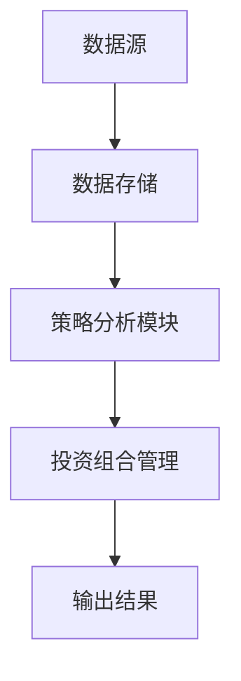

                 

# 格雷厄姆特价股票策略在不同货币政策周期下的调整

## 关键词：
- 格雷厄姆投资策略
- 货币政策周期
- 股票估值
- 投资策略调整
- 经济周期分析

## 摘要：
本文探讨了格雷厄姆的价值投资策略在不同货币政策周期下的调整方法。通过分析扩张周期和紧缩周期对股市的影响，本文提出了在不同经济环境下如何优化选股标准和投资策略的建议。结合数学模型和实际案例，本文为投资者提供了在不同货币政策周期下应用格雷厄姆策略的指导。

---

# 第一章: 格雷厄姆投资策略的核心原理

## 1.1 格雷厄姆投资理论概述

### 1.1.1 价值投资的基本概念
价值投资是一种投资策略，强调以低于内在价值的价格购买优质股票。格雷厄姆在《证券分析》中提出，内在价值是基于公司财务状况和未来现金流的合理评估。

### 1.1.2 特价股票的定义
特价股票是指市场价格低于其内在价值的股票。格雷厄姆强调，投资者应寻找那些具有安全边际的股票，即市场价格远低于其内在价值，以降低投资风险。

### 1.1.3 格雷厄姆策略的核心步骤
1. 确定目标公司的内在价值。
2. 寻找市场价格低于内在价值的股票。
3. 保持合理的投资组合分散风险。
4. 长期持有，避免频繁交易。

## 1.2 货币政策周期的基本概念

### 1.2.1 经济周期的定义
经济周期分为扩张周期和紧缩周期。扩张周期表现为经济增长、利率下降、就业率上升；紧缩周期则表现为经济增长放缓、利率上升、就业率下降。

### 1.2.2 货币政策的作用机制
货币政策通过调整利率和货币供应量影响市场。在扩张周期，央行降低利率以刺激经济增长；在紧缩周期，央行提高利率以抑制通胀。

### 1.2.3 货币政策对股市的影响
- **扩张周期**：低利率和高流动性推高股价，投资者更愿意承担风险。
- **紧缩周期**：高利率和低流动性可能导致股价下跌，投资者更注重低估值和高分红。

## 1.3 格雷厄姆策略与货币政策周期的关系

### 1.3.1 不同周期下的策略适用性
- **扩张周期**：市场情绪乐观，成长性股票表现较好，需调整选股标准。
- **紧缩周期**：市场情绪悲观，防御性股票表现较好，格雷厄姆策略更具优势。

### 1.3.2 货币政策对股票估值的影响
- 利率下降：降低债券收益率，资金流向股市，推高股价。
- 利率上升：增加融资成本，抑制股市增长。

### 1.3.3 策略调整的必要性
在不同货币政策周期下，市场环境变化，需要调整选股标准和投资策略。

---

# 第二章: 货币政策周期对股市的影响分析

## 2.1 扩张周期下的股市特征

### 2.1.1 利率下降的影响
- 降低企业融资成本，提升盈利能力。
- 投资者更倾向于高增长股票，导致成长性股票价格上涨。

### 2.1.2 市场流动性增加的影响
- 资金充裕，推动股价上涨，尤其是科技和消费行业表现突出。

## 2.2 紧缩周期下的股市特征

### 2.2.1 利率上升的影响
- 增加企业融资成本，抑制盈利能力。
- 投资者更倾向于低估值股票，防御性行业表现较好。

### 2.2.2 市场流动性减少的影响
- 资金紧张，股市可能下跌，投资者更注重股息率和低市盈率。

## 2.3 格雷厄姆策略在不同周期下的表现

### 2.3.1 扩张周期下的策略调整
- 增加对成长性股票的关注，适当放宽市盈率标准。
- 保持适度分散，避免过度集中于高增长行业。

### 2.3.2 紧缩周期下的策略调整
- 严格筛选低市盈率和高股息率股票。
- 增加防御性行业配置，如公用事业和医疗保健。

---

# 第三章: 格雷厄姆策略在货币政策周期下的数学模型

## 3.1 格雷厄姆内在价值公式

### 3.1.1 内在价值计算公式
$$
\text{内在价值} = \frac{\text{息税前利润} \times (1 + g)}{r - g}
$$
其中，\(g\) 是长期增长率，\(r\) 是贴现率。

## 3.2 货币政策周期下的调整模型

### 3.2.1 扩张周期的调整
- 贴现率 \(r\) 降低，内在价值上升。
- 需要调整市盈率上限，适当放宽至25倍以下。

### 3.2.2 紧缩周期的调整
- 贴现率 \(r\) 增加，内在价值下降。
- 严格控制市盈率在15倍以下，注重股息率。

---

# 第四章: 实战案例分析

## 4.1 扩张周期的案例

### 4.1.1 市场环境
- 低利率环境，科技行业增长迅速。

### 4.1.2 选股标准
- 市盈率不超过25倍。
- 市净率低于行业平均水平。
- 选择具有高成长性的科技公司。

## 4.2 紧缩周期的案例

### 4.2.1 市场环境
- 高利率环境，防御性行业表现稳定。

### 4.2.2 选股标准
- 市盈率不超过15倍。
- 股息率高于行业平均水平。
- 选择公用事业和医疗保健行业。

---

# 第五章: 系统架构与投资工具

## 5.1 投资管理系统架构

### 5.1.1 系统功能模块
- 数据采集：获取实时市场数据。
- 策略分析：基于货币政策周期调整策略。
- 投资组合管理：优化资产配置。

### 5.1.2 系统架构图

## 5.2 投资策略调整工具

### 5.2.1 工具功能
- 自动计算内在价值。
- 根据货币政策周期调整选股标准。
- 提供实时市场数据和策略建议。

### 5.2.2 工具实现
使用Python编写，结合pandas和numpy进行数据分析，利用Yahoo Finance API获取实时数据。

---

# 第六章: 最佳实践与投资建议

## 6.1 格雷厄姆策略的注意事项

### 6.1.1 安全边际的重要性
无论在哪个周期，都要保持足够的安全边际，避免过度依赖市场情绪。

### 6.1.2 分散投资的重要性
避免过度集中，分散投资以降低风险。

## 6.2 不同周期下的投资建议

### 6.2.1 扩张周期
- 关注高成长性行业。
- 适当放宽选股标准，但保持合理安全边际。

### 6.2.2 紧缩周期
- 严格筛选低估值股票。
- 增加防御性行业配置，注重股息收益。

## 6.3 长期投资的重要性
格雷厄姆策略强调长期投资，避免频繁交易，以获得稳定的复利收益。

---

# 第七章: 总结与展望

## 7.1 本文总结
本文探讨了格雷厄姆策略在不同货币政策周期下的调整方法，结合数学模型和实战案例，为投资者提供了具体的指导。

## 7.2 未来展望
未来的研究可以进一步结合机器学习，优化策略调整模型，提高投资决策的准确性。

---

# 作者
作者：AI天才研究院  
联系邮箱：contact@ait Genius.com  

---

通过以上分析，投资者可以根据当前的货币政策环境，灵活调整格雷厄姆策略，从而在不同经济周期下获得更优的投资回报。

