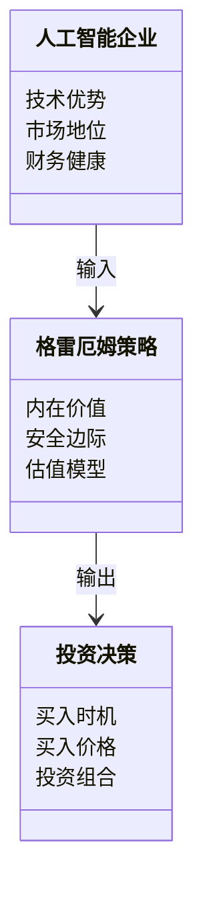
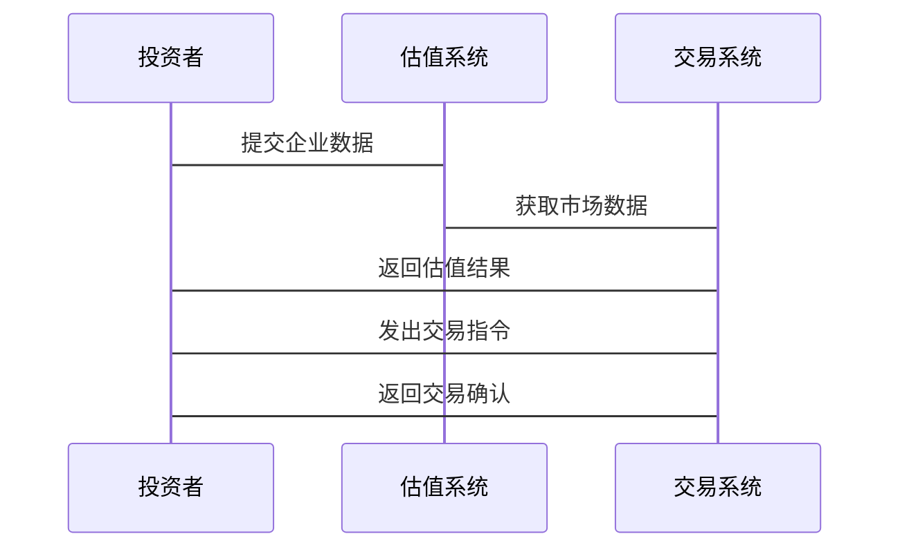

                 


# 格雷厄姆特价股票策略在人工智能产业的应用挑战

> 关键词：格雷厄姆策略、价值投资、人工智能、股票估值、投资挑战

> 摘要：本文系统分析了格雷厄姆价值投资策略在人工智能产业中的应用挑战，通过理论分析与实际案例结合，深入探讨了人工智能企业估值的核心要素、投资策略的选择与优化、风险控制等关键问题。文章从价值投资的基本原理出发，结合人工智能产业的特点，详细阐述了如何在快速变化的科技环境中，利用格雷厄姆策略寻找低估值、高潜力的人工智能企业，并通过实际案例分析和代码实现，为投资者提供了一套系统化的投资解决方案。

---

# 第1章 格雷厄姆价值投资策略概述

## 1.1 价值投资的核心理念

### 1.1.1 价值投资的定义与核心要素

- **价值投资**：以低于企业内在价值的价格买入优质企业，长期持有，获取超额收益。
- 核心要素：
  - **内在价值**：企业未来现金流的现值。
  - **安全边际**：买入价格低于内在价值，确保投资的安全性。
  - **长期视角**：关注企业的长期竞争优势，而非短期市场波动。

### 1.1.2 格雷厄姆投资策略的特点

- **低估值导向**：寻找市场价格低于内在价值的企业。
- **安全边际**：强调买入价格的安全性，降低投资风险。
- **逆向投资**：在市场恐慌时寻找低估机会，在市场狂热时保持冷静。

## 1.2 人工智能产业的背景与特点

### 1.2.1 人工智能产业的定义与范围

- **人工智能**：通过模拟人类认知过程，实现问题求解、决策支持和自动化操作的技术。
- 产业范围：
  - **上游**：芯片、算法、数据。
  - **中游**：AI平台、解决方案。
  - **下游**：应用领域包括医疗、金融、教育等。

### 1.2.2 人工智能企业的核心竞争力分析

- **技术优势**：算法创新、数据处理能力。
- **市场地位**：行业龙头、市场份额。
- **财务健康**：盈利能力、现金流状况。

### 1.2.3 人工智能产业的市场现状与未来趋势

- 当前趋势：
  - 技术快速迭代。
  - 应用场景不断扩展。
  - 行业竞争加剧。
- 未来趋势：
  - AI技术深度融入实体经济。
  - 产业链整合与生态化发展。

## 1.3 格雷厄姆策略与人工智能产业的结合点

### 1.3.1 价值投资在科技领域的应用

- **技术创新**：关注具有核心技术优势的企业。
- **市场空间**：选择具有广阔前景的行业。
- **竞争优势**：分析企业的护城河。

### 1.3.2 人工智能企业的估值挑战

- **技术创新的不确定性**：技术迭代快，难以准确评估。
- **数据依赖性**：数据质量和处理能力对估值的影响。
- **商业模式的多样性**：AI企业的盈利模式多样化，传统估值方法可能失效。

### 1.3.3 人工智能产业中的投资机会

- **技术创新型企业**：专注于前沿技术的企业。
- **应用场景广阔的企业**：能够在多个领域落地的企业。
- **具有强大生态能力的企业**：构建完整生态体系的企业。

---

# 第2章 格雷厄姆策略的核心概念与模型

## 2.1 格雷厄姆策略的核心概念

### 2.1.1 内在价值的计算公式

$$ V = \frac{E}{1 + r} $$

其中，\( V \) 为内在价值，\( E \) 为未来现金流，\( r \) 为折现率。

### 2.1.2 安全边际的定义与计算

$$ \text{安全边际} = \text{市场价格} \times \text{安全边际率} $$

### 2.1.3 格雷厄姆的“三重过滤器”法则

1. **第一重过滤器**：筛选出低市盈率企业。
2. **第二重过滤器**：进一步筛选低市净率企业。
3. **第三重过滤器**：选择高股息率企业。

## 2.2 人工智能企业的核心评估指标

### 2.2.1 财务指标分析

- **营业收入增长率**：反映企业收入增长能力。
- **净利润率**：衡量企业的盈利能力。
- **研发投入占比**：评估企业在技术创新上的投入力度。

### 2.2.2 技术指标分析

- **技术专利数量**：评估企业的技术储备。
- **技术团队规模**：反映企业的技术实力。
- **技术商业化能力**：衡量技术转化为收入的能力。

## 2.3 格雷厄姆策略与人工智能企业评估模型的结合

### 2.3.1 人工智能企业估值模型

$$ V = \frac{E}{1 + r} $$

其中，\( E \) 为人工智能企业的未来现金流，\( r \) 为折现率。

### 2.3.2 人工智能企业安全边际计算

$$ \text{安全边际} = \text{市场价格} \times \text{安全边际率} $$

---

# 第3章 人工智能产业中的投资策略

## 3.1 人工智能企业的投资策略

### 3.1.1 长期价值投资

- **核心理念**：选择具有长期竞争优势的企业，长期持有，获取复利收益。
- **实施步骤**：
  1. 识别具有核心技术优势的企业。
  2. 评估企业的内在价值。
  3. 确定安全边际，选择买入时机。

### 3.1.2 短期趋势投资

- **核心理念**：捕捉市场短期波动，获取超额收益。
- **实施步骤**：
  1. 分析市场情绪，识别超跌或超涨股票。
  2. 判断短期趋势，制定交易策略。
  3. 设置止损位，控制风险。

## 3.2 格雷厄姆策略在人工智能产业中的应用

### 3.2.1 人工智能企业的价值发现

- **识别低估值企业**：通过财务指标和市场估值分析，寻找市场价格低于内在价值的企业。
- **评估企业内在价值**：使用格雷厄姆模型计算企业内在价值，确定安全边际。
- **确定买入时机**：结合市场周期和企业基本面，选择合适的买入时机。

### 3.2.2 人工智能企业的风险控制

- **财务风险评估**：分析企业的财务健康状况，确保买入价格的安全性。
- **技术风险评估**：关注技术更新和市场竞争，评估技术优势的可持续性。
- **市场风险评估**：判断行业周期和市场波动，避免过度集中投资。

---

# 第4章 人工智能企业投资策略的系统分析与实现

## 4.1 系统功能设计

### 4.1.1 领域模型设计（Mermaid 类图）



### 4.1.2 系统架构设计（Mermaid 架构图）

```mermaid
server
    database
    service1
    service2
```

### 4.1.3 系统交互设计（Mermaid 序列图）



## 4.2 项目实战

### 4.2.1 环境安装

- **工具安装**：安装Python、Pandas、NumPy、Matplotlib等数据分析工具。
- **数据获取**：获取人工智能企业的财务数据和市场数据。

### 4.2.2 核心代码实现

```python
import pandas as pd
import numpy as np

# 示例数据：人工智能企业的财务数据
data = {
    '企业': ['企业A', '企业B', '企业C'],
    '营业收入': [100, 150, 200],
    '净利润': [20, 30, 40],
    '研发投入': [10, 20, 30],
    '市盈率': [15, 20, 25],
    '市净率': [2, 3, 4]
}

df = pd.DataFrame(data)

# 计算内在价值（简化模型）
def calculate_intrinsic_value(net_profit, growth_rate, discount_rate):
    return net_profit / (1 + discount_rate) * (1 + growth_rate)

# 应用格雷厄姆策略筛选企业
selected = []
for idx, row in df.iterrows():
    # 计算内在价值
    iv = calculate_intrinsic_value(row['净利润'], 0.1, 0.1)
    # 计算安全边际
    safety_margin = iv * 0.8
    # 判断是否满足条件
    if row['市盈率'] < 15 and row['市净率'] < 2 and row['研发投入'] > row['净利润']:
        selected.append(idx)
```

### 4.2.3 代码应用解读与分析

- **代码功能**：通过格雷厄姆策略筛选低估值、高研发投入的人工智能企业。
- **关键指标**：
  - 市盈率低于15。
  - 市净率低于2。
  - 研发投入高于净利润。

---

# 第5章 格雷厄姆策略在人工智能产业中的最佳实践

## 5.1 投资策略的优化

### 5.1.1 动态调整估值模型

- 根据市场变化和企业实际情况，动态调整折现率和增长率假设。
- 关注企业的技术创新和市场拓展，及时更新估值模型。

### 5.1.2 结合技术指标与财务指标

- 以技术指标为基础，结合财务指标，全面评估企业的投资价值。
- 关注企业的技术商业化能力，确保技术优势能够转化为实际收益。

## 5.2 风险控制与投资组合管理

### 5.2.1 分散投资

- 将资金分散投资于不同的人工智能企业，降低投资风险。
- 关注企业的行业分布和应用场景，避免过度集中。

### 5.2.2 定期复盘

- 定期评估投资组合的表现，分析偏离原因。
- 根据市场变化和企业动态，及时调整投资策略。

## 5.3 小结与注意事项

- **小结**：格雷厄姆策略在人工智能产业中的应用需要结合企业的技术优势和财务健康状况，动态调整估值模型和投资策略。
- **注意事项**：
  - 重视技术风险，关注企业的技术创新能力。
  - 动态调整投资组合，及时应对市场变化。
  - 保持长期视角，耐心持有优质企业。

---

# 第6章 拓展阅读与进一步思考

## 6.1 拓展阅读

- 格兰杰的《股票作手回忆录》：了解价值投资的实战经验。
- 巴菲特的《巴菲特致股东的信》：学习价值投资的长期视角。
- 《人工智能：一种现代的方法》：深入理解人工智能技术的核心。

## 6.2 进一步思考

- 人工智能技术对企业估值的影响。
- 人工智能企业的技术商业化能力与投资价值的关系。
- 人工智能产业中的长期投资机会与风险。

---

# 作者

作者：AI天才研究院/AI Genius Institute & 禅与计算机程序设计艺术 /Zen And The Art of Computer Programming

---

# 结语

本文系统分析了格雷厄姆价值投资策略在人工智能产业中的应用挑战，通过理论分析与实际案例结合，深入探讨了人工智能企业估值的核心要素、投资策略的选择与优化、风险控制等关键问题。文章从价值投资的基本原理出发，结合人工智能产业的特点，详细阐述了如何在快速变化的科技环境中，利用格雷厄姆策略寻找低估值、高潜力的人工智能企业，并通过实际案例分析和代码实现，为投资者提供了一套系统化的投资解决方案。

