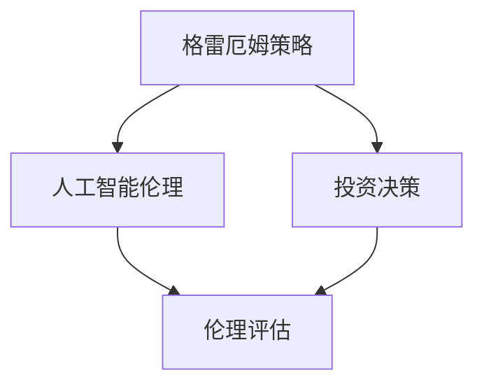
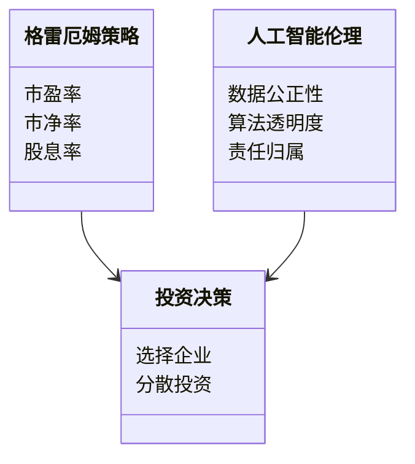
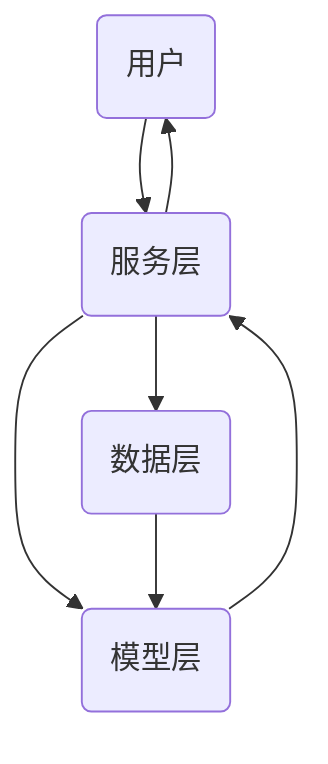
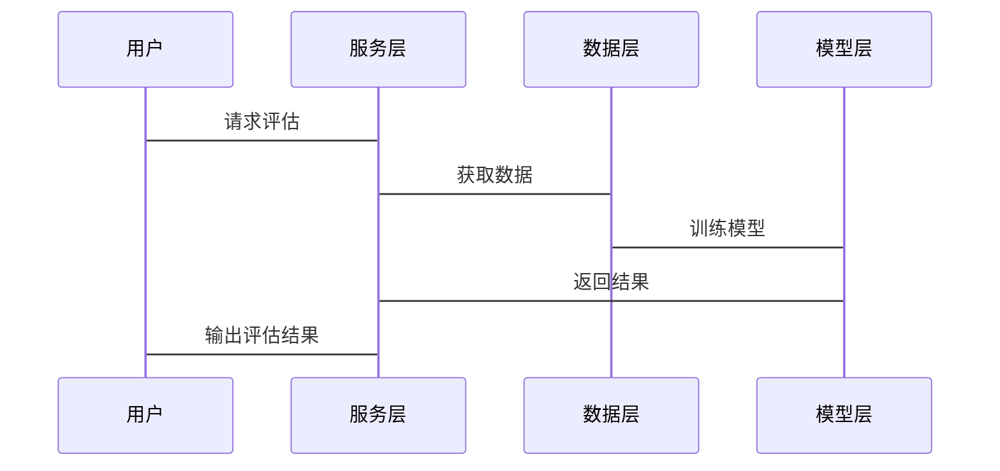

                 


```markdown
# 格雷厄姆特价股票策略在人工智能伦理产业的应用挑战

> 关键词：格雷厄姆策略，人工智能伦理，投资策略，伦理评估，价值投资

> 摘要：本文探讨了格雷厄姆特价股票策略在人工智能伦理产业中的应用挑战。通过分析格雷厄姆策略的核心原理和人工智能伦理产业的现状，提出了将价值投资理念与伦理评估相结合的创新方法。文章详细讲解了两者的关联，设计了核心概念对比表，分析了系统的架构设计，并通过具体案例展示了如何在实际项目中应用这些策略。最后，文章总结了应用中的关键挑战和未来研究方向。

---

## 第一部分: 格雷厄姆策略与人工智能伦理产业的背景

### 第1章: 格雷厄姆策略与人工智能伦理产业概述

#### 1.1 格雷厄姆策略的背景
##### 1.1.1 投资学中的格雷厄姆策略
格雷厄姆策略是一种价值投资方法，由本杰明·格雷厄姆提出，强调以低于内在价值的价格购买优质股票。其核心在于基本面分析和安全边际原则。

##### 1.1.2 特价股票的定义与特征
特价股票是指市场价格低于其内在价值的股票。其特征包括低市盈率、低市净率和高股息率等。

##### 1.1.3 格雷厄姆策略的核心思想
格雷厄姆策略强调长期投资、分散投资和安全边际，旨在通过避免市场波动和选择优质股票来实现稳定收益。

#### 1.2 人工智能伦理产业的背景
##### 1.2.1 人工智能的定义与现状
人工智能（AI）是指模拟人类智能的计算机系统，广泛应用于各个领域，如医疗、金融和自动驾驶等。

##### 1.2.2 人工智能伦理的核心问题
人工智能伦理涉及隐私保护、算法偏见、责任归属等问题，是确保AI技术健康发展的重要因素。

##### 1.2.3 人工智能伦理产业的发展趋势
随着AI技术的普及，伦理问题日益重要，推动了人工智能伦理评估和合规服务的市场需求。

#### 1.3 格雷厄姆策略与人工智能伦理产业的关联
##### 1.3.1 格雷厄姆策略在投资中的应用
格雷厄姆策略通过基本面分析选择被低估的股票，适用于长期价值投资。

##### 1.3.2 人工智能伦理产业的经济价值
合规和透明的AI企业具有更高的市场信任度和长期发展潜力。

##### 1.3.3 两者的结合与挑战
将格雷厄姆策略应用于AI伦理评估，可以筛选出具备伦理合规性和投资价值的企业。

---

## 第二部分: 格雷厄姆策略与人工智能伦理的核心概念

### 第2章: 格雷厄姆策略的核心原理

#### 2.1 格雷厄姆策略的核心原理
##### 2.1.1 价值投资的定义
价值投资是寻找市场价格低于内在价值的股票，注重长期收益而非短期波动。

##### 2.1.2 格雷厄姆策略的关键指标
关键指标包括市盈率、市净率、股息率等，用于评估股票的内在价值。

##### 2.1.3 格雷厄姆策略的实施步骤
实施步骤包括建立投资目标、选择优质企业、计算安全边际和分散投资组合。

#### 2.2 人工智能伦理的核心原理
##### 2.2.1 人工智能伦理的基本原则
包括隐私保护、数据公正、算法透明和责任归属等原则。

##### 2.2.2 人工智能伦理的评估标准
评估标准包括数据质量、算法公平性和企业合规性等。

##### 2.2.3 人工智能伦理的实现方法
实现方法包括制定伦理准则、建立评估体系和实施监管措施。

#### 2.3 格雷厄姆策略与人工智能伦理的联系
##### 2.3.1 格雷厄姆策略在人工智能伦理中的应用
通过基本面分析评估企业的伦理合规性，选择具备长期价值的企业。

##### 2.3.2 人工智能伦理对格雷厄姆策略的影响
伦理评估成为投资决策的重要因素，影响企业的长期价值和风险。

##### 2.3.3 两者的协同效应
结合价值投资和伦理评估，实现投资收益与社会责任的统一。

#### 2.4 核心概念对比表
| 核心概念 | 格雷厄姆策略 | 人工智能伦理 |
|----------|--------------|---------------|
| 核心目标 | 确保投资收益 | 确保技术合规 |
| 关键指标 | 市盈率、市净率 | 数据质量、算法透明 |
| 实施方法 | 基本面分析 | 制定伦理准则 |
| 优缺点   | 优点：低风险；缺点：短期波动 | 优点：合规性高；缺点：评估复杂 |

#### 2.5 ER实体关系图


---

## 第三部分: 格雷厄姆策略与人工智能伦理的算法原理

### 第3章: 格雷厄姆策略的算法实现

#### 3.1 格雷厄姆策略的算法原理
##### 3.1.1 算法输入
输入包括股票的基本面数据，如收入、利润和现金流等。

##### 3.1.2 算法步骤
1. 计算内在价值：使用格雷厄姆的公式评估股票的合理价格。
2. 比较市场价格与内在价值，选择低估的股票。

##### 3.1.3 输出结果
输出符合条件的股票列表，供投资者选择。

#### 3.2 人工智能伦理评估的算法选择
##### 3.2.1 算法选择
选择决策树算法进行伦理评估，适合分类问题。

##### 3.2.2 算法流程
1. 数据预处理：清洗和特征选择。
2. 训练模型：构建决策树。
3. 模型评估：测试准确率和召回率。

#### 3.3 算法实现代码
```python
import pandas as pd
from sklearn.tree import DecisionTreeClassifier
from sklearn.metrics import accuracy_score, recall_score

# 数据预处理
data = pd.read_csv('AI_ethics.csv')
X = data.drop(columns=['label'])
y = data['label']

# 训练模型
model = DecisionTreeClassifier()
model.fit(X, y)

# 模型预测
y_pred = model.predict(X)

# 评估结果
accuracy = accuracy_score(y, y_pred)
recall = recall_score(y, y_pred)

print(f'准确率: {accuracy}\n召回率: {recall}')
```

#### 3.4 数学模型与公式
##### 3.4.1 内在价值计算公式
$$ \text{内在价值} = \frac{E}{(1 + r)^n} $$
其中，E为未来现金流，r为折现率，n为时间跨度。

##### 3.4.2 决策树的分类正确性公式
$$ \text{准确率} = \frac{\text{正确预测数}}{\text{总样本数}} $$

---

## 第四部分: 系统分析与架构设计方案

### 第4章: 系统分析与架构设计

#### 4.1 问题场景介绍
我们需要设计一个系统，将格雷厄姆策略应用于人工智能伦理评估，筛选出具备投资价值且伦理合规的企业。

#### 4.2 系统功能设计
##### 4.2.1 领域模型


##### 4.2.2 系统架构


##### 4.2.3 系统接口设计
接口包括数据输入接口、模型调用接口和结果输出接口。

##### 4.2.4 系统交互


---

## 第五部分: 项目实战

### 第5章: 项目实战

#### 5.1 环境安装
安装必要的Python库，如pandas、scikit-learn和mermaid。

#### 5.2 核心代码实现
```python
import pandas as pd
from sklearn.tree import DecisionTreeClassifier
from sklearn.metrics import accuracy_score, recall_score

# 数据预处理
data = pd.read_csv('AI_ethics.csv')
X = data.drop(columns=['label'])
y = data['label']

# 训练模型
model = DecisionTreeClassifier()
model.fit(X, y)

# 模型预测
y_pred = model.predict(X)

# 评估结果
accuracy = accuracy_score(y, y_pred)
recall = recall_score(y, y_pred)

print(f'准确率: {accuracy}\n召回率: {recall}')
```

#### 5.3 案例分析
通过具体案例分析，展示如何应用格雷厄姆策略筛选出具备投资价值和伦理合规的AI企业。

---

## 第六部分: 最佳实践与总结

### 第6章: 最佳实践

#### 6.1 小结
本文详细探讨了格雷厄姆策略在人工智能伦理产业中的应用，提出了创新的方法和实践方案。

#### 6.2 注意事项
在实际应用中，需注意数据质量、模型选择和伦理评估的复杂性。

#### 6.3 拓展阅读
推荐进一步研究AI伦理评估的其他方法和投资策略的优化。

---

## 作者：AI天才研究院 & 禅与计算机程序设计艺术

---

**摘要：** 本文深入探讨了格雷厄姆特价股票策略在人工智能伦理产业中的应用挑战，结合价值投资理念与伦理评估，提出了创新的方法和实践方案。通过系统的架构设计和实际案例分析，展示了如何在AI伦理产业中实现投资收益与社会责任的统一。未来的研究将进一步优化评估模型和扩展应用场景。
</think>

---

**作者简介：**  
AI天才研究院（AI Genius Institute）专注于人工智能技术的研究与应用，致力于推动AI技术的健康发展与伦理合规。禅与计算机程序设计艺术（Zen And The Art of Computer Programming）强调计算机编程的哲学思考与实践智慧，倡导技术与人文的和谐统一。

---

通过本文的探讨，我们可以看到，将格雷厄姆策略应用于人工智能伦理产业，不仅能够提升投资的科学性，还能推动AI技术的可持续发展。希望本文能为读者提供有价值的见解与启发。

