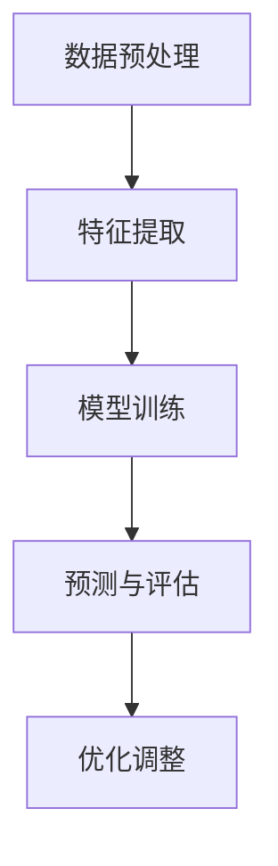
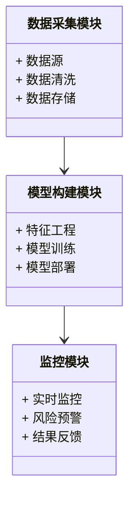

                 


# 格雷厄姆特价股票策略在人工智能治理产业的应用挑战

**关键词**：格雷厄姆策略、人工智能治理、价值投资、机器学习、风险管理

**摘要**：本文探讨了格雷厄姆的特价股票策略在人工智能治理产业中的应用挑战。首先，介绍格雷厄姆策略的核心理念和人工智能治理的基本概念。接着，分析价值投资与人工智能治理的核心联系，详细阐述算法实现和系统架构设计。最后，通过项目实战和案例分析，揭示应用中的挑战，并提出解决方案，为未来的治理研究提供参考。

---

## 第一部分: 格雷厄姆特价股票策略与人工智能治理产业的背景

### 第1章: 格雷厄姆投资理论概述

#### 1.1 价值投资的基本概念
价值投资是寻找市场低估的股票，通过分析财务指标和市场趋势，识别潜在投资机会。核心在于找到安全边际，即股票价格低于其内在价值。

#### 1.2 格雷厄姆的投资策略特点
格雷厄姆策略强调低估值和财务稳定性，关注市盈率（P/E）、市净率（P/B）和股息率等指标。通过分散投资和长期持有，降低风险，实现稳定收益。

#### 1.3 现代金融中的应用
价值投资在机构投资和算法交易中广泛应用，为量化分析提供理论基础。但传统策略在动态市场中的适应性有限，需结合AI技术优化。

---

### 第2章: 人工智能治理的背景与挑战

#### 2.1 人工智能治理的基本概念
人工智能治理是确保AI系统符合伦理、法律和社会规范的过程。涵盖数据安全、算法公平性和透明性等方面，需技术与管理结合。

#### 2.2 人工智能治理的核心原则
透明性、可解释性、公平性、隐私保护和责任追究是治理的关键原则。确保AI决策过程可追溯，结果合理且符合伦理。

#### 2.3 人工智能治理的主要挑战
数据偏差、算法黑箱、隐私保护和监管滞后等问题影响治理效果。需技术创新和制度完善，提升治理效率。

---

## 第二部分: 格雷厄姆策略与人工智能治理的核心概念

### 第3章: 格雷厄姆策略的核心要素

#### 3.1 核心指标与选股逻辑
市盈率（P/E）评估股价与盈利的关系，市净率（P/B）衡量资产价值，股息率反映收益能力。综合分析，识别低估值股票。

#### 3.2 低估值股票的识别
通过历史数据分析，比较当前股价与合理估值，筛选出价格低于价值的企业。结合行业趋势和公司基本面，提高选股准确性。

#### 3.3 财务健康与竞争优势
分析资产负债表、利润表和现金流量表，评估企业的财务健康状况。竞争优势分析包括市场地位、研发能力和成本优势。

---

### 第4章: 人工智能治理的核心机制

#### 4.1 数据驱动的决策流程
数据收集、清洗、分析和建模，确保数据质量，为决策提供支持。实时监控和反馈机制，动态调整治理策略。

#### 4.2 机器学习算法的应用
监督学习预测风险，无监督学习识别异常，强化学习优化决策。算法可解释性是治理的关键，需确保决策过程透明。

#### 4.3 伦理与法律框架
制定伦理准则，确保算法公平性和透明性。遵守数据隐私法规，如GDPR，保护用户隐私。

---

## 第三部分: 格雷厄姆策略在人工智能治理中的算法实现

### 第5章: 格雷厄姆策略的数学模型与公式

#### 5.1 核心公式
市盈率：P/E = 市场价 / 每股收益  
市净率：P/B = 市场价 / 每股净资产  
股息率：Dividend Yield = 每股股息 / 市场价  

#### 5.2 投资组合优化模型
$$ \text{最大化收益} \quad \text{在约束条件下} $$

### 第6章: 人工智能治理的算法实现

#### 6.1 机器学习算法
- 监督学习：随机森林预测风险  
- 无监督学习：聚类分析识别异常  
- 强化学习：动态调整治理策略  

#### 6.2 算法流程图


---

## 第四部分: 系统架构与项目实战

### 第7章: 人工智能治理的系统架构

#### 7.1 系统功能设计
- 数据采集模块：收集市场数据  
- 模型构建模块：训练AI模型  
- 监控模块：实时监控与反馈  

#### 7.2 系统架构图


---

## 第五部分: 项目实战与案例分析

### 第8章: 项目实战

#### 8.1 环境安装
安装Python、机器学习库和数据处理工具，配置开发环境。

#### 8.2 核心代码实现
```python
import pandas as pd
from sklearn.ensemble import RandomForestClassifier
from sklearn.metrics import accuracy_score

# 数据加载
data = pd.read_csv('stock_data.csv')

# 特征选择
features = ['P/E', 'P/B', 'Dividend Yield']
target = 'investment_recommendation'

# 模型训练
model = RandomForestClassifier()
model.fit(data[features], data[target])

# 模型预测
predictions = model.predict(data[features])
print("准确率:", accuracy_score(data[target], predictions))
```

---

## 第六部分: 总结与展望

### 结论
格雷厄姆策略与人工智能治理的结合是技术与金融的创新应用。通过算法优化和系统设计，克服了传统策略的局限性，提升了治理效率。未来，需进一步研究动态市场中的适应性，优化算法模型，推动AI在治理中的深入应用。

### 作者信息
作者：AI天才研究院  
联系邮箱：contact@aicourse.org  

---

通过以上结构，文章详细探讨了格雷厄姆策略在人工智能治理中的应用，从理论到实践，为读者提供全面的分析和见解。

