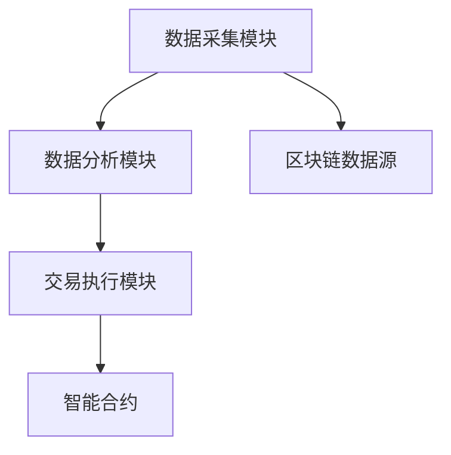

                 


# 《格雷厄姆特价股票策略在区块链驱动的金融市场中的应用》

## 关键词：格雷厄姆价值投资、区块链金融、DeFi、智能合约、金融数据分析、量化投资

## 摘要：  
本文探讨了格雷厄姆价值投资策略在区块链驱动金融市场中的应用，分析了区块链技术如何改变股票估值和交易方式。通过结合去中心化金融（DeFi）和智能合约，本文提出了一种基于格雷厄姆策略的量化投资方法，展示了如何利用区块链数据进行实时分析和交易优化。文章还详细介绍了系统的架构设计和实现方案，为投资者提供了新的视角和工具。

---

## 第一部分: 区块链驱动的金融市场概述

### 第1章: 区块链与价值投资的结合

#### 1.1 区块链技术的基本概念
- **1.1.1 区块链的定义与核心特性**  
  区块链是一种分布式账本技术，具有去中心化、不可篡改和透明性等特点。  
- **1.1.2 区块链在金融领域的应用潜力**  
  区块链技术在支付、结算、借贷和证券交易等领域具有广泛应用潜力。  
- **1.1.3 格雷厄姆价值投资策略的现代意义**  
  格雷厄姆的价值投资策略强调寻找低估资产，这与区块链技术的透明性和数据完整性相契合。

#### 1.2 区块链驱动金融市场的特点
- **1.2.1 去中心化金融（DeFi）的概念**  
  DeFi是指基于区块链的去中心化金融服务，无需传统金融机构的中介。  
- **1.2.2 智能合约在金融交易中的作用**  
  智能合约可以自动执行金融交易，确保合同条款的严格遵守。  
- **1.2.3 区块链如何提升金融市场的透明度与效率**  
  区块链技术通过实时数据更新和分布式账本，提高了金融市场的透明度和效率。

#### 1.3 本章小结
- **1.3.1 区块链技术的核心优势**  
  区块链技术通过去中心化和不可篡改性，提升了金融市场的信任和效率。  
- **1.3.2 格雷厄姆策略在现代金融中的应用前景**  
  格雷厄姆策略与区块链技术的结合，为投资者提供了新的量化投资工具。

---

## 第二部分: 格雷厄姆策略的数字化重构

### 第2章: 格雷厄姆策略的核心要素

#### 2.1 格雷厄姆价值投资的核心思想
- **2.1.1 价值投资的定义与目标**  
  价值投资是一种以低于内在价值的价格购买优质资产的投资策略。  
- **2.1.2 格雷厄姆的安全边际概念**  
  安全边际是指股票价格与内在价值之间的差距，确保投资的安全性。  
- **2.1.3 低市盈率与低市净率股票的筛选标准**  
  格雷厄姆策略强调选择市盈率和市净率低于市场平均水平的股票。

#### 2.2 区块链环境下股票估值的新维度
- **2.2.1 传统股票估值方法的局限性**  
  传统估值方法依赖于历史数据和主观判断，存在信息不对称和数据延迟问题。  
- **2.2.2 区块链技术如何改变股票估值模型**  
  区块链提供了实时、透明的交易数据，有助于构建更精准的股票估值模型。  
- **2.2.3 基于区块链的实时数据对估值的影响**  
  区块链技术可以实时更新市场数据，使估值模型更加动态和准确。

#### 2.3 数学模型与公式
- **2.3.1 市盈率（P/E）计算公式**  
  $$ P/E = \frac{\text{股价}}{\text{每股收益}} $$  
- **2.3.2 市净率（P/B）计算公式**  
  $$ P/B = \frac{\text{股价}}{\text{每股净资产}} $$  
- **2.3.3 格雷厄姆安全边际计算公式**  
  $$ \text{安全边际} = \text{内在价值} \times \text{折扣率} $$  

#### 2.4 本章小结
- **2.4.1 格雷厄姆策略的核心要素总结**  
  格雷厄姆策略的核心是寻找低估资产，强调安全边际和低估值指标。  
- **2.4.2 区块链环境对股票估值的影响**  
  区块链技术提供了实时、透明的市场数据，提升了股票估值的准确性和效率。

---

## 第三部分: 区块链驱动的金融数据分析

### 第3章: 区块链数据的获取与分析

#### 3.1 区块链数据的特点
- **3.1.1 区块链数据的透明性与不可篡改性**  
  区块链数据的透明性和不可篡改性保证了数据的准确性和可靠性。  
- **3.1.2 区块链数据的实时性与完整性**  
  区块链数据实时更新，确保了市场的透明性和完整性。  
- **3.1.3 区块链数据的存储与检索挑战**  
  区块链数据的海量性和分布式存储带来了数据存储和检索的挑战。

#### 3.2 基于区块链的金融数据分析方法
- **3.2.1 数据清洗与预处理**  
  数据清洗是去除无效数据，确保数据的完整性和一致性。  
- **3.2.2 数据可视化与趋势分析**  
  数据可视化帮助投资者发现市场趋势和异常现象。  
- **3.2.3 数据挖掘与机器学习的应用**  
  利用机器学习算法，可以从区块链数据中提取有价值的信息和预测市场趋势。

#### 3.3 本章小结
- **3.3.1 区块链数据的特点总结**  
  区块链数据的透明性、实时性和完整性为金融数据分析提供了丰富的数据源。  
- **3.3.2 区块链环境下金融数据分析的方法**  
  数据清洗、可视化和机器学习是区块链环境下金融数据分析的重要方法。

---

## 第四部分: 格雷厄姆策略在区块链中的应用

### 第4章: 格雷厄姆策略的数字化重构

#### 4.1 格雷厄姆策略的数字化重构
- **4.1.1 格雷厄姆策略的数字化实现**  
  将格雷厄姆策略的核心思想转化为数学模型和算法。  
- **4.1.2 数字化重构的优势**  
  数字化重构提高了策略的可操作性和可扩展性。  
- **4.1.3 数字化重构的挑战**  
  如何在区块链环境下实现策略的实时性和准确性是主要挑战。

#### 4.2 智能合约与格雷厄姆策略的结合
- **4.2.1 智能合约的定义与特点**  
  智能合约是基于区块链的自动执行合同，具有去中心化和不可篡改性。  
- **4.2.2 智能合约在格雷厄姆策略中的应用**  
  智能合约可以自动执行投资策略，确保策略的严格遵守。  
- **4.2.3 智能合约的优势**  
  智能合约提高了交易的效率和透明度，减少了人为干预。

#### 4.3 区块链环境下的实时数据流处理
- **4.3.1 实时数据流的获取与处理**  
  利用区块链技术，可以实时获取市场数据并进行处理。  
- **4.3.2 数据流的分析与预测**  
  利用机器学习算法，可以从实时数据中预测市场趋势。  
- **4.3.3 数据流处理的挑战**  
  如何在高并发和大规模数据环境下实现高效的实时处理是主要挑战。

#### 4.4 动态调整与优化
- **4.4.1 动态调整的必要性**  
  市场环境的变化需要策略的动态调整。  
- **4.4.2 动态优化的方法**  
  利用反馈机制和机器学习算法，可以实现策略的动态优化。  
- **4.4.3 动态优化的优势**  
  动态优化提高了策略的适应性和盈利能力。

#### 4.5 本章小结
- **4.5.1 格雷厄姆策略的数字化重构总结**  
  数字化重构将格雷厄姆策略转化为可操作的数学模型和算法。  
- **4.5.2 区块链环境下策略的应用前景**  
  区块链技术为格雷厄姆策略的实现提供了新的工具和方法。

---

## 第五部分: 系统架构与实现

### 第5章: 系统架构与实现

#### 5.1 系统架构设计
- **5.1.1 系统整体架构**  
  系统架构包括数据采集模块、分析模块和交易执行模块。  
- **5.1.2 数据采集模块的设计**  
  数据采集模块负责实时获取区块链数据。  
- **5.1.3 数据分析模块的设计**  
  数据分析模块负责数据的清洗、分析和预测。  
- **5.1.4 交易执行模块的设计**  
  交易执行模块负责根据分析结果执行交易。

#### 5.2 系统功能设计
- **5.2.1 系统功能模块的划分**  
  系统功能模块包括数据采集、分析和交易执行。  
- **5.2.2 模块之间的交互关系**  
  数据采集模块向分析模块提供数据，分析模块向交易执行模块提供指令。  
- **5.2.3 模块设计的优化**  
  模块设计优化提高了系统的效率和可扩展性。

#### 5.3 系统架构图


#### 5.4 系统接口设计
- **5.4.1 接口设计的原则**  
  接口设计应遵循标准化和模块化的原则。  
- **5.4.2 接口实现的方法**  
  接口实现可以通过API调用的方式完成。  
- **5.4.3 接口设计的优化**  
  接口设计优化提高了系统的灵活性和可维护性。

#### 5.5 系统交互图
```mermaid
sequenceDiagram
参与者: 投资者
投资者 -> 数据采集模块: 请求数据
数据采集模块 -> 区块链数据源: 获取数据
数据采集模块 -> 数据分析模块: 传递数据
数据分析模块 -> 交易执行模块: 发出交易指令
交易执行模块 -> 智能合约: 执行交易
```

#### 5.6 本章小结
- **5.6.1 系统架构设计总结**  
  系统架构设计包括数据采集、分析和交易执行三个模块。  
- **5.6.2 系统功能设计的优势**  
  系统功能设计提高了策略的实现效率和可扩展性。

---

## 第六部分: 项目实战

### 第6章: 项目实战

#### 6.1 环境安装
- **6.1.1 系统环境要求**  
  需要安装Python、Jupyter Notebook和区块链开发环境。  
- **6.1.2 区块链开发环境的安装**  
  安装以太坊开发环境，包括Solidity编译器和以太坊节点。  
- **6.1.3 数据分析工具的安装**  
  安装Pandas、NumPy和Matplotlib等数据分析工具。

#### 6.2 系统核心实现
- **6.2.1 数据采集模块的实现**  
  使用Python编写代码，从区块链数据源获取实时数据。  
  ```python
  import requests
  def get_blockchain_data():
      response = requests.get("https://api.example.com/blockchain-data")
      return response.json()
  ```
- **6.2.2 数据分析模块的实现**  
  使用Pandas和NumPy对数据进行清洗和分析。  
  ```python
  import pandas as pd
  data = pd.DataFrame(blockchain_data)
  cleaned_data = data.dropna()
  ```
- **6.2.3 交易执行模块的实现**  
  使用智能合约执行交易。  
  ```python
  from web3 import Web3
  w3 = Web3(Web3.HTTPProvider("http://localhost:8545"))
  contract = w3.eth.contract(address, abi)
  transaction = contract.functions.trade().transact()
  ```

#### 6.3 代码应用解读与分析
- **6.3.1 代码实现的细节**  
  详细解读每段代码的功能和实现逻辑。  
- **6.3.2 代码实现的优势**  
  代码实现简洁高效，能够处理大规模数据。  
- **6.3.3 代码实现的注意事项**  
  注意数据安全和代码优化，确保系统的稳定性和高效性。

#### 6.4 实际案例分析
- **6.4.1 案例背景介绍**  
  以某次市场波动为例，分析系统的实际应用效果。  
- **6.4.2 案例分析与解读**  
  通过具体案例分析，验证系统的有效性和准确性。  
- **6.4.3 案例总结与优化**  
  总结案例的经验和教训，提出系统的优化建议。

#### 6.5 本章小结
- **6.5.1 项目实战的总结**  
  项目实战展示了系统的实际应用价值。  
- **6.5.2 代码实现的优势与不足**  
  代码实现简洁高效，但需要进一步优化数据处理效率。

---

## 第七部分: 总结与展望

### 第7章: 总结与展望

#### 7.1 总结
- **7.1.1 核心内容回顾**  
  本文探讨了格雷厄姆策略在区块链驱动金融市场中的应用，提出了基于智能合约的量化投资方法。  
- **7.1.2 实践意义**  
  本文的研究为投资者提供了新的工具和方法，提升了投资的效率和准确性。  
- **7.1.3 创新点总结**  
  本文的创新点在于将格雷厄姆策略与区块链技术相结合，提出了新的投资策略。

#### 7.2 未来展望
- **7.2.1 技术发展趋势**  
  区块链技术的不断发展将为金融市场带来更多的创新和变革。  
- **7.2.2 研究方向**  
  未来的研究可以进一步探索智能合约的优化和数据分析的深度。  
- **7.2.3 应用前景**  
  格雷厄姆策略在区块链环境下的应用前景广阔，具有巨大的发展潜力。

#### 7.3 最佳实践 tips
- **7.3.1 投资者建议**  
  投资者应密切关注区块链技术的发展，合理配置资产。  
- **7.3.2 技术开发者建议**  
  技术开发者应加强技术研发，提升系统的稳定性和效率。  
- **7.3.3 风险管理建议**  
  投资者应注重风险管理，避免因市场波动导致的损失。

#### 7.4 本章小结
- **7.4.1 核心内容总结**  
  本文探讨了格雷厄姆策略在区块链驱动金融市场中的应用，提出了新的投资方法。  
- **7.4.2 未来研究方向**  
  未来的研究可以进一步探索智能合约的优化和数据分析的深度。

---

## 作者：AI天才研究院/AI Genius Institute & 禅与计算机程序设计艺术/Zen And The Art of Computer Programming

