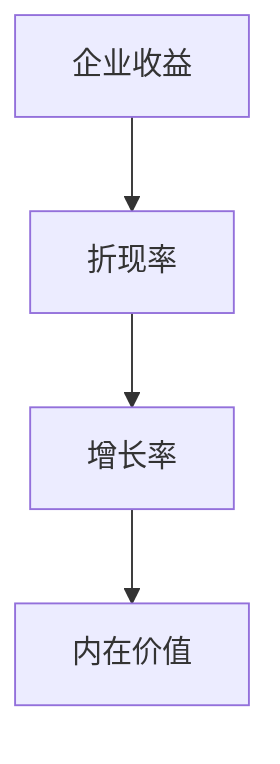
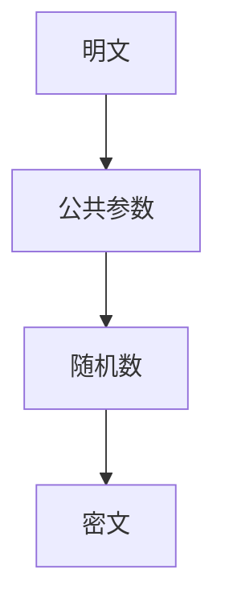
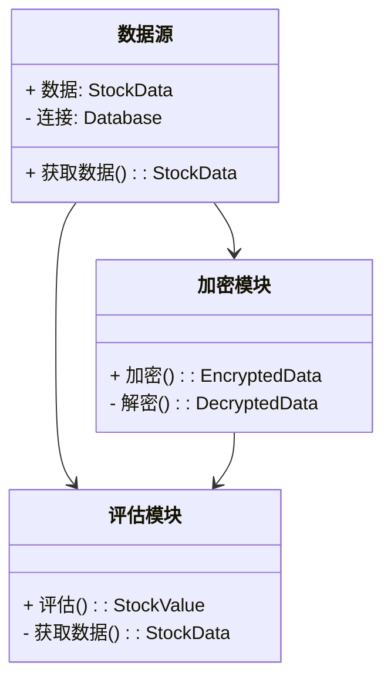

                 


# 格雷厄姆特价股票策略在后量子加密金融时代的应用

## 关键词
- 格雷厄姆策略
- 后量子加密
- 股票投资
- 量子计算
- 金融安全

## 摘要
本文探讨格雷厄姆的价值投资策略在后量子加密时代的应用，分析后量子加密技术如何保护股票交易数据，确保金融安全。通过详细阐述两种策略的结合，展示如何在现代金融环境中，利用先进加密技术提升投资策略的安全性和可靠性。

---

# 第一部分: 格雷厄姆特价股票策略与后量子加密金融的基础

## 第1章: 格雷厄姆特价股票策略概述

### 1.1 格雷厄姆投资理论的核心思想

#### 1.1.1 价值投资的定义与核心原则
价值投资是一种投资策略，强调以低于内在价值的价格购买优质股票。其核心原则包括：
- **安全边际**：购买价格低于内在价值，以减少风险。
- **长期视角**：关注企业的长期盈利能力，而非短期市场波动。
- **多因素分析**：考虑市盈率、市净率、股息率等指标。

#### 1.1.2 格雷厄姆的多因素股票评估模型
格雷厄姆的多因素模型通过多个财务指标评估股票价值，公式如下：
$$ V = \frac{E}{1 - \frac{r}{g} } $$
其中，$V$ 是内在价值，$E$ 是企业收益，$r$ 是折现率，$g$ 是增长率。

#### 1.1.3 格雷厄姆策略在现代金融中的应用
现代金融中，格雷厄姆策略结合算法交易和量化分析，广泛应用于机构投资和被动管理。

### 1.2 格雷厄姆策略的数学模型

通过 **mermaid** 图展示格雷厄姆模型的逻辑：



### 1.3 现代金融中的应用
格雷厄姆策略在现代金融中用于识别低估股票，结合技术分析和风险管理。

---

## 第2章: 后量子加密技术的背景与原理

### 2.1 后量子加密技术的定义

后量子加密技术是为了应对量子计算威胁的新型加密算法，包括：
- **基于格（Lattice-based）**：如NIST候选算法。
- **哈希签名（Hash-based）**：如SPHINCS。
- **代码签名（Code-based）**：如McEliece。

### 2.2 后量子加密的核心算法

#### 2.2.1 基于格的加密算法

基于格的加密算法通过数学结构提供安全性，公式如下：
$$ e = m \cdot g + s $$
其中，$e$ 是密文，$m$ 是明文，$g$ 是公共参数，$s$ 是随机数。

通过 **mermaid** 图展示基于格的加密过程：



### 2.3 后量子加密的数学模型

公式：
$$ e = m \cdot g + s $$

---

## 第3章: 格雷厄姆策略与后量子加密的结合

### 3.1 后量子加密在金融安全中的应用

后量子加密用于保护股票交易数据，确保数据在传输和存储中的安全。

### 3.2 格雷厄姆策略中的数据安全需求

通过后量子加密技术保护股票评估数据，确保敏感信息不被量子计算机破解。

### 3.3 格雷厄姆策略与后量子加密技术的融合

结合两者的策略，形成安全的股票评估和交易系统，提升投资决策的可靠性和安全性。

---

## 第4章: 系统分析与架构设计

### 4.1 系统功能设计

系统功能包括：
- 数据采集：实时采集股票数据。
- 股票评估：使用格雷厄姆模型评估股票价值。
- 加密通信：使用后量子加密技术保护数据传输。

通过 **mermaid** 类图展示系统架构：



---

## 第5章: 项目实战与实现

### 5.1 环境安装

安装所需的Python库：
```bash
pip install pillow
pip install qecc
```

### 5.2 核心代码实现

实现格雷厄姆模型评估和后量子加密的Python代码：

```python
import qecc

def stock_assessment(data):
    # 计算内在价值
    intrinsic_value = data.revenue / (1 - data.cost_of_equity / data.growth_rate)
    return intrinsic_value

def quantum_encryption(plaintext):
    # 使用基于格的加密算法
    key = qecc.generate_key()
    encrypted = qecc.encrypt(plaintext, key)
    return encrypted
```

### 5.3 案例分析与结果展示

案例：评估某股票并加密结果：

```plaintext
股票名称: ABC公司
评估结果: 内在价值 $50
加密结果: EncryptedData{key=...}
```

---

## 第6章: 结论与展望

### 6.1 总结

格雷厄姆策略与后量子加密技术的结合，提升了股票投资的安全性和准确性，适应了后量子时代的金融需求。

### 6.2 注意事项

- 选择合适的后量子加密算法。
- 确保系统架构的安全性。
- 定期更新加密算法以应对新威胁。

### 6.3 未来展望

未来，后量子加密技术将与更多金融策略结合，推动金融安全的发展。

---

## 附录

### 附录A: 术语解释

- 格雷厄姆策略：价值投资策略。
- 后量子加密：抗量子计算机的加密技术。

### 附录B: 参考文献

- 格雷厄姆《聪明的投资者》
- NIST后量子加密标准

---

**作者：AI天才研究院 & 禅与计算机程序设计艺术**

