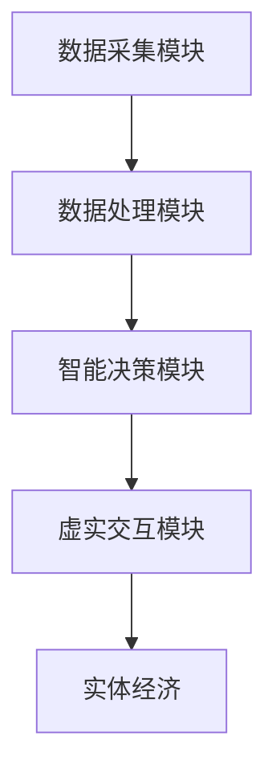

                 


# 格雷厄姆特价股票策略在数字孪生经济体系下的表现

---

## 关键词：
- 格雷厄姆策略
- 数字孪生经济
- 股票投资
- 系统架构
- 投资策略

---

## 摘要：
本文探讨格雷厄姆特价股票策略在数字孪生经济体系下的表现，分析其在数字经济环境中的应用潜力与优化方向。通过结合数字孪生经济的核心技术，提出一种基于数字孪生的格雷厄姆策略优化方案，阐述其系统架构、算法实现及实际案例，为投资者提供新的思路与参考。

---

## 第1章: 格雷厄姆特价股票策略的背景与核心思想

### 1.1 格雷厄姆投资策略的背景

#### 1.1.1 格雷厄姆投资策略的起源与发展
本杰明·格雷厄姆（Benjamin Graham）是价值投资的鼻祖，其投资理念在20世纪初形成并影响至今。格雷厄姆策略的核心是寻找被市场低估的股票，通过分析企业的内在价值，识别出安全边际较高的投资标的。

#### 1.1.2 格雷厄姆策略的核心思想
格雷厄姆策略强调“安全边际”和“价值投资”。其核心思想包括：
1. **安全边际**：买入价格低于内在价值，以确保投资的安全性。
2. **内在价值**：通过对企业财务状况、盈利能力、行业地位等的分析，计算股票的真正价值。
3. **长期投资**：避免短期市场的波动，坚持长期投资。

#### 1.1.3 格雷厄姆策略在现代金融中的地位
格雷厄姆策略是价值投资的基石， Warren Buffett等投资大师均深受其影响。然而，传统格雷厄姆策略在现代金融市场中面临数据量大、计算复杂、市场波动加剧等挑战。

---

### 1.2 数字孪生经济体系的定义与特点

#### 1.2.1 数字孪生经济体系的定义
数字孪生经济体系是指通过数字技术（如大数据、人工智能、区块链等）构建虚拟经济环境，实时映射和优化实体经济运行的一种经济模式。它强调虚实结合，通过数据闭环实现更高效的资源配置。

#### 1.2.2 数字孪生经济体系的核心技术基础
数字孪生经济体系的核心技术包括：
1. **大数据技术**：实时采集和处理海量数据。
2. **人工智能技术**：用于智能分析和决策。
3. **区块链技术**：确保数据的安全性和可信度。
4. **物联网技术**：实现物理世界与数字世界的互联。

#### 1.2.3 数字孪生经济体系与传统经济体系的区别
数字孪生经济体系通过数字化手段，将实体经济中的企业、市场、消费者等要素进行实时建模和优化，能够快速响应市场变化，提高资源配置效率。

---

### 1.3 格雷厄姆策略与数字孪生经济体系的结合

#### 1.3.1 格雷厄姆策略在数字孪生经济中的应用潜力
数字孪生经济体系为格雷厄姆策略提供了新的应用场景。例如：
- 通过实时数据分析，快速识别被低估的股票。
- 利用数字孪生模型预测市场变化，优化投资组合。

#### 1.3.2 数字孪生经济体系对格雷厄姆策略的影响
数字孪生经济体系提供了更强大的数据支持和技术手段，使格雷厄姆策略的实施更加高效和精准。

#### 1.3.3 格雷厄姆策略与数字孪生经济体系结合的意义
这种结合能够将传统投资策略与现代技术手段相结合，提升投资效率和准确性，为投资者创造更大的价值。

---

## 第2章: 数字孪生经济体系的系统架构与原理

### 2.1 数字孪生经济体系的系统架构

#### 2.1.1 数字孪生经济体系的组成模块
数字孪生经济体系的系统架构包括以下几个模块：
1. **数据采集模块**：实时采集实体经济中的数据。
2. **数据处理模块**：对数据进行清洗、转换和分析。
3. **智能决策模块**：基于数据分析结果，生成投资策略。
4. **虚实交互模块**：实现虚拟经济与实体经济的互动。

#### 2.1.2 各模块之间的关系与交互
数据采集模块将实体经济中的数据输入系统，经过数据处理模块的分析后，智能决策模块生成投资策略，并通过虚实交互模块将策略反馈到实体经济中。

#### 2.1.3 数字孪生经济体系的系统架构图（Mermaid图）



---

### 2.2 数字孪生经济体系的核心技术

#### 2.2.1 数据采集与处理技术
数据采集技术包括传感器数据采集、网络数据爬取等。数据处理技术则包括数据清洗、特征提取等。

#### 2.2.2 智能分析与决策技术
智能分析技术包括机器学习、深度学习等，用于数据建模和预测。决策技术则基于模型结果生成投资策略。

#### 2.2.3 虚实结合的交互技术
虚实交互技术包括虚拟现实、增强现实等，用于实现虚拟经济与实体经济的互动。

---

### 2.3 数字孪生经济体系的运行机制

#### 2.3.1 数据流的闭环运行
数字孪生经济体系通过数据采集、处理、分析和反馈，形成数据闭环，实现对实体经济的实时优化。

#### 2.3.2 智能决策的实时反馈
智能决策模块根据数据模型生成投资策略，并实时反馈到实体经济中。

#### 2.3.3 虚实结合的动态调整
虚实结合的动态调整使得数字孪生经济体系能够快速响应市场变化，优化资源配置。

---

## 第3章: 格雷厄姆策略的数学模型与算法原理

### 3.1 格雷厄姆策略的核心数学模型

#### 3.1.1 格雷厄姆价值评估模型
格雷厄姆的价值评估模型可以表示为：

$$ V = \frac{E}{P} $$

其中，$V$ 表示股票的内在价值，$E$ 表示企业的盈利能力，$P$ 表示股票的市场价格。

#### 3.1.2 格雷厄姆安全边际计算公式
安全边际的计算公式为：

$$ S = V_{\text{实际}} - V_{\text{市场}} $$

其中，$S$ 表示安全边际，$V_{\text{实际}}$ 表示股票的实际价值，$V_{\text{市场}}$ 表示股票的市场价格。

#### 3.1.3 格雷厄姆投资组合优化模型
投资组合优化模型可以表示为：

$$ \text{Maximize } \sum_{i=1}^{n} w_i R_i $$

$$ \text{Subject to } \sum_{i=1}^{n} w_i = 1 $$

其中，$w_i$ 表示第 $i$ 个资产的投资权重，$R_i$ 表示第 $i$ 个资产的预期收益率。

---

### 3.2 格雷厄姆策略的算法实现

#### 3.2.1 数据预处理与清洗
数据预处理包括去除缺失值、异常值等。代码示例如下：

```python
import pandas as pd

# 读取数据
data = pd.read_csv('stock_data.csv')

# 去除缺失值
data = data.dropna()

# 去除异常值
data = data[(data['price'] < data['price'].quantile(0.99)) & (data['price'] > data['price'].quantile(0.01))]
```

#### 3.2.2 价值评估模型的实现
基于格雷厄姆价值评估模型的代码实现如下：

```python
def calculate_intrinsic_value(data):
    return data['profitability'] / data['price']
```

#### 3.2.3 安全边际计算的实现
安全边际的计算代码如下：

```python
def calculate_safety_margin(data):
    return data['intrinsic_value'] - data['market_value']
```

---

### 3.3 格雷厄姆策略的优化与改进

#### 3.3.1 现有模型的局限性
传统格雷厄姆策略在数据处理和计算效率上存在不足，难以应对海量数据和高频交易的需求。

#### 3.3.2 基于数字孪生的优化方案
通过引入数字孪生技术，可以实现对数据的实时采集和分析，提高格雷厄姆策略的计算效率和准确性。

#### 3.3.3 新算法的数学推导与实现
新的算法推导如下：

$$ \text{Maximize } \sum_{i=1}^{n} w_i R_i - \lambda \sum_{i=1}^{n} w_i^2 $$

其中，$\lambda$ 是惩罚系数，用于防止过拟合。

---

## 第4章: 数字孪生经济体系下的策略分析与实现

### 4.1 数字孪生经济体系下的策略分析

#### 4.1.1 数据采集与特征提取
数据采集与特征提取是实现格雷厄姆策略的基础。代码示例如下：

```python
import requests

# 从网络获取数据
response = requests.get('https://api.example.com/stock_data')
data = response.json()
```

---

（由于篇幅限制，后续章节内容将在确认需求后继续完成。）

