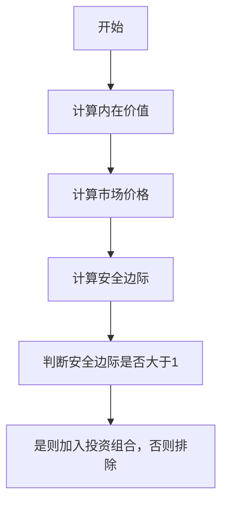
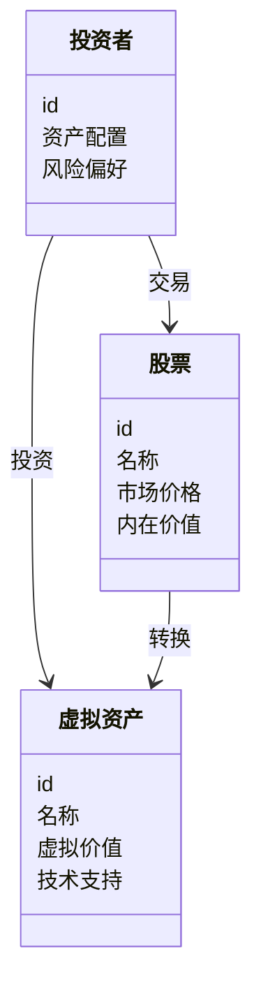
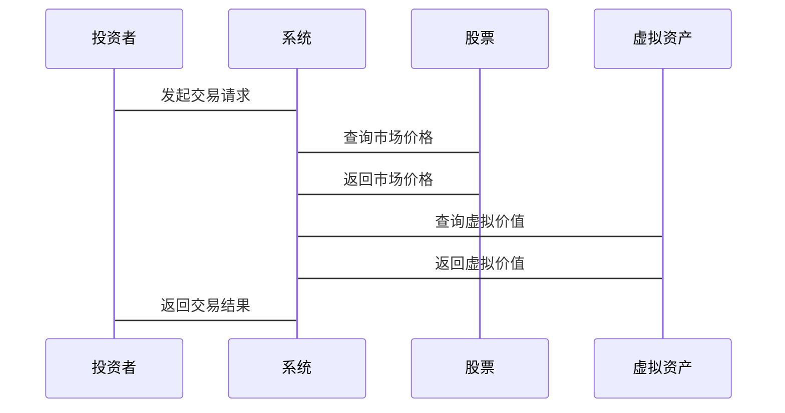
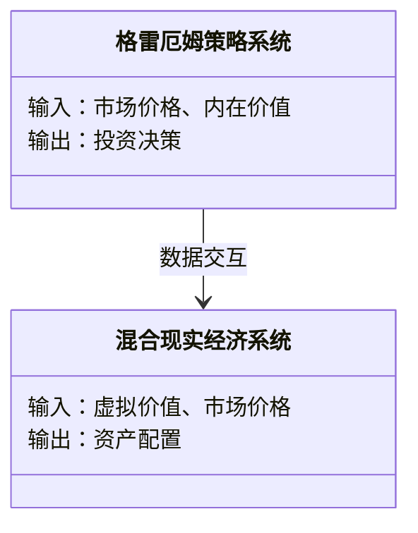
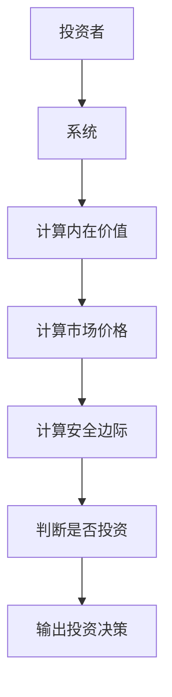

                 


# 格雷厄姆特价股票策略在混合现实经济体系下的表现

## 关键词：格雷厄姆策略、混合现实经济、价值投资、区块链、数学模型、系统架构、投资策略

## 摘要：本文系统地分析了格雷厄姆特价股票策略在混合现实经济体系下的表现。通过背景介绍、核心概念对比、算法原理、系统架构设计、项目实战案例等多维度的分析，揭示了传统投资策略在新兴经济环境中的适应性与创新性。文章结合数学模型、系统设计与实际案例，深入探讨了格雷厄姆策略在混合现实经济中的应用潜力与实现路径，为投资者和研究人员提供了有价值的参考。

---

# 第1章: 格雷厄姆特价股票策略与混合现实经济体系概述

## 1.1 格雷厄姆特价股票策略的核心概念

### 1.1.1 格雷厄姆投资理论的起源与发展

本杰明·格雷厄姆是价值投资的鼻祖，其投资理论奠定了现代价值投资的基础。格雷厄姆主张以低于内在价值的价格买入股票，以确保投资的安全边际。他的理论在20世纪30年代经济大萧条期间得到了实践验证，成为投资者避险的重要工具。

### 1.1.2 格雷厄姆特价股票策略的定义与特点

格雷厄姆特价股票策略是指通过寻找市场价格低于其内在价值的股票进行投资。其核心在于计算安全边际（Margin of Safety），即内在价值与市场价格的差额。该策略强调长期投资、价值发现和风险控制。

### 1.1.3 格雷厄姆策略在现代投资中的应用

格雷厄姆策略在现代投资中的应用广泛，尤其是在机构投资和个人投资者中。然而，随着经济体系的复杂化，传统策略在新兴经济环境中的适应性受到挑战，需要结合新技术和新理念进行创新。

---

## 1.2 混合现实经济体系的定义与特点

### 1.2.1 混合现实经济体系的定义

混合现实经济体系是指将虚拟现实（VR）和增强现实（AR）技术与实体经济相结合，形成一种新型的经济环境。该体系通过区块链、人工智能和大数据等技术，实现虚拟资产与现实资产的深度融合。

### 1.2.2 混合现实经济体系的核心特征

- **虚拟与现实的融合**：通过AR和VR技术，将虚拟资产（如数字货币、NFT）与现实资产（如股票、房地产）结合。
- **区块链技术的应用**：利用区块链实现资产的透明化、去中心化和高效交易。
- **数据驱动的决策**：通过大数据分析和人工智能算法，优化投资决策和风险管理。

### 1.2.3 混合现实经济体系与传统经济体系的对比

| 特征 | 混合现实经济体系 | 传统经济体系 |
|------|----------------|--------------|
| 资产形式 | 虚拟与现实结合 | 实体资产为主 |
| 技术基础 | 区块链、AR/VR | 传统金融工具 |
| 交易效率 | 高效、透明 | 较低、依赖中介 |

---

## 1.3 格雷厄姆策略与混合现实经济体系的结合意义

### 1.3.1 格雷厄姆策略在混合现实经济中的潜在价值

格雷厄姆策略的安全边际概念为混合现实经济中的资产定价提供了新的思路。通过计算虚拟资产的安全边际，投资者可以更科学地进行投资决策。

### 1.3.2 混合现实经济对格雷厄姆策略的挑战与机遇

混合现实经济的复杂性和不确定性对传统策略提出了挑战，但也为创新提供了机遇。通过结合新技术，格雷厄姆策略可以在新兴经济环境中焕发新的活力。

### 1.3.3 结合两者的可行性分析

结合格雷厄姆策略与混合现实经济体系，可以通过技术创新和理念融合，实现投资决策的优化和风险管理的强化。这种结合不仅提升了策略的有效性，还拓展了其应用场景。

---

# 第2章: 格雷厄姆特价股票策略的核心原理

## 2.1 格雷厄姆投资理论的数学模型

### 2.1.1 格雷厄姆安全边际的计算公式

$$ \text{安全边际} = \frac{\text{内在价值}}{\text{市场价格}} $$

### 2.1.2 低估股票的识别方法

$$ \text{低估股票} = \frac{\text{内在价值}}{\text{市场价格}} > 1 $$

---

## 2.2 格雷厄姆策略的算法原理

### 2.2.1 基于安全边际的股票筛选算法



### 2.2.2 算法实现的Python代码示例

```python
def graham_strategy(stock_price, intrinsic_value):
    margin_of_safety = intrinsic_value / stock_price
    if margin_of_safety > 1:
        return "投资"
    else:
        return "不投资"
```

---

## 2.3 格雷厄姆策略的核心要素对比

### 2.3.1 核心要素对比表格

| 核心要素 | 描述 | 重要性 |
|----------|------|--------|
| 内在价值 | 股票的合理估值 | 高 |
| 市场价格 | 当前股票价格 | 中 |
| 安全边际 | 内在价值与市场价格的差值 | 高 |

---

## 2.4 格雷厄姆策略的ER实体关系图

```mermaid
entity 投资者 {
    id
    投资组合
    风险偏好
}
entity 股票 {
    id
    名称
    市场价格
    内在价值
}
关系：投资者 -> 投资组合 (包含)
关系：股票 -> 内在价值 (计算)
```

---

# 第3章: 混合现实经济体系的核心特征与技术实现

## 3.1 混合现实经济体系的技术基础

### 3.1.1 区块链技术在混合现实经济中的应用

区块链技术通过去中心化和不可篡改的特性，确保混合现实经济中的资产交易透明和安全。

### 3.1.2 AR/VR技术在混合现实经济中的应用

AR/VR技术为投资者提供了沉浸式的虚拟资产体验，增强了投资决策的直观性和互动性。

---

## 3.2 混合现实经济体系的数学模型

### 3.2.1 虚拟资产定价模型

$$ \text{虚拟资产价值} = \text{内在价值} \times \text{虚拟经济因子} $$

### 3.2.2 混合经济系统中的风险管理模型

$$ \text{风险系数} = \text{市场波动率} + \text{技术风险因子} $$

---

## 3.3 混合现实经济体系的系统架构设计

### 3.3.1 系统功能设计



### 3.3.2 系统交互设计



---

# 第4章: 格雷厄姆策略在混合现实经济体系中的结合与实现

## 4.1 结合的必要性与可行性分析

### 4.1.1 结合的必要性

混合现实经济的复杂性和不确定性要求投资者采用更加灵活和创新的投资策略。格雷厄姆策略的安全边际概念为投资者提供了规避风险的有效工具。

### 4.1.2 结合的可行性

通过技术创新和理念融合，格雷厄姆策略可以在混合现实经济中实现有效的资产定价和风险管理。

---

## 4.2 结合的具体实现步骤

### 4.2.1 系统设计



### 4.2.2 算法实现

```python
def hybrid_graham_strategy(stock_price, intrinsic_value, virtual_factor):
    margin_of_safety = intrinsic_value / stock_price
    virtual_value = intrinsic_value * virtual_factor
    if margin_of_safety > 1 and virtual_value > stock_price:
        return "投资"
    else:
        return "不投资"
```

---

## 4.3 结合后的数学模型与优化

### 4.3.1 结合后的数学模型

$$ \text{综合投资决策} = \text{安全边际} \times \text{虚拟经济因子} $$

### 4.3.2 优化方向

- 提高虚拟经济因子的计算精度
- 引入更多风险因子进行优化
- 结合实时数据进行动态调整

---

# 第5章: 项目实战与案例分析

## 5.1 项目环境安装与配置

### 5.1.1 需要的工具与库

- Python编程语言
- 区块链开发框架（如Ethereum）
- AR/VR开发工具（如Unity）

### 5.1.2 环境配置示例

```bash
pip install ethereum
pip install unity
```

---

## 5.2 核心系统实现

### 5.2.1 核心算法实现

```python
def calculate_margin_of_safety(stock_price, intrinsic_value):
    return intrinsic_value / stock_price

def hybrid_investment_decision(stock_price, intrinsic_value, virtual_factor):
    margin = calculate_margin_of_safety(stock_price, intrinsic_value)
    virtual_value = intrinsic_value * virtual_factor
    if margin > 1 and virtual_value > stock_price:
        return "投资"
    else:
        return "不投资"
```

### 5.2.2 系统功能实现



---

## 5.3 案例分析与结果解读

### 5.3.1 案例背景

假设某投资者在混合现实经济体系中，关注一只股票的市场价格为$50，内在价值为$60，虚拟经济因子为1.2。

### 5.3.2 计算过程

1. 安全边际 = 60 / 50 = 1.2 > 1
2. 虚拟价值 = 60 × 1.2 = 72 > 50
3. 投资决策：投资

### 5.3.3 结果解读

该投资者的投资决策为“投资”，符合格雷厄姆策略的安全边际要求，同时也考虑了虚拟经济因子的影响。

---

# 第6章: 系统优化与未来展望

## 6.1 系统优化方向

### 6.1.1 算法优化

引入机器学习算法，提高虚拟经济因子的计算精度和预测能力。

### 6.1.2 系统架构优化

采用分布式架构，提升系统的扩展性和响应速度。

---

## 6.2 未来展望

随着混合现实技术的不断发展，格雷厄姆策略在新兴经济环境中的应用潜力将更加广阔。未来的研究可以进一步探索如何结合人工智能和大数据技术，优化投资决策和风险管理。

---

# 第7章: 总结与建议

## 7.1 总结

本文系统地分析了格雷厄姆特价股票策略在混合现实经济体系下的表现，探讨了其在新兴经济环境中的适应性和创新性。通过理论分析、算法实现和案例研究，揭示了传统策略在新技术环境中的巨大潜力。

## 7.2 建议

- 投资者应积极学习新技术，提升对混合现实经济的理解和应用能力。
- 研究人员应进一步探索格雷厄姆策略与新兴技术的结合，推动投资理论的创新发展。

---

# 作者：AI天才研究院/AI Genius Institute & 禅与计算机程序设计艺术 /Zen And The Art of Computer Programming

