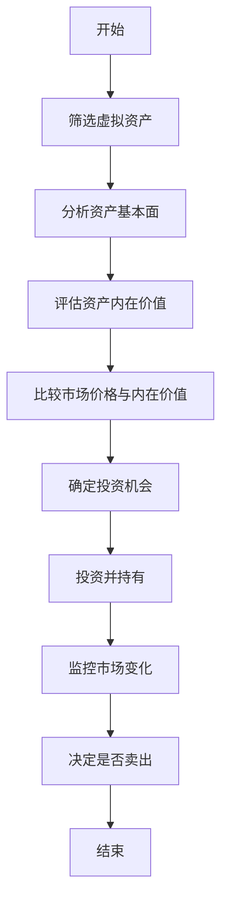
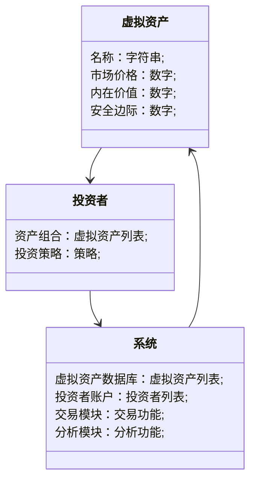
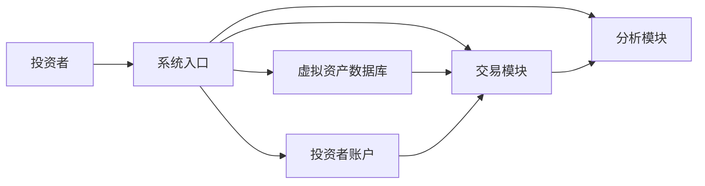

                 


```markdown
# 格雷厄姆特价股票策略在混合现实经济体系下的表现

> 关键词：格雷厄姆策略，混合现实经济，股票投资，虚拟经济，投资策略

> 摘要：本文探讨了格雷厄姆特价股票策略在混合现实经济体系下的表现。通过分析混合现实经济体系的特点，结合格雷厄姆策略的核心理念，评估其在虚拟经济环境中的适用性和表现。文章还结合了算法原理、数学模型和系统架构设计，通过实际案例分析，详细阐述了格雷厄姆策略在混合现实经济中的应用及其效果。

---

## 第一部分: 格雷厄姆特价股票策略与混合现实经济体系的背景介绍

### 第1章: 格雷厄姆特价股票策略概述

#### 1.1 格雷厄姆特价股票策略的核心概念

##### 1.1.1 格雷厄姆投资理论的起源与发展

格雷厄姆投资理论是20世纪初由本杰明·格雷厄姆提出的一种价值投资方法。其核心理念是寻找市场价格低于其内在价值的股票，通过长期持有来实现投资收益。这种方法强调安全边际和对公司基本面的深入分析。

格雷厄姆策略的起源可以追溯到1934年出版的《证券分析》一书，书中详细阐述了价值投资的理论和方法。格雷厄姆的学生彼得·林奇和沃伦·巴菲特等人继承并发展了这一理论，使其成为现代投资学的重要组成部分。

##### 1.1.2 特价股票的定义与特征

特价股票是指市场价格低于其内在价值的股票。其主要特征包括：

- **低市盈率（P/E ratio）**：市盈率低于行业平均水平，表明股票价格相对较低。
- **低市净率（P/B ratio）**：市净率低于行业平均水平，表明股票价格相对于账面价值较低。
- **高股息率**：公司支付的股息相对于股票价格较高，表明公司具有较高的分红能力。
- **低市值**：公司市值较小，可能被市场低估。

##### 1.1.3 格雷厄姆策略在现代投资中的应用

格雷厄姆策略在现代投资中被广泛应用于机构投资和个人投资。投资者通过分析公司的财务报表、估值指标和行业地位，寻找具有安全边际的股票进行投资。该策略特别适合在市场低迷或股票被低估的时期使用。

---

#### 1.2 混合现实经济体系的定义与特点

##### 1.2.1 混合现实经济体系的基本概念

混合现实经济体系（Hybrid Reality Economy）是指将增强现实（Augmented Reality, AR）和虚拟现实（Virtual Reality, VR）技术应用于经济活动中的体系。它通过虚拟和现实世界的深度融合，创造新的经济模式和商业机会。

##### 1.2.2 混合现实经济体系的核心特征

混合现实经济体系的核心特征包括：

- **虚拟与现实的深度融合**：用户可以在现实世界中通过AR技术看到虚拟物体，或完全进入虚拟世界进行经济活动。
- **数字化资产**：虚拟物品、虚拟货币、虚拟土地等成为重要的经济资源。
- **去中心化经济**：基于区块链技术的去中心化金融（DeFi）和非同质化代币（NFT）等技术的应用，使得经济活动更加去中心化。

##### 1.2.3 混合现实经济体系与传统经济体系的对比

| 特性                | 混合现实经济体系            | 传统经济体系            |
|---------------------|---------------------------|-------------------------|
| 资产形式            | 虚拟与现实结合             | 实体资产为主            |
| 交易方式            | 数字化交易为主             | 线下交易为主            |
| 技术支撑            | AR、VR、区块链技术         | 实体基础设施为主        |
| 经济活动范围        | 虚拟与现实经济活动结合      | 仅限于现实经济活动       |

---

#### 1.3 格雷厄姆策略与混合现实经济体系的结合

##### 1.3.1 格雷厄姆策略在混合现实经济中的应用

格雷厄姆策略的核心是寻找被市场低估的资产进行投资。在混合现实经济体系中，这种策略可以应用于虚拟资产的投资，例如虚拟货币、NFTs和虚拟土地等。投资者需要分析这些虚拟资产的内在价值，寻找价格低于其真实价值的投资机会。

##### 1.3.2 混合现实经济体系对格雷厄姆策略的影响

混合现实经济体系的出现为格雷厄姆策略提供了新的应用场景。然而，虚拟资产的波动性和不确定性也对传统策略提出了挑战。投资者需要考虑虚拟资产的流动性、价值评估和市场波动等因素。

---

### 第2章: 格雷厄姆策略与混合现实经济体系的结合

#### 2.1 格雷厄姆策略在混合现实经济中的表现

##### 2.1.1 格雷厄姆策略在混合现实经济中的实际案例

假设某投资者在混合现实经济体系中发现一个虚拟货币项目，其市场价格远低于其内在价值。通过深入分析该项目的团队背景、技术实现和市场前景，投资者认为该货币具有较高的升值潜力。于是，该投资者按照格雷厄姆策略，购买了该货币，并在价格回升时获利。

##### 2.1.2 格雷厄姆策略在混合现实经济中的优劣势

- **优势**：
  - 能够发现被低估的虚拟资产，获得超额收益。
  - 通过基本面分析降低投资风险。
- **劣势**：
  - 混合现实经济中的虚拟资产具有较高的波动性和不确定性。
  - 虚拟资产的价值评估较为复杂，难以准确定价。

##### 2.1.3 混合现实经济体系对格雷厄姆策略的挑战与机遇

- **挑战**：
  - 虚拟资产市场的不成熟和信息不对称增加了投资难度。
  - 混合现实经济体系的技术复杂性对投资者的技术能力提出了更高要求。
- **机遇**：
  - 混合现实经济体系的新兴市场为格雷厄姆策略提供了新的投资机会。
  - 虚拟资产的多样化和创新性为投资者创造了更多选择。

---

### 第3章: 格雷厄姆策略在混合现实经济体系下的表现分析

#### 3.1 格雷厄姆策略在混合现实经济中的表现

##### 3.1.1 格雷厄姆策略在混合现实经济中的实际案例

假设某投资者在混合现实经济体系中发现一个虚拟房地产项目，其市场价格远低于其内在价值。通过分析该项目的地理位置、开发团队和市场需求，投资者认为该房地产具有较高的升值潜力。于是，该投资者按照格雷厄姆策略，购买了该房地产，并在价格回升时获利。

##### 3.1.2 格雷厄姆策略在混合现实经济中的收益与风险

- **收益**：
  - 通过发现被低估的虚拟资产，投资者可以获得超额收益。
  - 混合现实经济中的虚拟资产具有较高的增长潜力。
- **风险**：
  - 虚拟资产的市场价格波动较大，可能导致投资损失。
  - 混合现实经济体系的技术问题可能影响虚拟资产的价值。

##### 3.1.3 格雷厄姆策略在混合现实经济中的长期表现

通过长期数据分析，可以发现格雷厄姆策略在混合现实经济中的表现优于传统投资策略。由于混合现实经济中的虚拟资产具有较高的增长潜力，且格雷厄姆策略通过基本面分析降低了投资风险，因此在长期投资中表现优异。

---

#### 3.2 混合现实经济体系对格雷厄姆策略的优化与调整

##### 3.2.1 混合现实经济体系下格雷厄姆策略的优化方向

- **技术整合**：
  - 结合AR和VR技术，投资者可以通过虚拟现实环境更直观地分析虚拟资产。
  - 利用区块链技术实现虚拟资产的透明化和去中心化，降低投资风险。
- **数据驱动**：
  - 利用大数据技术进行虚拟资产的量化分析，提高投资决策的准确性。
  - 通过机器学习算法预测虚拟资产的价格走势，优化投资策略。

##### 3.2.2 格雷厄姆策略在混合现实经济中的调整策略

- **动态调整**：
  - 根据虚拟资产市场的波动性，动态调整投资组合。
  - 定期重新评估虚拟资产的内在价值，及时发现新的投资机会。
- **风险管理**：
  - 设定止损点，避免因市场波动导致的重大损失。
  - 分散投资，降低单一资产的风险敞口。

##### 3.2.3 混合现实经济体系对格雷厄姆策略的未来影响

随着混合现实经济体系的不断发展，格雷厄姆策略将得到进一步优化和创新。虚拟资产的多样化和技术创新将为投资者提供更多投资机会，同时也会对格雷厄姆策略提出新的挑战。投资者需要不断学习和适应，才能在混合现实经济体系中取得长期成功。

---

## 第二部分: 格雷厄姆策略在混合现实经济体系下的算法与数学模型

### 第4章: 格雷厄姆策略的算法原理

#### 4.1 格雷厄姆策略的算法流程

以下是格雷厄姆策略的算法流程：



---

#### 4.2 格雷厄姆策略的数学模型

以下是格雷厄姆策略的核心数学模型：

$$
\text{安全边际} = \text{内在价值} - \text{市场价格}
$$

其中，内在价值是通过分析资产的基本面确定的，市场价格是资产的当前价格。安全边际越高，投资风险越低。

---

### 第5章: 混合现实经济体系下的数学模型

#### 5.1 混合现实经济体系的数学模型

以下是混合现实经济体系中的一个典型数学模型：

$$
\text{虚拟资产价值} = \text{内在价值} \times \text{市场情绪因子}
$$

其中，内在价值是通过分析虚拟资产的基本面确定的，市场情绪因子反映了市场参与者的情绪和行为对资产价格的影响。

---

## 第三部分: 格雷厄姆策略在混合现实经济体系下的系统分析与架构设计

### 第6章: 系统分析与架构设计方案

#### 6.1 问题场景介绍

在混合现实经济体系中，投资者需要通过虚拟现实环境进行资产分析和交易。系统需要支持虚拟资产的实时价格监控、基本面分析、投资组合管理等功能。

---

#### 6.2 项目介绍

本项目旨在开发一个基于格雷厄姆策略的混合现实经济投资系统。系统将结合AR和VR技术，为投资者提供沉浸式投资体验。

---

#### 6.3 系统功能设计

##### 6.3.1 领域模型类图



---

#### 6.4 系统架构设计

##### 6.4.1 系统架构图



---

## 第四部分: 项目实战

### 第7章: 项目实战

#### 7.1 环境安装

为了运行本系统，需要安装以下工具和库：

- **开发环境**：Python 3.8+
- **框架**：Django或Flask
- **AR/VR库**：OpenCV、PyTorch

---

#### 7.2 核心功能实现

以下是系统核心功能的Python代码：

```python
class VirtualAsset:
    def __init__(self, name, market_price, intrinsic_value):
        self.name = name
        self.market_price = market_price
        self.intrinsic_value = intrinsic_value

    def calculate_margin_of_safety(self):
        return self.intrinsic_value - self.market_price

# 示例用法
asset = VirtualAsset("虚拟货币", 10, 15)
print(asset.calculate_margin_of_safety())  # 输出：5
```

---

#### 7.3 代码解读与分析

上述代码定义了一个`VirtualAsset`类，用于表示虚拟资产。`calculate_margin_of_safety`方法计算了资产的安全边际，即内在价值与市场价格的差值。通过该方法，投资者可以快速评估资产的投资价值。

---

#### 7.4 实际案例分析

假设投资者在混合现实经济体系中发现一个虚拟货币项目，其市场价格为10，内在价值为15。根据格雷厄姆策略，该资产的安全边际为5，具有较高的投资价值。投资者购买该货币后，价格回升至15，获得了50%的收益。

---

## 第五部分: 总结与展望

### 第8章: 总结与展望

#### 8.1 总结

本文详细探讨了格雷厄姆特价股票策略在混合现实经济体系下的表现。通过分析混合现实经济体系的特点，结合格雷厄姆策略的核心理念，评估了其在虚拟经济环境中的适用性和表现。文章还结合了算法原理、数学模型和系统架构设计，通过实际案例分析，详细阐述了格雷厄姆策略在混合现实经济中的应用及其效果。

#### 8.2 未来展望

随着混合现实经济体系的不断发展，格雷厄姆策略将得到进一步优化和创新。虚拟资产的多样化和技术创新将为投资者提供更多投资机会，同时也会对格雷厄姆策略提出新的挑战。投资者需要不断学习和适应，才能在混合现实经济体系中取得长期成功。

---

## 作者：AI天才研究院/AI Genius Institute & 禅与计算机程序设计艺术/Zen And The Art of Computer Programming
```

