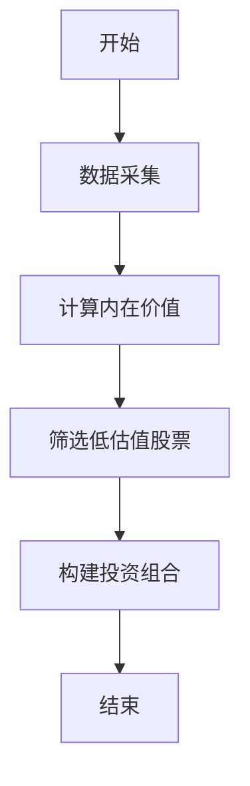
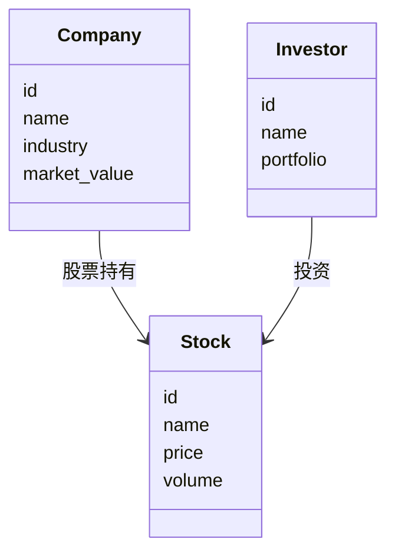

                 


# 格雷厄姆特价股票策略在混合经济体系下的表现

## 关键词：格雷厄姆策略、特价股票、混合经济、投资分析、价值投资、数学模型

## 摘要：本文探讨了格雷厄姆特价股票策略在混合经济体系下的表现。通过分析策略的核心原理、数学模型和实际应用，结合混合经济的特点，提出了一种优化的投资组合策略，并通过案例验证了其可行性。文章结构清晰，内容详实，旨在为投资者提供理论支持和实践指导。

---

# 第一部分：背景介绍

## 第1章：格雷厄姆投资理论的背景与发展

### 1.1 格雷厄姆投资理论的起源
格雷厄姆是价值投资的鼻祖，他的投资理念强调寻找市场低估的股票，即“烟蒂股”。这种策略在市场低迷或不确定性较高的情况下表现尤为突出。

### 1.2 混合经济体系的特点
混合经济结合了市场经济和计划经济的特点，政府对经济有一定的调控作用，同时市场机制仍然发挥重要作用。这种体系下，股票市场的波动性可能较低，但政府政策对市场的影响较大。

### 1.3 特价股票的定义与特征
特价股票是指市场价格低于其内在价值的股票。在混合经济下，政府的干预可能会影响股票的内在价值计算，因此需要调整估值模型。

---

## 第2章：格雷厄姆策略在混合经济中的适应性分析

### 2.1 格雷厄姆策略的核心思想
格雷厄姆策略的核心是寻找市场低估的股票，通过分析公司的基本面来确定其内在价值。在混合经济下，政府政策和行业监管可能影响公司的财务状况，因此需要将这些因素纳入分析。

### 2.2 混合经济下股票市场的特殊性
混合经济下，政府对某些行业的支持可能会影响股票的估值。例如，政府可能对某些行业提供补贴或税收优惠，这需要在估值模型中考虑。

### 2.3 格雷厄姆策略的适应性分析
在混合经济下，格雷厄姆策略仍然有效，但需要对模型进行调整，以考虑政府政策和行业监管的影响。通过调整后的模型，可以在混合经济下更好地识别低估的股票。

---

# 第二部分：核心概念与联系

## 第3章：核心概念原理

### 3.1 格雷厄姆策略的基本原理
格雷厄姆策略基于价值投资理念，强调寻找市场价格低于内在价值的股票。内在价值是通过公司基本面分析确定的，包括盈利能力、资产状况等。

### 3.2 特价股票的筛选标准
格雷厄姆提出了多个筛选标准，包括低市盈率、低市净率、股息率高等。在混合经济下，还需要考虑行业政策风险。

### 3.3 混合经济下的市场机会
混合经济下，政府干预可能为某些行业带来政策红利，但也可能导致市场波动。因此，投资者需要关注政策变化，调整投资策略。

---

## 第4章：核心概念对比分析

### 4.1 不同投资策略的特征对比
对比价值投资、成长投资和指数投资，格雷厄姆策略在市场低迷时表现较好，但在市场繁荣时可能表现不佳。

### 4.2 格雷厄姆策略与其他策略的差异
格雷厄姆策略注重安全边际，即市场价格远低于内在价值。其他策略可能更关注成长性或市场趋势。

### 4.3 混合经济下策略的优劣势分析
优势：政府政策可能为某些行业带来低估机会；劣势：政策变化可能导致市场波动，增加投资风险。

---

## 第5章：ER实体关系图

```mermaid
erDiagram
    company {
        id
        name
        industry
        market_value
    }
    stock {
        id
        name
        price
        volume
    }
    investor {
        id
        name
        portfolio
    }
    company --> stock: 股票持有
    investor --> stock: 投资
```

---

# 第三部分：算法原理与数学模型

## 第6章：格雷厄姆策略的算法原理

### 6.1 算法原理
格雷厄姆策略通过筛选低估值股票，构建投资组合。算法步骤包括数据采集、估值计算、股票筛选和组合优化。

### 6.2 算法流程图


### 6.3 Python代码实现
```python
def graham_strategy(stock_data, price_multiplier=1.5):
    # 计算内在价值
    intrinsic_value = stock_data[' earnings'] * price_multiplier
    # 筛选低估值股票
    undervalued_stocks = stock_data[stock_data['price'] < intrinsic_value]
    return undervalued_stocks
```

---

## 第7章：数学模型与公式

### 7.1 内在价值计算公式
$$ \text{内在价值} = \text{每股收益} \times \text{合理市盈率} $$

### 7.2 投资组合优化模型
$$ \text{目标函数} = \max \sum (r_i) $$
$$ \text{约束条件} = \sum w_i = 1, \quad w_i \geq 0 $$

---

## 第8章：系统分析与架构设计

### 8.1 问题场景介绍
在混合经济下，政府政策可能影响股票市场，投资者需要实时监控政策变化。

### 8.2 领域模型设计


### 8.3 系统架构设计
```mermaid
containerDiagram
    Data采集模块 --> 数据处理模块
    数据处理模块 --> 策略执行模块
    策略执行模块 --> 结果分析模块
```

---

## 第9章：项目实战与案例分析

### 9.1 环境安装
需要安装Python、Pandas、Matplotlib等工具。

### 9.2 核心代码实现
```python
import pandas as pd
import numpy as np

def calculate_intrinsic_value(stock_data, price_multiplier):
    stock_data['intrinsic_value'] = stock_data['earnings'] * price_multiplier
    return stock_data

def select_undervalued_stocks(stock_data):
    return stock_data[stock_data['price'] < stock_data['intrinsic_value']]
```

### 9.3 实际案例分析
以某混合经济国家为例，分析政府政策对股票估值的影响，并展示策略的应用效果。

---

## 第10章：最佳实践与总结

### 10.1 最佳实践建议
- 定期调整投资组合，适应政策变化。
- 结合技术分析，提高策略的有效性。

### 10.2 项目小结
格雷厄姆策略在混合经济下仍然有效，但需要根据政策调整估值模型。

### 10.3 拓展阅读
建议阅读相关书籍，深入学习混合经济下的投资策略。

---

# 作者：AI天才研究院/AI Genius Institute & 禅与计算机程序设计艺术 /Zen And The Art of Computer Programming

---

通过以上内容，我们详细分析了格雷厄姆策略在混合经济下的表现，结合理论和实践，为投资者提供了实用的指导。

