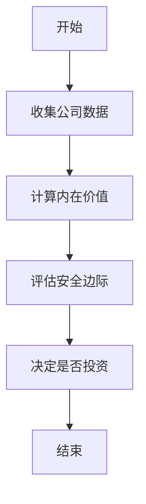
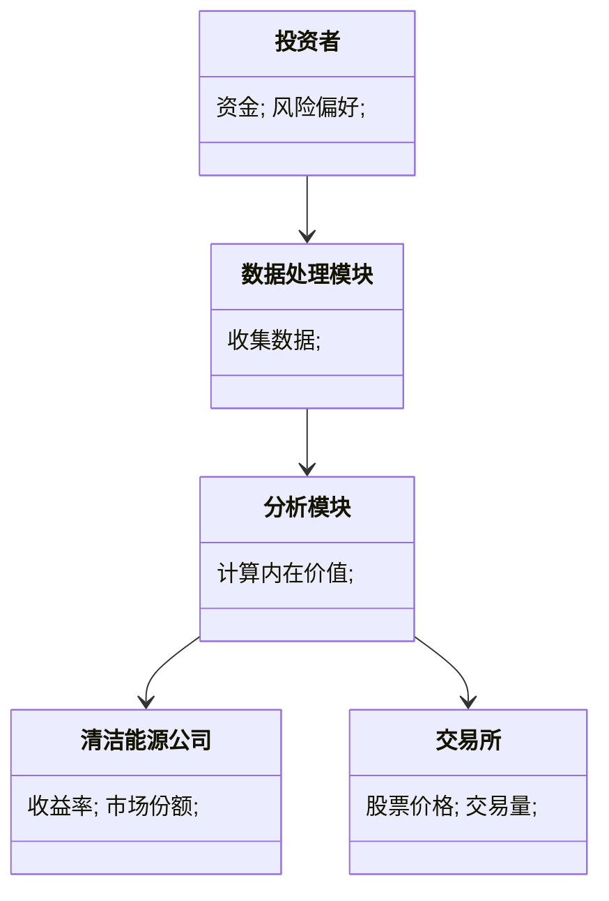

                 


# 格雷厄姆特价股票策略在清洁能源行业的应用挑战

> 关键词：格雷厄姆策略，清洁能源，价值投资，股票分析，投资策略

> 摘要：本文详细探讨了格雷厄姆特价股票策略在清洁能源行业的应用挑战。从策略背景、核心概念到算法原理、系统架构设计，再到项目实战与最佳实践，全面解析了如何将格雷厄姆策略应用于清洁能源投资中。通过丰富的案例分析和详细的系统设计，本文为投资者提供了实用的指导和参考。

---

## 第一部分: 格雷厄姆特价股票策略与清洁能源行业概述

### 第1章: 格雷厄姆特价股票策略的核心概念

#### 1.1 格雷厄姆特价股票策略的定义与特点
格雷厄姆特价股票策略是价值投资的核心策略，旨在寻找市场价格低于其内在价值的股票。其特点包括：
- **安全边际**：买入价格低于内在价值，以减少市场波动带来的风险。
- **长期视角**：关注公司的长期盈利能力，而非短期市场波动。
- **基本面分析**：通过财务数据和公司分析，评估公司的内在价值。

#### 1.2 清洁能源行业的现状与挑战
清洁能源行业是全球能源转型的重要方向，包括太阳能、风能、生物质能等多种形式。其特点包括：
- **政策依赖**：政府政策对行业影响重大。
- **技术驱动**：技术创新是行业发展的核心动力。
- **市场波动**：行业受政策、技术、市场等多种因素影响，波动较大。

#### 1.3 格雷厄姆策略在清洁能源行业的应用背景
随着全球能源结构的转型，清洁能源行业迎来了巨大的投资机会。然而，行业的高波动性和政策依赖性也为投资带来了挑战。格雷厄姆策略以其稳健的价值投资理念，为投资者提供了在清洁能源行业中寻找优质标的的可能性。

---

### 第2章: 格雷厄姆策略与清洁能源行业的核心概念

#### 2.1 核心概念的定义与属性对比
| 核心概念       | 格雷厄姆策略                          | 清洁能源行业                          |
|----------------|-------------------------------------|---------------------------------------|
| 核心目标       | 寻找安全边际高的股票                | 寻找具备长期成长潜力的企业            |
| 分析方法       | 基于市盈率、市净率等估值指标         | 基于技术创新、政策支持等                |
| 风险因素       | 市场波动、政策变化                   | 技术风险、政策变化、市场波动          |

#### 2.2 实体关系图（ER图）架构
```mermaid
erDiagram
    actor 投资者 {
        <属性> 资金
        <属性> 风险偏好
    }
    actor 清洁能源公司 {
        <属性> 收益率
        <属性> 市场份额
    }
    actor 交易所 {
        <属性> 股票价格
        <属性> 交易量
    }
    投资者 --> 清洁能源公司 : 投资
    清洁能源公司 --> 交易所 : 上市
    投资者 --> 交易所 : 购买股票
```

---

### 第3章: 格雷厄姆策略在清洁能源行业的算法原理

#### 3.1 算法原理的数学模型
格雷厄姆策略的核心是通过分析企业的基本面，计算其内在价值。公式如下：
$$ \text{内在价值} = \sum_{t=1}^{n} \frac{\text{现金流}_t}{(1 + r)^t} $$
其中，$r$ 是折现率，$\text{现金流}_t$ 是第 $t$ 年的现金流。

在清洁能源行业的应用中，还需要考虑行业特定因素，例如：
$$ \text{行业调整因子} = \text{技术创新速度} \times \text{政策支持力度} $$

#### 3.2 算法流程图


---

## 第4章: 格雷厄姆策略在清洁能源行业的系统分析与架构设计

### 4.1 问题场景介绍
在清洁能源行业，投资者需要处理大量数据，包括财务数据、行业数据和政策数据。格雷厄姆策略的应用需要一个高效的系统来支持数据处理和分析。

### 4.2 系统功能设计
#### 4.2.1 领域模型（Mermaid类图）


### 4.3 系统架构设计
#### 4.3.1 系统架构图（Mermaid架构图）


---

## 第5章: 格雷厄姆策略在清洁能源行业的项目实战

### 5.1 环境安装
需要安装Python、Pandas、NumPy等工具。

### 5.2 核心代码实现
```python
def calculate_intrinsic_value(enterprise_value, cash_flow):
    return sum(cash_flow / (1 + 0.1)**t for t in range(len(cash_flow)))

# 示例数据
cash_flow = [100, 120, 150]
enterprise_value = calculate_intrinsic_value(enterprise_value, cash_flow)
print(enterprise_value)
```

### 5.3 案例分析
通过分析某清洁能源公司的财务数据，计算其内在价值，评估其是否具备投资价值。

---

## 第6章: 最佳实践与总结

### 6.1 最佳实践 tips
- 保持对政策的关注，及时调整投资策略。
- 注重技术驱动型企业，避免选择技术落后的公司。

### 6.2 小结
格雷厄姆策略在清洁能源行业的应用需要结合行业特点，通过系统化的分析和数据支持，找到具备长期成长潜力的企业。

### 6.3 注意事项
- 避免过度依赖单一指标，结合多种因素进行分析。
- 定期复盘，根据市场变化调整投资策略。

### 6.4 拓展阅读
- 格雷厄姆的《证券分析》
- 清洁能源行业的技术趋势报告

---

作者：AI天才研究院 & 禅与计算机程序设计艺术

