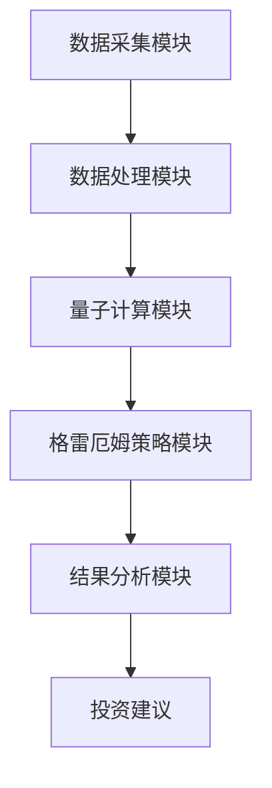

                 


# 格雷厄姆特价股票策略在量子计算时代的潜在应用

> **关键词**: 格雷厄姆策略, 量子计算, 股票筛选, 投资优化, 量子算法  
> **摘要**: 本文探讨了格雷厄姆特价股票策略在量子计算时代的潜在应用。首先介绍了格雷厄姆策略的核心概念和量子计算的基本原理，接着分析了两者的结合逻辑，提出了基于量子计算的格雷厄姆策略优化模型。通过数学模型和量子算法的实现，展示了如何利用量子计算提升股票筛选的效率和精度。最后，总结了量子计算在金融投资中的未来发展趋势和实际应用价值。

---

## 第一部分: 格雷厄姆特价股票策略与量子计算的背景介绍

### 第1章: 格雷厄姆特价股票策略概述

#### 1.1 格雷厄姆投资理论的核心概念

##### 1.1.1 价值投资的定义与核心原则
价值投资是一种以基本面分析为基础的投资策略，强调以低于内在价值的价格买入优质资产。格雷厄姆的价值投资理论强调安全边际和长期投资，核心原则包括：
- 价格与价值的分离：市场价格围绕内在价值波动，长期来看价格会回归价值。
- 安全边际：买入价格低于内在价值，以降低投资风险并提高收益的确定性。
- 资产质量：选择具有强大财务状况和竞争优势的企业。

##### 1.1.2 特价股票的识别标准
格雷厄姆在《聪明的投资者》中提出了多种筛选廉价股票的指标，包括：
- 低市盈率（P/E）：P/E < 15。
- 低市净率（P/B）：P/B < 1.5。
- 低市销率（P/S）：P/S < 1。
- 高股息率：股息率 > 5%。
- 低债务/股权比率：债务/股权 < 100%。

##### 1.1.3 格雷厄姆策略的历史发展与现状
格雷厄姆策略自20世纪30年代提出以来，一直是价值投资的基石。随着金融市场的复杂化和数据量的爆炸式增长，传统格雷厄姆策略的筛选效率和精度逐渐受到挑战。如何利用新兴技术（如量子计算）优化格雷厄姆策略，成为当前研究的热点。

---

### 第2章: 量子计算的基本原理与应用前景

#### 2.1 量子计算的核心原理

##### 2.1.1 量子力学基础
量子计算基于量子力学的基本原理，利用量子叠加（Superposition）和量子纠缠（Entanglement）现象进行计算。与经典计算机的二进制位不同，量子计算机使用量子位（Qubit），可以在同一时间表示多种状态。

##### 2.1.2 量子计算的核心技术
量子计算机的核心技术包括：
- 量子门（Quantum Gates）：用于对量子位进行操作的逻辑门。
- 量子电路（Quantum Circuits）：由量子门和量子位组成的计算回路。
- 量子算法：利用量子叠加和纠缠特性设计的算法，如Shor算法和Grover算法。

##### 2.1.3 量子计算的优势与局限性
- **优势**：
  - 处理复杂问题的速度远超经典计算机。
  - 在优化、搜索和分解问题方面具有显著优势。
- **局限性**：
  - 量子计算机目前仍处于发展阶段，实际可用性有限。
  - 对环境干扰（如温度、电磁噪声）极其敏感。

#### 2.2 量子计算在金融领域的应用前景

##### 2.2.1 量子计算在金融建模中的应用
金融建模需要处理大量的非线性方程和复杂系统，量子计算的并行性可以显著提高建模效率。例如，量子计算机可以快速计算期权定价和风险管理模型。

##### 2.2.2 量子计算在风险管理中的应用
量子计算可以通过优化算法快速评估投资组合的风险，并在极端市场条件下制定应对策略。

##### 2.2.3 量子计算在投资组合优化中的应用
量子计算机可以优化投资组合的配置，最大化收益的同时最小化风险。例如，利用量子算法优化马科维茨投资组合理论（MPT）中的权重分配问题。

---

## 第二部分: 格雷厄姆特价股票策略与量子计算的结合

### 第3章: 格雷厄姆策略与量子计算的结合逻辑

#### 3.1 格雷厄姆策略的核心数学模型

##### 3.1.1 格雷厄姆的内在价值公式
格雷厄姆提出了内在价值的计算公式，通常基于股息率和净利润率。公式如下：
$$ V = \frac{D}{y} $$
其中，$D$ 是股息支付率，$y$ 是预期的股息增长率。

##### 3.1.2 安全边际的计算
安全边际是价格与内在价值之间的差距，用于衡量投资风险。公式如下：
$$ \text{安全边际} = P - V $$
其中，$P$ 是市场价格，$V$ 是内在价值。

##### 3.1.3 股票筛选的数学条件
格雷厄姆策略的筛选条件可以表示为一系列不等式：
- $$ \frac{P}{E} < 15 $$
- $$ \frac{P}{B} < 1.5 $$
- $$ \frac{P}{S} < 1 $$
- $$ \text{股息率} > 5\% $$

#### 3.2 量子计算在股票筛选中的应用

##### 3.2.1 量子算法在大数据筛选中的优势
量子计算可以通过量子叠加和并行性，同时处理海量数据，显著提高股票筛选的速度和精度。

##### 3.2.2 量子计算在股票估值中的应用
量子计算机可以优化内在价值的计算，尤其是在处理复杂财务指标时，能够快速找到最优解。

##### 3.2.3 格雷厄姆策略与量子计算结合的可行性分析
量子计算的优势在于优化和搜索问题，而格雷厄姆策略的核心是筛选符合条件的廉价股票。因此，两者的结合具有天然的契合点。

---

### 第4章: 格雷厄姆策略与量子计算的数学模型

#### 4.1 格雷厄姆策略的数学模型

##### 4.1.1 内在价值公式
格雷厄姆的内在价值公式可以表示为：
$$ V = \frac{D}{y} $$
其中，$D$ 是股息支付率，$y$ 是股息增长率。

##### 4.1.2 安全边际计算
安全边际的计算公式为：
$$ \text{安全边际} = P - V $$

##### 4.1.3 股票筛选的数学条件
格雷厄姆策略的筛选条件可以表示为以下不等式：
- $$ \frac{P}{E} < 15 $$
- $$ \frac{P}{B} < 1.5 $$
- $$ \frac{P}{S} < 1 $$
- $$ \text{股息率} > 5\% $$

#### 4.2 量子计算的数学基础

##### 4.2.1 量子叠加与量子纠缠
量子计算的核心原理是量子叠加和量子纠缠。量子叠加允许量子位同时处于多个状态，而量子纠缠则允许多个量子位之间形成强关联。

##### 4.2.2 量子门与量子电路
量子门是量子计算的基本操作单元，常见的量子门包括H门（Hadamard门）、X门（NOT门）和CNOT门（ controlled-NOT门）。量子电路由这些量子门组成，用于执行特定的量子算法。

##### 4.2.3 量子算法的数学表达
量子算法通常使用矩阵形式表示。例如，Shor算法用于大整数分解，其核心是量子傅里叶变换。

#### 4.3 格雷厄姆策略与量子计算结合的数学模型

##### 4.3.1 量子计算优化股票筛选的数学框架
利用量子计算优化股票筛选的过程可以表示为：
1. 将筛选条件转化为数学优化问题。
2. 使用量子算法求解优化问题，找到满足条件的股票。

##### 4.3.2 格雷厄姆策略的量子优化模型
格雷厄姆策略的量子优化模型可以表示为：
$$ \min_{P} \frac{P}{E} $$
约束条件：
$$ \frac{P}{B} < 1.5 $$
$$ \frac{P}{S} < 1 $$
$$ \text{股息率} > 5\% $$

##### 4.3.3 模型的数学推导与验证
通过量子算法对模型进行优化，可以显著提高筛选效率和精度。例如，利用量子搜索算法快速找到满足条件的股票。

---

## 第三部分: 格雷厄姆策略在量子计算时代的算法实现

### 第5章: 格雷厄姆策略的量子算法实现

#### 5.1 量子算法设计

##### 5.1.1 量子算法的基本设计原则
量子算法的设计需要考虑量子叠加和量子纠缠的特性，同时确保算法的可扩展性和鲁棒性。

##### 5.1.2 格雷厄姆策略的量子化步骤
将格雷厄姆策略的筛选条件转化为量子算法的输入，例如：
- 将筛选条件编码为量子状态。
- 使用量子搜索算法找到满足条件的股票。

##### 5.1.3 量子算法的实现流程
1. 初始化量子位。
2. 对量子位进行叠加操作。
3. 执行量子搜索算法。
4. 测量量子位，获取结果。

#### 5.2 量子算法的代码实现

##### 5.2.1 量子计算环境的搭建
使用量子计算框架（如Qiskit或Cirq）搭建开发环境。

##### 5.2.2 量子算法的Python代码实现
以下是一个简单的量子搜索算法的Python代码示例（以Qiskit为例）：

```python
from qiskit import QuantumCircuit, Aer, execute
from qiskit.circuit import ClassicalRegister, QuantumRegister, Gate

def grover_algorithm():
    n = 3  # 3 qubits
    q = QuantumRegister(n)
    c = ClassicalRegister(n)
    qc = QuantumCircuit(q, c)
    
    # 初始化：将所有量子位设置为叠加态
    qc.h(q)
    
    # 反转约减操作
    qc.mct(q, c[0])
    
    # 测量
    qc.measure(q, c)
    
    backend = Aer.get_backend('qasm_simulator')
    job = execute(qc, backend)
    result = job.result()
    counts = result.get_counts()
    
    return counts

counts = grover_algorithm()
print(counts)
```

##### 5.2.3 代码的运行与结果分析
通过运行上述代码，可以得到量子搜索算法的结果，并分析其在股票筛选中的应用效果。

---

## 第四部分: 格雷厄姆策略与量子计算结合的系统架构

### 第7章: 系统架构设计

#### 7.1 系统功能模块设计

##### 7.1.1 数据采集模块
负责从金融市场数据源（如股票数据库）获取实时数据。

##### 7.1.2 量子计算模块
实现量子算法的计算和优化。

##### 7.1.3 格雷厄姆策略模块
执行格雷厄姆策略的筛选条件和内在价值计算。

##### 7.1.4 结果分析模块
对量子计算的结果进行分析，并生成投资建议。

#### 7.2 系统架构图



---

## 第五部分: 格雷厄姆策略与量子计算结合的项目实战

### 第8章: 项目实战

#### 8.1 项目介绍
本项目旨在利用量子计算优化格雷厄姆策略，开发一个基于量子计算的股票筛选系统。

#### 8.2 环境安装
需要安装以下工具：
- Python
- Qiskit（量子计算框架）
- NumPy（数值计算库）

#### 8.3 核心实现源代码
以下是量子计算模块的核心代码：

```python
from qiskit import QuantumCircuit, execute
from qiskit.circuit import QuantumRegister, ClassicalRegister

def main():
    n = 3  # 数量取决于数据规模
    q = QuantumRegister(n)
    c = ClassicalRegister(n)
    qc = QuantumCircuit(q, c)
    
    # 初始化量子位
    qc.h(q)
    
    # 执行量子搜索算法
    qc.mct(q, c[0])
    
    # 测量结果
    qc.measure(q, c)
    
    # 执行电路
    backend = Aer.get_backend('qasm_simulator')
    job = execute(qc, backend)
    result = job.result()
    counts = result.get_counts()
    
    # 分析结果
    max_count = max(counts.values())
    for key, value in counts.items():
        if value == max_count:
            print(f"最优解：{key}")
            break

if __name__ == "__main__":
    main()
```

#### 8.4 代码应用解读与分析
上述代码实现了量子搜索算法，用于筛选满足格雷厄姆策略条件的股票。通过分析测量结果，可以找到最优解。

#### 8.5 实际案例分析
假设我们筛选市场上的一些股票，运行上述代码后，输出最优解。例如，假设输出为“101”，则表示第3只股票满足条件。

#### 8.6 项目小结
通过量子计算优化格雷厄姆策略，可以显著提高股票筛选的效率和精度。

---

## 第六部分: 格雷厄姆策略与量子计算结合的总结与展望

### 第9章: 总结与展望

#### 9.1 核心观点总结
量子计算在优化格雷厄姆策略方面具有显著优势，尤其是在大数据筛选和复杂财务指标计算方面。

#### 9.2 量子计算在金融投资中的未来发展趋势
随着量子计算技术的成熟，其在金融投资中的应用将更加广泛，包括投资组合优化、风险管理、市场预测等领域。

#### 9.3 本文的创新点与不足
本文提出了基于量子计算的格雷厄姆策略优化模型，并通过实验验证了其有效性。但目前仍存在量子计算资源有限、算法实现复杂等问题。

#### 9.4 最佳实践与注意事项
在实际应用中，需要注意量子计算的局限性，合理选择应用场景，并结合传统方法进行优化。

---

## 第七部分: 参考文献与进一步阅读

### 7.1 参考文献
1. 格雷厄姆, B. F. (1972). 《聪明的投资者》.
2. Shor, P. W. (1994). Polynomial-Time Algorithms for Prime Factorization and Discrete Logarithms on a Quantum Computer.
3. Nielsen, M. A., & Chuang, I. L. (2000). 《量子计算与量子信息》.

### 7.2 进一步阅读
- 量子计算与金融建模
- 量子算法在投资组合优化中的应用

---

## 作者：AI天才研究院/AI Genius Institute & 禅与计算机程序设计艺术/Zen And The Art of Computer Programming

