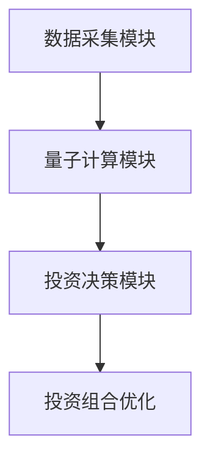

                 

# 《格雷厄姆特价股票策略在量子金融时代的演变》

---

## 关键词：
- 格雷厄姆投资策略  
- 量子金融  
- 量子计算  
- 量子概率论  
- 投资组合优化  
- 金融建模  

---

## 摘要：
本文探讨了格雷厄姆特价股票策略在量子金融时代的演变。格雷厄姆的价值投资理念，即以低于内在价值的价格购买优质股票，是金融领域的重要基石。然而，随着量子计算和大数据技术的快速发展，传统投资策略面临新的挑战和机遇。本文从量子金融的核心概念出发，分析量子计算如何改变金融建模和投资决策，探讨如何将格雷厄姆策略与量子金融技术结合，以优化投资组合和提高收益。通过系统架构设计和实际案例分析，本文展示了格雷厄姆策略在量子金融时代的创新应用，并展望了未来的发展方向。

---

# 第一章: 格雷厄姆特价股票策略与量子金融时代的背景

## 1.1 格雷厄姆投资理论的核心思想
### 1.1.1 价值投资的基本原则
- 格雷厄姆的价值投资理念：寻找市场低估的股票。
- 投资的长期性：关注企业的内在价值，而非短期市场波动。
- 安全边际：以低于内在价值的价格买入股票。

### 1.1.2 格雷厄姆的选股标准
- 低市盈率（P/E比率）。
- 低市净率（P/B比率）。
- 高股息率。
- 强大的财务状况（如低负债率）。

### 1.1.3 格雷厄姆策略的历史表现
- 格雷厄姆策略在历史上的收益率分析。
- 该策略在不同市场环境下的表现差异。

## 1.2 量子金融时代的定义与特征
### 1.2.1 量子金融的定义
- 量子金融：利用量子计算技术进行金融建模、交易和投资决策的新领域。
- 量子金融的核心特征：高速计算、超强并行性和量子叠加效应。

### 1.2.2 量子金融与传统金融的区别
- 数据处理能力：量子计算能够处理海量数据，超越传统计算机的极限。
- 计算速度：量子计算机在某些任务上比经典计算机快得多。
- 投资决策的实时性：量子计算能够实时优化投资组合，应对市场变化。

### 1.2.3 量子金融时代的投资挑战
- 数据量的爆炸性增长。
- 算法交易的复杂性增加。
- 量子计算对传统金融模型的冲击。

---

# 第二章: 格雷厄姆策略在量子金融中的核心概念

## 2.1 量子计算在金融分析中的应用
### 2.1.1 量子计算的基本原理
- 量子位（Qubit）：量子计算的基本单位。
- 量子叠加：量子位可以同时处于多个状态。
- 量子纠缠：量子位之间的强关联性。

### 2.1.2 量子计算在金融建模中的优势
- 高速计算能力：能够快速处理复杂的金融模型。
- 并行性：可以同时分析多个市场情景。
- 精准概率计算：利用量子叠加效应进行概率建模。

### 2.1.3 量子计算对格雷厄姆策略的改进
- 利用量子计算优化选股标准。
- 通过量子概率论改进市场预测模型。
- 实时分析市场变化，动态调整投资组合。

## 2.2 量子概率论与投资决策
### 2.2.1 量子概率论的基本概念
- 量子概率与传统概率的区别。
- 量子概率的叠加原理：同时考虑多种可能性。
- 量子概率的不确定性：如何在投资决策中处理不确定性。

### 2.2.2 量子概率在投资组合优化中的应用
- 利用量子概率优化投资组合的风险和收益。
- 通过量子概率模型预测市场波动。

## 2.3 量子叠加与投资组合优化
### 2.3.1 量子叠加的基本原理
- 量子叠加在投资组合优化中的应用。
- 通过量子叠加同时分析多个投资组合的可能性。

### 2.3.2 量子叠加在选股中的应用
- 利用量子叠加效应快速筛选符合格雷厄姆选股标准的股票。
- 通过量子叠加优化投资组合的构成。

---

# 第三章: 格雷厄姆策略的量子算法与数学模型

## 3.1 量子算法在金融分析中的应用
### 3.1.1 量子随机行走算法
- 量子随机行走算法的原理。
- 该算法在股票价格预测中的应用。

### 3.1.2 量子优化算法
- 利用量子优化算法优化投资组合。
- 通过量子优化算法解决复杂的投资组合优化问题。

## 3.2 量子概率模型的数学表达
### 3.2.1 量子概率的数学公式
- 量子概率的叠加表达式。
- 量子概率与传统概率的对比。

### 3.2.2 量子概率在投资决策中的应用
- 利用量子概率模型预测股票价格波动。
- 通过量子概率模型优化投资组合的风险和收益。

## 3.3 量子计算在选股中的数学模型
### 3.3.1 量子计算选股模型的构建
- 利用量子计算分析大量股票数据。
- 构建量子计算选股模型的步骤。

### 3.3.2 量子计算选股模型的优化
- 通过量子优化算法改进选股模型的精度。
- 实时更新选股模型以应对市场变化。

---

# 第四章: 格雷厄姆策略在量子金融中的系统架构与项目实战

## 4.1 系统架构设计
### 4.1.1 系统功能模块
- 数据采集模块：收集股票数据。
- 量子计算模块：运行量子算法。
- 投资决策模块：生成投资建议。

### 4.1.2 系统架构图

## 4.2 项目实战
### 4.2.1 量子计算选股算法的实现
- 量子随机行走算法的Python代码实现。
- 代码实现的详细解释与分析。

### 4.2.2 投资组合优化的实战案例
- 通过量子计算优化的投资组合案例分析。
- 实战案例的详细步骤与结果展示。

---

# 第五章: 量子金融时代的未来趋势与挑战

## 5.1 量子金融的未来发展趋势
### 5.1.1 量子计算在金融领域的广泛应用
- 量子计算在高频交易中的应用。
- 量子计算在风险管理中的应用。

### 5.1.2 量子金融与其他技术的结合
- 量子金融与人工智能的结合。
- 量子金融与大数据技术的结合。

## 5.2 量子金融时代的挑战
### 5.2.1 技术挑战
- 量子计算机的成本与稳定性问题。
- 量子算法的开发与优化。

### 5.2.2 市场挑战
- 量子金融技术的普及与应用。
- 传统金融模式的转型与适应。

## 5.3 格雷厄姆策略在量子金融时代的最佳实践
### 5.3.1 技术层面的建议
- 如何选择合适的量子计算技术。
- 如何优化量子概率模型。

### 5.3.2 实务层面的建议
- 如何在实际投资中应用量子金融技术。
- 如何平衡传统策略与量子策略的关系。

---

# 作者：AI天才研究院/AI Genius Institute & 禅与计算机程序设计艺术 /Zen And The Art of Computer Programming

---

通过以上目录结构，本文将详细探讨格雷厄姆特价股票策略在量子金融时代的演变，从理论到实践，从传统到创新，全面解析量子计算如何改变金融投资的未来。

