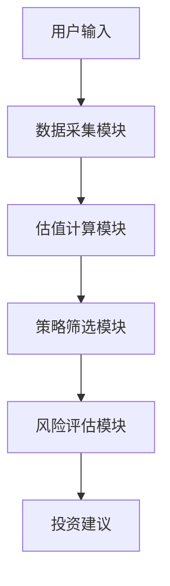

                 


```markdown
# 格雷厄姆特价股票策略在高科技行业的应用挑战

> 关键词：格雷厄姆策略，高科技行业，股票估值，价值投资，安全边际

> 摘要：本文探讨了格雷厄姆价值投资策略在高科技行业中的应用挑战。通过分析高科技行业的特点，如高增长、高风险和高波动性，本文揭示了传统格雷厄姆策略在该领域的局限性，并提出了一些调整策略，以更好地适应高科技行业的独特需求。文章还通过实际案例分析，展示了如何在高科技行业应用和调整格雷厄姆策略，以实现长期稳健的投资回报。

---

# 第一部分：格雷厄姆策略概述

## 第1章：格雷厄姆价值投资理论基础

### 1.1 格雷厄姆投资理论的核心理念
- **价值投资**：寻找市场价格低于其内在价值的股票。
- **安全边际**：以低于内在价值的价格买入，确保投资的安全性。
- **低市盈率与低市净率**：通过估值指标寻找被低估的股票。

### 1.2 格雷厄姆策略在传统行业的应用
- **案例分析**：以传统制造业为例，展示格雷厄姆策略的有效性。
- **成功经验**：低市盈率股票在经济衰退期的表现优于市场。

### 1.3 高科技行业的特点
- **高增长性**：高科技行业通常具有较高的增长率。
- **高波动性**：市场波动剧烈，市盈率和市净率往往远高于传统行业。
- **研发投入与未来收益**：高科技企业的价值更多依赖于未来的研发投入和创新。

---

# 第二部分：格雷厄姆策略在高科技行业的挑战

## 第2章：高科技行业的估值难点

### 2.1 高科技行业的估值指标
- **市盈率（P/E）**：由于高科技公司盈利波动大，市盈率可能被高估。
- **市净率（P/B）**：对于重资产行业适用，但高科技公司资产轻，市净率可能不准确。
- **PEG比率**：将市盈率与盈利增长率结合，更适合高增长行业。

### 2.2 格雷厄姆策略在高科技行业的局限性
- **高估值问题**：高科技公司市盈率和市净率通常远高于格雷厄姆的筛选标准。
- **研发投入的资本化**：研发投入难以准确评估，影响企业估值。
- **未来收益的不确定性**：高科技行业的创新风险较高，未来收益难以预测。

### 2.3 高科技行业与传统行业的估值差异对比
| 指标类型 | 传统行业 | 高科技行业 |
|----------|-----------|-------------|
| 市盈率   | 通常较低  | 通常较高    |
| 市净率   | 反映资产价值 | 资产较轻，市净率可能低估 |
| 盈利增长率 | 较低      | 较高        |

---

## 第3章：应对挑战的策略调整

### 3.1 调整格雷厄姆筛选标准
- **放宽市盈率和市净率标准**：允许更高的市盈率和市净率，以适应高科技行业的高增长特性。
- **引入PEG指标**：结合盈利增长率，筛选具有合理估值的高科技公司。
- **关注研发投入与未来收益**：将研发投入视为企业价值的重要组成部分。

### 3.2 分阶段投资策略
- **早期阶段**：投资于具有创新潜力但尚未盈利的公司。
- **成长阶段**：投资于盈利稳定且估值合理的公司。
- **成熟阶段**：投资于行业龙头，关注股息回报。

### 3.3 风险控制措施
- **分散投资**：避免过度集中于单一高科技公司或行业。
- **动态调整**：定期评估投资组合，根据市场变化和公司基本面进行调整。
- **风险管理模型**：使用VaR（在险价值）等模型量化投资风险。

---

## 第4章：数学模型与算法实现

### 4.1 格雷厄姆策略的数学模型
$$ \text{内在价值} = \frac{\text{年收益}}{\text{期望收益率}} $$

### 4.2 高科技行业调整后的估值模型
$$ \text{调整后估值} = \text{PEG} \times \text{行业平均市盈率} $$

### 4.3 算法实现步骤
1. **数据收集**：收集目标高科技公司的财务数据，包括收入、利润、研发投入等。
2. **计算估值指标**：计算市盈率、市净率、PEG等指标。
3. **筛选股票**：根据调整后的标准筛选出潜在投资标的。
4. **风险评估**：使用VaR模型评估投资组合风险。
5. **动态调整**：定期重新评估并调整投资组合。

---

## 第5章：系统架构与实现

### 5.1 系统架构设计
- **数据采集模块**：从金融数据库获取实时数据。
- **估值计算模块**：实现各种估值指标的计算。
- **策略筛选模块**：根据调整后的策略筛选股票。
- **风险评估模块**：评估投资组合风险。
- **用户界面模块**：提供直观的投资建议和报告。

### 5.2 系统架构图


---

## 第6章：项目实战

### 6.1 案例分析：某高科技公司
- **公司背景**：一家专注于人工智能的高科技公司。
- **财务数据**：收入增长率为30%，市盈率为50，行业平均PEG为1.5。
- **估值分析**：计算PEG为1.8，高于行业平均，需谨慎考虑。

### 6.2 代码实现
```python
def calculate_pe(stock_data):
    pe_ratio = stock_data['price'] / stock_data['earnings_per_share']
    return pe_ratio

def calculatePEG(stock_data, growth_rate):
    pe = calculate_pe(stock_data)
    peg = pe / growth_rate
    return peg

# 示例数据
stock_data = {
    'price': 100,
    'earnings_per_share': 5,
    'growth_rate': 0.3
}

peg = calculatePEG(stock_data, stock_data['growth_rate'])
print(f"PEG: {peg}")
```

---

## 第7章：总结与展望

### 7.1 总结
- 格雷厄姆策略在高科技行业面临独特挑战。
- 通过调整估值指标和引入新模型，可以有效应对这些挑战。
- 分阶段投资和风险管理是实现稳健回报的关键。

### 7.2 展望
- 进一步优化估值模型，结合更多因素如研发投入。
- 探索AI和大数据技术在股票估值中的应用。
- 开发动态调整策略，适应市场变化。

---

## 作者

作者：AI天才研究院/AI Genius Institute & 禅与计算机程序设计艺术 /Zen And The Art of Computer Programming
```

