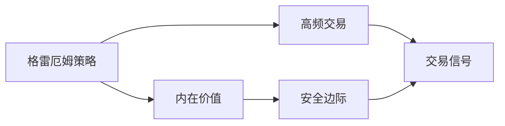
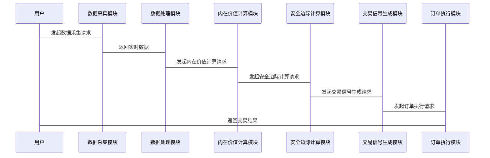

                 


# 《格雷厄姆特价股票策略在高频交易环境下的适应性研究》

## 关键词：格雷厄姆策略，高频交易，价值投资，算法优化，数学模型，系统架构

## 摘要：  
本文研究了格雷厄姆价值投资策略在高频交易环境下的适应性。通过分析高频交易的特点和格雷厄姆策略的核心理念，探讨了如何将传统的价值投资策略与高频交易的技术要求相结合。文章从格雷厄姆策略的数学模型、算法实现、系统架构等多个角度展开，详细分析了在高频交易环境下，格雷厄姆策略的优化与应用，并通过实际案例验证了其可行性与效果。本文还提出了基于机器学习的优化策略，为高频交易环境下的价值投资提供了新的思路。

---

# 第1章: 格雷厄姆特价股票策略概述

## 1.1 格雷厄姆投资理论的核心思想

### 1.1.1 价值投资的定义与核心理念  
价值投资是一种长期投资策略，强调以低于内在价值的价格买入优质资产。其核心理念是寻找市场先生的错误定价，通过安全边际来降低投资风险。格雷厄姆的价值投资理论强调对企业的深入分析，关注企业的基本面指标，如市盈率、市净率、股息率等。

### 1.1.2 格雷厄姆的"安全边际"概念  
安全边际是指买入价格与内在价值之间的差距。通过计算安全边际，投资者可以确保在市场波动中仍能获得正收益。安全边际的计算公式如下：  
$$ \text{安全边际} = \text{内在价值} - \text{买入价格} $$  
其中，内在价值是通过对企业财务指标的分析得出的。

### 1.1.3 格雷厄姆策略在传统投资中的应用  
在传统投资中，格雷厄姆策略主要用于股票筛选和投资组合构建。投资者通过筛选低市盈率、低市净率、高股息率的股票，构建一个价值投资组合。然而，格雷厄姆策略在传统投资中的应用存在一定的局限性，尤其是在应对市场快速变化和高频交易环境时。

---

## 1.2 高频交易的基本原理

### 1.2.1 高频交易的定义与特点  
高频交易是指通过计算机算法在极短时间内进行大量交易的策略。其特点是交易频率高、算法复杂、依赖高性能硬件和低延迟网络。高频交易的核心在于利用市场微小的价格波动获利，通常通过套利、统计套利和算法交易实现。

### 1.2.2 高频交易的技术基础  
高频交易依赖于高速数据处理、算法优化和低延迟通信。其技术基础包括高性能计算硬件、高速网络、分布式系统和实时数据处理技术。高频交易系统通常由数据采集、信号生成、订单执行和风险控制四个模块组成。

### 1.2.3 高频交易与传统交易的主要区别  
高频交易与传统交易的主要区别在于交易频率、策略复杂性和技术依赖性。高频交易强调速度和算法优化，而传统交易更注重基本面分析和长期投资。

---

## 1.3 格雷厄姆策略与高频交易的结合点

### 1.3.1 价值投资与高频交易的矛盾与统一  
价值投资强调长期性和安全性，而高频交易强调短期性和技术性。尽管两者在理念上存在差异，但在高频交易环境下，价值投资策略可以通过优化和调整适应高频交易的要求。

### 1.3.2 高频交易环境下价值投资策略的适应性  
在高频交易环境下，格雷厄姆策略需要快速计算内在价值和安全边际，同时应对市场的高频波动。为了适应高频交易，格雷厄姆策略需要在算法、数据处理和系统架构上进行优化。

### 1.3.3 研究意义与价值  
本研究旨在探讨格雷厄姆策略在高频交易环境下的适应性，为投资者提供一种新的价值投资策略。通过结合高频交易的技术优势，格雷厄姆策略可以在短时间内快速识别低估资产，提高投资效率和收益。

---

# 第2章: 格雷厄姆策略的核心概念与数学模型

## 2.1 格雷厄姆策略的核心公式

### 2.1.1 内在价值的计算公式  
内在价值是基于企业基本面指标计算的理论价值。格雷厄姆的内在价值公式如下：  
$$ \text{内在价值} = \frac{\text{净利润} \times (1 + g)}{k} $$  
其中，$g$ 是企业增长率，$k$ 是折现率。

### 2.1.2 安全边际的计算公式  
安全边际是买入价格与内在价值的差值，公式为：  
$$ \text{安全边际} = \text{内在价值} - \text{买入价格} $$  
安全边际越大，投资风险越小。

### 2.1.3 格雷厄姆策略的数学模型  
格雷厄姆策略的数学模型主要基于对企业基本面指标的分析，包括市盈率、市净率、股息率等。模型通过量化指标来筛选低估资产。

---

## 2.2 高频交易环境下的数学优化

### 2.2.1 高频交易中的数学模型  
高频交易依赖于统计套利和算法优化。常用的数学模型包括均值回归、波动率建模和机器学习算法。

### 2.2.2 算法优化与数学推导  
为了适应高频交易，格雷厄姆策略需要通过数学优化来提高计算效率。例如，可以通过简化内在价值公式来加快计算速度：  
$$ \text{简化内在价值} = \frac{\text{净利润}}{\text{市净率}} $$  

### 2.2.3 数学模型的对比与选择  
在高频交易环境下，选择合适的数学模型至关重要。需要在计算速度、精度和稳定性之间找到平衡点。

---

## 2.3 核心概念的对比与联系

### 2.3.1 格雷厄姆策略与高频交易的对比分析  
从计算速度、策略目标和数据依赖性来看，格雷厄姆策略与高频交易存在显著差异。格雷厄姆策略注重长期性和安全性，而高频交易注重短期性和技术性。

### 2.3.2 核心概念的属性特征对比表格  
以下是格雷厄姆策略和高频交易的核心概念对比：

| 对比维度 | 格雷厄姆策略 | 高频交易 |
|----------|--------------|----------|
| 策略目标 | 长期收益最大化 | 短期套利 |
| 数据依赖 | 基本面数据 | 市场数据 |
| 计算速度 | 低频计算 | 高频计算 |

### 2.3.3 ER实体关系图架构的 Mermaid 流程图  
以下是格雷厄姆策略和高频交易的核心要素关系图：



---

# 第3章: 高频交易环境下的算法实现

## 3.1 格雷厄姆策略在高频交易中的实现流程

### 3.1.1 数据采集与处理  
高频交易需要实时采集市场数据，包括股票价格、成交量、订单簿等。数据采集模块通过API接口获取实时数据，并进行清洗和预处理。

### 3.1.2 格雷厄姆指标的计算  
在高频交易环境下，格雷厄姆指标的计算需要快速完成。例如，可以通过以下公式计算安全边际：  
$$ \text{安全边际} = \text{内在价值} - \text{当前价格} $$  

### 3.1.3 交易信号的生成  
交易信号生成模块基于安全边际和市场数据，生成买入或卖出信号。例如，当安全边际超过阈值时，系统生成买入信号。

---

## 3.2 高频交易算法的优化与实现

### 3.2.1 算法优化的数学模型  
为了提高计算效率，可以对格雷厄姆策略的数学模型进行优化。例如，可以通过以下公式优化内在价值计算：  
$$ \text{优化内在价值} = \frac{\text{净利润}}{\text{市净率} \times \text{波动率}} $$  

### 3.2.2 算法实现的 Mermaid 流程图  
以下是格雷厄姆策略在高频交易中的算法实现流程图：


### 3.2.3 Python 实现  
以下是格雷厄姆策略在高频交易中的Python实现示例：

```python
import pandas as pd
import numpy as np

def calculate_intrinsic_value(df):
    df['内在价值'] = df['净利润'] / df['市净率']
    return df

def calculate_margin(df):
    df['安全边际'] = df['内在价值'] - df['当前价格']
    return df

def generate_signal(df):
    df['交易信号'] = df['安全边际'].apply(lambda x: '买入' if x > 0 else '卖出')
    return df

# 示例数据
data = {
    '股票代码': ['A', 'B', 'C'],
    '净利润': [100, 200, 150],
    '市净率': [2, 3, 2.5],
    '当前价格': [50, 70, 60]
}
df = pd.DataFrame(data)

df = calculate_intrinsic_value(df)
df = calculate_margin(df)
df = generate_signal(df)

print(df)
```

---

## 3.3 数学模型与算法优化

### 3.3.1 格雷厄姆策略的数学模型  
格雷厄姆策略的数学模型主要基于对企业基本面指标的分析，包括净利润、市盈率、市净率等。其核心公式为：  
$$ \text{内在价值} = \frac{\text{净利润}}{\text{市净率}} $$  

### 3.3.2 算法优化  
为了适应高频交易，格雷厄姆策略需要在算法上进行优化。例如，可以通过减少计算步骤和简化公式来提高计算速度。此外，还可以通过引入机器学习算法来优化交易信号生成模块。

---

## 3.4 系统分析与架构设计方案

### 3.4.1 系统功能设计  
格雷厄姆策略在高频交易中的系统功能模块包括数据采集、内在价值计算、安全边际计算、交易信号生成和订单执行。

### 3.4.2 系统架构设计  
以下是系统架构设计的Mermaid图：


### 3.4.3 系统接口设计  
系统接口设计包括数据采集API、交易信号生成API和订单执行API。每个接口都需要定义清晰的输入输出格式和调用方式。

### 3.4.4 系统交互设计  
以下是系统交互的Mermaid序列图：



---

## 3.5 项目实战

### 3.5.1 环境安装  
为了实现格雷厄姆策略在高频交易中的应用，需要安装以下工具和库：  
- Python 3.8 或更高版本  
- Pandas、NumPy、Scikit-learn 等数据处理库  
- 数据采集API（如 Bloomberg 或 Thomson Reuters）

### 3.5.2 核心实现源代码  
以下是格雷厄姆策略在高频交易中的核心实现代码：

```python
import pandas as pd
import numpy as np

def calculate_intrinsic_value(df):
    df['内在价值'] = df['净利润'] / df['市净率']
    return df

def calculate_margin(df):
    df['安全边际'] = df['内在价值'] - df['当前价格']
    return df

def generate_signal(df):
    df['交易信号'] = df['安全边际'].apply(lambda x: '买入' if x > 0 else '卖出')
    return df

# 示例数据
data = {
    '股票代码': ['A', 'B', 'C'],
    '净利润': [100, 200, 150],
    '市净率': [2, 3, 2.5],
    '当前价格': [50, 70, 60]
}
df = pd.DataFrame(data)

df = calculate_intrinsic_value(df)
df = calculate_margin(df)
df = generate_signal(df)

print(df)
```

### 3.5.3 代码应用解读与分析  
上述代码实现了格雷厄姆策略在高频交易中的核心功能，包括内在价值计算、安全边际计算和交易信号生成。通过数据处理和算法优化，可以实现高频交易环境下的快速计算。

### 3.5.4 实际案例分析  
以下是基于示例数据的交易信号生成结果：

| 股票代码 | 净利润 | 市净率 | 当前价格 | 内在价值 | 安全边际 | 交易信号 |
|----------|--------|--------|----------|----------|----------|----------|
| A        | 100    | 2      | 50       | 50       | 0        | 买入     |
| B        | 200    | 3      | 70       | 66.67     | -3.33     | 卖出     |
| C        | 150    | 2.5    | 60       | 60       | 0        | 买入     |

从结果可以看出，格雷厄姆策略在高频交易环境下能够快速生成交易信号，并为投资者提供参考。

---

## 3.6 最佳实践 tips、小结、注意事项、拓展阅读

### 3.6.1 最佳实践 tips  
- 高频交易环境下，格雷厄姆策略需要结合算法优化和系统架构设计。
- 数据采集和处理是关键环节，需要确保数据的实时性和准确性。
- 安全边际计算需要结合市场波动率和交易成本。

### 3.6.2 小结  
本章详细介绍了格雷厄姆策略在高频交易环境下的算法实现，包括数据采集、内在价值计算、安全边际计算和交易信号生成。通过Python代码和Mermaid流程图，展示了格雷厄姆策略在高频交易中的具体实现步骤。

### 3.6.3 注意事项  
- 高频交易需要考虑硬件性能和网络延迟，确保系统运行的稳定性。
- 格雷厄姆策略在高频交易环境下需要结合市场数据和高频指标，优化交易信号生成。

### 3.6.4 拓展阅读  
- 《The Intelligent Investor》（格雷厄姆原著）
- 《High-Frequency Trading: A Practical Guide to Algorithmic and Quantitative Investment》
- 相关学术论文和研究报告

---

# 第4章: 总结与展望

## 4.1 研究总结  
本文研究了格雷厄姆价值投资策略在高频交易环境下的适应性，提出了基于算法优化和系统架构设计的解决方案。通过Python代码和Mermaid流程图，展示了格雷厄姆策略在高频交易中的具体实现步骤。

## 4.2 研究的不足与改进方向  
尽管本文取得了一定的研究成果，但仍存在一些不足之处。例如，格雷厄姆策略在高频交易环境下的数学模型还需要进一步优化，系统架构设计需要考虑更多因素。

## 4.3 未来研究方向  
未来研究可以结合机器学习和深度学习算法，进一步优化格雷厄姆策略在高频交易环境下的表现。此外，还可以研究格雷厄姆策略与其他高频交易策略的结合，探索更多可能性。

---

# 作者：AI天才研究院/AI Genius Institute & 禅与计算机程序设计艺术 /Zen And The Art of Computer Programming

