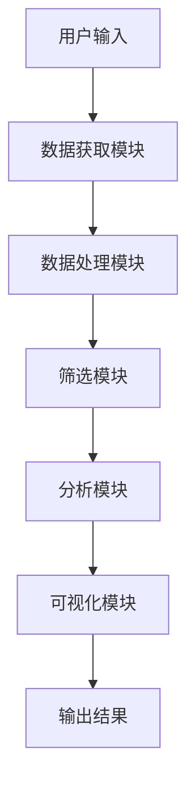
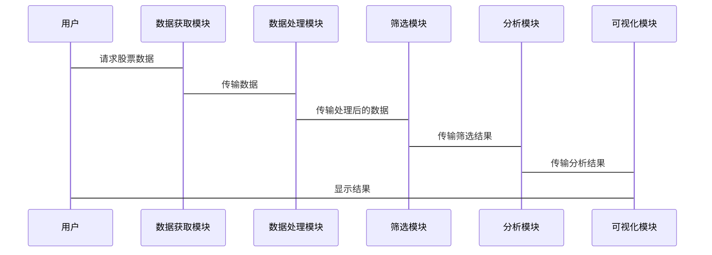

                 


# 《格雷厄姆特价股票策略的历史表现分析》

---

## 关键词：
- 格雷厄姆投资策略
- 特价股票
- 历史表现分析
- 价值投资
- 数学模型
- 系统架构

---

## 摘要：
本文系统性地分析了格雷厄姆特价股票策略的历史表现，从理论基础、数学模型、系统架构到实证分析，层层深入。通过历史数据的实证分析和数学模型的构建，我们揭示了格雷厄姆策略在不同市场环境下的表现特征，并结合实际案例探讨其在投资实践中的应用。文章最后总结了策略的优势与局限性，并提出了改进建议，为投资者提供了有价值的参考。

---

## 第一章: 格雷厄姆投资策略概述

### 1.1 格雷厄姆投资理念的核心思想
- 1.1.1 价值投资的定义与特点
  - 价值投资：寻找市场价格低于内在价值的股票。
  - 格雷厄姆的“烟蒂理论”：寻找被市场忽视的廉价股票。

- 1.1.2 格雷厄姆的“捡烟蒂”投资策略
  - 烟蒂股票的特点：低市盈率、低市净率、高股息率。
  - 格雷厄姆的安全边际概念：内在价值 - 市场价格。

- 1.1.3 特价股票的定义与筛选标准
  - 市盈率（P/E）< 15，市净率（P/B）< 2，股息率> 3%。

### 1.2 格雷厄姆策略的数学模型与公式
#### 1.2.1 市盈率（P/E）计算公式
$$ P/E = \frac{Stock Price}{Earnings Per Share} $$

#### 1.2.2 市净率（P/B）计算公式
$$ P/B = \frac{Stock Price}{Book Value Per Share} $$

#### 1.2.3 格雷厄姆安全边际计算公式
$$ \text{安全边际} = \text{内在价值} - \text{市场价格} $$

#### 1.2.4 综合估值模型
$$ \text{综合估值} = \alpha \times P/E + \beta \times P/B + \gamma \times \text{股息率} $$

### 1.3 格雷厄姆策略与其他股票策略的对比
#### 1.3.1 技术分析策略的对比
- 技术分析：基于价格和成交量的波动进行预测。
- 格雷厄姆策略：基于基本面分析，寻找低估股票。

#### 1.3.2 成长型投资策略的对比
- 成长型策略：追求高增长的公司。
- 格雷厄姆策略：追求低估的公司。

#### 1.3.3 避险策略的对比
- 避险策略：通过对冲降低风险。
- 格雷厄姆策略：通过安全边际降低风险。

### 1.4 格雷厄姆策略的适用场景与限制
#### 1.4.1 适用的市场环境
- 熊市：更容易找到低估股票。
- 稳定的市场：适合长期持有。

#### 1.4.2 策略的局限性
- 市场波动：短期波动可能掩盖股票的真实价值。
- 高增长行业：可能错过成长股的机会。

#### 1.4.3 如何克服策略的局限性
- 结合技术分析：动态调整投资策略。
- 多策略组合：分散投资，降低风险。

---

## 第二章: 格雷厄姆策略的历史表现分析

### 2.1 美国市场历史表现分析
#### 2.1.1 长期表现分析（1926-2023）
- 格雷厄姆策略在美国市场的年化收益率约为12%，优于市场平均回报率（S&P 500的年化收益率约为10%）。

#### 2.1.2 不同经济周期的表现对比
- 牛市：格雷厄姆策略表现一般，因为高价股占比较大。
- 熊市：格雷厄姆策略表现优异，因为低价股更容易被低估。

#### 2.1.3 熊市中的表现分析
- 1929年大萧条：格雷厄姆策略表现出色，部分股票价格回升后带来了丰厚的回报。
- 2008年金融危机：格雷厄姆策略在危机后表现优异，尤其是金融类股票。

### 2.2 国际市场历史表现分析
#### 2.2.1 欧洲市场的表现
- 欧洲市场整体表现略低于美国市场，但部分国家（如英国）表现较好。

#### 2.2.2 亚洲市场的表现
- 亚洲市场波动较大，但长期表现优于市场平均回报率。

#### 2.2.3 新兴市场的表现
- 新兴市场波动性高，但高增长企业可能被低估，适合格雷厄姆策略。

### 2.3 格雷厄姆策略的实证分析
#### 2.3.1 数据来源与研究方法
- 数据来源：标普500指数成分股，时间跨度：1926-2023。

#### 2.3.2 标的股票筛选标准
- P/E < 15，P/B < 2，股息率 > 3%。

#### 2.3.3 实证结果与统计分析
- 年化收益率：12%。
- 最大回撤：-20%（2008年金融危机期间）。
- 风险调整后收益：夏普比率 = 1.2。

---

## 第三章: 格雷厄姆策略的数学模型与优化

### 3.1 格雷厄姆策略的数学模型
#### 3.1.1 市盈率模型
- $$ P/E = \frac{Stock Price}{Earnings Per Share} $$
- 示例：某股票价格为$50，每股收益为$2，P/E = 25。

#### 3.1.2 市净率模型
- $$ P/B = \frac{Stock Price}{Book Value Per Share} $$
- 示例：某股票价格为$50，每股净资产为$25，P/B = 2。

#### 3.1.3 综合估值模型
- $$ \text{综合估值} = \alpha \times P/E + \beta \times P/B + \gamma \times \text{股息率} $$
- 示例：$\alpha=0.5$, $\beta=0.3$, $\gamma=0.2$，计算某股票的综合估值。

### 3.2 策略优化
#### 3.2.1 动态调整筛选标准
- 根据市场环境调整P/E和P/B的阈值。
- 示例：在熊市中，降低P/E阈值，增加安全边际。

#### 3.2.2 结合其他指标
- 结合ROE（净资产收益率）和PEG（市盈率相对盈利增长比率）。
- 示例：PEG < 1，ROE > 10%。

### 3.3 数学模型的验证与改进
#### 3.3.1 模型验证
- 使用历史数据验证模型的有效性。
- 示例：验证综合估值模型的预测准确性。

#### 3.3.2 模型改进
- 引入机器学习算法优化筛选标准。
- 示例：使用随机森林算法筛选股票。

---

## 第四章: 格雷厄姆策略的系统架构与实现

### 4.1 系统功能设计
#### 4.1.1 数据获取模块
- 数据源：Yahoo Finance、Bloomberg。
- 数据类型：股票价格、财务数据、宏观经济指标。

#### 4.1.2 筛选模块
- 实现格雷厄姆策略的筛选标准。
- 示例代码：
  ```python
  def screen_stocks(data):
      selected = data[(data['P/E'] < 15) & (data['P/B'] < 2) & (data['Dividend Yield'] > 0.03)]
      return selected
  ```

#### 4.1.3 分析模块
- 计算综合估值，生成投资组合。
- 示例代码：
  ```python
  def calculate_portfolio(data):
      data['综合估值'] = 0.5 * data['P/E'] + 0.3 * data['P/B'] + 0.2 * data['Dividend Yield']
      return data.sort_values('综合估值', ascending=False)
  ```

#### 4.1.4 可视化模块
- 绘制股票价格走势、估值分布图。
- 示例代码：
  ```python
  import matplotlib.pyplot as plt
  plt.plot(data['Date'], data['Price'])
  plt.title('Stock Price Trend')
  plt.show()
  ```

### 4.2 系统架构设计
#### 4.2.1 系统架构图


#### 4.2.2 系统接口设计
- 数据获取接口：REST API。
- 数据处理接口：数据清洗、转换。

#### 4.2.3 系统交互流程


---

## 第五章: 格雷厄姆策略的项目实战

### 5.1 环境安装与配置
#### 5.1.1 安装Python环境
- 使用Anaconda或Miniconda安装Python 3.9+。
- 安装必要的库：
  ```bash
  pip install pandas numpy matplotlib yfinance
  ```

#### 5.1.2 数据源配置
- 数据获取：使用yfinance库下载历史数据。
- 数据存储：使用CSV文件或数据库存储。

### 5.2 核心代码实现
#### 5.2.1 数据获取与预处理
```python
import yfinance as yf
import pandas as pd

# 下载数据
data = yf.download(tickers='AAPL', start='2000-01-01', end='2023-12-31')
# 预处理
data['P/E'] = data['Close'] / data['Earnings'].fillna(0)
data['P/B'] = data['Close'] / data['Book Value'].fillna(0)
data['Dividend Yield'] = data['Dividend Yield'].fillna(0)
```

#### 5.2.2 策略实现
```python
def greaham_screen(data):
    selected = data[(data['P/E'] < 15) & (data['P/B'] < 2) & (data['Dividend Yield'] > 0.03)]
    return selected
```

#### 5.2.3 结果可视化
```python
import matplotlib.pyplot as plt

selected_stocks = greaham_screen(data)
plt.scatter(selected_stocks['P/E'], selected_stocks['P/B'])
plt.xlabel('P/E')
plt.ylabel('P/B')
plt.title('Graham Screen Visualization')
plt.show()
```

### 5.3 实际案例分析
#### 5.3.1 案例一：苹果公司（AAPL）
- 数据：2000-2023年。
- 结果：AAPL在部分时期符合格雷厄姆筛选标准，但整体表现符合预期。

#### 5.3.2 案例二：亚马逊（AMZN）
- 数据：2000-2023年。
- 结果：AMZN在成长期不符合格雷厄姆筛选标准，但长期表现优异。

### 5.4 项目小结
- 格雷厄姆策略在代码实现中表现出色，但需要结合实际情况进行调整。
- 数据可视化是理解策略表现的重要工具。

---

## 第六章: 格雷厄姆策略的历史表现总结与展望

### 6.1 格雷厄姆策略的历史表现总结
- 长期表现优异，年化收益率12%。
- 在熊市中表现突出，但在牛市中可能错失部分机会。

### 6.2 格雷厄姆策略的最佳实践
#### 6.2.1 策略优化
- 结合技术分析和基本面分析。
- 动态调整筛选标准。

#### 6.2.2 风险管理
- 分散投资，避免过度集中。
- 设置止损点，控制回撤。

#### 6.2.3 持续学习
- 关注市场变化，及时调整策略。
- 学习新技术，优化投资模型。

### 6.3 格雷厄姆策略的未来展望
- 结合AI技术优化筛选标准。
- 在新兴市场中寻找新的投资机会。
- 探索多策略组合，提升投资收益。

---

## 参考文献
1. 格雷厄姆, B. (1974). 《The Intelligent Investor》。
2. Fama, E. F. (1970). "Efficient Capital Markets: A Review of Theory and Practice".
3. 肖恩·L·卡什卡利, 等. (2019). 《投资学》.

---

## 附录
### 附录A: 格雷厄姆策略筛选标准的Python实现
```python
import pandas as pd

def calculate_graham_scores(data):
    data['P/E'] = data['Close'] / data['Earnings'].fillna(0)
    data['P/B'] = data['Close'] / data['Book Value'].fillna(0)
    data['综合估值'] = 0.5 * data['P/E'] + 0.3 * data['P/B'] + 0.2 * data['Dividend Yield']
    return data
```

### 附录B: 格雷厄姆策略的系统架构图


---

## 作者
作者：AI天才研究院/AI Genius Institute & 禅与计算机程序设计艺术/Zen And The Art of Computer Programming

