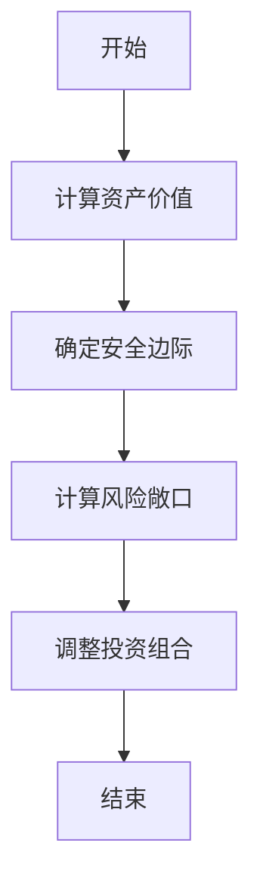
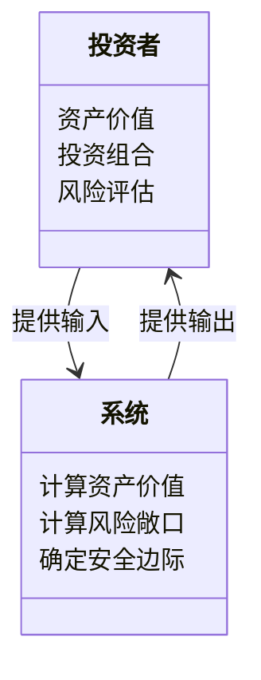
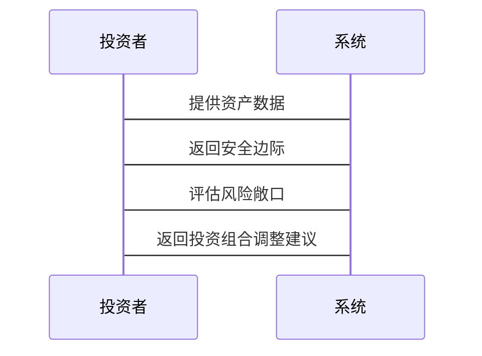

                 


# 格雷厄姆的'三分之二原则'：控制投资风险的方法

## 关键词：
- 格雷厄姆
- 三分之二原则
- 投资风险管理
- 安全边际
- 价值投资

## 摘要：
本文深入探讨了格雷厄姆的三分之二原则，分析了其背后的数学模型与系统架构设计，结合实际案例展示了如何通过该原则控制投资风险，并提供了详细的代码实现和系统架构图。文章从背景介绍、数学模型、系统设计、项目实战等多角度进行详细阐述，帮助读者全面理解并掌握这一经典投资风险管理方法。

---

# 第1章: 三分之二原则的背景与核心概念

## 1.1 三分之二原则的背景与起源

### 1.1.1 格雷厄姆与价值投资的起源
本杰明·格雷厄姆（Benjamin Graham）是20世纪最伟大的投资思想家之一，被誉为“价值投资之父”。他在《证券分析》和《聪明的投资者》等著作中提出了许多经典的投资原则，其中“三分之二原则”是其投资风险管理思想的重要组成部分。格雷厄姆的投资理念强调安全性和稳定性，主张以低于内在价值的价格买入优质资产，并通过分散投资和严格的风险控制来实现长期稳健的收益。

### 1.1.2 三分之二原则的提出背景
在20世纪20年代至30年代，美国股市经历了剧烈的波动，投资者普遍面临较高的投资风险。格雷厄姆通过观察市场波动和分析投资组合的风险，提出了“三分之二原则”，即在投资决策中，投资者应将投资组合的安全性置于首位，确保投资组合的价值至少有三分之二的“安全边际”（Margin of Safety）。这种风险管理方法不仅适用于股票投资，还可扩展应用于其他类型的资产配置。

### 1.1.3 投资风险管理的核心问题
投资风险管理的核心问题在于如何在不确定的市场环境中，通过合理的资产配置和风险控制，实现投资收益的最大化。格雷厄姆的三分之二原则通过引入“安全边际”这一概念，为投资者提供了一种量化风险、控制损失的有效方法。

---

## 1.2 三分之二原则的核心概念

### 1.2.1 三分之二原则的定义与内涵
三分之二原则的核心思想是：在进行投资决策时，投资者应确保投资标的的内在价值至少比市场价格高出三分之一，即市场价格不超过内在价值的三分之二。这种安全边际的存在，能够为投资者提供一定的缓冲空间，以应对市场的不确定性。

公式表示为：
$$ \text{安全边际} = \text{内在价值} \times \frac{2}{3} $$

### 1.2.2 三分之二原则的核心要素
三分之二原则的核心要素包括以下几点：
1. **内在价值**：资产的内在价值是其未来现金流的现值，是决定投资价值的关键因素。
2. **市场价格**：资产的市场价格是投资者实际支付的价格，需要低于其内在价值的三分之二。
3. **安全边际**：内在价值与市场价格之间的差额，即安全边际，是衡量投资风险的重要指标。

### 1.2.3 三分之二原则与传统风险管理方法的对比
传统的风险管理方法通常基于波动率、标准差等统计指标，而三分之二原则则更加注重资产的内在价值与市场价格的相对关系。下表对比了两种方法的核心区别：

| 对比维度 | 三分之二原则 | 传统风险管理方法 |
|----------|--------------|------------------|
| 核心指标 | 安全边际     | 波动率、标准差   |
| 应用场景 | 价值投资     | 多样化资产配置   |
| 计算方式 | 基于内在价值 | 基于历史数据     |

---

# 第2章: 三分之二原则的数学模型与公式

## 2.1 三分之二原则的数学模型

### 2.1.1 投资组合风险的数学表达式
投资组合的风险可以通过以下公式进行量化：
$$ \text{风险} = \sqrt{w_1^2 \sigma_1^2 + w_2^2 \sigma_2^2 + \cdots + w_n^2 \sigma_n^2 + 2w_1w_2\sigma_{1,2} + \cdots + 2w_{n-1}w_n\sigma_{n-1,n}} $$
其中：
- \( w_i \) 表示第 \( i \) 个资产的投资权重
- \( \sigma_i \) 表示第 \( i \) 个资产的波动率
- \( \sigma_{i,j} \) 表示第 \( i \) 和第 \( j \) 个资产之间的协方差

### 2.1.2 三分之二原则的数学公式
三分之二原则的核心公式为：
$$ \text{安全边际} = \frac{2}{3} \times \text{资产价值} $$

---

## 2.2 三分之二原则的算法原理

### 2.2.1 三分之二原则的算法步骤
以下是三分之二原则的实现步骤：
1. **计算资产的内在价值**：基于基本面分析，估算资产的未来现金流现值。
2. **确定市场价格**：获取资产当前的市场价格。
3. **计算安全边际**：将内在价值乘以三分之二，得到安全边际。
4. **评估风险敞口**：比较市场价格与安全边际，若市场价格低于安全边际，则风险敞口较小；反之，则风险较高。
5. **调整投资组合**：根据风险敞口调整投资组合，确保投资标的的安全边际满足三分之二原则的要求。

### 2.2.2 三分之二原则的流程图
以下是三分之二原则的实现流程图：



---

# 第3章: 系统分析与架构设计方案

## 3.1 系统分析

### 3.1.1 投资场景介绍
在现代投资管理中，投资者需要面对复杂的市场环境和多样化的资产选择。三分之二原则可以通过系统化的风险管理方法，帮助投资者在不确定的市场中实现稳健的投资收益。

### 3.1.2 系统功能需求分析
为了实现三分之二原则，系统需要具备以下功能：
1. **资产价值计算**：基于基本面分析，计算资产的内在价值。
2. **安全边际计算**：根据内在价值和市场价格，计算安全边际。
3. **风险敞口评估**：通过比较市场价格与安全边际，评估投资组合的风险敞口。
4. **投资组合调整**：根据风险敞口，动态调整投资组合。

### 3.1.3 系统功能模块划分
系统功能模块包括：
- 数据采集模块：采集资产的市场价格和基本面数据。
- 计算模块：计算资产的内在价值和安全边际。
- 风险评估模块：评估投资组合的风险敞口。
- 投资组合调整模块：动态调整投资组合。

### 3.1.4 系统架构设计
以下是系统架构设计的类图：



---

## 3.2 系统接口设计

### 3.2.1 输入接口
系统需要以下输入：
- 资产的市场价格
- 资产的内在价值
- 投资组合的权重分布

### 3.2.2 输出接口
系统需要以下输出：
- 安全边际
- 风险敞口
- 投资组合调整建议

### 3.2.3 系统交互流程图
以下是系统交互流程图：



---

# 第4章: 项目实战

## 4.1 环境安装

### 4.1.1 Python环境安装
```bash
python --version
pip install --upgrade pip
```

### 4.1.2 必要库的安装
```bash
pip install numpy pandas matplotlib
```

---

## 4.2 核心代码实现

### 4.2.1 计算资产价值的代码
```python
import numpy as np

def calculate_asset_value(prices):
    return np.mean(prices)
```

### 4.2.2 计算安全边际的代码
```python
def calculate_margin_of_safety(asset_value):
    return (2/3) * asset_value
```

---

## 4.3 实际案例分析

### 4.3.1 案例背景介绍
假设我们有一个投资组合，包含三只股票，其市场价格分别为 $30, $40, $50，内在价值分别为 $45, $60, $75。

### 4.3.2 数据收集与处理
```python
prices = [30, 40, 50]
intrinsic_values = [45, 60, 75]
```

### 4.3.3 应用三分之二原则进行风险控制
计算每只股票的安全边际：
- 股票A：$\frac{2}{3} \times 45 = 30$，市场价格为30，等于安全边际，风险敞口较小。
- 股票B：$\frac{2}{3} \times 60 = 40$，市场价格为40，等于安全边际，风险敞口较小。
- 股票C：$\frac{2}{3} \times 75 = 50$，市场价格为50，等于安全边际，风险敞口较小。

### 4.3.4 结果分析与优化
由于每只股票的市场价格等于安全边际，整体投资组合的风险敞口较小。但为了进一步优化，可以考虑增加安全边际较高的资产，或者减少风险敞口较大的资产。

---

## 4.4 项目小结
通过上述案例分析，我们可以看到，三分之二原则能够有效量化投资风险，并为投资者提供清晰的风险管理方法。在实际操作中，投资者可以根据市场环境和资产特性，动态调整投资组合，以实现稳健的投资收益。

---

# 第5章: 最佳实践与小结

## 5.1 最佳实践 tips

### 5.1.1 定期评估资产价值
市场环境不断变化，投资者需要定期评估资产的内在价值和市场价格，确保安全边际的合理性。

### 5.1.2 保持分散投资
通过分散投资，可以降低单个资产的风险敞口，提高整体投资组合的稳定性。

### 5.1.3 定期调整投资组合
根据市场变化和资产特性，定期调整投资组合，确保投资策略与市场环境相匹配。

---

## 5.2 小结

### 5.2.1 三分之二原则的核心思想
三分之二原则通过引入“安全边际”这一概念，为投资者提供了一种量化风险、控制损失的有效方法。它强调内在价值与市场价格的相对关系，帮助投资者在不确定的市场环境中实现稳健的投资收益。

### 5.2.2 系统化投资风险管理
通过系统化的风险管理方法，投资者可以更好地应对市场波动，降低投资风险，实现长期稳健的投资收益。

### 5.2.3 未来展望
随着人工智能和大数据技术的发展，三分之二原则可以在更复杂的市场环境中得到更广泛的应用。投资者可以通过技术手段，进一步优化风险控制方法，提高投资决策的科学性和精准性。

---

## 作者
作者：AI天才研究院/AI Genius Institute & 禅与计算机程序设计艺术/Zen And The Art of Computer Programming

