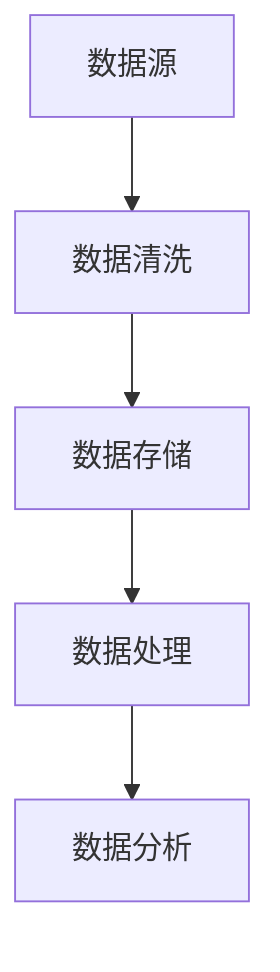
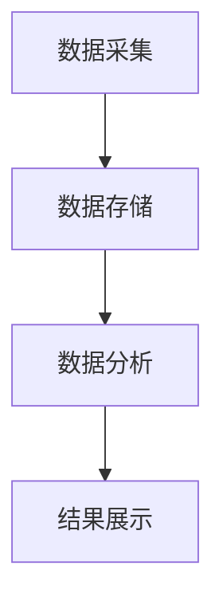
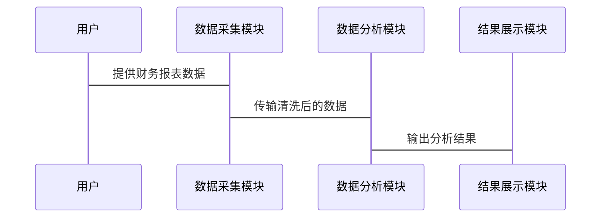

                 


# 格雷厄姆的“工作资本”分析：评估公司短期偿债能力

## 关键词：格雷厄姆、工作资本、短期偿债能力、流动比率、速动比率、财务分析、价值投资

## 摘要：本文深入探讨了格雷厄姆的“工作资本”分析方法，重点分析了流动资产与流动负债的构成，以及如何通过流动比率和速动比率等指标评估公司的短期偿债能力。文章从理论基础到实际应用，结合实例分析和系统设计，全面阐述了该方法的应用价值和实践意义。

---

## 第1章: 工作资本的概念与背景

### 1.1 什么是工作资本

#### 1.1.1 工作资本的定义
工作资本（Working Capital）是公司日常运营中可用的资金，通常指流动资产减去流动负债的部分，即：
$$ \text{工作资本} = \text{流动资产} - \text{流动负债} $$

工作资本反映了公司短期内偿还债务的能力，是企业财务健康的重要指标。

#### 1.1.2 工作资本的演变历程
工作资本的概念起源于18世纪，随着资本主义的发展，逐渐从简单的资产清单演变为复杂的财务分析工具。格雷厄姆在20世纪初将其系统化，成为价值投资的重要组成部分。

#### 1.1.3 工作资本在财务分析中的重要性
工作资本是评估公司短期偿债能力的核心指标，直接影响企业的信用评级和融资能力。充足的流动资本意味着企业能够应对短期债务，维持正常运营。

---

### 1.2 格雷厄姆的分析方法

#### 1.2.1 格雷厄姆的背景介绍
本杰明·格雷厄姆是价值投资之父，他的投资理念强调安全边际和对公司基本面的深入分析。他提出了“工作资本”分析法，用于识别具有强大短期偿债能力的公司。

#### 1.2.2 格雷厄姆的“工作资本”理论
格雷厄姆认为，企业的短期偿债能力取决于流动资产与流动负债的比率。他特别关注流动比率（流动资产/流动负债）和速动比率（（流动资产-存货）/流动负债）。

#### 1.2.3 格雷厄姆分析方法的核心思想
格雷厄姆主张通过分析公司的财务报表，尤其是流动资产和流动负债的构成，来评估其短期偿债能力。他认为，只有当流动比率和速动比率都达到一定标准时，企业才具备良好的短期偿债能力。

---

## 第2章: 工作资本的核心要素

### 2.1 流动资产与流动负债

#### 2.1.1 流动资产的构成与特征
流动资产包括现金、应收账款、存货等，具有变现能力强、周转速度快的特点。以下是流动资产与非流动资产的对比：

| **属性**       | **流动资产**           | **非流动资产**         |
|----------------|------------------------|-------------------------|
| 变现能力       | 强                    | 弱或无法快速变现        |
| 周转周期       | 短                   | 长                      |
| 例子           | 现金、应收账款、存货   | 固定资产、无形资产      |

#### 2.1.2 流动负债的构成与特征
流动负债包括应付账款、短期借款等，通常在一年内偿还。以下是流动负债与非流动负债的对比：

| **属性**       | **流动负债**           | **非流动负债**         |
|----------------|------------------------|-------------------------|
| 偿还期限       | 短                   | 长                      |
| 利息负担       | 低或无                | 高                     |
| 例子           | 应付账款、短期借款     | 长期借款、公司债券      |

#### 2.1.3 流动资产与流动负债的对比分析
流动资产和流动负债的对比可以通过流动比率来衡量。一个健康的公司通常希望流动比率保持在2:1以上，速动比率在1:1以上。

---

## 第3章: 工作资本分析的数学模型

### 3.1 流动比率分析

#### 3.1.1 流动比率的定义
流动比率（Current Ratio）是衡量公司短期偿债能力的重要指标，计算公式为：
$$ \text{流动比率} = \frac{\text{流动资产}}{\text{流动负债}} $$

#### 3.1.2 示例计算
假设某公司流动资产为$200,000，流动负债为$100,000，则流动比率为：
$$ \text{流动比率} = \frac{200,000}{100,000} = 2 $$

### 3.2 速动比率分析

#### 3.2.1 速动比率的定义
速动比率（Quick Ratio）是流动资产中除去存货后的剩余部分与流动负债的比率，计算公式为：
$$ \text{速动比率} = \frac{\text{流动资产} - \text{存货}}{\text{流动负债}} $$

#### 3.2.2 示例计算
假设某公司流动资产为$200,000，存货为$50,000，流动负债为$100,000，则速动比率为：
$$ \text{速动比率} = \frac{200,000 - 50,000}{100,000} = 1.5 $$

### 3.3 其他相关比率分析

#### 3.3.1 现金比率
现金比率（Cash Ratio）是现金及现金等价物与流动负债的比率，计算公式为：
$$ \text{现金比率} = \frac{\text{现金及现金等价物}}{\text{流动负债}} $$

#### 3.3.2 负债比率
负债比率（Debt Ratio）是总负债与总资产的比率，计算公式为：
$$ \text{负债比率} = \frac{\text{总负债}}{\text{总资产}} $$

#### 3.3.3 存货周转率
存货周转率（Inventory Turnover Ratio）是衡量存货管理效率的指标，计算公式为：
$$ \text{存货周转率} = \frac{\text{成本 of goods sold (COGS)}}{\text{平均存货}} $$

---

## 第4章: 工作资本分析的系统架构

### 4.1 系统功能设计

#### 4.1.1 数据采集模块
数据采集模块负责从财务报表中提取流动资产和流动负债的数据。以下是数据采集流程的Mermaid图：



#### 4.1.2 数据分析模块
数据分析模块使用Python进行数据处理，以下是核心代码示例：

```python
import pandas as pd

# 读取财务报表数据
df = pd.read_csv('financial_data.csv')

# 计算流动比率
current_ratio = df['流动资产'] / df['流动负债']

# 计算速动比率
quick_ratio = (df['流动资产'] - df['存货']) / df['流动负债']

# 输出结果
print("流动比率：", current_ratio.mean())
print("速动比率：", quick_ratio.mean())
```

#### 4.1.3 结果展示模块
结果展示模块以图表形式呈现分析结果。以下是结果展示的Mermaid图：


### 4.2 系统架构设计

#### 4.2.1 系统功能架构
以下是系统功能架构的Mermaid图：



#### 4.2.2 模块交互图
以下是模块交互图的Mermaid图：



---

## 第5章: 工作资本分析的项目实战

### 5.1 项目环境配置

#### 5.1.1 数据来源与准备
数据来源包括公司财务报表（如资产负债表和利润表）以及行业基准数据。

#### 5.1.2 工具安装与配置
需要安装Python、Pandas、Matplotlib等工具。

### 5.2 系统核心实现源代码

#### 5.2.1 数据清洗与处理
```python
import pandas as pd

# 读取数据
df = pd.read_csv('financial_data.csv')

# 删除缺失值
df = df.dropna()

# 填充空值
df['流动资产'] = df['流动资产'].fillna(0)
df['流动负债'] = df['流动负债'].fillna(0)

# 计算比率
df['流动比率'] = df['流动资产'] / df['流动负债']
df['速动比率'] = (df['流动资产'] - df['存货']) / df['流动负债']
```

#### 5.2.2 结果展示
```python
import matplotlib.pyplot as plt

# 绘制流动比率分布图
plt.hist(df['流动比率'], bins=10)
plt.title('流动比率分布图')
plt.xlabel('流动比率')
plt.ylabel('频数')
plt.show()
```

### 5.3 项目小结

#### 5.3.1 成功经验
通过实际案例分析，验证了格雷厄姆“工作资本”分析法的有效性。

#### 5.3.2 改进建议
建议结合行业基准和市场环境，进一步优化分析模型。

#### 5.3.3 展望未来
未来可以将工作资本分析与其他财务指标结合，构建更全面的财务健康评估体系。

---

## 总结与展望

### 6.1 格雷厄姆分析方法的总结
格雷厄姆的“工作资本”分析方法以其科学性和实用性，成为评估公司短期偿债能力的重要工具。

### 6.2 格雷厄姆分析方法的优点与局限
优点：简单易懂，实用性强；局限：仅适用于短期分析，需结合其他指标。

### 6.3 未来的研究方向
未来可以研究工作资本分析在不同行业中的应用，以及其与企业价值的关系。

### 6.4 最佳实践 tips
1. 结合行业基准进行分析。
2. 定期更新财务数据，持续监控比率变化。
3. 与其他财务指标结合，全面评估企业财务健康状况。

---

## 作者：AI天才研究院/AI Genius Institute & 禅与计算机程序设计艺术 /Zen And The Art of Computer Programming

