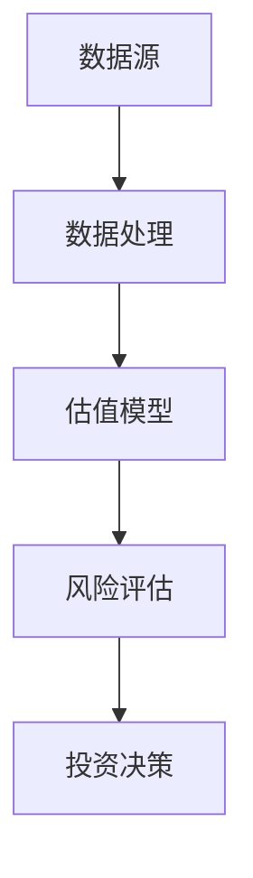

                 


# 格雷厄姆的“聪明的投资者”：价值投资圣经的现代解读

---

## 关键词

- 价值投资
- 格雷厄姆
- 股票估值
- 安全边际
- 投资策略
- 现代解读

---

## 摘要

本书深入解读了本杰明·格雷厄姆的经典投资理论《聪明的投资者》，并结合现代投资环境和工具，探讨了其在当前市场中的应用。通过系统分析价值投资的核心概念、数学模型、算法实现以及实际案例，本书为读者提供了从理论到实践的全面指导。内容涵盖投资决策的逻辑、量化分析的方法、系统架构的设计以及项目实战的步骤，旨在帮助投资者在复杂多变的市场中运用格雷厄姆的理念实现稳健收益。

---

# 第一部分：价值投资的背景与核心概念

## 第1章：价值投资的起源与发展

### 1.1 投资的基本概念与问题背景

#### 1.1.1 投资的基本概念

投资是通过将资金投入到特定资产中，以期获得超过初始投入的收益。核心问题包括资产选择、风险控制和收益最大化。

#### 1.1.2 格雷厄姆的生平与贡献

本杰明·格雷厄姆（1894-1976）是价值投资的鼻祖，其著作《聪明的投资者》奠定了现代价值投资理论的基础。

#### 1.1.3 价值投资的核心理念与目标

价值投资强调购买被市场低估的资产，通过安全边际和长期持有实现稳健收益。

### 1.2 价值投资的核心概念与理论框架

#### 1.2.1 股票的内在价值与市场价值

内在价值是资产的公允价值，与市场波动无关；市场价值是即时的市场价格。

#### 1.2.2 安全边际的概念与计算

安全边际是内在价值与市场价格的差额，用于降低投资风险。

#### 1.2.3 资产评估与投资决策的逻辑

通过分析财务报表和市场数据，评估资产的内在价值，制定投资决策。

---

## 第2章：价值投资的数学模型与算法原理

### 2.1 投资分析的数学基础

#### 2.1.1 股票估值的数学模型

使用股息贴现模型（DDM）和市盈率（P/E）等方法进行估值。

#### 2.1.2 风险与收益的量化分析

通过标准差和贝塔系数衡量投资风险。

#### 2.1.3 时间价值与复利计算

复利是投资增长的核心，其公式为：\( A = P(1 + r)^n \)

### 2.2 格雷厄姆投资策略的算法实现

#### 2.2.1 安全边际的计算公式

安全边际 = 内在价值 - 市场价格

#### 2.2.2 内在价值的估算方法

使用股息贴现模型（DDM）进行估算，公式为：\( V = \frac{D}{k - g} \)

#### 2.2.3 投资组合优化的数学模型

使用均值-方差优化模型，目标是最小化风险，最大化收益。

---

## 第3章：价值投资的系统分析与架构设计

### 3.1 投资系统的整体架构

#### 3.1.1 系统功能模块划分

包括数据收集、估值计算、风险评估和决策输出。

#### 3.1.2 系统架构的Mermaid图



#### 3.1.3 系统接口的设计

定义数据输入、处理和输出的接口。

### 3.2 投资决策的流程设计

#### 3.2.1 从数据收集到决策输出

流程包括数据清洗、特征提取、模型计算和结果分析。

#### 3.2.2 数据处理与分析的流程

使用数据流图展示数据处理步骤。

#### 3.2.3 决策模型的实现步骤

详细描述模型训练、测试和部署的过程。

---

## 第4章：价值投资的项目实战

### 4.1 环境搭建与数据准备

#### 4.1.1 投资分析工具的安装

安装Python和相关库（如Pandas、NumPy）。

#### 4.1.2 数据源的选择与获取

从Yahoo Finance获取历史数据。

#### 4.1.3 数据清洗与预处理

处理缺失值和异常值。

### 4.2 核心算法的实现

#### 4.2.1 内在价值计算的Python代码

```python
def calculate_intrinsic_value(dividend, required_rate, growth_rate):
    return dividend / (required_rate - growth_rate)
```

#### 4.2.2 安全边际评估的实现

计算内在价值与市场价格的差额。

#### 4.2.3 投资组合优化的代码示例

使用优化算法构造最优投资组合。

### 4.3 案例分析与结果解读

分析实际案例，验证模型的有效性。

---

## 第5章：价值投资的现代发展与案例分析

### 5.1 现代价值投资的演变

#### 5.1.1 新兴市场的价值投资策略

在科技股中寻找低估机会。

#### 5.1.2 数字化工具的应用

利用算法和大数据优化投资决策。

### 5.2 实际案例分析

分析苹果公司的投资价值，展示从估值到决策的全过程。

---

## 第6章：总结与展望

### 6.1 本书的总结

回顾核心概念和算法实现，强调理论与实践的结合。

### 6.2 未来投资的趋势与挑战

探讨人工智能和大数据在投资中的应用前景。

### 6.3 最佳实践与注意事项

提醒读者注意心态管理、风险管理等关键点。

---

## 作者

作者：AI天才研究院/AI Genius Institute & 禅与计算机程序设计艺术 /Zen And The Art of Computer Programming

---

通过以上结构，本书系统地介绍了格雷厄姆的价值投资理论，并结合现代技术和工具，提供了实践指导。从基础概念到数学模型，再到系统设计和项目实战，帮助读者全面理解并应用价值投资策略。

