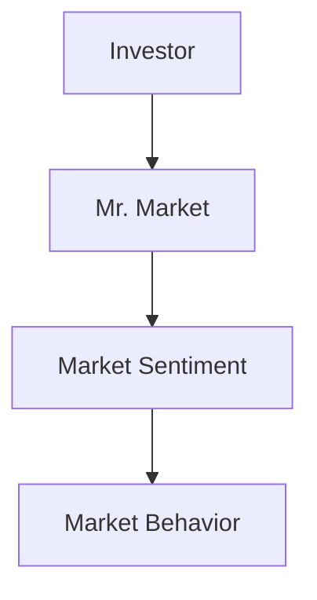
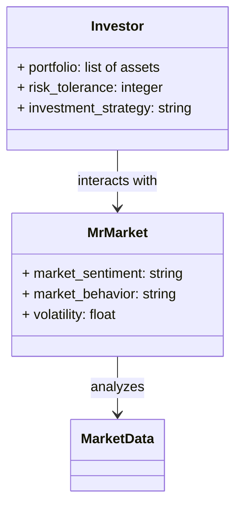
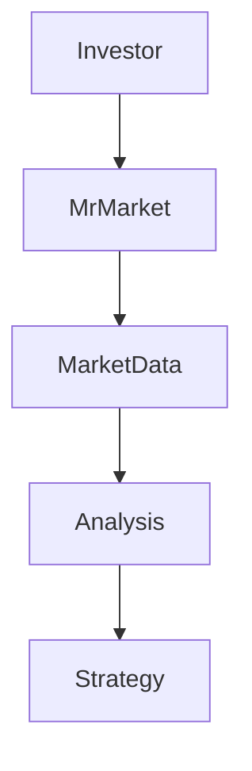
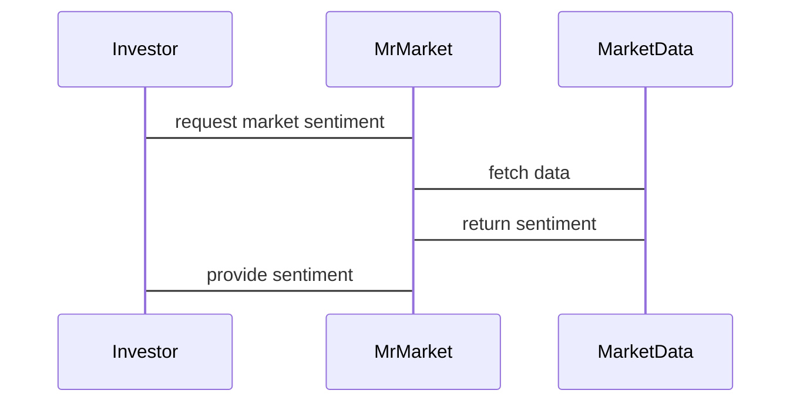

                 


# 格雷厄姆的Mr. Market比喻及其现代意义

## 关键词：格雷厄姆，Mr. Market，市场情绪，投资策略，行为金融学，认知偏差

## 摘要：本文深入探讨了格雷厄姆的Mr. Market比喻，分析其在现代投资中的应用及其对投资者行为的影响。通过结合行为金融学和系统分析，本文展示了如何利用Mr. Market的理论来优化投资决策，帮助投资者在复杂市场环境中保持理性。

---

## 第一部分: 引言

### 第1章: 引言

#### 1.1 格雷厄姆的Mr. Market比喻概述

##### 1.1.1 Mr. Market的定义与背景
Benjamin Graham的Mr. Market比喻是投资心理学中的一个经典概念。Mr. Market代表市场情绪，他每天都会以不同的情绪影响投资者的决策。这个比喻的核心在于提醒投资者，市场波动并非由内在价值驱动，而是由情绪和认知偏差主导。

##### 1.1.2 格雷厄姆的投资哲学与Mr. Market的关系
Graham强调价值投资，认为市场波动为投资者提供了以低于内在价值的价格购买优质资产的机会。Mr. Market的出现正是为了帮助投资者识别这些机会，通过分析市场情绪来做出理性的投资决策。

##### 1.1.3 Mr. Market比喻的核心思想
Mr. Market的核心思想是市场情绪是波动的，而理性投资者应利用这种波动，避免被情绪左右，专注于长期价值。

#### 1.2 Mr. Market比喻的现代意义
##### 1.2.1 现代市场环境的变化
现代市场高度复杂，信息传播速度快，投资者情绪波动更加频繁。Mr. Market的理论在现代投资中依然适用，但需要结合新的工具和技术进行分析。

##### 1.2.2 Mr. Market在现代投资中的应用
通过分析市场情绪和投资者行为，现代投资者可以更好地识别市场周期，制定有效的投资策略。

##### 1.2.3 Mr. Market与行为金融学的联系
行为金融学研究表明，投资者的情绪和认知偏差影响市场定价。Mr. Market的理论为行为金融学提供了实证基础，帮助投资者理解市场波动的本质。

---

## 第二部分: Mr. Market的核心概念与属性

### 第2章: Mr. Market的核心概念与属性

#### 2.1 Mr. Market的定义与特征

##### 2.1.1 Mr. Market的定义
Mr. Market是Graham用来描述市场情绪的拟人化概念，代表市场的整体情绪状态。

##### 2.1.2 Mr. Market的核心属性
- 情绪波动性：市场情绪在不同时间点表现出不同的状态，从乐观到悲观，再回到乐观。
- 不理性：市场情绪经常偏离理性，导致资产价格的波动。
- 可预测性：通过分析市场情绪指标，投资者可以预测市场的短期走势。

##### 2.1.3 Mr. Market与市场情绪的关系
市场情绪直接影响市场波动，而Mr. Market帮助投资者识别这些情绪变化，从而做出更理性的决策。

#### 2.2 Mr. Market的实体关系图

##### 2.2.1 实体关系图


##### 2.2.2 实体关系图分析
- 投资者与Mr. Market之间的互动：投资者受Mr. Market的情绪影响，做出投资决策。
- 市场情绪与市场行为的关系：市场情绪驱动市场行为，进而影响资产价格。

#### 2.3 Mr. Market的数学模型与公式

##### 2.3.1 市场情绪的量化公式
$$ \text{Market Sentiment} = \frac{\text{Positive News} - \text{Negative News}}{\text{Total News}} $$

##### 2.3.2 投资者情绪与市场波动的关系
$$ \text{Market Volatility} = \alpha \times \text{Investor Sentiment} + \beta \times \text{Market Conditions} $$

---

## 第三部分: Mr. Market与现代投资策略

### 第3章: Mr. Market在行为金融学中的应用

#### 3.1 行为金融学的定义与核心理论

##### 3.1.1 行为金融学的定义
行为金融学研究投资者心理和行为对市场定价和决策的影响，强调情绪和认知偏差在投资中的作用。

##### 3.1.2 Mr. Market与行为金融学的联系
Mr. Market的理论与行为金融学的核心观点一致，认为市场波动由情绪驱动。

#### 3.2 Mr. Market与投资者认知偏差

##### 3.2.1 认知偏差的定义
认知偏差是投资者在信息处理过程中产生的系统性错误，影响其决策。

##### 3.2.2 常见的认知偏差与Mr. Market的关系
- 过度自信：投资者可能低估市场风险，导致过度投资。
- 沉没成本谬误：投资者可能因过去的投资而继续持有亏损资产。
- 羊群效应：投资者跟随市场情绪，导致市场泡沫。

---

## 第四部分: 系统分析与架构设计

### 第4章: 系统分析与架构设计方案

#### 4.1 问题场景介绍

##### 4.1.1 问题背景
现代投资者面临复杂多变的市场环境，需要利用Mr. Market的理论来优化投资策略。

##### 4.1.2 项目介绍
本项目旨在通过分析市场情绪和投资者行为，构建一个基于Mr. Market理论的投资决策支持系统。

#### 4.2 系统功能设计

##### 4.2.1 领域模型


##### 4.2.2 系统架构设计


#### 4.3 系统接口设计

##### 4.3.1 API接口
- `get_market_sentiment()`: 获取当前市场情绪。
- `analyze_behavior()`: 分析市场行为。
- `predict_volatility()`: 预测市场波动性。

#### 4.4 系统交互设计

##### 4.4.1 序列图


---

## 第五部分: 项目实战

### 第5章: 项目实战

#### 5.1 环境安装

##### 5.1.1 安装Python环境
使用Anaconda或虚拟环境，安装必要的库：Pandas, NumPy, Matplotlib, Scikit-learn。

#### 5.2 系统核心实现源代码

##### 5.2.1 市场情绪分析
```python
import pandas as pd
import numpy as np

def calculate_market_sentiment(news_data):
    positive = news_data['positive'].sum()
    negative = news_data['negative'].sum()
    total = len(news_data)
    sentiment = (positive - negative) / total
    return sentiment

# 示例数据
news_data = pd.DataFrame({
    'positive': [5, 3, 4],
    'negative': [2, 1, 2]
})
sentiment = calculate_market_sentiment(news_data)
print(f"Market Sentiment: {sentiment}")
```

##### 5.2.2 投资策略构建
```python
def invest_strategy(sentiment, portfolio_value):
    if sentiment > 0.6:
        return "Buy"
    elif sentiment < 0.4:
        return "Sell"
    else:
        return "Hold"

strategy = invest_strategy(sentiment, 100000)
print(f"Strategy: {strategy}")
```

#### 5.3 代码应用解读与分析

##### 5.3.1 市场情绪分析代码解读
该代码通过计算正面和负面新闻的数量，得出市场情绪指数。指数大于0.6表示乐观，小于0.4表示悲观。

##### 5.3.2 投资策略代码解读
根据市场情绪指数，投资者决定买入、卖出或持有资产。该策略基于Mr. Market的理论，帮助投资者在市场情绪过度乐观时卖出，避免市场崩盘。

#### 5.4 实际案例分析

##### 5.4.1 案例分析
假设当前市场情绪指数为0.7，投资组合价值为100,000美元。根据代码，投资者应选择“买入”。然而，如果市场情绪指数为0.3，投资者应选择“卖出”。

##### 5.4.2 详细解读
市场情绪指数反映了市场的整体情绪，投资者应结合其他因素（如内在价值）做出决策，避免被情绪左右。

#### 5.5 项目小结

##### 5.5.1 项目总结
通过分析市场情绪和构建投资策略，投资者可以更好地应对市场波动，实现长期收益。

##### 5.5.2 项目最佳实践
- 定期监控市场情绪。
- 结合技术分析和基本面分析。
- 避免情绪化决策，保持理性。

---

## 第六部分: 结论

### 第6章: 结论

#### 6.1 最佳实践 tips

##### 6.1.1 投资者注意事项
- 定期回顾投资策略，确保与市场情绪相符。
- 避免过度自信和认知偏差，保持理性。

##### 6.1.2 项目实战中的注意事项
- 数据质量对市场情绪分析至关重要。
- 确保算法模型的可解释性和实用性。

#### 6.2 小结

##### 6.2.1 Mr. Market的理论总结
Mr. Market提醒投资者，市场波动由情绪驱动，理性投资者应利用这种波动，制定长期投资策略。

##### 6.2.2 现代投资中的应用
通过分析市场情绪和投资者行为，现代投资者可以更好地理解市场波动，优化投资决策。

#### 6.3 注意事项

##### 6.3.1 风险提示
市场情绪分析不能完全预测市场走势，投资需谨慎。

##### 6.3.2 道德与伦理
投资者应遵循道德规范，避免操纵市场情绪。

#### 6.4 拓展阅读

##### 6.4.1 推荐书籍
- 《The Intelligent Investor》 by Benjamin Graham
- 《Behavioral Finance》 by Richard Thaler

##### 6.4.2 推荐博客
- Invest Like the Best
- Behavioral Finance Today

---

## 作者：AI天才研究院/AI Genius Institute & 禅与计算机程序设计艺术 /Zen And The Art of Computer Programming

---

通过以上结构，我们可以看到，Mr. Market的理论在现代投资中的应用不仅限于情绪分析，还包括实际的策略制定和系统设计。投资者应结合市场情绪和内在价值，制定长期的投资计划，避免被短期波动左右。

