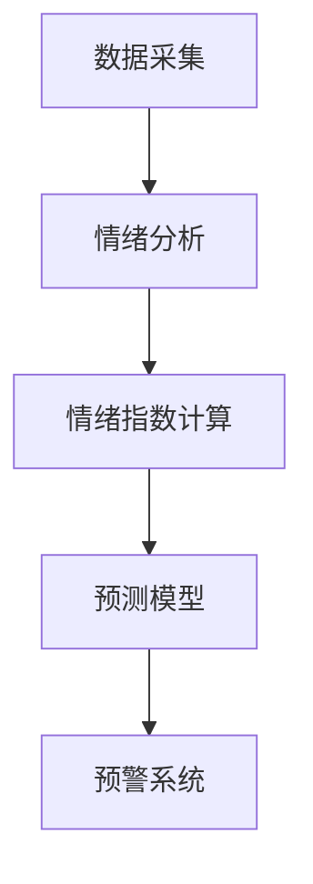

                 


# 格雷厄姆的Mr. Market比喻：洞察市场心理

**关键词**：格雷厄姆、Mr. Market、市场心理、投资心理学、行为金融学、价值投资、市场波动

**摘要**：本文通过分析格雷厄姆的Mr. Market比喻，探讨其在投资心理学中的应用。从市场情绪的波动性、投资者行为的理性与非理性等方面，结合数学模型和系统架构设计，深入解读市场心理，为投资者提供科学的决策支持。

---

## 第一部分：Mr. Market比喻的背景与核心概念

### 第1章：Mr. Market比喻的背景

#### 1.1 投资心理学的基石

投资者在市场中的决策往往受到情绪影响，而Mr. Market比喻正是帮助投资者理解这种心理现象的关键工具。本节介绍Mr. Market比喻的起源及其在投资心理学中的重要性。

#### 1.2 Mr. Market比喻的核心要素

- **市场情绪的波动性**：市场情绪如同Mr. Market，时而乐观，时而悲观。
- **投资者行为的理性与非理性**：分析投资者在不同情绪下的决策过程。
- **市场波动与价值评估的关系**：理解波动如何影响资产定价。

### 第2章：市场心理分析

#### 2.1 市场情绪的周期性

- **情绪波动周期**：从兴奋到恐慌，再到平静，市场的周期性变化。
- **市场情绪与估值的关系**：情绪高涨时估值偏高，情绪低落时估值偏低。

#### 2.2 投资者行为的理性与非理性

- **理性决策**：基于基本面分析的理性选择。
- **非理性偏差**：如从众心理、过度自信等行为偏差。

---

## 第二部分：Mr. Market比喻在投资策略中的应用

### 第3章：投资者心态的自我审视

#### 3.1 自我认知的重要性

投资者需认识到自身情绪波动，避免非理性决策。

#### 3.2 理性决策的培养

通过纪律和知识提升，避免情绪影响投资决策。

### 第4章：市场波动中的投资机会

#### 4.1 利用市场恐慌与贪婪

在市场恐慌时寻找低估资产，在贪婪时警惕风险。

#### 4.2 价值投资的时机选择

识别市场波动中的价值投资机会，长期持有优质资产。

---

## 第三部分：Mr. Market比喻的数学模型与分析

### 第5章：市场情绪的量化指标

#### 5.1 情绪指数的构建

使用NLP技术分析市场新闻和社交媒体情绪，构建情绪指数。

#### 5.2 情绪指数的数学表达式

$$\text{情绪指数} = \sum_{i=1}^{n} (s_i \times w_i)$$

其中，\(s_i\)是第i条信息的情绪值，\(w_i\)是权重。

### 第6章：市场波动的预测模型

#### 6.1 时间序列分析

使用ARIMA模型预测市场情绪波动。

#### 6.2 情绪指数的预测模型

基于历史情绪数据，建立回归模型预测市场趋势。

---

## 第四部分：系统架构设计

### 第7章：市场情绪分析系统

#### 7.1 系统功能需求

- 数据采集：收集市场新闻、社交媒体数据。
- 情绪分析：计算情绪指数。
- 预警系统：设定阈值，触发预警。

#### 7.2 系统架构图



### 第8章：投资者行为分析系统

#### 8.1 行为数据采集

- 用户交易记录、持仓情况。

#### 8.2 行为分析算法

使用聚类分析识别投资者行为模式。

---

## 第五部分：项目实战

### 第9章：情绪指数计算案例

#### 9.1 环境安装

安装Python、Pandas、NLTK等库。

#### 9.2 情绪指数计算代码

```python
import pandas as pd
from nltk.sentiment import SentimentIntensityAnalyzer

def calculate_sentiment(sentences):
    sia = SentimentIntensityAnalyzer()
    sentiments = []
    for sentence in sentences:
        sentiment = sia.polarity_scores(sentence)
        sentiments.append(sentiment['compound'])
    return sentiments

data = pd.read_csv('market_news.csv')
data['sentiment'] = calculate_sentiment(data['text'])
print(data['sentiment'].mean())
```

---

## 第六部分：总结与建议

### 第10章：最佳实践

- 定期回顾投资决策，避免情绪影响。
- 结合Mr. Market比喻，制定长期投资策略。

### 第11章：小结

Mr. Market比喻揭示了市场心理的复杂性，帮助投资者理性决策，避免情绪波动影响投资效果。

### 第12章：注意事项

- 市场情绪分析存在局限性，需结合基本面分析。
- 情绪指数仅为参考，不作为投资决策唯一依据。

### 第13章：拓展阅读

建议阅读《The Intelligent Investor》深入理解价值投资理念。

---

**作者**：AI天才研究院/AI Genius Institute & 禅与计算机程序设计艺术/Zen And The Art of Computer Programming

---

**End**

