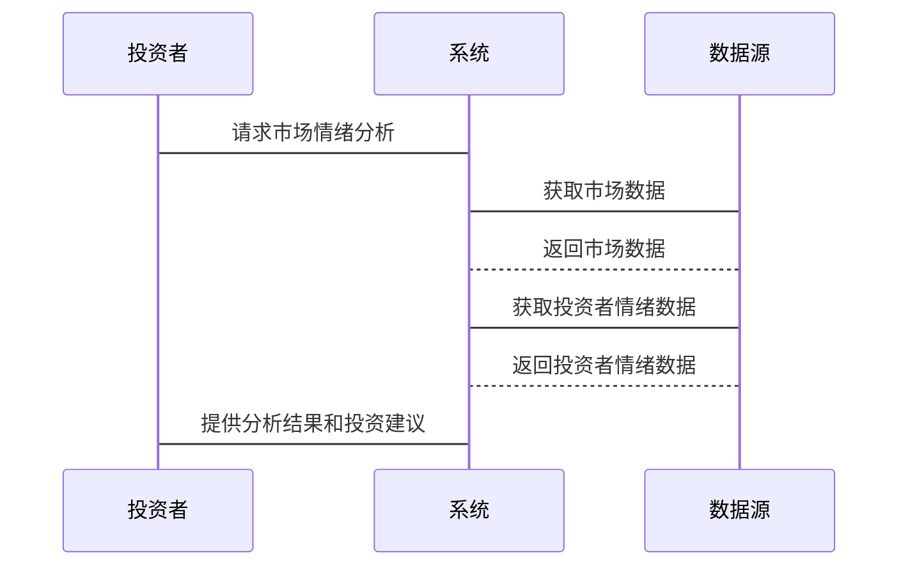

                 


# 格雷厄姆的Mr. Market比喻：理解市场心理

> 关键词：市场心理，投资者心态，Mr. Market，情绪分析，数据可视化

> 摘要：本文通过分析本杰明·格雷厄姆的Mr. Market比喻，探讨市场心理的复杂性，帮助投资者理解市场波动和非理性行为。文章结合情绪分析、行为分析和数据可视化工具，深入讲解市场心理的核心概念，并通过算法和系统设计，提供实际投资决策支持的解决方案。

---

## 第一部分: 格雷厄姆的Mr. Market比喻基础

### 第1章: Mr. Market比喻的定义与背景

#### 1.1 Mr. Market的定义与核心概念
##### 1.1.1 Mr. Market的起源与背景
本杰明·格雷厄姆在其经典著作《证券分析》中引入了Mr. Market（市场先生）的比喻，用以解释市场波动的本质。Mr. Market被描绘成一个情绪化的投资者，他的行为往往受到情绪驱动，而非理性分析。这一比喻的核心在于揭示市场的非理性波动和投资者心理的重要性。

##### 1.1.2 投资者与市场的关系
投资者与市场的关系是双向的。市场影响投资者的决策，而投资者的行为又反过来影响市场的波动。理解这种动态关系是掌握市场心理的关键。

##### 1.1.3 Mr. Market比喻的核心思想
Mr. Market的核心思想在于强调市场的波动性和非理性。市场先生的情绪波动会导致资产价格偏离其内在价值，而聪明的投资者应利用这种波动，逆市场情绪进行投资。

---

#### 1.2 市场心理的基础知识
##### 1.2.1 市场情绪的波动性
市场情绪是市场波动的核心驱动力。情绪波动可以通过数据分析和可视化工具来捕捉和量化。

##### 1.2.2 投资者行为的非理性
投资者的行为常常受到情绪影响，如贪婪和恐惧，导致决策失误。理解这些行为模式对投资决策至关重要。

##### 1.2.3 市场心理与投资决策的关系
市场心理直接影响投资决策。投资者需识别并利用市场情绪的周期性波动，制定合理的投资策略。

---

#### 1.3 投资者心态的分析
##### 1.3.1 理性与非理性决策
投资者在决策过程中往往在理性分析与情绪驱动之间摇摆。理解这两种决策模式有助于制定更有效的投资策略。

##### 1.3.2 情绪对投资行为的影响
情绪波动会导致投资者在市场高点买入，在市场低点卖出。这种行为模式可以通过情绪分析和数据可视化来识别。

##### 1.3.3 市场波动中的投资者心理
市场波动加剧时，投资者的心理压力增大，容易做出非理性决策。了解这些心理特征有助于投资者更好地应对市场变化。

---

### 第2章: 市场心理的核心概念与联系

#### 2.1 市场情绪分析的原理
##### 2.1.1 市场情绪的分类
市场情绪可以分为乐观、中性和悲观三种状态。每种状态对应不同的市场行为和价格波动。

##### 2.1.2 市场情绪的量化方法
通过新闻分析、社交媒体情绪评分和市场指标（如波动率）等方法，可以量化市场情绪。

##### 2.1.3 市场情绪与资产价格的关系
市场情绪是资产价格波动的重要驱动力。当市场情绪高涨时，资产价格可能被高估；当市场情绪低落时，资产价格可能被低估。

---

#### 2.2 投资者行为分析
##### 2.2.1 投资者行为的特征
投资者行为具有非理性、从众性和过度自信等特点。这些特征可以通过行为金融学理论进行分析。

##### 2.2.2 行为偏差对投资决策的影响
行为偏差（如确认偏差、损失厌恶）会影响投资者的决策，导致投资失误。

##### 2.2.3 群体心理与市场泡沫
群体心理会导致市场泡沫的形成和破裂。投资者需警惕群体心理的影响，避免盲目跟风。

---

#### 2.3 数据可视化与市场心理
##### 2.3.1 使用数据可视化工具分析市场情绪
通过可视化工具（如折线图、柱状图）可以直观展示市场情绪的变化趋势。

##### 2.3.2 市场情绪的时空分布分析
分析不同时间、空间的市场情绪分布，有助于识别市场趋势和投资机会。

##### 2.3.3 数据可视化在投资决策中的应用
数据可视化可以帮助投资者快速识别市场情绪，制定科学的投资策略。

---

## 第三部分: 算法原理讲解

### 第3章: 情绪分析算法

#### 3.1 情绪分析算法的原理
情绪分析算法通过自然语言处理（NLP）技术，对文本中的情感倾向进行分类。常用的算法包括基于词袋模型的分类器和深度学习模型。

##### 3.1.1 基于NLP的情感分析模型
- 使用词袋模型提取文本特征。
- 使用机器学习算法（如SVM、随机森林）进行分类。
- 使用深度学习模型（如LSTM、BERT）进行情感分析。

##### 3.1.2 情感分析的数学模型
情感分析的分类模型可以用逻辑回归表示：
$$ P(y=1|x) = \frac{e^{\beta x}}{1 + e^{\beta x}} $$
其中，$\beta$ 是模型参数，$x$ 是输入特征。

##### 3.1.3 情感分析的Python实现
```python
from sklearn.feature_extraction.text import TfidfVectorizer
from sklearn.linear_model import LogisticRegression

# 假设text是一个包含文本的列表
vectorizer = TfidfVectorizer()
X = vectorizer.fit_transform(text)
model = LogisticRegression()
model.fit(X, labels)
```

---

## 第四部分: 系统分析与架构设计方案

### 第4章: 投资决策支持系统

#### 4.1 系统功能设计
- 数据采集模块：收集市场数据和投资者情绪数据。
- 数据分析模块：对数据进行清洗、特征提取和情绪分析。
- 投资决策模块：基于分析结果，提供投资建议。

#### 4.2 系统架构设计
使用分层架构：
```
+----------------+       +----------------+       +----------------+
|                |       |                |       |                |
| 数据采集模块   |<-----> | 数据分析模块   |<-----> | 投资决策模块   |
|                |       |                |<-----> |                |
+----------------+       +----------------+       +----------------+
```

#### 4.3 系统接口设计
- 数据输入接口：接收市场数据和情绪数据。
- 数据输出接口：输出分析结果和投资建议。

#### 4.4 系统交互流程
使用Mermaid序列图表示交互流程：


---

## 第五部分: 项目实战

### 第5章: 实战分析与实现

#### 5.1 环境安装
安装必要的Python库：
```bash
pip install pandas numpy scikit-learn matplotlib
```

#### 5.2 核心代码实现
实现情绪分析的代码：
```python
import pandas as pd
from sklearn.model_selection import train_test_split
from sklearn.metrics import accuracy_score
from sklearn.svm import SVC

# 加载数据
data = pd.read_csv('market_sentiment.csv')
X = data['text']
y = data['label']

# 数据分割
X_train, X_test, y_train, y_test = train_test_split(X, y, test_size=0.2)

# 特征提取
vectorizer = TfidfVectorizer()
X_train_vec = vectorizer.fit_transform(X_train)
X_test_vec = vectorizer.transform(X_test)

# 模型训练
model = SVC()
model.fit(X_train_vec, y_train)

# 模型预测
y_pred = model.predict(X_test_vec)
print("准确率:", accuracy_score(y_test, y_pred))
```

#### 5.3 案例分析
分析一个具体市场事件的情绪变化，如2020年新冠疫情对市场情绪的影响。

---

## 第六部分: 最佳实践

### 第6章: 小结与注意事项

#### 6.1 最佳实践
- 定期进行市场情绪分析。
- 避免情绪驱动的决策。
- 结合技术分析和情绪分析制定投资策略。

#### 6.2 小结
本文通过分析Mr. Market比喻，揭示了市场心理的复杂性。投资者应结合情绪分析和数据可视化工具，制定科学的投资策略。

#### 6.3 注意事项
- 市场情绪分析结果仅供参考，需结合其他因素进行决策。
- 投资者需保持理性，避免过度依赖情绪分析。

#### 6.4 拓展阅读
建议阅读《证券分析》和《行为金融学》相关书籍，深入了解市场心理和投资行为。

---

## 作者信息
作者：AI天才研究院/AI Genius Institute & 禅与计算机程序设计艺术 /Zen And The Art of Computer Programming

---

以上是文章的详细结构，涵盖从基础概念到实际应用的各个方面，旨在帮助读者全面理解市场心理，并在投资决策中应用所学知识。

