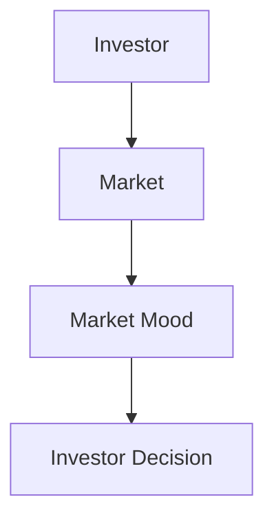
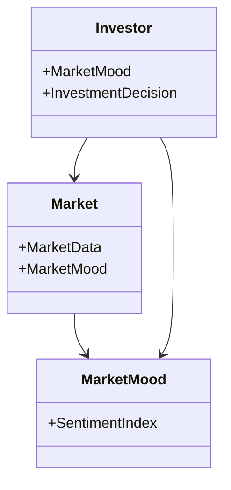
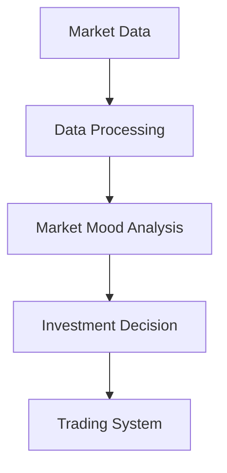
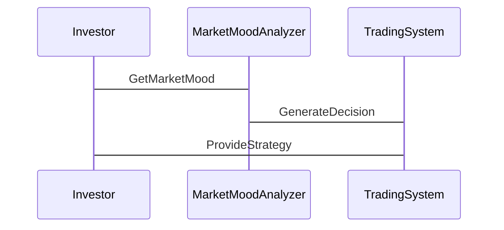

                 


# 格雷厄姆的Mr. Market理论

## 关键词：格雷厄姆、Mr. Market、投资理论、市场波动、价值投资

## 摘要：本文深入探讨了格雷厄姆提出的Mr. Market理论，解释了市场波动与投资者心理的关系，并展示了如何应用该理论进行投资决策优化。通过数学模型、系统架构和项目实战，详细阐述了Mr. Market的算法原理及其在现代投资中的应用。

---

## 第一部分：格雷厄姆的Mr. Market理论基础

### 第1章：Mr. Market的背景与定义

#### 1.1 Mr. Market的背景介绍

- **1.1.1 本杰明·格雷厄姆的生平简介**
  本杰明·格雷厄姆（1894-1976）是价值投资的奠基人，被誉为“价值投资之父”。他曾在哥伦比亚大学教授证券分析，并著有《证券分析》和《聪明的投资者》等经典著作。他的投资理念深刻影响了沃伦·巴菲特等投资者。

- **1.1.2 投资理论的发展历程**
  格雷厄姆的投资理论始于20世纪初，他主张以基本面分析为基础，寻找被市场低估的股票。他的理论强调长期投资和安全边际，即在购买股票时留有足够安全的空间以应对价格波动。

- **1.1.3 Mr. Market概念的提出与意义**
  在《聪明的投资者》一书中，格雷厄姆引入了Mr. Market（市场先生）这个虚拟人物，用以解释市场波动的非理性。Mr. Market代表市场情绪，他的行为反映了市场的波动，而非市场的实际价值。

#### 1.2 Mr. Market的定义与特点

- **1.2.1 Mr. Market的定义**
  Mr. Market是格雷厄姆创造的一个比喻，代表市场情绪。他会根据市场参与者的心理波动，不断改变对资产的定价，而不考虑其实际价值。

- **1.2.2 Mr. Market的核心特点**
  - 市场情绪的波动性：Mr. Market的情绪会随市场环境变化而波动。
  - 非理性：他的定价往往偏离实际价值。
  - 不可预测性：市场情绪的变化难以准确预测。

- **1.2.3 Mr. Market与传统市场分析的区别**
  传统市场分析通常依赖于技术指标和宏观经济数据，而Mr. Market理论更关注投资者心理和市场情绪。

### 第2章：Mr. Market的核心概念与联系

#### 2.1 核心概念原理

- **2.1.1 Mr. Market的理性与非理性情绪**
  Mr. Market的情绪在理性与非理性之间摇摆。当市场情绪高涨时，资产价格被高估；当市场情绪低落时，资产价格被低估。

- **2.1.2 投资者心理与市场波动的关系**
  投资者心理驱动市场波动。当大多数投资者贪婪时，市场情绪高涨；当大多数投资者恐惧时，市场情绪低落。

- **2.1.3 Mr. Market决策框架的数学模型**
  通过数学模型可以模拟Mr. Market的情绪变化，帮助投资者制定更科学的投资策略。

#### 2.2 核心概念属性特征对比表格

| 特性             | 理性情绪       | 非理性情绪       |
|------------------|---------------|------------------|
| 表现             | 稳定、合理     | 波动、极端       |
| 时间分布         | 长期稳定       | 短期剧烈波动     |
| 对应投资策略     | 价值投资       | 技术分析         |

#### 2.3 实体关系图（ER图）架构的 Mermaid 流程图



## 第三部分：系统分析与架构设计方案

### 3.1 系统分析

#### 3.1.1 问题场景介绍

- **问题场景**：投资者如何在市场波动中做出理性决策，避免被市场情绪左右。

### 3.2 系统功能设计

#### 3.2.1 领域模型类图



#### 3.2.2 系统架构设计



### 3.3 系统接口设计

- **接口1**：市场数据接口，用于获取实时市场数据。
- **接口2**：情绪分析接口，用于计算市场情绪指数。
- **接口3**：投资决策接口，用于生成投资建议。

### 3.4 系统交互设计



## 第四部分：项目实战

### 4.1 环境安装

- **Python环境**：安装Python 3.8及以上版本。
- **依赖库**：安装pandas、numpy、matplotlib。

### 4.2 核心代码实现

#### 4.2.1 市场情绪指数计算

```python
import pandas as pd
import numpy as np

def calculate_mood_index(prices):
    # 计算10日平均波动率
    volatility = prices.rolling(10).std().iloc[-1]
    # 计算市场情绪指数
    mood_index = (volatility / prices.mean()) * 100
    return mood_index

# 示例数据
prices = pd.DataFrame({
    'price': [100, 105, 98, 110, 108, 105, 101, 103, 107, 112]
})
print(calculate_mood_index(prices))
```

#### 4.2.2 投资决策模型

```python
import pandas as pd
import numpy as np

def investment_decision(mood_index, value_ratio):
    if mood_index < 20 and value_ratio > 1.1:
        return 'Buy'
    elif mood_index > 80 and value_ratio < 0.9:
        return 'Sell'
    else:
        return 'Hold'

# 示例参数
mood_index = 25
value_ratio = 1.2
print(investment_decision(mood_index, value_ratio))
```

### 4.3 案例分析

#### 4.3.1 案例背景

假设当前市场情绪指数为30，价值比率为1.2，代表市场情绪较为冷静，但资产价格略高于其实际价值。

#### 4.3.2 分析步骤

1. 计算市场情绪指数：30，低于20，表示市场情绪低迷。
2. 计算价值比率：1.2，略高于1，表示资产价格稍高。
3. 投资决策：结合情绪指数和价值比率，选择“Hold”（持有）策略。

### 4.4 项目小结

通过实际案例分析，展示了如何应用Mr. Market理论结合数学模型进行投资决策。投资者可以根据市场情绪和资产价值，制定更科学的投资策略。

## 第五部分：总结与展望

### 5.1 总结

格雷厄姆的Mr. Market理论通过模拟市场情绪，帮助投资者理解市场的非理性波动。结合数学模型和系统设计，可以进一步优化投资决策。

### 5.2 展望

未来，随着人工智能和大数据技术的发展，Mr. Market理论可以在更复杂的市场环境中应用，帮助投资者更好地应对市场波动。

## 作者：AI天才研究院 & 禅与计算机程序设计艺术

