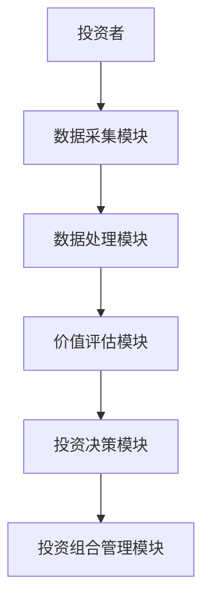

                 


# 《格雷厄姆的价值投资传承》

> 关键词：价值投资，格雷厄姆，投资理念，投资策略，投资传承，投资心理学

> 摘要：本文深入探讨了格雷厄姆的价值投资理念及其方法，分析了其投资哲学的核心要素，包括安全边际、内在价值评估和防御性投资策略。文章还详细介绍了如何将格雷厄姆的价值投资理念传承下去，通过系统性的分析和实际案例，展示了如何在现代投资环境中应用这些经典方法。最后，本文总结了格雷厄姆的价值投资对现代投资者的启示，并提出了未来投资领域的潜在发展方向。

---

# 第1章 价值投资的核心理念

## 1.1 价值投资的定义与背景

### 1.1.1 价值投资的起源与背景

价值投资是一种基于股票内在价值的投资方法，起源于20世纪初。本杰明·格雷厄姆（Benjamin Graham）是该领域的鼻祖，他通过研究市场波动和投资者行为，提出了以基本面分析为核心的价值投资理论。格雷厄姆的投资理念强调安全边际和长期投资，旨在帮助投资者在市场波动中保持理性，避免情绪化决策。

### 1.1.2 价值投资的核心概念

价值投资的核心概念是寻找市场价格低于内在价值的股票。内在价值是基于公司财务状况、行业地位和未来盈利能力计算的合理价格。格雷厄姆强调，投资的本质是购买企业的一部分，而非关注市场的短期波动。这种理念与当时流行的“华尔街智慧”形成鲜明对比，后者更注重短期价格波动和技术分析。

### 1.1.3 价值投资与现代投资理论的区别

现代投资理论，如现代资产组合理论（CAPM）和有效市场假说，认为市场是理性的，价格反映了所有可用信息。然而，格雷厄姆的价值投资理念基于市场的非有效性，认为短期波动为投资者提供了以折扣价买入优质资产的机会。这种区别使得价值投资更注重长期基本面分析，而非短期市场趋势。

---

## 1.2 格雷厄姆的投资哲学

### 1.2.1 格雷厄姆的生平与贡献

格雷厄姆是20世纪最具影响力的投资思想家之一，他的著作《聪明的投资者》奠定了价值投资的基础。他的学生包括沃伦·巴菲特，后者将格雷厄姆的理念发扬光大。格雷厄姆的投资哲学强调安全性和稳定性，而非追求高风险高回报。

### 1.2.2 格雷厄姆的投资理念

格雷厄姆的核心理念是“价格是市场的仆人，而非主人”。他主张通过分析企业的财务报表和行业地位，找到那些市场价格低于内在价值的企业。这种方法不仅降低了投资风险，还为投资者提供了长期稳定的收益。

### 1.2.3 格雷厄姆的安全边际理论

安全边际是格雷厄姆投资理念中的关键部分。它是指买入价格与内在价值之间的差距，这种差距提供了保护，避免因市场价格波动而产生损失。通过预留安全边际，投资者能够在市场下跌时依然保持盈利，从而降低投资风险。

---

## 1.3 价值投资的核心原则

### 1.3.1 购买低于内在价值的股票

投资者应寻找市场价格低于内在价值的股票。内在价值是通过对企业财务状况和未来盈利能力的分析得出的合理价格。这种策略要求投资者具备强大的基本面分析能力，并能够识别市场的短期波动。

### 1.3.2 长期投资的重要性

价值投资强调长期投资，而非短期交易。通过长期持有优质资产，投资者能够充分享受企业成长的成果，同时避免短期市场波动带来的影响。

### 1.3.3 分散投资的风险

通过分散投资，投资者可以降低特定资产或行业带来的风险。格雷厄姆建议投资者将资金分配到多个行业和企业，以减少单一投资的风险。

---

## 1.4 价值投资的适用场景

### 1.4.1 价值投资在不同市场环境中的表现

在牛市中，价值投资可能表现平平，因为市场价格往往被高估。但在熊市中，价值投资能够找到被低估的资产，从而实现超额收益。

### 1.4.2 价值投资与周期性行业的关联

周期性行业如制造业和能源业，通常在市场波动中表现不佳。价值投资者可以通过分析周期性行业的财务状况，在市场低谷时买入优质资产。

### 1.4.3 价值投资的局限性与改进空间

价值投资的局限性在于其对市场短期波动的忽视。在某些情况下，市场价格可能长期低于内在价值，导致资金被锁定。因此，投资者需要结合市场环境和企业基本面，灵活调整投资策略。

---

## 1.5 本章小结

本章介绍了格雷厄姆的价值投资理念，包括其定义、核心概念和投资原则。通过分析价值投资与现代投资理论的区别，我们理解了其在市场中的独特地位。格雷厄姆的安全边际理论和长期投资策略为投资者提供了稳健的投资框架，帮助他们在市场波动中保持理性。

---

# 第2章 格雷厄姆的价值评估方法

## 2.1 股票的内在价值评估

### 2.1.1 内在价值的定义与计算公式

内在价值是指一家企业在其经营中所能创造的全部价值。计算内在价值的公式如下：

$$ V = \frac{E}{k} $$

其中，$V$ 是内在价值，$E$ 是未来现金流的现值，$k$ 是折现率。

### 2.1.2 格雷厄姆的估值方法

格雷厄姆提出了“清算价值”和“保守估计”的方法。他建议投资者将企业的清算价值作为内在价值的上限，并以低于清算价值的价格买入股票。

### 2.1.3 市盈率与市净率的分析

市盈率（P/E）和市净率（P/B）是常用的估值指标。格雷厄姆建议投资者关注市盈率低于行业平均水平的股票，并选择市净率低于1.5倍的企业。

---

## 2.2 安全边际的概念与应用

### 2.2.1 安全边际的定义

安全边际是买入价格与内在价值之间的差距。公式为：

$$ \text{安全边际} = \text{内在价值} - \text{市场价格} $$

### 2.2.2 安全边际的计算方法

通过分析企业的财务报表和市场环境，计算内在价值后，再比较市场价格，确定安全边际的大小。

### 2.2.3 安全边际在投资决策中的作用

安全边际提供了风险保护，确保投资者在市场波动中不会出现重大损失。它帮助投资者在市场高估时保持谨慎，在市场低估时果断买入。

---

## 2.3 财务报表分析与价值评估

### 2.3.1 财务报表的基本构成

财务报表包括资产负债表、利润表和现金流量表。这些报表提供了企业的财务状况、盈利能力和现金流情况。

### 2.3.2 格雷厄姆的财务指标分析方法

格雷厄姆关注的关键指标包括市盈率、市净率、股息率和资本回报率。他建议投资者选择市盈率低于行业平均水平、市净率低于1.5倍的股票。

### 2.3.3 通过财务报表识别低估股票

通过分析企业的财务报表，识别那些市场价格低于内在价值的股票。这需要投资者具备强大的财务分析能力，并能够识别企业的核心竞争力。

---

## 2.4 价值评估的数学模型

### 2.4.1 内在价值计算的公式

$$ V = \frac{E}{k} $$

其中，$E$ 是未来现金流的现值，$k$ 是折现率。

### 2.4.2 安全边际的计算公式

$$ \text{安全边际} = \text{内在价值} - \text{市场价格} $$

---

## 2.5 本章小结

本章详细介绍了格雷厄姆的价值评估方法，包括内在价值的计算、安全边际的概念及其应用。通过分析财务报表和估值指标，投资者可以识别出市场价格低于内在价值的股票，从而实现稳健的投资收益。

---

# 第3章 格雷厄姆的投资策略与组合管理

## 3.1 防御性投资策略

### 3.1.1 防御性投资的定义

防御性投资是一种以安全性和稳定性为目标的投资策略。它强调买入具有强大财务基础和良好行业地位的企业股票。

### 3.1.2 防御性投资的核心原则

防御性投资的核心原则包括：

1. **安全性**：选择具有强大财务基础的企业。
2. **稳定性**：关注那些行业地位稳固的企业。
3. **长期性**：长期持有优质资产，避免短期交易。

### 3.1.3 防御性投资的实施步骤

1. **筛选企业**：选择具有强大财务基础和良好行业地位的企业。
2. **计算内在价值**：通过财务报表分析计算企业的内在价值。
3. **确定安全边际**：比较市场价格与内在价值，确保存在安全边际。
4. **长期持有**：耐心持有优质资产，避免频繁交易。

---

## 3.2 分散投资与风险控制

### 3.2.1 分散投资的定义与作用

分散投资是指将资金分配到多个不同的资产或行业中，以降低投资风险。通过分散投资，投资者可以减少单一资产带来的风险。

### 3.2.2 投资组合的风险管理

风险管理是投资组合管理的重要部分。通过定期评估投资组合的表现，调整资产配置，以应对市场变化。

### 3.2.3 如何构建有效的投资组合

构建有效投资组合的步骤包括：

1. **确定投资目标**：明确投资目标和风险承受能力。
2. **资产配置**：根据目标分配资产比例。
3. **定期调整**：根据市场变化和个人目标调整投资组合。

---

## 3.3 股票筛选与投资决策

### 3.3.1 股票筛选的标准

格雷厄姆提出了以下股票筛选标准：

- 市盈率低于行业平均水平。
- 市净率低于1.5倍。
- 股息率稳定且合理。

### 3.3.2 格雷厄姆的选股公式

格雷厄姆建议投资者选择满足以下条件的股票：

$$ \text{价格} < \frac{\text{清算价值}}{4} $$

### 3.3.3 投资决策的流程

1. **分析企业基本面**：研究企业的财务报表和行业地位。
2. **计算内在价值**：通过公式计算企业的内在价值。
3. **确定安全边际**：比较市场价格与内在价值，确保存在安全边际。
4. **做出投资决策**：根据分析结果，决定是否买入。

---

## 3.4 投资组合的动态调整

### 3.4.1 调整的时机

投资组合的调整时机包括：

1. **市场环境变化**：如经济周期变化或行业趋势变化。
2. **企业基本面变化**：如企业财务状况恶化或行业地位下降。
3. **个人目标变化**：如风险承受能力或投资目标的变化。

### 3.4.2 调整的方法

调整投资组合的方法包括：

1. **卖出亏损资产**：及时止损，避免进一步损失。
2. **增加优质资产**：买入市场价格低于内在价值的股票。
3. **重新平衡资产配置**：根据市场变化和个人目标调整资产比例。

---

## 3.5 本章小结

本章探讨了格雷厄姆的投资策略与组合管理，包括防御性投资策略、分散投资与风险控制、股票筛选与投资决策以及投资组合的动态调整。通过这些策略，投资者可以在市场波动中保持稳健，并实现长期的超额收益。

---

# 第4章 价值投资的传承

## 4.1 价值投资的传承背景

### 4.1.1 投资理念的延续性

价值投资作为一种长期有效的投资方法，需要在代际之间传承。通过将格雷厄姆的理念传递给下一代，投资者可以持续受益于其稳健的投资方法。

### 4.1.2 投资环境的变化

尽管市场环境不断变化，但价值投资的核心理念依然适用。通过适应新的市场环境，投资者可以将格雷厄姆的理念应用到现代投资实践中。

---

## 4.2 价值投资的传承方法

### 4.2.1 理论知识的传递

通过教育和培训，将格雷厄姆的价值投资理念传递给下一代。这包括学习经典著作、参加投资研讨会以及参与投资俱乐部。

### 4.2.2 实战经验的积累

通过实际投资操作，积累实战经验。投资者可以通过模拟投资或小额资金实践，逐步掌握格雷厄姆的投资方法。

### 4.2.3 投资文化的建设

建立积极的投资文化，鼓励理性思考和长期投资。通过分享投资经验和教训，投资者可以共同进步。

---

## 4.3 价值投资的未来展望

### 4.3.1 格雷厄姆理念的现代应用

在现代投资环境中，价值投资需要结合新的工具和技术。例如，利用大数据和人工智能进行更精准的估值和风险控制。

### 4.3.2 投资理念的全球化

随着全球经济一体化，价值投资理念正在全球范围内传播。投资者可以通过全球化视角，寻找具有全球竞争力的优质企业。

### 4.3.3 投资者的心理与行为

投资者的心理和行为是影响投资决策的重要因素。通过研究投资者行为学，可以帮助投资者更好地理解和应用格雷厄姆的理念。

---

## 4.4 本章小结

本章探讨了价值投资的传承方法和未来展望。通过理论知识的传递、实战经验的积累和投资文化的建设，投资者可以将格雷厄姆的理念应用到现代投资实践中。同时，通过全球化和技术创新，价值投资将在未来继续发挥重要作用。

---

# 第5章 价值投资的心理学与行为经济学分析

## 5.1 投资者心理与行为分析

### 5.1.1 投资者的心理偏差

投资者常见的心理偏差包括：

1. **过度自信**：投资者往往高估自己的能力，导致决策失误。
2. **从众心理**：跟随市场潮流，忽略独立思考。
3. **损失厌恶**：对损失的恐惧导致投资决策失误。

### 5.1.2 心理账户的建立

心理账户是投资者将资金分配到不同账户的心理过程。通过合理建立心理账户，投资者可以更好地管理风险和收益。

### 5.1.3 投资者情绪与市场波动

投资者情绪是市场波动的重要驱动因素。通过理解情绪波动，投资者可以更好地控制自己的决策。

---

## 5.2 行为经济学与价值投资

### 5.2.1 行为经济学的核心观点

行为经济学研究了人类行为在经济和投资中的作用。它揭示了投资者决策中的非理性行为，并提出了相应的解决方案。

### 5.2.2 格雷厄姆理念与行为经济学的结合

通过结合行为经济学，投资者可以更好地理解自己的决策，并避免情绪化投资。

### 5.2.3 投资者行为的改进方法

投资者可以通过以下方法改进自己的行为：

1. **制定投资计划**：明确投资目标和策略。
2. **避免情绪化决策**：通过纪律性控制投资行为。
3. **定期反思与调整**：不断总结经验教训。

---

## 5.3 本章小结

本章从心理学和行为经济学的角度分析了价值投资的内在逻辑。通过理解投资者的心理和行为，投资者可以更好地应用格雷厄姆的理念，并在实际操作中避免常见错误。

---

# 第6章 价值投资的系统性分析与架构设计

## 6.1 价值投资的系统性分析

### 6.1.1 问题场景介绍

在现代投资环境中，价值投资需要结合系统性分析。通过构建完整的分析框架，投资者可以更好地识别和评估投资机会。

### 6.1.2 系统功能设计

系统功能设计包括：

1. **数据采集与处理**：获取企业财务数据和市场数据。
2. **价值评估与筛选**：计算内在价值，筛选符合条件的股票。
3. **投资组合管理**：制定投资策略，调整资产配置。

---

## 6.2 系统架构设计

### 6.2.1 系统架构图

以下是系统架构图：



### 6.2.2 系统接口设计

系统接口包括：

1. **数据接口**：与财务数据提供商对接，获取企业财务数据。
2. **用户接口**：提供用户友好的操作界面，方便投资者使用。
3. **决策接口**：输出投资建议和决策支持。

---

## 6.3 价值投资的系统性实现

### 6.3.1 系统核心实现

系统核心实现包括：

1. **数据采集**：通过网络爬虫或其他数据接口获取企业财务数据。
2. **数据处理**：对数据进行清洗和转换，确保数据的准确性和一致性。
3. **价值评估**：基于格雷厄姆的方法计算内在价值，筛选符合条件的股票。
4. **投资决策**：根据分析结果，制定投资策略。

### 6.3.2 价值投资系统的实现代码

以下是一个简单的价值评估代码示例：

```python
def calculate_intrinsic_value(revenue, profit_margin, roe):
    # 计算未来现金流
    future_cash_flow = revenue * profit_margin * 1.1  # 假设年增长率为10%
    # 计算现值
    present_value = future_cash_flow / 0.10  # 假设折现率为10%
    # 计算内在价值
    intrinsic_value = present_value / 1000  # 假设企业价值为1000倍现金流
    return intrinsic_value

# 示例计算
revenue = 100000000
profit_margin = 0.1
roe = 0.15
iv = calculate_intrinsic_value(revenue, profit_margin, roe)
print(f"内在价值: {iv}")
```

---

## 6.4 本章小结

本章从系统性分析的角度探讨了价值投资的实现。通过构建完整的系统架构和接口设计，投资者可以更系统地应用格雷厄姆的理念，并在实际操作中提高效率。

---

# 第7章 价值投资的项目实战

## 7.1 项目背景与目标

### 7.1.1 项目背景

本项目旨在通过实际案例分析，展示如何应用格雷厄姆的价值投资理念进行投资决策。

### 7.1.2 项目目标

1. **识别低估股票**：通过基本面分析找到市场价格低于内在价值的股票。
2. **制定投资策略**：基于分析结果，制定长期投资计划。
3. **评估投资效果**：定期评估投资组合的表现，调整投资策略。

---

## 7.2 项目实施步骤

### 7.2.1 数据收集

收集目标企业的财务数据，包括收入、利润、现金流等。

### 7.2.2 数据分析

通过财务报表分析计算企业的内在价值，确定是否存在安全边际。

### 7.2.3 投资决策

根据分析结果，决定是否买入该股票。

### 7.2.4 投资组合管理

将目标股票加入投资组合，定期评估组合表现，调整资产配置。

---

## 7.3 实际案例分析

### 7.3.1 案例背景

假设我们关注一家制造业企业，其财务数据如下：

- 收入：100,000,000
- 利润率：10%
- 股东权益回报率（ROE）：15%
- 市盈率：15
- 市净率：2.5

### 7.3.2 价值评估

1. **计算内在价值**：
   $$ V = \frac{E}{k} = \frac{100,000,000 \times 0.1}{0.10} = 100,000,000 $$

2. **比较市场价格与内在价值**：
   假设市场价格为120,000,000，则安全边际为-20,000,000，不具有投资价值。

3. **投资决策**：
   由于市场价格高于内在价值，建议不买入该股票。

---

## 7.4 投资效果评估

### 7.4.1 定期评估

定期评估投资组合的表现，确保投资组合符合预期目标。

### 7.4.2 调整策略

根据市场变化和个人目标，调整投资策略。

---

## 7.5 本章小结

本章通过实际案例分析展示了如何应用格雷厄姆的价值投资理念进行投资决策。通过系统化的分析和实战经验，投资者可以更好地理解理论的应用，并在实际操作中提高投资效果。

---

# 第8章 总结与展望

## 8.1 格雷厄姆的价值投资总结

格雷厄姆的价值投资理念为投资者提供了稳健的投资框架。通过长期持有优质资产和注重安全边际，投资者可以在市场波动中实现稳定收益。

## 8.2 价值投资的传承与创新

价值投资的理念需要在代际之间传承，并结合现代工具和技术进行创新。通过全球化和技术创新，价值投资将在未来继续发挥重要作用。

## 8.3 对未来投资领域的思考

未来投资领域将更加注重科技创新和可持续发展。投资者需要关注那些具有长期竞争优势和良好社会责任的企业。

---

## 8.4 本章小结

本章总结了格雷厄姆的价值投资理念，并展望了其在未来的传承与创新。通过不断学习和适应市场变化，投资者可以更好地应用价值投资理念，并在现代投资环境中实现长期收益。

---

# 作者：AI天才研究院/AI Genius Institute & 禅与计算机程序设计艺术 /Zen And The Art of Computer Programming

---

这篇文章详细探讨了格雷厄姆的价值投资理念及其在现代投资环境中的应用。通过系统化的分析和实际案例，我们展示了如何将格雷厄姆的理念传承下去，并在实际操作中实现稳健的投资收益。希望这篇文章能为投资者提供有价值的参考，并帮助他们在复杂多变的市场中保持理性与耐心。

