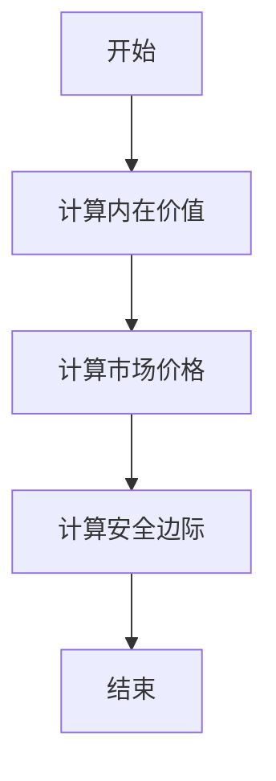
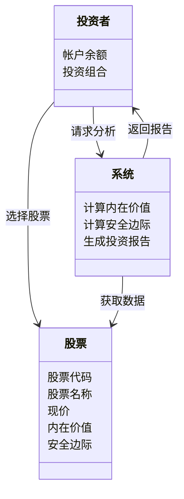
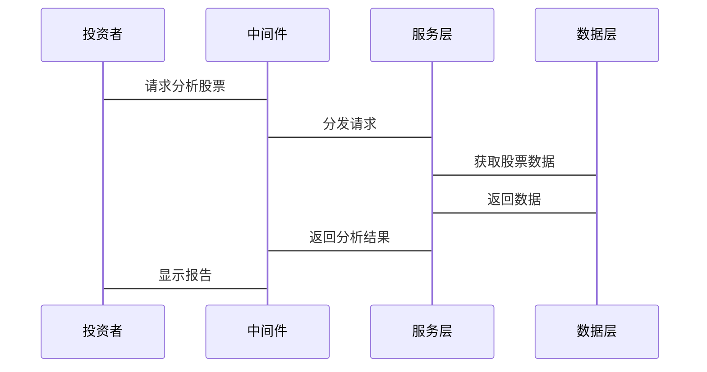

                 


# 格雷厄姆的价值投资教育理念

---

## 关键词  
- 价值投资  
- 格雷厄姆  
- 安全边际  
- 内在价值  
- 市场先生  
- 投资策略  
- 金融教育  

---

## 摘要  
本文深入探讨了格雷厄姆的价值投资理念，分析其核心概念、算法原理及系统架构。通过详细讲解安全边际、内在价值和市场先生等核心概念，结合实际案例，阐述了价值投资的教育意义和应用实践。本文适合投资新手和对金融教育感兴趣的技术读者阅读。

---

# 第1章: 价值投资的核心概念与背景

## 1.1 价值投资的定义与背景  
- 1.1.1 投资的定义与分类  
  - 股票投资、债券投资、房地产投资等分类  
  - 投资的三要素：时间、风险、收益  

- 1.1.2 价值投资的起源与发展  
  - 格雷厄姆与多德的价值投资体系  
  - 价值投资在现代金融中的地位  

- 1.1.3 格雷厄姆与价值投资的关系  
  - 格雷厄姆对价值投资的贡献  
  - 价值投资的核心理念与实践  

---

## 1.2 格雷厄姆的生平与贡献  
- 1.2.1 格雷厄姆的生平简介  
  - 1897年出生于纽约  
  - 哈佛大学与哥伦比亚大学教育背景  
  - 1929年经济大萧条中的投资实践  

- 1.2.2 格雷厄姆对投资理论的贡献  
  - 《证券分析》与《聪明的投资者》  
  - 安全边际概念的提出  
  - 价值投资体系的建立  

- 1.2.3 格雷厄姆的投资哲学与方法  
  - 理性投资与非理性市场的对立统一  
  - 股价波动与内在价值的分离  

---

## 1.3 价值投资的核心理念  
- 1.3.1 安全边际的概念与重要性  
  - 安全边际的定义  
  - 安全边际的作用：降低投资风险  

- 1.3.2 内在价值的定义与计算  
  - 内在价值的公式：DCF模型  
  - 内在价值的计算方法  

- 1.3.3 市场先生与投资者心理  
  - 市场先生的概念  
  - 投资者情绪对市场的影响  

---

## 1.4 价值投资的适用场景与局限性  
- 1.4.1 价值投资的适用场景  
  - 稳定收益投资者的首选  
  - 长期投资策略的适用性  

- 1.4.2 价值投资的局限性  
  - 市场波动的不可预测性  
  - 内在价值计算的复杂性  

- 1.4.3 价值投资与成长投资的对比  
  - 价值投资 vs 成长投资：优缺点分析  

---

## 1.5 本章小结  
- 本章总结了价值投资的核心概念、格雷厄姆的贡献及其投资理念的适用场景和局限性，为后续章节奠定了基础。

---

# 第2章: 价值投资的核心概念与联系

## 2.1 核心概念原理  
- 2.1.1 安全边际的数学模型  
  - 安全边际公式：$ \text{安全边际} = V - P $  
  - $V$为内在价值，$P$为市场价格  

- 2.1.2 内在价值的计算公式  
  - DCF模型：$ V = \sum_{t=1}^{n} \frac{CF_t}{(1 + r)^t} $  
  - $CF_t$为第t年的现金流，$r$为折现率  

- 2.1.3 市场波动与投资者情绪的关系  
  - 市场先生的波动性对投资者决策的影响  

---

## 2.2 核心概念属性特征对比表格  
| 概念       | 安全边际 | 内在价值 | 市场先生 |  
|------------|----------|----------|----------|  
| 定义       | 投资者以低于内在价值的价格买入股票的安全空间 | 股票的公允价值 | 市场价格受投资者情绪影响 |  
| 计算公式   | $\text{安全边际} = V - P$ | $V = \sum_{t=1}^{n} \frac{CF_t}{(1 + r)^t}$ | 市场价格 = 投资者心理定价 |  
| 作用       | 降低投资风险 | 作为投资决策的基础 | 反映市场情绪 |  

---

## 2.3 ER实体关系图架构  
```mermaid
er
actor 投资者 {
  has 内在价值
  has 安全边际
  has 市场先生
}
```

---

## 2.4 本章小结  
- 本章通过数学模型和对比分析，详细阐述了价值投资的核心概念及其联系，为后续的算法原理和系统设计奠定了基础。

---

# 第3章: 价值投资的算法原理讲解

## 3.1 算法原理概述  
- 3.1.1 价值投资的量化模型  
  - 内在价值计算算法  
  - 安全边际计算算法  

- 3.1.2 内在价值的计算公式  
  - $ V = \sum_{t=1}^{n} \frac{CF_t}{(1 + r)^t} $  
  - 示例：某股票未来现金流的现值计算  

- 3.1.3 安全边际的计算方法  
  - $ \text{安全边际} = V - P $  
  - 示例：某股票的安全边际计算  

---

## 3.2 算法流程图  


---

## 3.3 本章小结  
- 本章详细讲解了价值投资的算法原理，包括内在价值和安全边际的计算方法，通过流程图直观展示算法步骤。

---

# 第4章: 价值投资的系统分析与架构设计方案

## 4.1 问题场景介绍  
- 投资者如何通过价值投资理念构建投资组合  
- 系统目标：实现价值投资理念的量化分析与决策支持  

---

## 4.2 项目介绍  
- 项目目标：开发一个基于价值投资理念的投资决策支持系统  
- 项目范围：涵盖股票筛选、内在价值计算、安全边际分析等功能  

---

## 4.3 系统功能设计（领域模型）  


---

## 4.4 系统架构设计  


---

## 4.5 系统交互设计  


---

## 4.6 本章小结  
- 本章通过系统分析与架构设计，展示了如何将价值投资理念应用于实际投资决策中，为后续的项目实战奠定了基础。

---

# 第5章: 价值投资的项目实战

## 5.1 环境安装与配置  
- 安装Python环境（推荐使用Anaconda）  
- 安装必要的库：Pandas、NumPy、Matplotlib  

---

## 5.2 系统核心实现源代码  
```python
import pandas as pd
import numpy as np

def calculate_intrinsic_value(cash_flows, discount_rate):
    return np.npv(discount_rate, cash_flows[1:], cash_flows[0])

def calculate_margin_of_safety(intrinsic_value, market_price):
    return intrinsic_value - market_price

# 示例数据
cash_flows = [100, 120, 150, 200]
discount_rate = 0.10

IV = calculate_intrinsic_value(cash_flows, discount_rate)
MS = calculate_margin_of_safety(IV, 90)

print(f"内在价值: {IV:.2f}")
print(f"安全边际: {MS:.2f}")
```

---

## 5.3 代码应用解读与分析  
- 示例代码的功能：计算股票的内在价值和安全边际  
- 代码实现的关键点：现金流的输入与折现率的设置  

---

## 5.4 实际案例分析  
- 案例：某股票的现金流预测与内在价值计算  
- 步骤：  
  1. 收集公司未来现金流预测  
  2. 确定合适的折现率  
  3. 计算内在价值  
  4. 对比市场价格，计算安全边际  

---

## 5.5 本章小结  
- 本章通过实际案例分析和代码实现，展示了价值投资理念在实际投资中的应用。

---

# 第6章: 价值投资的教育与实践

## 6.1 价值投资的教育意义  
- 价值投资理念的传播与普及  
- 投资者教育的重要性  

---

## 6.2 投资者心态与行为管理  
- 理性投资的重要性  
- 如何克服非理性决策  

---

## 6.3 实践中的注意事项  
- 数据来源的可靠性  
- 模型的适用性与局限性  

---

## 6.4 拓展阅读与学习资源  
- 推荐书籍：《聪明的投资者》、《证券分析》  
- 在线资源与课程推荐  

---

## 6.5 本章小结  
- 本章强调了价值投资的教育意义和实践中的注意事项，为读者提供了进一步学习和实践的指导。

---

# 第7章: 总结与展望

## 7.1 本章总结  
- 本文系统地介绍了格雷厄姆的价值投资理念，分析了其核心概念、算法原理和系统架构，通过实际案例展示了其在投资实践中的应用。

---

## 7.2 未来展望  
- 价值投资理念的进一步发展  
- 数字化工具在价值投资中的应用前景  

---

## 7.3 本章小结  
- 本章总结了全文，展望了价值投资理念的未来发展。

---

# 作者：AI天才研究院/AI Genius Institute & 禅与计算机程序设计艺术 /Zen And The Art of Computer Programming

