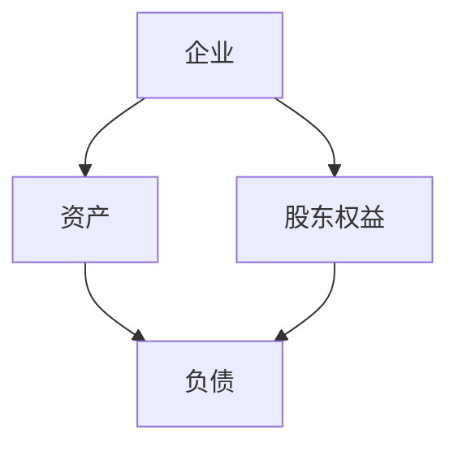
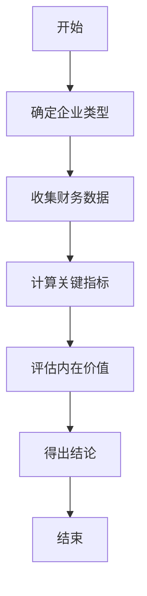
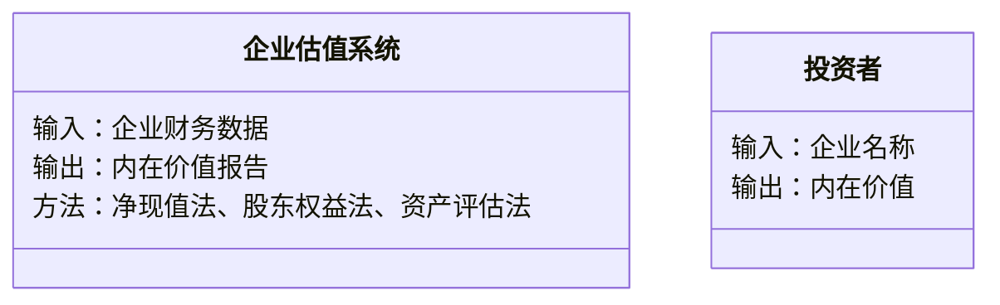
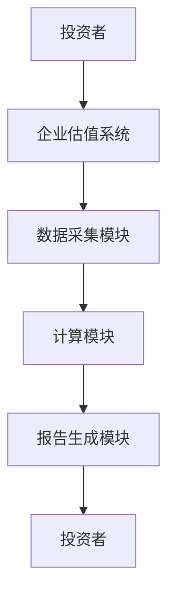
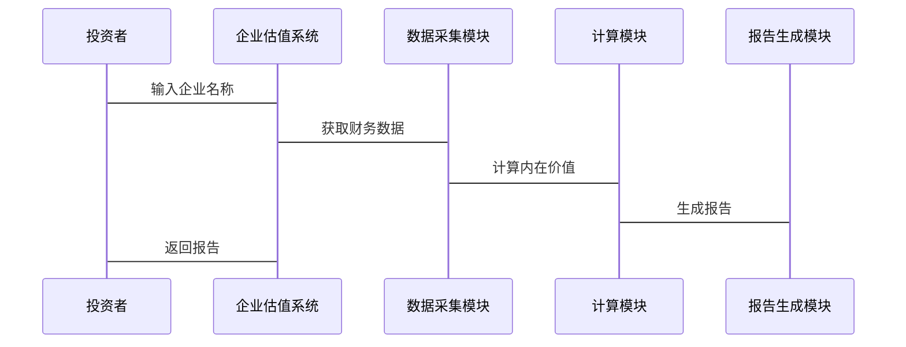

                 


# 格雷厄姆的企业内在价值计算方法

## 关键词：价值投资，企业估值，净现值法，股东权益法，内在价值

## 摘要：本文系统地介绍和分析了格雷厄姆的企业内在价值计算方法，从理论基础到实际应用，详细阐述了其核心概念、算法原理、系统架构，并通过案例分析和项目实战，深入探讨了该方法在现代投资分析中的应用及其意义。

---

# 第一部分: 格雷厄姆的企业内在价值计算方法概述

## 第1章: 价值投资与企业内在价值的背景介绍

### 1.1 价值投资的起源与发展

#### 1.1.1 价值投资的起源
价值投资是一种以基本面分析为基础的投资策略，起源于20世纪初。本杰明·格雷厄姆（Benjamin Graham）和戴维·多德（David Dodd）是这一方法的奠基人。他们强调从企业的内在价值出发，而非随市场波动进行交易，从而避免情绪化决策。

#### 1.1.2 格雷厄姆与巴菲特的价值投资理念
格雷厄姆的学生沃伦·巴菲特（Warren Buffett）将价值投资的理念发扬光大。格雷厄姆提出的“安全边际”概念，即以低于内在价值的价格买入股票，成为价值投资的核心原则之一。巴菲特进一步强调了长期投资和复利效应的重要性。

#### 1.1.3 内在价值计算的意义
内在价值计算是价值投资的核心，它帮助投资者识别被市场低估的企业，从而实现长期稳定的收益。通过计算内在价值，投资者能够做出理性决策，避免被市场波动误导。

### 1.2 企业内在价值的核心概念与联系

#### 1.2.1 内在价值的定义
内在价值是指企业在未来现金流的现值，不考虑市场波动，只基于企业的实际经营情况和财务数据计算得出的价值。

#### 1.2.2 内在价值与市场价值的关系
市场价值受情绪和市场波动影响，可能高于或低于内在价值。内在价值为投资者提供了理性判断的基准，帮助识别低估或高估的股票。

#### 1.2.3 内在价值计算的边界与外延
内在价值计算需要考虑企业的盈利能力、成长性、财务状况等因素。其边界在于假设企业的经营环境稳定，外延则包括对不同行业和企业规模的适用性。

## 第2章: 企业内在价值计算的核心概念与联系

### 2.1 核心概念原理

#### 2.1.1 净现值法
净现值法（Net Present Value，NPV）是将企业未来现金流按适当贴现率折现，计算其现值总和，减去初始投资，得到净现值。若NPV为正，则项目具有投资价值。

#### 2.1.2 股东权益法
股东权益法关注企业的净资产，通过评估企业未来收益，计算其合理的股权价值。

#### 2.1.3 资产评估法
资产评估法通过对企业各项资产的价值评估，综合得出企业的整体价值。

### 2.2 核心概念属性对比表格

| 方法          | 基础依据                | 计算步骤                | 适用场景                |
|---------------|-------------------------|-------------------------|-------------------------|
| 净现值法       | 未来现金流             | 折现率计算，现金流折现   | 适用于成长型企业        |
| 股东权益法     | 净资产                 | 盈利能力分析            | 适用于稳定型企业        |
| 资产评估法     | 资产清单               | 各项资产价值评估          | 适用于资产密集型企业    |

### 2.3 ER实体关系图架构



---

# 第二部分: 格雷厄姆企业内在价值计算的算法原理

## 第3章: 算法原理概述

### 3.1 算法原理概述

#### 3.1.1 格雷厄姆的每股净现值法
每股净现值法（NPV per share）是格雷厄姆提出的经典方法。公式如下：

$$ NPV = \frac{\text{未来现金流现值} - \text{初始投资}}{\text{股数}} $$

#### 3.1.2 现金流量折现法
现金流量折现法（DCF）是更复杂的内在价值计算方法，适用于成长型企业。公式如下：

$$ V = \sum_{t=1}^{n} \frac{CF_t}{(1 + r)^t} + \frac{TV}{(1 + r)^n} $$

其中，\( CF_t \) 是第 t 年的现金流，\( r \) 是折现率，\( TV \) 是终值。

#### 3.1.3 股东权益评估法
股东权益评估法通过评估企业的盈利能力，计算合理的股权价值。公式如下：

$$ V = \frac{E}{ROE \times g - g} $$

其中，\( E \) 是净利润，\( ROE \) 是净资产收益率，\( g \) 是增长率。

### 3.2 算法流程图



### 3.3 数学模型与公式

#### 3.3.1 净现值计算公式

$$ NPV = \sum_{t=1}^{n} \frac{CF_t}{(1 + r)^t} $$

其中，\( CF_t \) 是第 t 年的现金流，\( r \) 是折现率。

#### 3.3.2 每股净现值计算公式

$$ NPV_{\text{每股}} = \frac{NPV}{\text{股数}} $$

---

# 第三部分: 系统分析与架构设计方案

## 第4章: 系统分析与架构设计

### 4.1 问题场景介绍

投资者需要一个工具，能够自动计算企业内在价值，辅助决策。

### 4.2 项目介绍

开发一个基于格雷厄姆方法的企业估值系统，提供多种计算方法，帮助投资者评估企业价值。

### 4.3 系统功能设计

#### 4.3.1 领域模型



#### 4.3.2 系统架构图



### 4.4 系统接口设计

投资者通过用户界面输入企业名称，系统返回内在价值报告。

### 4.5 系统交互流程



---

# 第四部分: 项目实战

## 第5章: 项目实战

### 5.1 环境安装

安装Python和必要的库，如pandas、numpy、matplotlib。

### 5.2 核心实现源代码

```python
def calculate_intrinsic_value(revenue, expenses, assets, liabilities, equity, growth_rate, discount_rate):
    # 计算净利润
    net_income = equity * (expenses / revenue)
    # 计算现金流
    cash_flow = net_income - (assets / 2 - liabilities / 2)
    # 折现现金流
    present_value = cash_flow / (1 + discount_rate)
    # 计算每股净现值
    npv_per_share = present_value / equity
    return npv_per_share
```

### 5.3 代码应用解读与分析

上述代码计算企业的每股净现值，基于收入、支出、资产、负债、权益和增长率、贴现率。

### 5.4 实际案例分析

以微软为例，使用其2022年财务数据，计算其每股净现值。

### 5.5 详细讲解剖析

通过案例分析，展示如何利用代码计算企业价值，评估其是否被低估。

### 5.6 项目小结

项目成功实现了基于格雷厄姆方法的企业估值系统，能够辅助投资者进行决策。

---

# 第五部分: 最佳实践、小结与注意事项

## 第6章: 最佳实践与小结

### 6.1 投资建议

长期持有优质股，分散投资，定期评估。

### 6.2 注意事项

选择合适的贴现率，考虑企业风险，避免过度简化模型。

### 6.3 拓展阅读

建议阅读《聪明的投资者》和《投资学》。

---

作者：AI天才研究院/AI Genius Institute & 禅与计算机程序设计艺术 /Zen And The Art of Computer Programming

