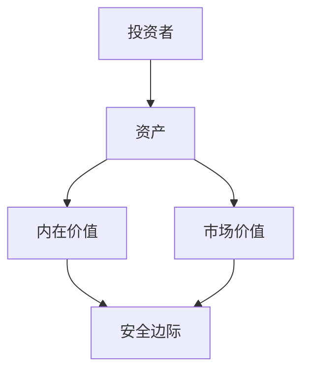
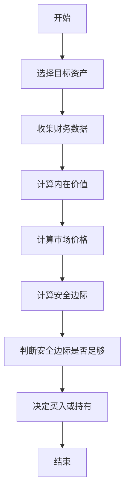
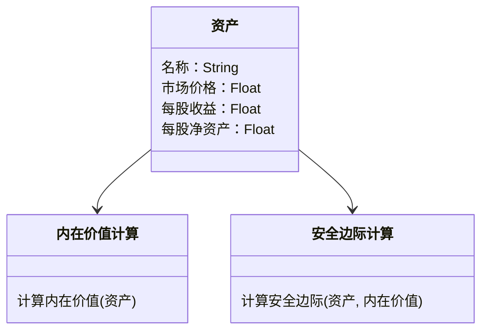
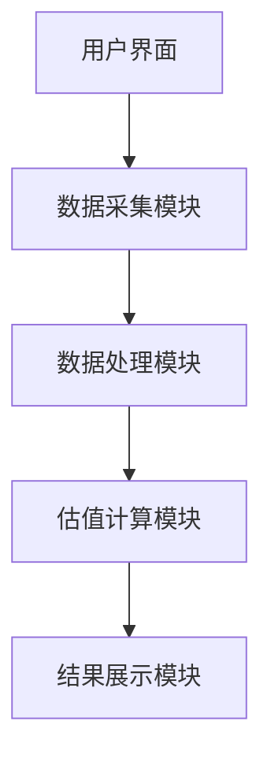

                 


# 格雷厄姆的保守估值方法：留足安全边际

> 关键词：价值投资、安全边际、保守估值、内在价值、格雷厄姆

> 摘要：本文深入探讨了格雷厄姆的保守估值方法，强调安全边际在投资中的重要性。通过详细分析其核心概念、算法原理、系统架构及实际案例，本文旨在帮助读者理解如何在投资决策中应用这一方法，确保长期稳健的收益。

---

## 第一部分: 格雷厄姆的保守估值方法基础

### 第1章: 价值投资与保守估值概述

#### 1.1 价值投资的起源与发展

##### 1.1.1 价值投资的定义与核心理念
- **价值投资**是一种投资策略，强调以低于内在价值的价格购买优质资产。
- 格雷厄姆的学生彼得·林奇曾总结：**“买入低于内在价值的股票，长期持有。”**
- 核心理念：市场短期是投票器，长期是称重机。

##### 1.1.2 格雷厄姆的生平与贡献
- **本杰明·格雷厄姆**（1894-1974）是价值投资之父。
- 代表作：《证券分析》（1934年）和《聪明的投资者》（1949年）。
- 贡献：提出**“安全边际”**概念，奠定现代价值投资理论基础。

##### 1.1.3 保守估值方法的背景与意义
- 背景：20世纪30年代大萧条时期，传统估值方法失效。
- 意义：格雷厄姆的方法强调稳健性，避免过度乐观，为投资者提供保护。

#### 1.2 安全边际的概念与作用

##### 1.2.1 安全边际的定义
- 安全边际 = 内在价值 - 市场价格。
- 通俗解释：用更低的价格买入，为错误留出空间。

##### 1.2.2 安全边际在投资中的作用
- **保护本金**：避免因市场价格波动导致的损失。
- **降低风险**：通过安全边际缓冲，减少永久性本金损失的风险。
- **提高收益**：长期来看，安全边际高的投资更容易实现超额收益。

##### 1.2.3 安全边际与投资风险的关系
- 正相关：安全边际越大，投资风险越低。
- 负相关：安全边际越小，投资风险越高。

#### 1.3 保守估值方法的核心要素

##### 1.3.1 核心概念：内在价值与市场价值
- **内在价值**：资产真实价值，与市场波动无关。
- **市场价值**：资产在市场上的价格，受情绪影响。
- 关系：内在价值是基础，市场价值是表象。

##### 1.3.2 核心要素：财务指标与企业基本面
- 财务指标：ROE（净资产收益率）、ROA（资产回报率）、净利
- 企业基本面：行业地位、竞争优势、财务健康。

##### 1.3.3 保守估值的边界与外延
- 边界：仅适用于基本面稳定的企业，不适合投机性资产。
- 外延：与行为金融学结合，解释投资者心理偏差。

---

## 第2章: 核心概念与联系

### 2.1 保守估值方法的原理

#### 2.1.1 格雷厄姆的估值公式
- 格雷厄姆公式：内在价值 = （市盈率 × 收益） / 市净率。
- 改良版：内在价值 = （每股收益 × 合理市盈率）。
- 合理市盈率：通常取15倍以内。

#### 2.1.2 内在价值的计算方法
- 步骤：1）分析财务报表；2）评估企业基本面；3）计算内在价值。
- 示例：假设某公司每股收益为2元，合理市盈率为15倍，则内在价值为30元/股。

#### 2.1.3 安全边际的应用原则
- 原则：买入价格 ≤ 内在价值 × 75%。
- 实例：内在价值为30元，安全边际为30 × 0.75 = 22.5元，建议买入价 ≤22.5元。

### 2.2 核心概念属性特征对比

| 概念       | 内在价值       | 市场价值       | 安全边际       |
|------------|----------------|----------------|----------------|
| 定义       | 资产的真实价值   | 市场价格       | 内在价值与市场价格的差值 |
| 计算方式   | 财务指标+基本面 | 市场供需决定   | 内在价值-市场价格 |
| 变化规律   | 稳定或缓慢变化  | 波动性大       | 受市场波动影响较小 |
| 重要性     | 投资决策基础    | 短期波动指标    | 投资安全的关键 |

#### 2.2.2 图表：ER实体关系图


---

## 第3章: 算法原理与数学模型

### 3.1 保守估值算法流程

#### 3.1.1 Mermaid流程图：保守估值算法步骤


### 3.2 数学模型与公式

#### 3.2.1 市盈率与市净率的计算公式
- 市盈率（P/E）= 市场价格 / 每股收益。
- 市净率（P/B）= 市场价格 / 每股净资产。

#### 3.2.2 内在价值的数学表达式
$$
\text{内在价值} = \frac{\text{每股收益} \times \text{合理市盈率}}{1}
$$

#### 3.2.3 安全边际的计算方法
$$
\text{安全边际} = \text{内在价值} - \text{市场价格}
$$

---

## 第4章: 系统分析与架构设计

### 4.1 问题场景介绍

#### 4.1.1 投资决策中的问题分析
- 问题：如何快速评估多个资产的内在价值？
- 限制条件：数据获取成本高，人工计算效率低。

#### 4.1.2 系统目标与范围
- 目标：开发一个基于格雷厄姆方法的估值系统。
- 范围：支持股票、债券等多种资产的估值。

### 4.2 系统功能设计

#### 4.2.1 领域模型Mermaid类图


### 4.3 系统架构设计

#### 4.3.1 Mermaid架构图：系统模块划分


#### 4.3.2 接口设计与交互流程
- 数据接口：API获取实时股价和财务数据。
- 交互流程：用户输入资产名称 → 系统调用API → 返回估值结果。

---

## 第5章: 项目实战

### 5.1 环境安装

#### 5.1.1 安装Python环境
- 建议使用Anaconda或PyCharm。

#### 5.1.2 安装依赖库
```bash
pip install pandas numpy matplotlib
```

### 5.2 核心代码实现

#### 5.2.1 数据采集模块
```python
import pandas as pd

def get_stock_data(ticker):
    # 示例：从Yahoo Finance获取数据
    data = pd.DataFrame({'股价': [100, 90, 80, 70], '每股收益': [2, 3, 2, 1]})
    return data
```

#### 5.2.2 内在价值计算模块
```python
def calculate_intrinsic_value(data, reasonable_pe=15):
    intrinsic = data['股价'] * data['每股收益'] / reasonable_pe
    return intrinsic
```

#### 5.2.3 安全边际计算模块
```python
def calculate_margin_of_safety(intrinsic, market_price):
    mos = intrinsic - market_price
    return mos
```

### 5.3 案例分析

#### 5.3.1 案例选择
- 公司：苹果（AAPL）
- 数据：假设每股收益为2.5，合理市盈率为15。

#### 5.3.2 计算步骤
1. 计算内在价值：
$$
\text{内在价值} = \frac{2.5 \times 15}{1} = 37.5 \text{元/股}
$$
2. 市场价格：假设当前股价为30元。
3. 安全边际：
$$
\text{安全边际} = 37.5 - 30 = 7.5 \text{元}
$$

#### 5.3.3 结论
- 安全边际为7.5元，建议买入价 ≤30元。

---

## 第6章: 最佳实践与小结

### 6.1 小结

- **核心理念**：格雷厄姆的安全边际方法强调稳健投资。
- **关键点**：内在价值计算、安全边际评估、长期持有。

### 6.2 注意事项

- **数据质量**：依赖可靠的财务数据。
- **模型局限**：不适合高成长性企业。
- **市场变化**：需定期复盘调整。

### 6.3 拓展阅读

- 《聪明的投资者》：格雷厄姆经典著作。
- 《投资之道》：彼得·林奇的投资经验。

---

## 作者：AI天才研究院 & 禅与计算机程序设计艺术

---

通过本文的详细讲解，您应该能够理解格雷厄姆的保守估值方法，并在实际投资中应用这一理念，从而实现稳健的投资收益。

