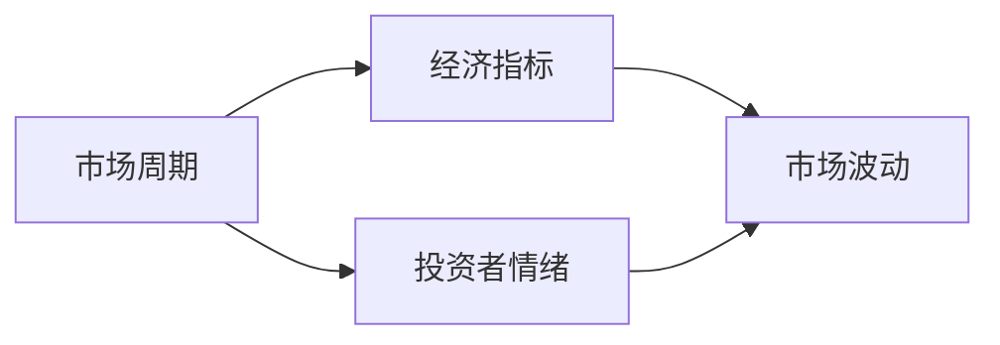
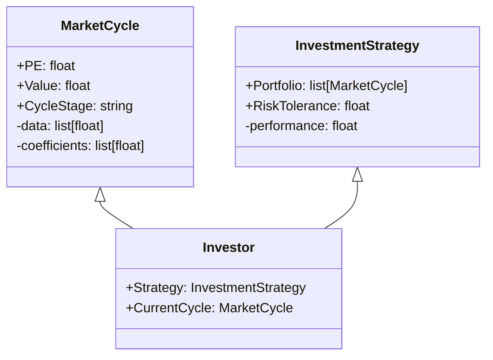

                 


# 格雷厄姆的市场周期理论

## 关键词：市场周期理论，投资分析，价值投资，本·格雷厄姆，投资策略

## 摘要：  
本文深入探讨了本·格雷厄姆的市场周期理论，分析了其核心概念、算法原理、数学模型以及实际应用。通过系统的介绍和详细的技术分析，本文为读者提供了从理论到实践的全面指导，帮助投资者更好地理解和应用市场周期理论进行投资决策。

---

# 第一部分: 市场周期理论的背景与核心概念

## 第1章: 市场周期理论的背景与核心概念

### 1.1 市场周期的基本概念

#### 1.1.1 市场周期的定义与特征
市场周期是指市场在一段时间内价格波动的规律性变化。格雷厄姆认为，市场周期分为四个阶段：恐慌与抛售、积累、怀疑和兴奋。每个阶段都有其独特的特征，例如价格波动、投资者情绪变化等。

#### 1.1.2 格雷厄姆的市场周期理论背景
格雷厄姆是价值投资的鼻祖，他的市场周期理论基于对市场波动和投资者行为的深入研究。他认为，市场周期的核心在于价格与价值的偏离，投资者可以通过识别这种偏离来制定投资策略。

#### 1.1.3 市场周期与投资决策的关系
市场周期与投资决策密切相关。在牛市中，投资者情绪高涨，价格可能被高估；在熊市中，投资者情绪低落，价格可能被低估。通过分析市场周期，投资者可以更好地把握投资机会和风险。

---

### 1.2 格雷厄姆的市场周期理论基础

#### 1.2.1 市场周期的四个阶段
格雷厄姆将市场周期分为四个阶段：
1. **恐慌与抛售阶段**：投资者情绪极度悲观，大量抛售资产，价格大幅下跌。
2. **积累阶段**：价格触底，投资者开始逐步买入，市场逐渐复苏。
3. **怀疑阶段**：投资者对市场前景持谨慎态度，价格波动较小。
4. **兴奋阶段**：投资者情绪高涨，价格被高估，市场进入牛市。

#### 1.2.2 市场周期的波动规律
市场周期的波动具有一定的规律性，例如价格波动、成交量变化、投资者情绪变化等。格雷厄姆通过分析这些规律，提出了基于市场周期的投资策略。

#### 1.2.3 市场周期与投资者心理的关系
市场周期与投资者心理密切相关。在牛市中，投资者贪婪；在熊市中，投资者恐惧。格雷厄姆强调，投资者应避免被情绪左右，而应基于基本面进行投资。

---

## 第2章: 格雷厄姆市场周期理论的核心概念与联系

### 2.1 核心概念原理

#### 2.1.1 市场周期的核心要素
市场周期的核心要素包括价格波动、投资者情绪、经济指标等。这些要素共同作用，推动市场的周期性变化。

#### 2.1.2 市场周期的内在逻辑
市场周期的内在逻辑是价格与价值的偏离。当价格低于价值时，市场处于低估阶段；当价格高于价值时，市场处于高估阶段。

#### 2.1.3 市场周期与投资策略的关系
投资者可以通过分析市场周期的阶段，制定相应的投资策略。例如，在低估阶段买入，在高估阶段卖出。

---

### 2.2 核心概念属性特征对比

#### 2.2.1 不同市场周期阶段的特征对比

| 阶段          | 投资者情绪 | 价格波动 | 市场估值 |
|---------------|------------|-----------|----------|
| 恐慌与抛售     | 恐惧       | 高        | 低估     |
| 积累阶段       | 谨慎       | 中        | 逐步回升 |
| 怀疑阶段       | 犹豫       | 低        | 靠近价值  |
| 兴奋阶段       | 贪婪       | 高        | 高估     |

---

### 2.3 实体关系图



---

## 第3章: 格雷厄姆市场周期理论的算法原理

### 3.1 算法原理概述

#### 3.1.1 市场周期的识别算法
市场周期的识别算法基于价格与价值的偏离。具体步骤如下：
1. 计算资产的内在价值。
2. 比较当前价格与内在价值。
3. 根据偏离程度判断市场周期阶段。

#### 3.1.2 市场周期的预测模型
市场周期的预测模型基于历史数据和统计分析。例如，可以通过回归分析预测下一阶段的市场走势。

#### 3.1.3 市场周期的量化分析方法
量化分析方法包括计算市盈率、市净率等指标，判断市场是否处于高估或低估阶段。

---

### 3.2 算法流程图


---

### 3.3 算法实现代码

```python
import pandas as pd
import numpy as np

def calculate_market_cycle(data):
    # 示例代码：计算市场周期阶段
    data['Market_Cycle'] = np.where(data['PE'] < 15, '熊市', '牛市')
    return data

# 示例数据
data = pd.DataFrame({'PE': [10, 20, 12, 18, 10]})
result = calculate_market_cycle(data)
print(result)
```

---

## 第4章: 格雷厄姆市场周期理论的数学模型

### 4.1 数学模型概述

#### 4.1.1 市场周期的数学表达
市场周期的数学模型可以通过价格与价值的偏离来表示。例如，内在价值公式：

$$ V = \frac{E}{P} $$

其中，$V$ 是内在价值，$E$ 是每股收益，$P$ 是市盈率。

#### 4.1.2 市场周期的预测公式
市场周期的预测公式可以通过回归分析实现：

$$ Y = aX + b $$

其中，$Y$ 是预测的市场阶段，$X$ 是市盈率，$a$ 和 $b$ 是回归系数。

---

## 第5章: 系统分析与架构设计方案

### 5.1 问题场景介绍
本章将从系统架构的角度，分析如何基于格雷厄姆的市场周期理论构建一个投资分析系统。

---

### 5.2 系统功能设计

#### 5.2.1 领域模型（Mermaid 类图）


---

#### 5.2.2 系统架构设计（Mermaid 架构图）
```mermaid
container 投资者 {
    Investor
}
container 数据源 {
    MarketData
}
container 分析模块 {
    MarketCycleAnalyzer
}
container 决策模块 {
    InvestmentStrategy
}

抽屉 投资者 --> MarketData
抽屉 投资者 --> MarketCycleAnalyzer
抽屉 MarketCycleAnalyzer --> InvestmentStrategy
抽屉 InvestmentStrategy --> 投资者
```

---

## 第6章: 项目实战

### 6.1 环境安装
需要安装的工具包括 Python、Pandas、NumPy、Matplotlib 等。

---

### 6.2 系统核心实现源代码

```python
import pandas as pd
import numpy as np
import matplotlib.pyplot as plt

def calculate_intrinsic_value(data, required_margin_of_safety=0.3):
    # 计算内在价值
    data['Intrinsic_Value'] = data['Earnings'] / data['PE']
    # 应用安全边际
    data['Intrinsic_Value'] *= (1 + required_margin_of_safety)
    return data

# 示例数据
data = pd.DataFrame({
    'Earnings': [10, 20, 15, 25, 30],
    'PE': [15, 12, 18, 10, 14]
})

result = calculate_intrinsic_value(data)
print(result)
```

---

### 6.3 代码应用解读与分析
通过上述代码，我们可以计算每只股票的内在价值，并应用安全边际进行调整。这有助于投资者判断市场是否处于低估阶段。

---

## 第7章: 最佳实践

### 7.1 小结
通过本文的介绍，读者可以深入了解格雷厄姆的市场周期理论，并将其应用于实际投资中。

---

### 7.2 注意事项
投资者在实际应用中应结合市场实际情况，避免盲目跟从理论。

---

### 7.3 拓展阅读
推荐读者阅读《证券分析》（*The Analysis of Investment Value*）等书籍，深入了解格雷厄姆的理论。

---

## 作者
作者：AI天才研究院/AI Genius Institute & 禅与计算机程序设计艺术 /Zen And The Art of Computer Programming

