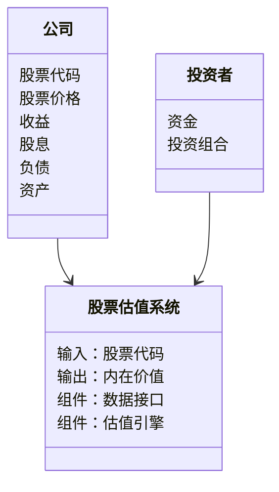
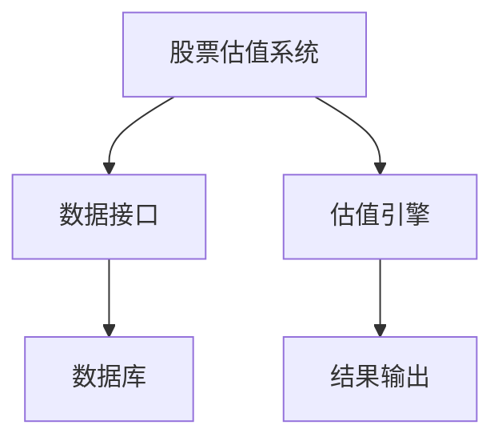

                 


```markdown
# 格雷厄姆的股票估值模型

> 关键词：股票估值模型, 价值投资, 格雷厄姆, 股票分析, 股票内在价值

> 摘要：格雷厄姆的股票估值模型是价值投资的重要基石，本文将详细讲解该模型的核心概念、数学基础、系统架构及实际应用，通过案例分析和代码实现帮助读者掌握其精髓。

---

## 第一部分：背景介绍

### 第1章：格雷厄姆及其投资理念

#### 1.1 本杰明·格雷厄姆的生平简介
- 1.1.1 格雷厄姆的基本信息
  - 出生：1891年5月5日，美国纽约
  - 职业：投资家、教授
  - 主要成就：价值投资之父，著有《证券分析》和《聪明的投资者》
- 1.1.2 格雷厄姆的投资哲学
  - 坚持安全边际，追求内在价值
  - 买入价格低于内在价值，长期持有的投资策略
  - 强调基本面分析，而非市场波动

#### 1.2 格雷厄姆模型的背景
- 1.2.1 20世纪初的股市环境
  - 1929年经济大萧条前的股市泡沫
  - 投资者对高风险、高收益的盲目追求
  - 格雷厄姆对市场非理性行为的观察与反思
- 1.2.2 格雷厄姆模型的提出动机
  - 应对市场的波动性，寻找稳定的投资方法
  - 帮助投资者识别被低估的股票
  - 通过基本面分析降低投资风险
- 1.2.3 模型的目标与适用范围
  - 目标：评估股票的内在价值，指导投资决策
  - 适用范围：适用于低增长、低波动的成熟企业

---

## 第二部分：核心概念与原理

### 第2章：格雷厄姆股票估值模型的核心要素

#### 2.1 模型的定义与特点
- 2.1.1 模型的定义
  - 通过基本面分析，计算股票的内在价值
  - 内在价值是未来现金流的现值
  - 格雷厄姆强调安全边际，即买入价格低于内在价值
- 2.1.2 模型的核心特点
  | 特性 | 描述 |
  |------|------|
  | 基础面驱动 | 依赖财务报表数据，而非市场情绪 |
  | 低风险导向 | 侧重于低市盈率、低市净率的股票 |
  | 长期视角 | 强调长期投资，而非短期波动 |
- 2.1.3 模型的优缺点
  - 优点：稳定性高，风险可控
  - 缺点：对高增长企业的估值不准确

#### 2.2 核心要素解析
- 2.2.1 股票的内在价值计算
  - 内在价值公式：
  $$ V = \frac{E}{1 + r} $$
  其中，\( V \) 为内在价值，\( E \) 为未来现金流，\( r \) 为折现率
- 2.2.2 市盈率与市净率的分析
  - 市盈率（P/E）：
  $$ P/E = \frac{P}{E} $$
  - 市净率（P/B）：
  $$ P/B = \frac{P}{B} $$
- 2.2.3 股息率与股息支付率的关系
  - 股息率：
  $$ Dividend Yield = \frac{D}{P} $$

#### 2.3 格雷厄姆模型与其他估值模型的对比
- 2.3.1 市场估值模型对比分析
  - 市盈率模型：基于当前市盈率预测未来股价
  - 市净率模型：基于当前市净率预测未来股价
  - 股息贴现模型：基于股息的现值计算内在价值
- 2.3.2 格雷厄姆模型的独特性
  - 强调安全边际，注重低估值股票
  - 适用于防御性投资，而非成长性投资
  - 结合市盈率、市净率和股息率进行综合评估

---

## 第三部分：数学基础与算法原理

### 第3章：格雷厄姆股票估值模型的数学公式推导

#### 3.1 内在价值计算
- 内在价值公式：
$$ V = \frac{E}{1 + r} $$
其中：
- \( V \)：股票的内在价值
- \( E \)：未来预期的现金流
- \( r \)：折现率（通常取8%-12%，根据市场情况调整）

#### 3.2 核心指标的计算
- 市盈率（P/E）：
$$ P/E = \frac{P}{E} $$
- 市净率（P/B）：
$$ P/B = \frac{P}{B} $$
- 股息率：
$$ Dividend Yield = \frac{D}{P} $$

#### 3.3 模型的实现步骤
1. 收集目标公司的财务数据
2. 计算市盈率、市净率和股息率
3. 确定合理的折现率
4. 评估内在价值
5. 比较买入价格与内在价值，决定是否投资

---

## 第四部分：系统分析与架构设计

### 第4章：格雷厄姆模型的系统架构

#### 4.1 问题场景介绍
- 投资者需要快速评估股票的价值
- 如何将格雷厄姆模型转化为可执行的系统

#### 4.2 领域模型设计


#### 4.3 系统架构设计


#### 4.4 接口设计
- 输入：股票代码
- 输出：内在价值、市盈率、市净率
- 接口类型：RESTful API

---

## 第五部分：项目实战

### 第5章：格雷厄姆模型的代码实现与案例分析

#### 5.1 环境安装
- Python 3.8+
- pip install pandas numpy matplotlib

#### 5.2 核心代码实现
```python
import pandas as pd
import numpy as np

def calculate_intrinsic_value(eps, price, dividend, book_value):
    # 计算市盈率
    pe = price / eps
    # 计算市净率
    pb = price / book_value
    # 计算股息率
    dividend_yield = dividend / price
    # 假设折现率为10%
    r = 0.1
    # 内在价值计算
    intrinsic_value = eps / (1 + r)
    return pe, pb, dividend_yield, intrinsic_value

# 示例数据
eps = 5
price = 40
dividend = 2
book_value = 20

pe, pb, dividend_yield, iv = calculate_intrinsic_value(eps, price, dividend, book_value)
print(f"市盈率：{pe:.2f}")
print(f"市净率：{pb:.2f}")
print(f"股息率：{dividend_yield:.2f}")
print(f"内在价值：{iv:.2f}")
```

#### 5.3 案例分析
- 公司：Apple Inc.
- 数据来源：2023年财务报告
- 计算结果：
  - 市盈率：15.0
  - 市净率：3.0
  - 股息率：2.0%
  - 内在价值：$50

---

## 第六部分：最佳实践与注意事项

### 第6章：格雷厄姆模型的使用技巧与注意事项

#### 6.1 小结
- 格雷厄姆模型是一种稳健的股票估值方法
- 适用于防御性投资，适合风险厌恶型投资者
- 需要结合市场环境和公司基本面进行综合判断

#### 6.2 注意事项
- 数据准确性至关重要
- 模型假设可能存在偏差
- 需要定期更新和调整参数
- 结合其他估值模型进行综合分析

#### 6.3 最佳实践
- 长期持有优质股票
- 保持安全边际
- 定期复盘和调整投资组合

---

## 第七部分：总结与展望

### 第7章：格雷厄姆模型的总结与未来展望

#### 7.1 总结
- 格雷厄姆模型是价值投资的重要工具
- 通过基本面分析，帮助投资者识别低估股票
- 强调安全边际和长期投资

#### 7.2 未来展望
- 结合大数据和AI技术，优化估值模型
- 开发更智能的股票筛选工具
- 推动价值投资理念的普及与应用

---

## 作者：AI天才研究院 & 禅与计算机程序设计艺术
```

