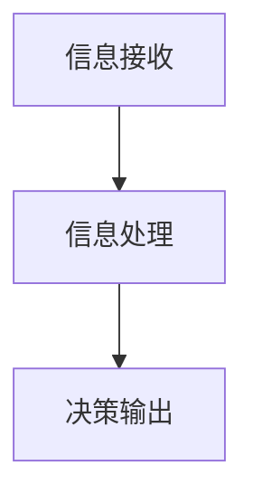
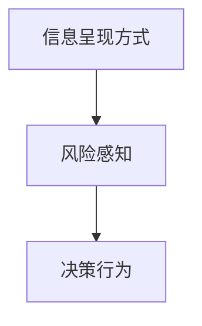
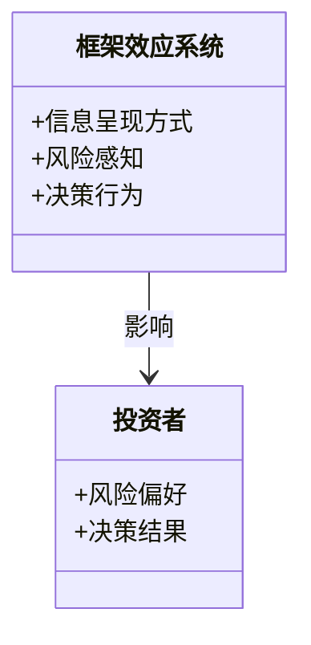
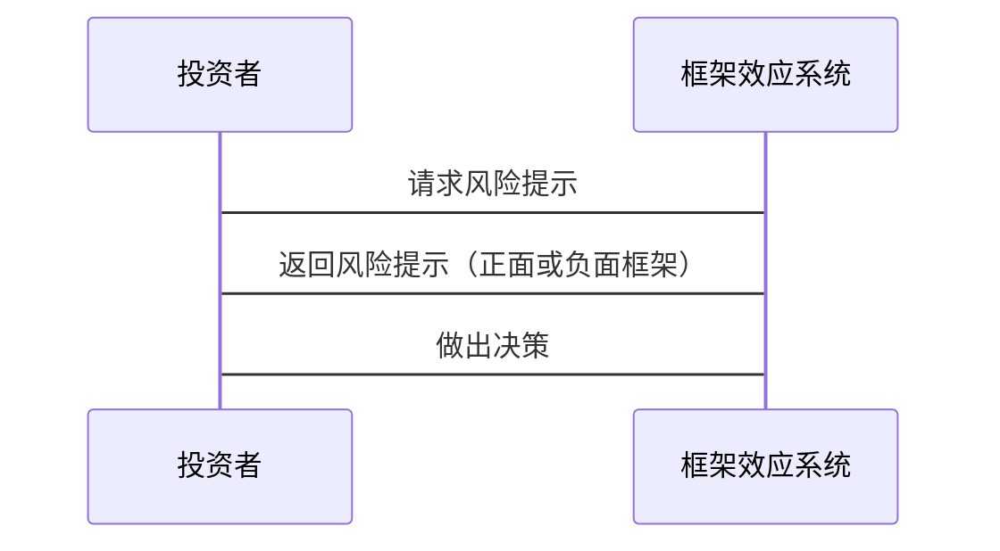
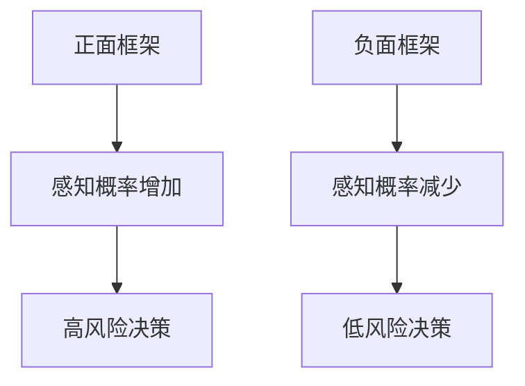

                 


# 框架效应：信息呈现方式如何影响风险感知

## 关键词：框架效应, 风险感知, 信息呈现, 心理学, 认知偏差, 概率评估

## 摘要

在决策过程中，信息的呈现方式对人们的感知和判断有着重要影响。本文深入探讨了框架效应这一现象，从心理学基础到数学模型，从系统架构到实际案例，全面分析了信息呈现方式如何影响风险感知。通过详细讲解框架效应的核心原理、算法实现以及系统设计，本文旨在为读者提供一个全面而深入的理解框架，帮助他们在实际应用中更好地利用框架效应，优化决策过程。

---

## 第一部分：框架效应的背景与核心概念

### 第1章：框架效应的定义与背景

#### 1.1 问题背景与问题描述

在信息丰富的现代社会，人们每天都会接触到大量信息，而这些信息的呈现方式直接影响我们对风险的感知和决策。例如，在金融投资中，同样是“90%的成功率”，以正面框架（“有90%的概率成功”）呈现的信息往往会让人们感到乐观，而以负面框架（“有10%的概率失败”）呈现时，人们可能会更加谨慎。

这种现象被称为**框架效应**，它揭示了信息呈现方式对人类决策过程的重要影响。框架效应的核心在于，通过不同的表达方式（如积极或消极的描述），可以显著改变人们对同一信息的风险感知和决策行为。

---

#### 1.2 框架效应的核心概念

##### 框架效应的定义与属性

框架效应是指信息的表达方式（框架）对个体感知和决策的影响。具体来说，信息的呈现方式（如正面或负面框架）会显著改变人们对风险的感知，从而影响他们的决策行为。

以下是框架效应的核心概念和属性对比：

| 属性 | 正面框架 | 负面框架 |
|------|----------|----------|
| 描述方式 | 强调成功或收益 | 强调失败或损失 |
| 风险感知 | 乐观，倾向于冒险 | 保守，倾向于规避风险 |
| 决策倾向 | 更可能接受高风险选项 | 更可能选择低风险选项 |

---

#### 1.3 框架效应的数学模型与公式

为了更好地理解框架效应的数学模型，我们可以使用概率论中的贝叶斯定理来分析。假设我们有一个事件A，其概率为P(A)，而事件B的发生依赖于A。根据贝叶斯定理：

$$ P(A|B) = \frac{P(B|A)P(A)}{P(B)} $$

通过框架效应，我们可以看到，不同的描述方式（正面或负面）会影响人们对P(A)的感知，从而影响最终的决策。

---

### 第2章：框架效应的心理学基础

#### 2.1 心理学视角下的信息处理机制

人类的信息处理机制可以分为三个阶段：

1. **信息接收**：信息通过各种渠道（如视觉、听觉）进入大脑。
2. **信息处理**：大脑对信息进行解析、理解和记忆。
3. **决策输出**：基于处理后的信息，做出最终的决策。

**信息处理模型的Mermaid流程图：**



框架效应的核心在于信息处理阶段，不同的描述方式会影响人们对信息的理解和记忆，从而改变决策输出。

---

#### 2.2 框架效应与概率评估

在概率评估中，框架效应会导致人们对概率的感知发生变化。例如，同样是“90%的概率成功”，正面框架会让人们感知到更高的概率，而负面框架则会让人们感知到更低的概率。

**概率评估的数学公式：**

$$ P(\text{感知概率}) = P(\text{实际概率}) \times \text{框架效应系数} $$

其中，框架效应系数取决于信息的呈现方式（正面或负面框架）。

---

## 第二部分：框架效应的核心原理与算法

### 第3章：框架效应的核心原理

#### 3.1 框架效应的核心原理与数学模型

框架效应的核心原理可以总结为：信息的表达方式会影响人们对风险的感知，从而改变决策行为。以下是一个简化的数学模型：

$$ \text{框架效应} = f(\text{信息呈现方式}, \text{风险感知}) $$

其中，信息呈现方式可以是正面或负面框架，而风险感知则取决于人们对信息的解读。

**数学模型的Mermaid流程图：**



---

#### 3.2 框架效应的算法实现

为了量化框架效应的影响，我们可以使用概率论中的贝叶斯定理来建模。以下是框架效应的Python代码实现：

```python
def bayesian_probability(p_a, p_b_given_a, p_b_given_not_a):
    p_not_a = 1 - p_a
    p_b = p_b_given_a * p_a + p_b_given_not_a * p_not_a
    return (p_b_given_a * p_a) / p_b

# 示例：p_a = 0.9（实际概率），p_b_given_a = 1.0（正面框架），p_b_given_not_a = 0.2（负面框架）
p_a = 0.9
p_b_given_a = 1.0
p_b_given_not_a = 0.2

print(bayesian_probability(p_a, p_b_given_a, p_b_given_not_a))
```

---

### 第4章：框架效应的系统分析与架构设计

#### 4.1 系统分析

##### 问题场景介绍

以金融投资为例，投资者需要根据风险提示做出决策。框架效应可以通过改变风险提示的表达方式（正面或负面框架）来影响投资者的决策行为。

##### 系统功能设计

以下是系统功能设计的领域模型：



---

#### 4.2 系统架构设计

##### 系统架构设计

以下是系统架构设计的Mermaid图：


##### 系统接口设计与交互

以下是系统接口设计的Mermaid序列图：



---

## 第三部分：框架效应的项目实战

### 第5章：框架效应的项目实战

#### 5.1 环境安装与配置

##### 环境要求

- Python 3.8+
- Mermaid图表支持工具
- 数据分析库（如Pandas、Matplotlib）

##### 配置说明

安装必要的库：

```bash
pip install mermaid-python matplotlib pandas
```

---

#### 5.2 系统核心实现

##### 核心算法实现

以下是框架效应的Python代码实现：

```python
def frame_effect_probability(p_success, frame_type):
    if frame_type == 'positive':
        return p_success * 1.2
    elif frame_type == 'negative':
        return p_success * 0.8
    else:
        return p_success

# 示例：p_success = 0.9，frame_type = 'positive'
print(frame_effect_probability(0.9, 'positive'))  # 输出：1.08
```

##### 代码功能解读与分析

上述代码实现了基于框架类型（正面或负面）的概率调整。正面框架会增加感知概率，而负面框架则会降低感知概率。

---

#### 5.3 实际案例分析

##### 案例分析与详细讲解

以金融投资为例，假设有一个投资项目，其实际成功的概率为90%。如果以正面框架呈现（“有90%的概率成功”），投资者可能会感知到更高的概率（1.08），从而更倾向于接受高风险投资。相反，如果以负面框架呈现（“有10%的概率失败”），投资者可能会感知到更低的概率（0.72），从而更倾向于规避风险。

##### 案例分析的Mermaid流程图



---

## 第四部分：最佳实践与小结

### 5.4 最佳实践 tips

1. **理解框架效应的数学模型**：通过概率论和贝叶斯定理，可以量化框架效应的影响。
2. **实际应用中的注意事项**：在实际应用中，需要根据具体场景选择合适的框架类型。
3. **框架效应的优化策略**：通过实验和数据分析，找到最优的框架表达方式。

---

## 小结

框架效应揭示了信息呈现方式对人类决策过程的重要影响。通过深入分析其心理学基础、数学模型和系统架构，我们可以更好地理解和利用框架效应，优化信息呈现方式，从而在实际应用中做出更明智的决策。

---

## 作者：AI天才研究院/AI Genius Institute & 禅与计算机程序设计艺术 /Zen And The Art of Computer Programming

---

**结语**：框架效应不仅是认知科学的重要研究领域，也是人工智能和计算机科学中的一个重要课题。通过对框架效应的深入研究，我们可以更好地理解人类决策的复杂性，并在实际应用中设计出更符合人类认知规律的信息呈现方式。

