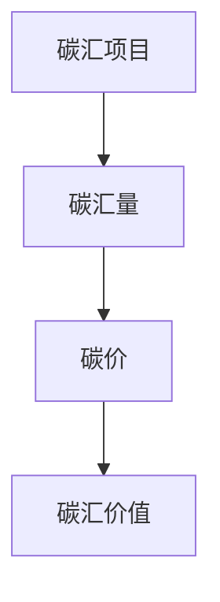
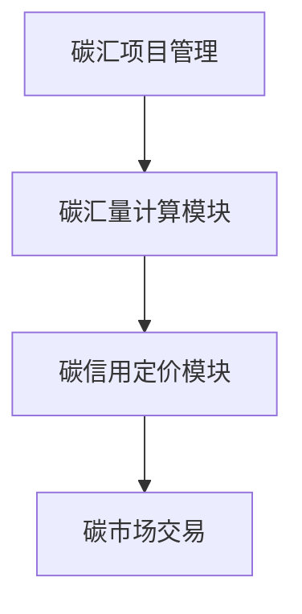
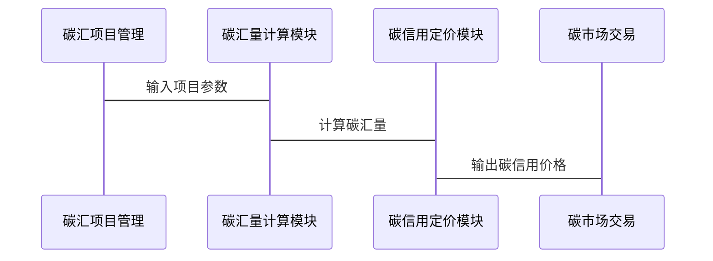

                 


# 森林碳汇项目的投资模式与回报分析

> 关键词：森林碳汇，碳中和，投资模式，回报分析，碳市场，碳信用

> 摘要：本文详细分析了森林碳汇项目的投资模式与回报分析，从碳汇的基本概念、投资模式分类、碳市场运作机制、财务回报模型、风险评估、系统架构设计等方面进行深入探讨。通过实际案例分析和数学模型的建立，为投资者提供了科学的投资决策依据。

---

# 第一部分: 森林碳汇项目的背景与基本概念

# 第1章: 森林碳汇项目的概述

## 1.1 碳汇与碳中和的基本概念

### 1.1.1 碳汇的定义与作用机制
碳汇是指通过植物的光合作用吸收并固定二氧化碳的过程。森林碳汇是利用森林生态系统吸收和储存二氧化碳的能力，减缓气候变化的一种手段。其作用机制包括碳固定、碳储存和碳释放三个阶段。

### 1.1.2 碳中和的目标与全球背景
碳中和是指通过减少温室气体排放和增加碳汇，使净碳排放量为零的目标。全球气候变化问题日益严峻，森林碳汇在实现碳中和目标中扮演着重要角色。

### 1.1.3 森林碳汇在碳中和中的地位
森林碳汇是实现碳中和的重要手段之一，其作用不仅体现在减少碳排放，还包括生态修复、生物多样性保护等方面。

## 1.2 森林碳汇的分类与特点

### 1.2.1 森林碳汇的分类
- **自然林碳汇**：天然森林的碳汇能力较强，但受人为干扰较少。
- **人工林碳汇**：通过人工造林或再造林实现碳汇。
- **混合型碳汇**：结合自然林和人工林的特性，优化碳汇效果。

### 1.2.2 森林碳汇的核心特点
- **可测量性**：碳汇量可以通过科学方法进行精确测量。
- **可核查性**：碳汇项目的碳汇量可以通过第三方机构进行核查和认证。
- **可比较性**：不同碳汇项目的碳汇量可以进行横向比较。

## 1.3 森林碳汇项目的背景与意义

### 1.3.1 全球气候变化的现状
全球气候变化导致极端天气频发，生态系统受到严重威胁。减少碳排放和增加碳汇是应对气候变化的重要措施。

### 1.3.2 森林碳汇项目的全球实践
全球范围内，许多国家和地区已经开始实施森林碳汇项目，如 REDD+（减少排放导致的森林砍伐和森林退化）机制。

### 1.3.3 森林碳汇对可持续发展的贡献
森林碳汇不仅有助于减缓气候变化，还能促进经济发展、保护生物多样性和改善当地居民的生活条件。

## 1.4 本章小结
本章介绍了森林碳汇的基本概念、分类和特点，分析了其在全球气候变化中的重要作用，并探讨了其对可持续发展的贡献。

---

# 第二部分: 森林碳汇项目的核心概念与原理

# 第2章: 森林碳汇的原理与数学模型

## 2.1 碳汇的原理分析

### 2.1.1 碳汇的基本原理
碳汇的核心原理是通过植物的光合作用吸收二氧化碳，将其转化为有机物并储存在生物体和土壤中。

### 2.1.2 森林碳汇的生态机制
森林碳汇的生态机制包括碳固定、碳储存和碳释放三个阶段。通过合理管理和维护森林生态系统，可以最大化碳汇能力。

### 2.1.3 碳汇与碳循环的关系
碳循环是地球生态系统中碳元素流动的重要过程，森林碳汇是其中的关键环节。

## 2.2 碳汇的数学模型与公式

### 2.2.1 碳汇量的计算公式
$$
C = A \times t
$$
其中，\( C \) 为碳汇量，\( A \) 为年碳汇量，\( t \) 为时间（年）。

### 2.2.2 碳汇价值的评估公式
$$
V = C \times P
$$
其中，\( V \) 为碳汇价值，\( C \) 为碳汇量，\( P \) 为碳价。

## 2.3 碳汇的属性特征对比

| 属性 | 可测量性 | 可核查性 | 可比较性 |
|------|----------|----------|----------|
| 描述 | 碳汇量可以通过科学方法精确测量 | 碳汇量可以通过第三方机构核查和认证 | 不同碳汇项目的碳汇量可以进行横向比较 |

## 2.4 碳汇的ER实体关系图



## 2.5 本章小结
本章详细介绍了森林碳汇的原理和数学模型，探讨了碳汇的属性特征，并通过ER实体关系图展示了碳汇的核心要素。

---

# 第三部分: 森林碳汇项目的投资模式分析

# 第3章: 棣林碳汇项目的投资模式

## 3.1 投资模式的分类

### 3.1.1 政府主导型
- **特点**：政策支持、风险可控。
- **优缺点**：资金来源单一，效率较低。

### 3.1.2 企业主导型
- **特点**：资金充足、效率高。
- **优缺点**：政策依赖性强，风险较高。

### 3.1.3 社区参与型
- **特点**：可持续性强、社会影响好。
- **优缺点**：资金不足，实施难度大。

### 3.1.4 国际合作型
- **特点**：资源整合能力强、国际化程度高。
- **优缺点**：协调难度大，成本较高。

## 3.2 各种投资模式的优缺点对比

| 模式类型 | 优点 | 缺点 |
|----------|------|------|
| 政府主导型 | 政策支持、风险可控 | 资金来源单一、效率较低 |
| 企业主导型 | 资金充足、效率高 | 政策依赖性强、风险较高 |
| 社区参与型 | 可持续性强、社会影响好 | 资金不足，实施难度大 |
| 国际合作型 | 整合能力强、国际化程度高 | 协调难度大，成本较高 |

## 3.3 碳市场的运作机制

### 3.3.1 碳市场的基本运作
碳市场是通过买卖碳信用来实现碳排放权交易的市场。碳信用的生成和交易需要经过严格的核查和认证。

### 3.3.2 碳信用的定价机制
碳信用的价格受到多种因素的影响，包括市场需求、供给、政策法规等。通常情况下，碳信用的价格与碳汇项目的规模、地理位置、类型等密切相关。

## 3.4 本章小结
本章分析了森林碳汇项目的四种投资模式，并对其优缺点进行了对比分析。同时，探讨了碳市场的基本运作机制和碳信用的定价机制。

---

# 第四部分: 森林碳汇项目的回报分析

# 第4章: 森林碳汇项目的回报分析

## 4.1 投资回报的核心要素

### 4.1.1 碳信用的价格
碳信用的价格是影响投资回报的重要因素。碳信用的价格越高，投资回报越大。

### 4.1.2 碳汇项目的规模
碳汇项目的规模越大，碳汇量越大，投资回报也越高。

### 4.1.3 项目周期
项目周期的长短直接影响投资回报的计算。长期项目可以带来持续的碳汇收益，但初期投资较大。

## 4.2 财务分析与模型构建

### 4.2.1 净现值（NPV）模型
净现值是评估投资项目 profitability 的重要指标。计算公式为：
$$
NPV = \sum_{t=0}^{n} \frac{CF_t}{(1 + r)^t}
$$
其中，\( CF_t \) 为第 \( t \) 年的现金流，\( r \) 为贴现率，\( n \) 为项目周期。

### 4.2.2 内部收益率（IRR）模型
内部收益率是使净现值为零的贴现率。计算公式为：
$$
NPV = 0
$$

## 4.3 风险评估与应对策略

### 4.3.1 市场风险
碳市场的波动性可能导致碳信用价格下跌，影响投资回报。

### 4.3.2 政策风险
政策的变化可能对碳信用的价格和交易机制产生重大影响。

### 4.3.3 环境风险
自然灾害、病虫害等环境问题可能影响碳汇项目的实施。

## 4.4 本章小结
本章通过财务分析和风险评估，探讨了森林碳汇项目的投资回报核心要素，并构建了净现值和内部收益率模型，为投资者提供了科学的决策依据。

---

# 第五部分: 系统分析与架构设计

# 第5章: 棣林碳汇项目的系统架构设计

## 5.1 系统功能模块设计

### 5.1.1 碳汇量计算模块
- 功能：计算碳汇项目的碳汇量。
- 输入：项目面积、树种类型、年数。
- 输出：碳汇量。

### 5.1.2 碳信用定价模块
- 功能：根据市场供需情况，计算碳信用价格。
- 输入：市场需求、供给、政策因素。
- 输出：碳信用价格。

## 5.2 系统架构设计



## 5.3 系统接口设计
- **输入接口**：项目参数输入、市场数据输入。
- **输出接口**：碳汇量输出、碳信用价格输出。

## 5.4 系统交互流程图



## 5.5 本章小结
本章通过系统功能模块设计、系统架构设计和系统交互流程图，展示了森林碳汇项目的整体架构和运行机制。

---

# 第六部分: 项目实战与案例分析

# 第6章: 棣林碳汇项目的实战分析

## 6.1 项目背景与实施环境

### 6.1.1 项目背景
某地区计划通过实施森林碳汇项目，减少碳排放，实现碳中和目标。

### 6.1.2 实施环境
项目实施区域为热带雨林地区，气候条件适宜，土地资源丰富。

## 6.2 核心代码实现

### 6.2.1 碳汇量计算模块实现
```python
def calculate_carbon_sequestration(area, tree_type, years):
    # 计算碳汇量
    carbon_sequestration = area * tree_type * years
    return carbon_sequestration
```

### 6.2.2 碳信用定价模块实现
```python
def calculate_carbon_credit_price(demand, supply, policy_factors):
    # 计算碳信用价格
    carbon_price = (demand + supply + policy_factors) / 3
    return carbon_price
```

## 6.3 项目实施与结果分析

### 6.3.1 项目实施过程
- 项目规划与设计
- 项目实施与管理
- 项目监测与评估

### 6.3.2 实施结果分析
通过实施森林碳汇项目，项目区域的碳汇量显著增加，碳信用价格稳定，投资回报率较高。

## 6.4 本章小结
本章通过具体案例分析，展示了森林碳汇项目的实施过程和结果分析，为投资者提供了实践参考。

---

# 第七部分: 总结与展望

# 第7章: 总结与展望

## 7.1 本研究的主要成果
- 构建了森林碳汇项目的投资模式与回报分析框架。
- 提出了碳汇量计算和碳信用定价的数学模型。
- 分析了多种投资模式的优缺点和风险因素。

## 7.2 研究的局限性
- 研究范围有限，主要聚焦于森林碳汇项目，其他类型的碳汇项目未涉及。
- 算法和模型的复杂性较高，实际应用中可能需要进一步简化。

## 7.3 未来研究方向
- 探讨其他类型的碳汇项目的投资模式与回报分析。
- 研究碳市场的动态变化及其对投资回报的影响。
- 探索人工智能技术在碳汇项目中的应用。

## 7.4 本章小结
本章总结了本研究的主要成果，分析了研究的局限性，并提出了未来的研究方向。

---

# 作者：AI天才研究院/AI Genius Institute & 禅与计算机程序设计艺术 /Zen And The Art of Computer Programming

