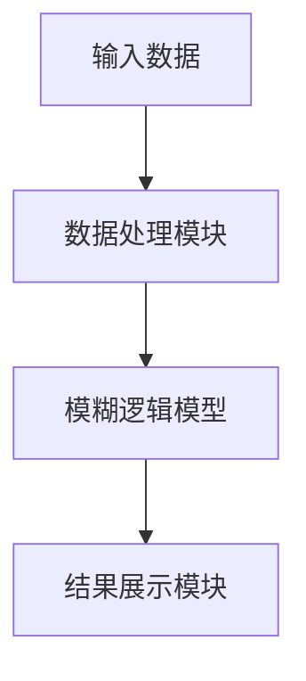

                 


```markdown
# 模糊逻辑在投资决策支持系统中的应用

## 关键词
模糊逻辑, 投资决策, 决策支持系统, 不确定性, 模糊推理

## 摘要
模糊逻辑作为一种处理不确定性问题的有效工具，近年来在投资决策支持系统中的应用越来越广泛。本文详细探讨了模糊逻辑的基本原理及其在投资决策中的应用。通过分析模糊逻辑的核心概念、算法实现、数学模型以及系统架构设计，本文展示了如何利用模糊逻辑来提高投资决策的准确性和效率。文章还通过实际案例分析，进一步验证了模糊逻辑在投资决策中的优势，为投资决策支持系统的开发提供了有价值的参考。

---

## 第1章 模糊逻辑与投资决策支持系统概述

### 1.1 模糊逻辑的基本概念
#### 1.1.1 模糊逻辑的定义
模糊逻辑是一种处理模糊性信息的数学框架，它允许命题的真值在0和1之间取值，从而更贴近人类思维的模糊性和不确定性。

#### 1.1.2 模糊逻辑的特点
- **连续性**：模糊逻辑允许命题的真值在0到1之间连续变化。
- **灵活性**：模糊逻辑能够处理不精确的信息，适用于复杂的投资环境。
- **可解释性**：模糊逻辑规则易于理解和解释，适合实际应用。

#### 1.1.3 模糊逻辑与传统逻辑的区别
| 特性 | 模糊逻辑 | 传统逻辑 |
|------|----------|----------|
| 真值范围 | 0到1之间的连续值 | 0或1的二进制值 |
| 处理方式 | 处理模糊性和不确定性 | 处理确定性问题 |
| 应用场景 | 适合不明确的领域，如投资决策 | 适合明确的领域，如数学计算 |

### 1.2 投资决策支持系统的定义与作用
#### 1.2.1 投资决策支持系统的定义
投资决策支持系统是一种利用计算机技术辅助投资者进行决策的系统，它结合了数据分析、模型构建和专家知识，为投资者提供科学的决策支持。

#### 1.2.2 投资决策支持系统的核心功能
- 数据收集与处理
- 模型构建与分析
- 决策支持与优化
- 结果展示与反馈

#### 1.2.3 模糊逻辑在投资决策中的应用背景
投资决策过程中存在许多不确定性，如市场波动、政策变化等。模糊逻辑能够有效处理这些不确定性，提高决策的准确性和可靠性。

---

## 第2章 模糊逻辑的核心原理

### 2.1 模糊集合与隶属度函数
#### 2.1.1 模糊集合的定义
模糊集合是一种集合，其元素的隶属度（属于该集合的程度）在0到1之间连续变化。

#### 2.1.2 隶属度函数的定义与类型
隶属度函数是用来描述元素属于某个模糊集合的程度的函数。常见的隶属度函数包括：
- **梯形函数**：适用于具有明确边界的情况。
- **三角形函数**：适用于具有线性变化的情况。
- **高斯函数**：适用于具有概率分布的情况。

#### 2.1.3 隶属度函数的计算方法
以梯形函数为例，其计算公式如下：
$$
\mu(x) = 
\begin{cases}
0 & \text{if } x < a \\
\frac{x - a}{b - a} & \text{if } a \leq x \leq b \\
1 & \text{if } b \leq x \leq c \\
\frac{d - x}{d - c} & \text{if } c \leq x \leq d \\
0 & \text{if } x > d
\end{cases}
$$

### 2.2 模糊推理与模糊规则
#### 2.2.1 模糊推理的定义
模糊推理是一种基于模糊逻辑的推理方法，它通过模糊规则和模糊推理算法来推导结论。

#### 2.2.2 模糊规则的表达方式
模糊规则通常表示为“如果前提，那么结论”的形式。例如：
$$
\text{如果市场趋势是上升的，那么投资股票的比例增加。}
$$

#### 2.2.3 模糊推理的过程与算法
1. ** fuzzification**：将输入变量转换为模糊集合。
2. **模糊推理**：根据模糊规则进行推理。
3. ** defuzzification**：将模糊结论转换为清晰的输出。

### 2.3 模糊逻辑的运算与操作
#### 2.3.1 模糊逻辑的基本运算
- 交集（AND）：$A \cap B$
- 并集（OR）：$A \cup B$
- 补集（NOT）：$\neg A$

#### 2.3.2 模糊逻辑的合成规则
模糊逻辑的合成规则通常采用模糊关系的合成，例如：
$$
R(x, y) = \sup_{z} (A(x, z) \times B(z, y))
$$

---

## 第3章 模糊逻辑在投资决策中的应用案例

### 3.1 投资决策支持系统的架构设计
#### 3.1.1 系统功能设计
- 数据输入与处理模块
- 模糊逻辑模型模块
- 决策支持模块
- 结果展示模块

#### 3.1.2 系统架构设计


### 3.2 模糊逻辑在投资组合优化中的应用
#### 3.2.1 投资组合优化的背景
投资组合优化是投资者在不同资产之间分配资金以最大化收益和最小化风险的过程。

#### 3.2.2 模糊逻辑的应用步骤
1. **数据收集**：收集历史市场数据、资产收益率等。
2. **模糊化**：将数据转换为模糊集合。
3. **模糊推理**：根据模糊规则进行推理。
4. **去模糊化**：将模糊结论转换为清晰的输出。

#### 3.2.3 案例分析
假设我们有三个资产A、B、C，我们可以通过模糊逻辑模型推导出最佳的投资组合。

### 3.3 模糊逻辑在风险评估中的应用
#### 3.3.1 风险评估的背景
投资决策中的风险评估是衡量投资组合可能面临的风险程度的过程。

#### 3.3.2 模糊逻辑的应用步骤
1. **数据收集**：收集资产的风险数据。
2. **模糊化**：将风险数据转换为模糊集合。
3. **模糊推理**：根据模糊规则进行推理。
4. **去模糊化**：将模糊结论转换为清晰的输出。

#### 3.3.3 案例分析
假设我们有三个资产A、B、C，我们可以通过模糊逻辑模型推导出每个资产的风险等级。

---

## 第4章 总结与展望

### 4.1 总结
模糊逻辑作为一种处理不确定性的工具，在投资决策支持系统中的应用具有重要的意义。通过模糊逻辑，投资者可以更好地应对市场中的不确定性，提高决策的准确性和效率。

### 4.2 展望
未来，模糊逻辑在投资决策支持系统中的应用将更加广泛和深入。随着技术的进步，模糊逻辑将与其他技术（如机器学习）结合，进一步提升投资决策的智能化水平。

---

## 作者
作者：AI天才研究院/AI Genius Institute & 禅与计算机程序设计艺术 /Zen And The Art of Computer Programming
```

