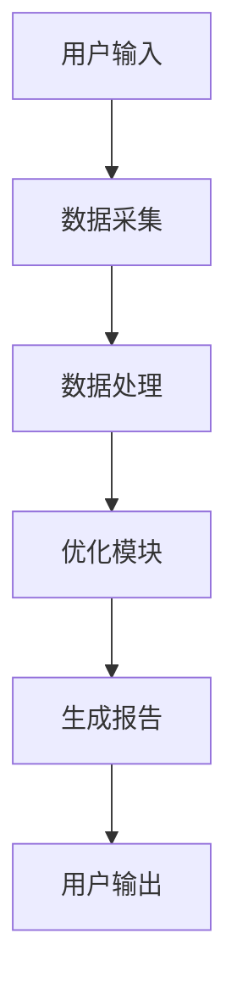

                 


# 每年更新投资组合的重要性

## 关键词：
投资组合管理、年度更新、资产配置、风险管理、现代投资组合理论、系统架构

## 摘要：
投资组合管理是实现财务目标的重要手段，而每年更新投资组合是应对市场变化和投资者需求变化的关键。本文从投资组合管理的基本概念出发，详细探讨了年度更新的必要性，结合数学模型和系统架构，提供了实际操作的指导。通过案例分析和项目实战，进一步验证了每年更新投资组合的重要性和实际应用价值。

---

# 第一部分: 投资组合管理与年度更新的背景

## 第1章: 投资组合管理的基本概念

### 1.1 投资组合的基本定义

#### 1.1.1 投资组合的定义与核心要素
- **定义**：投资组合是指将资金分配到不同资产（如股票、债券、房地产等）上的组合，以实现风险分散和收益最大化。
- **核心要素**：
  - 资产种类：股票、债券、现金等。
  - 资产比例：每种资产在组合中的权重。
  - 投资目标：收益目标、风险承受能力等。

#### 1.1.2 投资组合的目标与分类
- **目标**：
  - 最大化收益。
  - 最小化风险。
  - 实现长期财务目标（如退休、教育基金等）。
- **分类**：
  - 按风险：保守型、稳健型、激进型。
  - 按期限：短期、中期、长期。
  - 按资产类别：股票型、债券型、混合型。

#### 1.1.3 投资组合管理的重要性
- 投资组合管理是实现投资目标的关键。
- 通过科学的配置和调整，可以有效分散风险，提高收益。

### 1.2 投资组合管理的历史与发展

#### 1.2.1 投资组合管理的起源
- 起源于20世纪初，早期的投资管理主要依赖经验判断。
- 1952年，哈里·马科维茨提出了现代投资组合理论（MPT），奠定了投资组合管理的理论基础。

#### 1.2.2 现代投资组合理论的提出
- MPT的核心思想是通过资产配置实现风险分散和收益最大化。
- 强调投资组合的优化和风险与收益的平衡。

#### 1.2.3 投资组合管理的发展趋势
- 数量化投资逐渐兴起。
- 人工智能和大数据技术的应用越来越广泛。
- 可持续投资（ESG）成为新的趋势。

## 第2章: 投资组合年度更新的必要性

### 2.1 市场环境的变化

#### 2.1.1 经济周期的影响
- 经济周期波动会影响资产价格。
- 不同周期下，最优资产配置会有所不同。

#### 2.1.2 市场波动的不确定性
- 市场波动可能导致投资组合偏离预定目标。
- 需要定期调整以适应市场变化。

#### 2.1.3 宏观经济政策的调整
- 货币政策、财政政策的变化会影响市场。
- 投资者需要根据政策变化调整投资组合。

### 2.2 投资者自身需求的变化

#### 2.2.1 资金需求的动态调整
- 不同阶段的资金需求（如结婚、买房）会影响投资策略。
- 需要根据资金需求调整投资组合。

#### 2.2.2 风险承受能力的变化
- 随着年龄增长，风险承受能力可能下降。
- 需要根据个人风险偏好调整资产配置。

#### 2.2.3 投资目标的更新
- 长期目标（如退休计划）可能需要定期调整。
- 短期目标（如旅行基金）也需要及时更新。

### 2.3 资产配置的再平衡

#### 2.3.1 资产配置的再平衡
- 随着市场变化，各资产的权重可能偏离初始配置。
- 需要定期调整，以维持目标资产比例。

#### 2.3.2 再平衡的必要性
- 维持投资组合的风险收益特性。
- 利用市场波动的机会优化收益。

#### 2.3.3 再平衡的常见方法
- 定期调整：按季度或年度调整。
- 买入低配资产，卖出高配资产。

---

# 第二部分: 投资组合管理的核心概念与数学模型

## 第3章: 资产配置与风险分散

### 3.1 资产配置的原理

#### 3.1.1 资产配置的定义
- 资产配置是指将资金分配到不同资产类别中的过程。
- 目标是通过不同资产的组合来优化风险和收益。

#### 3.1.2 资产配置的分类
- 按时间：战略性资产配置、战术性资产配置。
- 按策略：被动型资产配置、主动型资产配置。

#### 3.1.3 资产配置的优劣势对比

| 类别           | 优势                                   | 劣势                                   |
|----------------|--------------------------------------|--------------------------------------|
| 被动型         | 简单易行，成本低                     | 灵活性差，难以应对市场变化             |
| 主动型         | 灵活性高，能及时调整                 | 成本高，需要专业的投资团队             |

### 3.2 风险分散的数学模型

#### 3.2.1 投资组合风险的衡量指标
- 方差：衡量资产收益的波动性。
- 标准差：方差的平方根，是衡量风险的常用指标。

#### 3.2.2 方差与协方差的计算
- 方差公式：
  $$ \sigma^2 = \sum_{i=1}^{n} w_i^2 \sigma_i^2 + 2 \sum_{i=1}^{n} \sum_{j=1}^{n} w_i w_j \sigma_{ij} $$
- 协方差公式：
  $$ \sigma_{ij} = \sum_{k=1}^{m} p_k (r_i^k - \bar{r_i})(r_j^k - \bar{r_j}) $$

#### 3.2.3 现代投资组合理论（MPT）的核心公式
- MPT的目标是通过优化资产配置，使风险最小化，收益最大化。
- 优化公式：
  $$ \min_w \sum_{i=1}^{n} w_i^2 \sigma_i^2 + 2 \sum_{i=1}^{n} \sum_{j=1}^{n} w_i w_j \sigma_{ij} $$
  $$ \text{subject to} \quad \sum_{i=1}^{n} w_i = 1 $$

---

## 第4章: 投资组合优化的数学模型

### 4.1 现代投资组合理论（MPT）概述

#### 4.1.1 MPT的核心假设
- 投资者是理性的，追求收益最大化，厌恶风险。
- 资产收益服从正态分布。
- 市场是有效的，不存在套利机会。

#### 4.1.2 MPT的优化目标
- 在给定风险下，寻找收益最大的组合。
- 在给定收益下，寻找风险最小的组合。

#### 4.1.3 MPT的数学推导
- 通过拉格朗日乘数法求解优化问题。

### 4.2 数学公式与算法实现

#### 4.2.1 均值-方差优化的数学表达
- 优化目标：
  $$ \min_w \sum_{i=1}^{n} w_i^2 \sigma_i^2 + 2 \sum_{i=1}^{n} \sum_{j=1}^{n} w_i w_j \sigma_{ij} $$
  $$ \text{subject to} \quad \sum_{i=1}^{n} w_i = 1 $$

#### 4.2.2 效用函数的构建与应用
- 效用函数：
  $$ U(w) = \mu^T w - \frac{1}{2} w^T \Sigma w $$
- 通过最大化效用函数，找到最优资产配置。

#### 4.2.3 线性规划算法的实现步骤
1. 确定目标函数和约束条件。
2. 选择优化算法（如二次规划）。
3. 求解优化问题。
4. 验证解的合理性。

---

## 第5章: 投资组合管理的系统架构

### 5.1 系统功能设计

#### 5.1.1 投资组合管理系统的功能模块
- 数据采集模块：获取市场数据。
- 优化模块：计算最优资产配置。
- 报告生成模块：输出投资建议。
- 交互模块：用户与系统互动。

#### 5.1.2 用户需求分析
- 用户角色：投资者、财富管理机构。
- 用户需求：个性化投资建议、实时监控。

#### 5.1.3 系统功能流程图


### 5.2 系统架构设计

#### 5.2.1 分层架构设计
- 展示层：用户界面。
- 业务逻辑层：处理用户请求。
- 数据访问层：与数据库交互。

#### 5.2.2 组件间的关系与交互
- 展示层通过API调用业务逻辑层。
- 业务逻辑层通过数据访问层获取数据。

#### 5.2.3 系统架构的可扩展性分析
- 模块化设计，便于功能扩展。
- 支持多种优化算法的接入。

### 5.3 系统接口设计

#### 5.3.1 输入接口设计
- RESTful API：支持JSON格式请求。
- 输入参数：用户信息、财务目标、市场数据。

#### 5.3.2 输出接口设计
- JSON格式输出：投资建议、风险评估。
- 输出内容：资产配置建议、预期收益与风险。

#### 5.3.3 数据交互协议
- 使用HTTP协议进行数据传输。
- 支持HTTPS加密传输。

---

# 第三部分: 投资组合年度更新的实战与案例分析

## 第6章: 投资组合年度更新的实战步骤

### 6.1 环境安装与数据准备

#### 6.1.1 投资组合管理系统的安装
- 安装Python环境。
- 安装相关库（如numpy、pandas、scipy）。

#### 6.1.2 数据来源与数据清洗
- 数据来源：金融数据API（如Yahoo Finance）。
- 数据清洗：处理缺失值、异常值。

#### 6.1.3 数据预处理的常见方法
- 标准化：将数据归一化处理。
- 去噪：去除噪声数据，保留有用信息。

### 6.2 投资组合优化的代码实现

#### 6.2.1 Python代码实现

```python
import numpy as np
import pandas as pd
from scipy.optimize import minimize

# 示例数据：资产收益和协方差矩阵
returns = pd.Series([0.05, 0.03, 0.07], index=['A', 'B', 'C'])
cov_matrix = pd.DataFrame({
    'A': [0.02, 0.01, 0.01],
    'B': [0.01, 0.03, 0.02],
    'C': [0.01, 0.02, 0.04]
})

# 定义优化函数
def portfolio Optimization(weights, returns, cov_matrix):
    return (weights.T @ returns.values) - 0.5 * (weights.T @ cov_matrix.values @ weights)

# 约束条件：权重之和为1
def constraint(weights):
    return sum(weights) - 1

# 初始猜测：等权分配
initial_guess = [1/3, 1/3, 1/3]

# 求解优化问题
result = minimize(portfolio_Optimization, initial_guess, args=(returns, cov_matrix), method='SLSQP', constraints={'type': 'eq', 'fun': constraint})

# 输出结果
print(result)
```

#### 6.2.2 数学模型的代码

```python
# 示例：使用MPT优化资产配置
import numpy as np

def optimize_portfolio(weights, returns, cov_matrix):
    return (weights.T @ returns) - 0.5 * (weights.T @ cov_matrix @ weights)

initial_guess = np.array([1/3, 1/3, 1/3])
result = optimize_portfolio(initial_guess, returns, cov_matrix)
print(result)
```

---

## 第7章: 投资组合年度更新的实际案例分析

### 7.1 案例背景

#### 7.1.1 投资者概况
- 年龄：35岁。
- 收入：年收入100万元。
- 财务目标：5年后购房。

#### 7.1.2 初始投资组合
- 股票：60%。
- 债券：30%。
- 现金：10%。

### 7.2 市场变化与投资组合调整

#### 7.2.1 市场波动
- 股票市场下跌10%。
- 债券收益率上升。

#### 7.2.2 调整后的投资组合
- 股票：50%。
- 债券：40%。
- 现金：10%。

### 7.3 调整后的收益与风险评估

#### 7.3.1 收益评估
- 调整前预期收益：$$ 0.6 \times 7\% + 0.3 \times 3\% + 0.1 \times 2\% = 5.3\% $$
- 调整后预期收益：$$ 0.5 \times 6\% + 0.4 \times 4\% + 0.1 \times 2\% = 4.8\% $$

#### 7.3.2 风险评估
- 调整前标准差：$$ \sqrt{0.6^2 \times 15\% + 0.3^2 \times 10\% + 0.1^2 \times 5\%} = 9.7\% $$
- 调整后标准差：$$ \sqrt{0.5^2 \times 12\% + 0.4^2 \times 8\% + 0.1^2 \times 5\%} = 7.5\% $$

---

## 第8章: 总结与最佳实践

### 8.1 总结

#### 8.1.1 投资组合管理的核心
- 资产配置是关键。
- 定期更新是保障。

#### 8.1.2 年度更新的重要性
- 应对市场变化。
- 适应投资者需求变化。

### 8.2 最佳实践 tips

#### 8.2.1 定期审视投资组合
- 至少每年一次。
- 根据市场和自身情况调整。

#### 8.2.2 选择合适的工具
- 使用专业的投资组合管理系统。
- 借助AI和大数据技术。

#### 8.2.3 风险管理
- 设置止损点。
- 定期评估投资组合的风险。

### 8.3 注意事项

#### 8.3.1 避免过度调整
- 频繁调整会增加交易成本。
- 影响投资组合的稳定性。

#### 8.3.2 考虑税务影响
- 理解不同资产的税务处理。
- 避免不必要的税务负担。

### 8.4 拓展阅读

#### 8.4.1 推荐书籍
- 《投资学》（书籍名称）。
- 《Python金融计算》（书籍名称）。

#### 8.4.2 在线资源
- 金融数据API文档。
- 投资组合管理的开源工具。

---

# 作者：AI天才研究院/AI Genius Institute & 禅与计算机程序设计艺术 /Zen And The Art of Computer Programming

