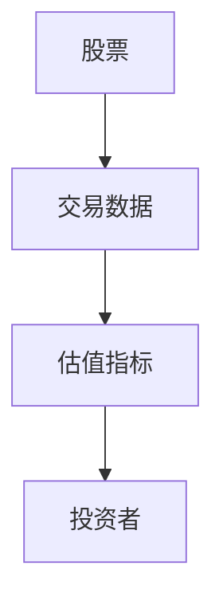
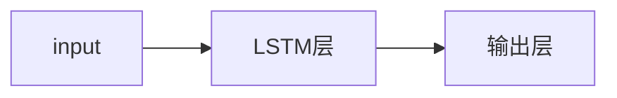
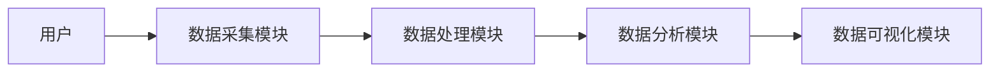
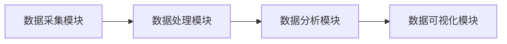
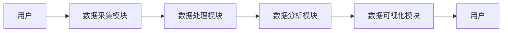

                 


# 每日更新的全球股市估值数据分析

> 关键词：股市估值，数据分析，时间序列，机器学习，LSTM，ARIMA

> 摘要：本文详细探讨了如何每天更新全球股市的估值数据，从数据收集、分析到建模，再到可视化，全面解析技术细节。文章结合理论与实践，通过具体案例分析，展示了如何利用时间序列分析和机器学习算法对股市数据进行建模和预测。

---

# 第一部分：背景介绍

## 第1章：背景介绍

### 1.1 全球股市估值数据分析的重要性

#### 1.1.1 问题背景与数据的重要性

在全球化的今天，股市估值数据的实时性、准确性和全面性对投资者来说至关重要。每天更新的股市估值数据能够帮助投资者及时捕捉市场动态，做出明智的投资决策。股市估值数据不仅包括股票的价格，还包括市盈率（P/E ratio）、市净率（P/B ratio）等关键指标，这些指标能够反映企业的内在价值和市场表现。

#### 1.1.2 数据分析在投资决策中的作用

数据分析是连接数据与投资决策的桥梁。通过对历史数据的分析，投资者可以识别市场趋势、评估风险、发现投资机会。例如，通过分析股票的历史价格数据，可以预测未来的价格走势；通过分析财务报表数据，可以评估企业的盈利能力和成长潜力。

#### 1.1.3 每日更新数据的必要性

股市数据具有高度的动态性，每天的市场波动都会影响股票的估值。因此，每天更新的数据能够捕捉最新的市场变化，为投资者提供及时的参考。例如，某公司发布了一份令人满意的季度报告，这可能导致其股价在第二天上涨，而这一变化只有通过每日更新的数据才能被及时捕捉到。

---

### 1.2 数据特征与挑战

#### 1.2.1 高频数据的特点

股市数据具有高频性，即数据更新的频率非常高。高频数据的特点包括：

1. **实时性**：数据需要实时更新，以反映市场的最新动态。
2. **多样性**：数据来源多样，包括股票价格、交易量、财务报表等。
3. **噪声多**：高频数据中常常包含大量的噪声，如市场波动、突发事件等。
4. **计算复杂性**：高频数据分析需要高效的计算能力和算法支持。

#### 1.2.2 数据清洗与预处理

在分析股市数据之前，通常需要对数据进行清洗和预处理。常见的数据清洗步骤包括：

1. **缺失值处理**：填充缺失值或删除包含缺失值的数据。
2. **异常值处理**：识别并处理异常值，如市场操纵或错误数据。
3. **数据标准化**：对数据进行标准化处理，以消除不同数据量纲的影响。
4. **数据转换**：将数据转换为更适合分析的形式，如对数变换、差分处理等。

#### 1.2.3 数据源的多样性和可靠性

股市数据的来源多种多样，包括：

1. **交易所API**：直接从交易所获取实时数据。
2. **财经网站**：如Yahoo Finance、Google Finance等。
3. **数据供应商**：如 Bloomberg、Reuters 等专业的数据供应商。

选择可靠的数据源是确保数据质量的关键。通常，专业数据供应商的数据更为准确和可靠。

---

### 1.3 本章小结

#### 1.3.1 核心概念总结

- 股市估值数据的实时性、准确性和全面性对投资决策至关重要。
- 数据清洗和预处理是数据分析的基础。
- 高频数据的分析需要高效的算法和计算能力支持。

#### 1.3.2 下一章的预览

在下一章中，我们将详细介绍股市估值数据的核心概念，包括市盈率、市净率等关键指标，并通过对比分析，帮助读者更好地理解这些概念。

---

# 第二部分：核心概念与联系

## 第2章：股市估值数据的核心概念

### 2.1 股市估值的基本原理

#### 2.1.1 市盈率与市净率的计算

市盈率（P/E ratio）是衡量股票价值的重要指标，其计算公式为：

$$ \text{市盈率} = \frac{\text{股票价格}}{\text{每股收益（EPS）}} $$

市净率（P/B ratio）则是另一种常用的估值指标，其计算公式为：

$$ \text{市净率} = \frac{\text{股票价格}}{\text{每股净资产（BPS）}} $$

#### 2.1.2 股票价格与内在价值的关系

股票价格与内在价值之间的关系可以通过以下公式表示：

$$ \text{内在价值} = \text{未来现金流的现值} $$

其中，未来现金流的现值可以通过 discounted cash flow (DCF) 模型进行计算。

---

### 2.2 数据特征对比表格

| 特征         | 描述 |
|--------------|------|
| 数据频率     | 每日更新 |
| 数据类型     | 数值型 |
| 数据来源     | 交易所API、财经网站 |
| 数据维度     | 股票代码、交易时间、开盘价、收盘价、最高价、最低价、成交量 |
| 数据特征     | 高频性、多样性、噪声多 |

---

### 2.3 实体关系图



---

## 第3章：时间序列分析

### 3.1 ARIMA模型

#### 3.1.1 模型原理

ARIMA（Autoregressive Integrated Moving Average）模型是一种常用的时间序列分析模型，其基本结构如下：

$$ ARIMA(p, d, q) $$

其中：

- $p$ 是自回归（AR）的阶数。
- $d$ 是差分（I）的阶数。
- $q$ 是移动平均（MA）的阶数。

---

#### 3.1.2 模型实现

```python
from statsmodels.tsa.arima_model import ARIMA
import pandas as pd

# 假设 train_data 是训练数据
model = ARIMA(train_data, order=(5, 1, 0))
model_fit = model.fit()
```

---

## 第4章：机器学习模型

### 4.1 LSTM网络

#### 4.1.1 模型结构

LSTM（长短期记忆网络）是一种特殊的RNN（循环神经网络），其结构如下：



---

#### 4.1.2 模型实现

```python
import tensorflow as tf
from tensorflow.keras.layers import LSTM, Dense

model = tf.keras.Sequential()
model.add(LSTM(64, input_shape=(timesteps, features)))
model.add(Dense(1))
model.compile(optimizer='adam', loss='mse')
```

---

# 第三部分：系统分析与架构设计

## 第5章：系统架构设计

### 5.1 数据采集模块

#### 5.1.1 数据采集场景



---

### 5.2 数据处理模块

#### 5.2.1 数据清洗与预处理

```python
import pandas as pd

# 假设 data 是原始数据
data = pd.DataFrame({
    '日期': ['2023-01-01', '2023-01-02', '2023-01-03'],
    '收盘价': [100, 102, 98]
})

# 数据清洗
data = data.dropna()
data['收盘价'] = data['收盘价'].astype(float)
```

---

## 第6章：项目实战

### 6.1 环境安装

#### 6.1.1 安装依赖

```bash
pip install pandas numpy scikit-learn tensorflow
```

---

### 6.2 系统核心实现源代码

#### 6.2.1 数据采集

```python
import requests

def get_stock_data(symbol):
    url = f"https://api.example.com/stock/{symbol}"
    response = requests.get(url)
    data = response.json()
    return data
```

---

### 6.3 代码应用解读与分析

#### 6.3.1 代码功能分析

上述代码通过API获取股票数据，并将其转换为结构化的数据格式，以便后续分析。

---

## 第7章：数学模型和公式

### 7.1 时间序列模型公式

$$ ARIMA(p, d, q) $$

其中：

- $p$ 是自回归阶数。
- $d$ 是差分阶数。
- $q$ 是移动平均阶数。

---

## 第8章：系统架构设计

### 8.1 系统架构图



---

## 第9章：系统交互设计

### 9.1 系统交互序列图



---

## 第10章：最佳实践

### 10.1 数据源选择

选择可靠的数据源是确保数据质量的关键。建议优先选择专业的数据供应商，如Bloomberg、Reuters等。

---

### 10.2 性能优化

为了提高系统的性能，可以考虑以下优化措施：

1. **数据预处理**：在数据采集阶段进行初步清洗和预处理，减少后续处理的负担。
2. **分布式计算**：利用分布式计算框架（如Hadoop、Spark）处理大规模数据。
3. **缓存机制**：使用缓存技术减少重复计算，提高系统响应速度。

---

## 第11章：小结

### 11.1 注意事项

在实际应用中，需要注意以下几点：

1. **数据安全**：确保数据的安全性，防止数据泄露。
2. **模型调优**：根据实际需求对模型进行调优，以提高预测精度。
3. **持续学习**：市场环境不断变化，需要持续更新模型和数据。

---

## 第12章：拓展阅读

### 12.1 推荐书籍

1. 《Python机器学习实战》
2. 《时间序列分析：Forecasting and Control》

---

## 作者

作者：AI天才研究院/AI Genius Institute & 禅与计算机程序设计艺术 /Zen And The Art of Computer Programming

---

以上是《每日更新的全球股市估值数据分析》的技术博客文章大纲。希望对您有所帮助！

