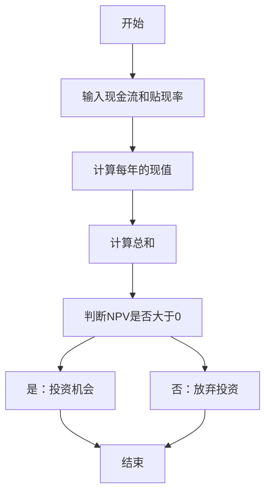
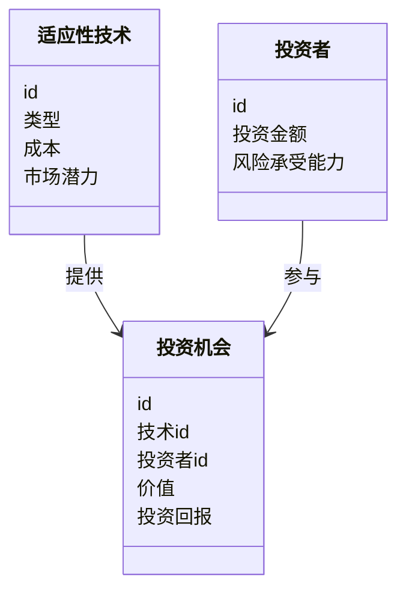

                 


---

# 气候变化适应性技术的投资机会识别

## 关键词：气候变化，适应性技术，投资机会，数学模型，算法原理，系统架构

## 摘要：  
气候变化适应性技术是应对全球气候变化的关键手段之一，而识别这些技术的投资机会则是实现可持续发展的关键。本文通过系统分析气候变化适应性技术的核心概念、数学模型、算法原理以及实际案例，帮助投资者识别和评估气候变化适应性技术的投资价值。文章从背景介绍、核心概念、技术分析、投资策略等多个维度展开，为读者提供全面的指导。

---

# 第一部分：气候变化适应性技术的背景与核心概念

## 第1章：气候变化与适应性技术概述

### 1.1 气候变化的现状与影响  
气候变化是21世纪人类面临的最严峻挑战之一。根据联合国政府间气候变化专门委员会（IPCC）的报告，全球气温上升的速度远超自然变化的节奏，这导致极端天气事件频发，生态系统受到破坏，以及海平面上升等问题。这些问题对全球经济和社会稳定构成了严重威胁。  
适应性技术在应对气候变化中扮演着关键角色。它不仅能够减少气候变化的负面影响，还能够为相关产业带来新的发展机遇。

### 1.2 适应性技术的定义与分类  
适应性技术是指能够帮助人类和生态系统适应气候变化带来的物理、生物和社会影响的技术。这些技术可以分为几大类：  
- **减排技术**：减少温室气体排放，如可再生能源技术、碳捕获与封存等。  
- **生态修复技术**：通过植树造林、湿地保护等手段增强生态系统的韧性。  
- **基础设施适应技术**：如防洪工程、干旱地区水资源管理技术等。  
- **农业适应技术**：培育耐旱、抗病虫害的作物品种，提高农业生产的稳定性。  

### 1.3 投资机会识别的背景与意义  
随着气候变化问题的加剧，适应性技术的投资价值日益凸显。政府、企业和个人都在寻求通过投资适应性技术来降低风险、抓住机遇。例如，投资于可再生能源技术不仅可以减少碳排放，还能带来可观的经济回报。  

---

## 第2章：气候变化适应性技术的核心概念与联系  

### 2.1 核心概念原理  
适应性技术的核心在于通过技术创新和系统优化，增强社会和生态系统的抗灾能力。例如，智能农业技术可以通过实时监测和数据分析，帮助农民更好地应对气候变化带来的挑战。  

### 2.2 核心概念属性特征对比表格  
以下是几种常见适应性技术的核心属性对比：

| 技术类型          | 投资周期 | 技术成熟度 | 市场潜力 |
|-------------------|----------|------------|----------|
| 可再生能源       | 中长期   | 较高        | 高        |
| 智慧城市技术     | 长期     | 中等        | 高        |
| 生态修复技术     | 中长期   | 较低        | 中等      |
| 水资源管理技术   | 中期     | 较高        | 中等      |

### 2.3 ER实体关系图架构  
以下是适应性技术与投资机会的实体关系图：  

```mermaid
erDiagram
    adapterTechnology++{ 
        id
        type
        cost
        marketPotential
        riskLevel
    }
    investor++{ 
        id
        investmentAmount
        returnPeriod
        riskTolerance
    }
    opportunity++{ 
        id
        technologyId
        investorId
        value
        potentialReturn
    }
    adapterTechnology --> opportunity : 提供
    investor --> opportunity : 参与
```

---

## 第3章：气候变化适应性技术的数学模型与算法原理  

### 3.1 数学模型与公式  
为了评估适应性技术的投资价值，我们可以使用净现值（Net Present Value，NPV）模型。NPV的计算公式如下：  

$$ NPV = \sum_{t=1}^{n} \frac{CF_t}{(1 + r)^t} $$  

其中，\( CF_t \) 是第 \( t \) 年的现金流，\( r \) 是贴现率，\( n \) 是项目的生命周期。  

### 3.2 算法原理讲解  
以下是使用NPV模型进行投资机会识别的算法流程图：  



### 3.3 项目实战  
以可再生能源项目为例，假设项目的初始投资为1000万元，年现金流分别为300万、400万、500万，贴现率为8%。计算其NPV：  

$$ NPV = \frac{300}{1.08} + \frac{400}{(1.08)^2} + \frac{500}{(1.08)^3} - 1000 $$  

计算结果为正，说明该项目具有投资价值。

---

## 第4章：系统分析与架构设计  

### 4.1 问题场景介绍  
我们需要构建一个系统，用于评估不同适应性技术的投资价值。  

### 4.2 系统功能设计  
以下是系统的领域模型图：  



### 4.3 系统架构设计  
以下是系统的架构图：  


---

## 第5章：项目实战与案例分析  

### 5.1 案例分析：智能农业技术  
假设我们投资于一种智能农业技术，该技术可以通过传感器和数据分析帮助农民优化水资源使用。经过评估，该项目的NPV为正，具有较高的投资价值。  

### 5.2 实际应用解读  
通过上述案例，我们可以看到，智能农业技术不仅有助于应对气候变化，还能提高农业生产效率，具有显著的经济和社会效益。

---

## 第6章：结论与展望  

### 6.1 最佳实践 tips  
- 投资者应关注技术的成熟度和市场潜力。  
- 在评估时，需综合考虑技术、经济和社会因素。  

### 6.2 小结  
气候变化适应性技术的投资机会识别是一个复杂但极具潜力的过程。通过系统分析和实际案例，我们可以更好地识别和投资于这些技术，为应对气候变化和实现可持续发展做出贡献。  

### 6.3 注意事项  
- 风险分析是投资决策的重要部分。  
- 政策支持和技术进步是影响投资价值的关键因素。  

### 6.4 拓展阅读  
建议读者进一步阅读《气候变化经济学》和《可持续投资指南》等相关书籍，以深入了解气候变化适应性技术的投资策略。

---

# 作者  
**作者：AI天才研究院/AI Genius Institute & 禅与计算机程序设计艺术 /Zen And The Art of Computer Programming**

---

以上就是《气候变化适应性技术的投资机会识别》的技术博客文章大纲和内容。通过系统分析和实际案例，本文为读者提供了识别和评估气候变化适应性技术投资机会的全面指导。

