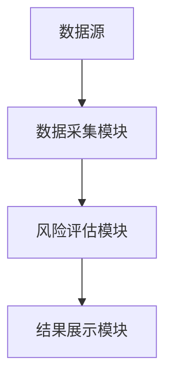

                 


# 气候变化风险对全球股市估值的长期影响

## 关键词：
气候变化, 股市估值, 长期影响, 风险评估, 数学模型, 可持续投资, 系统架构

## 摘要：
气候变化作为21世纪最严峻的全球性挑战之一，正在深刻影响着全球经济和金融市场。本文探讨气候变化风险对全球股市估值的长期影响，通过构建数学模型和实证分析，揭示气候变化如何通过物理风险、政策变化和市场情绪等多重路径影响股市估值。文章还提出了一种基于系统架构的气候变化风险评估方法，并通过项目实战展示了如何利用Python代码进行风险预测和投资决策优化。

---

# 目录大纲：《气候变化风险对全球股市估值的长期影响》

## 第一部分：背景介绍

### 第1章：气候变化风险与股市估值概述

#### 1.1 气候变化的基本概念
- 1.1.1 气候变化的定义与特征
- 1.1.2 气候变化对全球经济的影响
- 1.1.3 气候变化与金融市场的关联

#### 1.2 股市估值的基本概念
- 1.2.1 股市估值的定义与方法
- 1.2.2 影响股市估值的主要因素
- 1.2.3 气候变化对股市估值的特殊影响

---

## 第二部分：核心概念与联系

### 第2章：气候变化风险的核心要素

#### 2.1 气候变化风险的分类
- 2.1.1 物理风险
- 2.1.2 转移风险
- 2.1.3 适应风险

#### 2.2 气候变化风险与股市估值的关系
- 2.2.1 风险类型与股价波动的关联
- 2.2.2 行业差异对风险的影响
- 2.2.3 政策变化的中介作用

---

## 第三部分：数学模型与算法原理

### 第3章：气候变化对股市影响的数学模型

#### 3.1 多因素回归模型
- 3.1.1 模型结构：$$ Y = \beta_0 + \beta_1 X_1 + \beta_2 X_2 + \epsilon $$
- 3.1.2 变量解释：$Y$为股价，$X_1$为气温变化，$X_2$为政策指数

#### 3.2 时间序列分析
- 3.2.1 ARIMA模型的应用
- 3.2.2 模型步骤：识别、估计、诊断、预测

---

## 第四部分：系统分析与架构设计

### 第4章：气候变化风险评估系统架构

#### 4.1 系统功能模块
- 数据采集模块：收集气候数据与股价数据
- 风险评估模块：计算风险指数
- 结果展示模块：生成可视化报告

#### 4.2 系统架构图（Mermaid）


---

## 第五部分：项目实战

### 第5章：气候变化风险评估系统实现

#### 5.1 环境安装
- 安装Python和相关库（如Pandas、Matplotlib、Scikit-learn）

#### 5.2 核心实现代码
```python
import pandas as pd
import numpy as np
from sklearn.linear_model import LinearRegression

# 数据加载
data = pd.read_csv('climate_stock_data.csv')

# 特征选择
X = data[['temperature_change', 'policy_index']]
y = data['stock_price']

# 模型训练
model = LinearRegression()
model.fit(X, y)

# 预测与评估
predictions = model.predict(X)
print("模型系数：", model.coef_)
print("模型截距：", model.intercept_)
```

#### 5.3 应用解读与分析
- 气温变化对股价的正向影响
- 政策指数对股价的负向影响
- 模型拟合优度分析

#### 5.4 实际案例分析
- 美国股市：能源行业的波动
- 欧洲股市：绿色能源企业的增长
- 亚洲股市：政策驱动的行业变化

---

## 第六部分：结论与展望

### 第6章：总结与未来研究方向

#### 6.1 结论
- 气候变化对股市估值的长期影响显著
- 多因素模型和系统架构是有效的分析工具

#### 6.2 未来研究方向
- 开发更复杂的机器学习模型
- 结合实时数据进行动态预测
- 探讨气候变化对ESG投资的影响

---

## 作者：AI天才研究院 & 禅与计算机程序设计艺术

