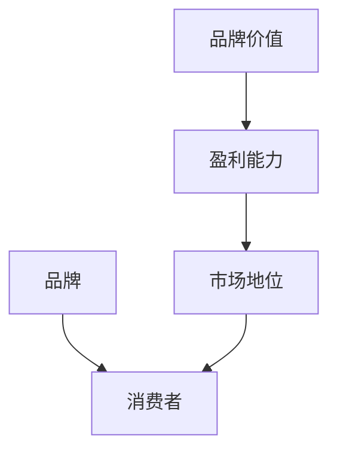
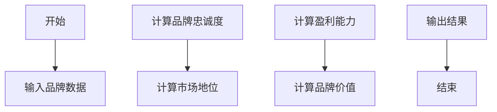
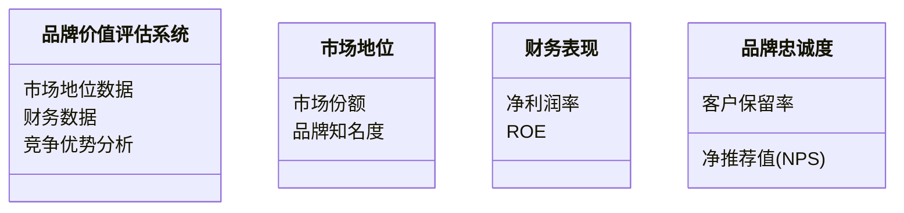
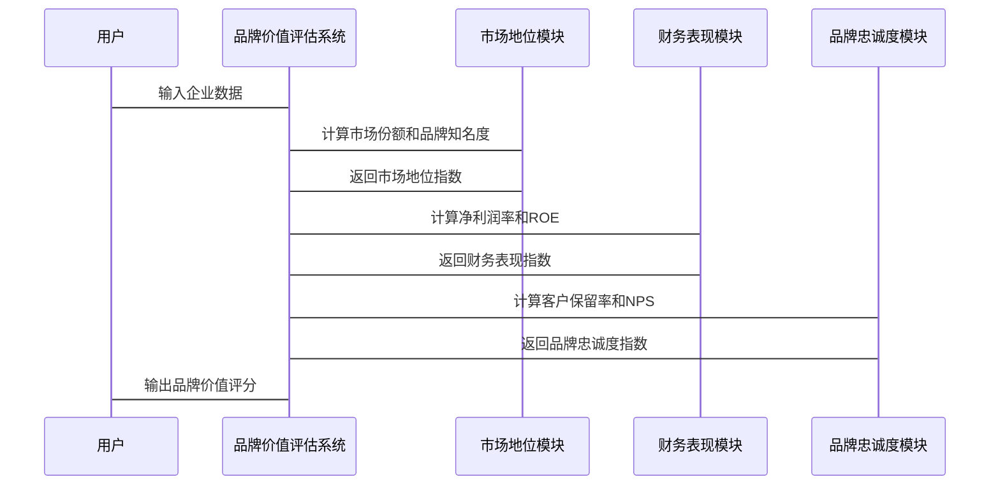

                 


# 沃伦·巴菲特的品牌价值评估方法

## 关键词：
- 巴菲特
- 品牌价值
- 投资评估
- 财务分析
- 价值投资

## 摘要：
沃伦·巴菲特是全球最著名的价值投资者之一，他以其独特的品牌价值评估方法闻名。本文将详细分析巴菲特的品牌价值评估方法，从核心概念到实际应用，帮助读者理解如何通过品牌忠诚度、市场地位和盈利能力来评估企业的长期价值。

---

# 第1章: 背景介绍

## 1.1 问题背景
### 1.1.1 品牌价值评估的重要性
在现代商业环境中，品牌不仅是企业的产品或服务的标识，更是企业长期竞争优势的核心。品牌价值直接关系到企业的市场地位、客户忠诚度和盈利能力。因此，准确评估品牌价值是投资者做出明智决策的关键。

### 1.1.2 沃伦·巴菲特投资哲学的核心理念
巴菲特的投资哲学基于“价值投资”，即寻找具有持续竞争优势的企业，而非短期市场波动。他认为，企业的品牌价值是其长期盈利能力的重要组成部分。

### 1.1.3 品牌价值评估在投资决策中的作用
品牌价值评估能够帮助投资者识别具有强大市场地位和客户忠诚度的企业，从而做出更明智的投资决策。

## 1.2 问题描述
### 1.2.1 品牌价值的定义与外延
品牌价值是指品牌为企业带来的超额收益能力，包括品牌知名度、品牌忠诚度和品牌影响力等因素。

### 1.2.2 品牌价值评估的主要挑战
品牌价值评估的复杂性在于如何量化品牌忠诚度和市场地位，同时考虑企业的财务表现和行业竞争环境。

### 1.2.3 品牌价值与企业长期盈利能力的关系
品牌价值是企业长期盈利能力的重要驱动因素，强大的品牌能够为企业带来更高的市场份额和客户忠诚度。

## 1.3 问题解决
### 1.3.1 品牌价值评估的主要方法
常用的品牌价值评估方法包括基于财务指标的评估、基于市场地位的评估和基于客户忠诚度的评估。

### 1.3.2 巴菲特品牌价值评估的独特视角
巴菲特的独特视角在于将品牌价值与企业的财务表现和竞争优势相结合，重点关注企业的护城河（competitive moat）。

### 1.3.3 从短期收益到长期价值的平衡
巴菲特强调在投资中平衡短期收益和长期价值，品牌价值评估是实现这种平衡的重要工具。

## 1.4 边界与外延
### 1.4.1 品牌价值评估的适用范围
品牌价值评估适用于所有行业，但特别适用于具有强大品牌影响力的消费品行业和服务业。

### 1.4.2 与其他投资评估方法的对比
与基于市盈率或市净率的传统估值方法相比，品牌价值评估更关注企业的长期竞争优势。

### 1.4.3 品牌价值评估的局限性
品牌价值评估的局限性在于难以量化品牌忠诚度和市场地位，且受行业和企业规模的影响较大。

## 1.5 概念结构与核心要素
### 1.5.1 品牌价值的核心要素分析
品牌价值的核心要素包括品牌忠诚度、市场地位、盈利能力、竞争优势和品牌影响力。

### 1.5.2 巴菲特品牌价值评估模型的框架
巴菲特的品牌价值评估模型包括以下几个步骤：
1. 评估企业的市场地位和竞争优势。
2. 分析企业的财务表现和盈利能力。
3. 考虑企业的品牌忠诚度和客户生命周期价值。
4. 结合行业趋势和宏观经济环境进行综合评估。

### 1.5.3 核心要素之间的关系与影响
市场地位和竞争优势直接影响品牌忠诚度和盈利能力，而品牌忠诚度和盈利能力又反过来影响企业的长期价值。

---

# 第2章: 核心概念与联系

## 2.1 核心概念原理
### 2.1.1 巴菲特品牌价值评估的三大支柱
1. 市场地位：企业的市场占有率和品牌知名度。
2. 竞争优势：企业的护城河，包括成本优势、专利、品牌忠诚度等。
3. 盈利能力：企业的财务表现，包括净利润率和ROE（净资产收益率）。

### 2.1.2 品牌忠诚度与市场地位的关系
品牌忠诚度高意味着企业具有更强的市场地位和客户保留能力，从而能够获得更高的市场份额和长期盈利能力。

### 2.1.3 企业盈利能力与品牌价值的关联
企业的盈利能力是品牌价值的重要体现，强大的品牌能够为企业带来更高的利润率和市场份额。

## 2.2 核心概念属性特征对比
### 2.2.1 品牌知名度与市场占有率对比
品牌知名度高通常意味着市场占有率较高，但市场占有率还受到价格、渠道和竞争环境的影响。

### 2.2.2 品牌忠诚度与客户生命周期价值对比
品牌忠诚度高的客户通常具有更高的客户生命周期价值，能够为企业带来更多的收入和利润。

### 2.2.3 企业盈利能力与品牌溢价能力对比
盈利能力强的企业通常具有更强的品牌溢价能力，能够通过品牌溢价获得更高的利润。

## 2.3 ER实体关系图


---

# 第3章: 算法原理讲解

## 3.1 巴菲特品牌价值评估算法
### 3.1.1 算法概述
巴菲特的品牌价值评估算法基于企业的市场地位、竞争优势和盈利能力，通过量化这些因素来评估企业的品牌价值。

### 3.1.2 算法输入与输出
输入：企业的市场地位数据、财务数据（如净利润率、ROE）和竞争优势分析。
输出：企业的品牌价值评分和长期盈利能力预测。

### 3.1.3 算法流程图


## 3.2 算法实现
### 3.2.1 品牌忠诚度计算
品牌忠诚度可以通过客户保留率和净推荐值（NPS）来衡量。

### 3.2.2 市场地位评估
市场地位评估包括市场份额和品牌知名度的分析。

### 3.2.3 盈利能力分析
盈利能力分析包括净利润率和ROE的计算。

---

## 3.3 数学模型与公式
### 3.3.1 净资产收益率（ROE）
$$ROE = \frac{\text{净利润}}{\text{股东权益}}$$
ROE是衡量企业盈利能力的重要指标，巴菲特通常寻找ROE超过15%的企业。

### 3.3.2 市场地位指数
$$\text{市场地位指数} = (\text{市场份额} \times 1.5) + (\text{品牌知名度} \times 0.5)$$

### 3.3.3 品牌价值评分
$$\text{品牌价值评分} = (\text{市场地位指数} \times 0.4) + (\text{ROE} \times 0.3) + (\text{品牌忠诚度} \times 0.3)$$

---

# 第4章: 系统分析与架构设计

## 4.1 系统功能设计
### 4.1.1 领域模型


### 4.1.2 系统架构设计
```mermaid
graph TD
A[品牌价值评估系统] --> B[市场地位模块]
B --> C[市场份额]
B --> D[品牌知名度]
A --> E[财务表现模块]
E --> F[净利润率]
E --> G[ROE]
A --> H[品牌忠诚度模块]
H --> I[客户保留率]
H --> J[净推荐值(NPS)]
```

### 4.1.3 系统接口设计
- 输入接口：接受企业的市场地位数据、财务数据和竞争优势分析。
- 输出接口：提供品牌价值评分和长期盈利能力预测。

### 4.1.4 系统交互设计


---

# 第5章: 项目实战

## 5.1 环境安装
为了进行品牌价值评估，您需要以下工具：
- 数据分析工具：Excel或Python（如Pandas、NumPy）。
- 统计分析工具：SPSS或R。

## 5.2 系统核心实现源代码
以下是一个简单的Python脚本，用于计算企业的ROE和市场地位指数：

```python
import pandas as pd

# 输入数据
data = {
    '企业名称': ['可口可乐', '百事可乐', '펩si'],
    '净利润': [5000, 4000, 3000],
    '股东权益': [20000, 15000, 10000],
    '市场份额': [50, 30, 20],
    '品牌知名度': [80, 70, 60]
}

df = pd.DataFrame(data)

# 计算ROE
df['ROE'] = df['净利润'] / df['股东权益'] * 100

# 计算市场地位指数
df['市场地位指数'] = (df['市场份额'] * 1.5) + (df['品牌知名度'] * 0.5)

print(df)
```

## 5.3 代码应用解读与分析
上述代码展示了如何将企业的财务数据和市场地位数据结合起来，计算ROE和市场地位指数。通过这些指标，我们可以评估企业的品牌价值。

## 5.4 实际案例分析
以可口可乐为例，假设其净利润为5000万美元，股东权益为2亿美元，市场份额为50%，品牌知名度为80%。根据上述代码，其ROE为25%，市场地位指数为(50*1.5) + (80*0.5) = 75 + 40 = 115。

## 5.5 项目小结
通过实际案例分析，我们可以看到，可口可乐的高市场份额和品牌知名度使其具有强大的品牌价值，同时其高ROE也表明其盈利能力强。

---

# 第6章: 总结与最佳实践

## 6.1 总结
沃伦·巴菲特的品牌价值评估方法结合了企业的市场地位、竞争优势和盈利能力，是一种全面评估品牌价值的有效方法。

## 6.2 最佳实践 tips
1. 在投资前，仔细研究企业的市场地位和竞争优势。
2. 结合财务指标（如ROE）和品牌指标（如市场地位指数）进行综合评估。
3. 长期关注企业的品牌忠诚度和客户生命周期价值。

## 6.3 小结
品牌价值评估是投资决策中的重要环节，巴菲特的方法为我们提供了一种系统化的评估工具，帮助我们识别具有长期竞争优势的企业。

## 6.4 注意事项
- 品牌价值评估需要结合具体行业和企业特点。
- 避免仅依赖单一指标进行评估。

## 6.5 拓展阅读
- 巴菲特的《投资之道》
- 品牌价值评估的其他方法，如Interbrand品牌价值评估模型。

---

# 作者：AI天才研究院 & 禅与计算机程序设计艺术

