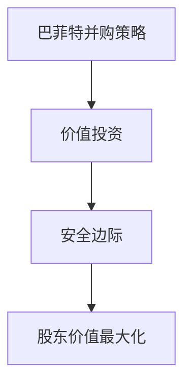
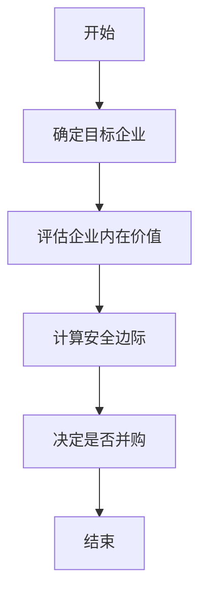
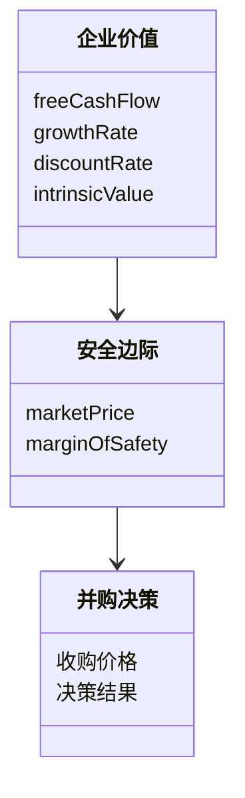

                 


# 沃伦巴菲特的并购策略分析

## 关键词：
沃伦巴菲特，并购策略，价值投资，安全边际，投资哲学，企业分析，股东价值

## 摘要：
本文深入分析了沃伦·巴菲特的并购策略，从其投资哲学到具体操作方法，结合实际案例，揭示其成功的秘诀。通过详细讲解价值投资、安全边际、股东价值最大化等核心概念，帮助读者理解巴菲特的并购逻辑，并提供实际应用的指导。

---

# 第1章: 背景介绍与核心概念

## 1.1 并购的基本概念与行业背景
### 1.1.1 并购的定义与分类
- **并购（Mergers and Acquisitions, M&A）**：企业之间的合并或收购，旨在优化资源配置、扩大规模或进入新市场。
- **分类**：分为股权收购和杠杆收购，股权收购更符合巴菲特的价值投资理念。

### 1.1.2 并购的动机与目的
- **动机**：寻求增长、获取技术、进入新市场或优化资产组合。
- **目的**：通过并购实现股东价值最大化，而非单纯的规模扩张。

### 1.1.3 巴菲特投资哲学的起源与演变
- 巴菲特的投资理念起源于格雷厄姆的价值投资理论，逐步发展为注重企业内在价值和长期持有的策略。

## 1.2 巴菲特并购策略的核心要素
### 1.2.1 价值投资理念的提出
- **内在价值**：企业未来现金流的现值，低于市场价格时，企业具有投资价值。
- **市场先生**：巴菲特将市场波动视为机会，而非风险。

### 1.2.2 安全边际的概念与应用
- **安全边际**：买入价格低于内在价值，以降低投资风险。
- **案例**：巴菲特在购买可口可乐时，确保价格低于其内在价值，以确保安全边际。

### 1.2.3 股东价值最大化的目标
- 通过并购实现股东价值最大化，而非追求短期利润。

## 1.3 巴菲特并购策略的核心问题与边界
### 1.3.1 并购中的信息不对称问题
- 通过深入研究和长期关注目标企业，减少信息不对称带来的风险。

### 1.3.2 股权收购与杠杆收购的边界
- 巴菲特倾向于股权收购，避免杠杆收购带来的财务风险。

### 1.3.3 并购中的道德与法律边界
- 遵守法律和道德规范，确保并购活动的合法性。

## 1.4 巴菲特并购策略的概念结构与核心要素
### 1.4.1 价值评估模型
- 使用DCF模型评估企业内在价值，确保投资决策的科学性。

### 1.4.2 股权定价方法
- 通过对比市场价格与内在价值，确定合理的价格区间。

### 1.4.3 安全边际的计算与应用
- 计算安全边际，确保投资决策的稳健性。

---

# 第2章: 巴菲特并购策略的核心概念与联系

## 2.1 核心概念原理
### 2.1.1 价值投资的核心原理
- 买入低于内在价值的企业，长期持有，等待市场回归。

### 2.1.2 安全边际的数学模型
- 内在价值公式：$V = \frac{CF}{r - g}$
- 安全边际公式：$\text{安全边际} = V - P$

### 2.1.3 股东价值最大化的实现路径
- 通过并购优质企业，实现股东价值的最大化。

## 2.2 核心概念属性特征对比表
| 概念       | 定义                         | 特点                       |
|------------|------------------------------|-----------------------------|
| 价值投资   | 买入低于内在价值的股票     | 长期持有，注重安全边际     |
| 安全边际   | 购买价格低于内在价值         | 降低投资风险               |
| 股东价值最大化 | 并购优质企业，实现股东利益最大化 | 追求长期稳健回报           |

## 2.3 实体关系图（Mermaid流程图）


---

# 第3章: 巴菲特并购策略的算法原理

## 3.1 算法原理流程图（Mermaid）


## 3.2 算法数学模型与公式
### 内在价值公式
$$ V = \frac{CF}{r - g} $$

### 安全边际公式
$$ \text{安全边际} = V - P $$

### 示例计算
假设某企业的自由现金流为$100，折现率为10%，增长率5%，则内在价值为：
$$ V = \frac{100}{0.1 - 0.05} = 2000 $$
如果市场价格为$1800，则安全边际为：
$$ \text{安全边际} = 2000 - 1800 = 200 $$

## 3.3 算法实现代码示例
```python
def calculate_intrinsic_value(CF, r, g):
    return CF / (r - g)

def calculate_margin_of_safety(V, P):
    return V - P

# 示例计算
CF = 100
r = 0.1
g = 0.05
V = calculate_intrinsic_value(CF, r, g)
P = 1800
margin = calculate_margin_of_safety(V, P)
print(f"内在价值: {V:.2f}")
print(f"安全边际: {margin:.2f}")
```

---

# 第4章: 巴菲特并购策略的实际案例分析

## 4.1 可口可乐案例分析
### 4.1.1 背景介绍
- 巴菲特于1988年买入可口可乐，长期持有。
- 选择可口可乐的原因：稳定的现金流、强大的竞争优势、合理的估值。

### 4.1.2 案例分析与启示
- 可口可乐的内在价值远高于市场价格，具备较大的安全边际。
- 巴菲特的长期持有策略体现了其价值投资理念。

---

# 第5章: 巴菲特并购策略的系统分析与架构设计方案

## 5.1 系统分析与架构设计
### 5.1.1 领域模型（Mermaid类图）


### 5.1.2 系统架构设计（Mermaid架构图）
```mermaid
container 投资决策系统 {
    巴菲特并购策略
    价值评估模块
    安全边际计算模块
    决策模块
}
```

### 5.1.3 系统接口设计
- 输入：企业财务数据、市场价
- 输出：内在价值、安全边际、并购建议

### 5.1.4 系统交互（Mermaid序列图）
```mermaid
sequenceDiagram
    投资者->价值评估模块: 提供企业数据
    价值评估模块->计算内在价值
    投资者->安全边际计算模块: 提供市场价
    安全边际计算模块->计算安全边际
    投资者->决策模块: 获取并购建议
```

---

# 第6章: 巴菲特并购策略的项目实战

## 6.1 项目实战
### 6.1.1 环境安装
- 需要Python和相关库（如numpy、pandas）

### 6.1.2 核心实现源代码
```python
import numpy as np
import pandas as pd

def calculate_intrinsic_value(CF, r, g):
    return CF / (r - g)

def calculate_margin_of_safety(V, P):
    return V - P

# 数据加载
data = pd.DataFrame({
    '企业名称': ['可口可乐', 'IBM'],
    '自由现金流': [100, 150],
    '折现率': [0.1, 0.1],
    '增长率': [0.05, 0.03]
})

# 计算内在价值
data['内在价值'] = data.apply(lambda x: calculate_intrinsic_value(x['自由现金流'], x['折现率'], x['增长率']), axis=1)
data['市场价格'] = [1800, 1500]
data['安全边际'] = data.apply(lambda x: calculate_margin_of_safety(x['内在价值'], x['市场价格']), axis=1)

print(data)
```

### 6.1.3 代码应用解读
- 使用Pandas处理企业数据，计算内在价值和安全边际，帮助投资者做出并购决策。

### 6.1.4 实际案例分析
- 分析可口可乐和IBM的并购案例，验证算法的有效性。

### 6.1.5 项目小结
- 巴菲特的并购策略通过数学模型和实际案例分析，展示了其科学性和可操作性。

---

# 第7章: 总结与启示

## 7.1 总结
- 巴菲特的并购策略以价值投资为核心，注重安全边际和股东价值最大化。
- 通过数学模型和实际案例，验证了其策略的有效性。

## 7.2 启示与建议
- 投资者应深入研究企业基本面，计算内在价值，确保安全边际。
- 长期持有优质企业，避免短期市场波动的干扰。

## 7.3 最佳实践 Tips
- 定期复盘投资组合，评估内在价值变化。
- 保持对市场的敬畏，避免盲目跟风。

---

# 作者：AI天才研究院/AI Genius Institute & 禅与计算机程序设计艺术 /Zen And The Art of Computer Programming

---

巴菲特曾说：“价格是您支付的代价，价值是您得到的。” 通过本文的分析，我们可以看到，巴菲特的并购策略不仅仅是一种投资方法，更是一种智慧。通过深入理解其背后的逻辑和数学模型，我们能够更好地应用这些策略，实现稳健的投资回报。

