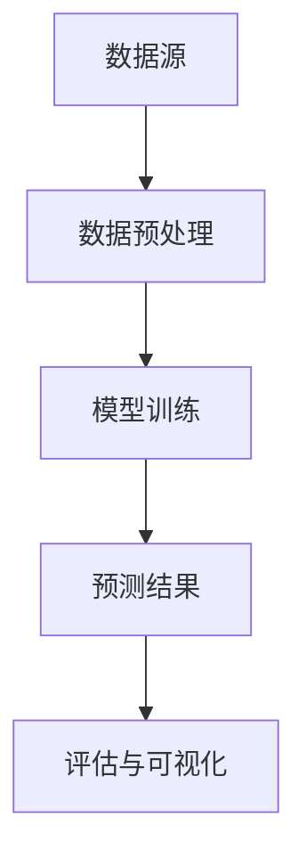

                 


# 注意力机制在金融时间序列分析中的应用

**关键词**：注意力机制、金融时间序列、深度学习、Transformer、自注意力

**摘要**：  
金融时间序列分析是金融领域中的重要研究方向，其核心在于从历史数据中挖掘潜在规律以预测未来趋势。然而，传统的方法往往难以捕捉长期依赖关系和复杂模式。近年来，基于注意力机制的深度学习模型（如Transformer）在自然语言处理领域取得了巨大成功，其强大的全局依赖捕捉能力为金融时间序列分析提供了新的思路。本文将系统介绍注意力机制的基本原理及其在金融时间序列分析中的应用，结合具体案例和数学公式，深入剖析其优势、挑战及未来发展方向。

---

# 第一部分：注意力机制与金融时间序列分析的背景

## 第1章：注意力机制的基本概念

### 1.1 注意力机制的起源与背景
- **注意力机制的起源**：注意力机制最初由Transformer模型提出，是一种基于权重分配的机制，用于捕捉序列中不同位置之间的关系。
- **背景**：在金融领域，时间序列数据通常具有高度的非线性、噪声干扰和复杂依赖关系，传统的统计方法和浅层模型难以有效处理这些问题。

### 1.2 金融时间序列分析的核心挑战
- **挑战1**：捕捉长期依赖关系。
- **挑战2**：处理噪声和异常值。
- **挑战3**：模型的可解释性与稳定性。

### 1.3 注意力机制的优势
- **全局依赖捕捉**：注意力机制能够自动学习序列中任意位置的重要信息，适合处理金融数据的复杂模式。
- **计算效率**：通过权重分配，注意力机制能够在保持较低计算复杂度的同时捕捉全局依赖关系。

---

## 第2章：注意力机制的核心原理

### 2.1 自注意力机制的数学模型
自注意力机制通过计算序列中每个位置与其他位置的权重来生成新的表示。其数学公式如下：

$$
\text{Attention}(Q, K, V) = \text{softmax}\left(\frac{QK^T}{\sqrt{d_k}}\right)V
$$

其中：
- $Q$、$K$、$V$分别为查询、键和值矩阵。
- $d_k$为键的维度。

### 2.2 多头注意力机制的扩展
为了增强模型的表达能力，多头注意力机制将序列划分为多个子序列，分别计算注意力权重：

$$
\text{Multi-head}(Q, K, V) = \text{Concat}(\text{Attention}_1(Q, K, V), \text{Attention}_2(Q, K, V), \dots, \text{Attention}_n(Q, K, V))
$$

### 2.3 位置编码与时间序列的结合
为了保持时间序列的位置信息，通常在模型中引入位置编码（Positional Encoding，PE）。常见的位置编码方法包括基于指数函数的编码：

$$
PE(i, j) = \sum_{k=0}^{n-1} \sin(10000^{j/(2n)} i)
$$

---

## 第3章：注意力机制在金融时间序列分析中的应用

### 3.1 金融时间序列分析的典型场景
- **股票价格预测**：通过注意力机制捕捉价格波动的全局依赖关系。
- **金融事件检测**：利用注意力机制识别异常事件。
- **风险评估与预警**：通过注意力机制分析风险因素的权重。

### 3.2 基于Transformer的金融时间序列模型
- **模型结构**：编码器-解码器架构。
- **输入处理**：将金融时间序列数据输入模型，通过自注意力机制生成高级特征。

### 3.3 实验与结果分析
- **实验设计**：比较传统方法（如ARIMA）与基于注意力机制的模型在预测准确率上的表现。
- **结果分析**：通过实验验证注意力机制在捕捉金融数据复杂模式上的优势。

---

## 第4章：金融时间序列分析中的系统架构设计

### 4.1 系统架构概述
- **数据预处理模块**：清洗、归一化和特征提取。
- **模型训练模块**：基于Transformer的注意力机制模型。
- **预测与评估模块**：生成预测结果并评估模型性能。

### 4.2 系统架构图


### 4.3 系统接口设计
- **输入接口**：接收原始金融数据。
- **输出接口**：输出预测结果和模型评估指标。

---

## 第5章：项目实战与代码实现

### 5.1 环境搭建
- **Python版本**：Python 3.8+
- **深度学习框架**：TensorFlow或PyTorch。
- **金融数据处理库**：Pandas、NumPy。

### 5.2 核心代码实现
```python
import tensorflow as tf
from tensorflow import keras
from tensorflow.keras import layers

class TransformerBlock(layers.Layer):
    def __init__(self, embed_dim, num_heads, **kwargs):
        super().__init__(**kwargs)
        self.embed_dim = embed_dim
        self.num_heads = num_heads
        self.head_size = embed_dim // num_heads
        self.scaling = tf.constant(self.head_size ** -0.5, dtype=tf.float32)
        
    def call(self, inputs):
        Q = K = V = inputs
        # 计算键-查询点积
        attention_scores = tf.matmul(Q, K, transpose_b=True) * self.scaling
        attention_weights = tf.nn.softmax(attention_scores)
        # 加权求和
        output = tf.matmul(attention_weights, V)
        return output
```

### 5.3 数据处理与模型训练
```python
# 数据预处理
data = pd.read_csv('financial_data.csv')
train_data, test_data = split_data(data)
model = TransformerBlock(embed_dim=64, num_heads=4)
model.compile(optimizer='adam', loss='mse')
model.fit(train_data, epochs=10, batch_size=32)
```

---

## 第6章：总结与展望

### 6.1 本文总结
- **总结**：注意力机制在金融时间序列分析中表现出强大的能力，能够捕捉复杂模式和全局依赖关系。
- **优势**：提高了预测的准确性和模型的可解释性。

### 6.2 未来展望
- **改进方向**：结合强化学习优化注意力机制。
- **研究热点**：多模态数据融合与实时金融分析。

### 6.3 小结
- **关键点回顾**：注意力机制的核心原理、数学模型及其在金融时间序列分析中的应用。
- **注意事项**：模型的可解释性与计算效率需要进一步优化。

### 6.4 拓展阅读
- **推荐书籍**：《Deep Learning》、《Transformer in Action》。
- **推荐论文**：《Attention Is All You Need》。

---

**作者：AI天才研究院/AI Genius Institute & 禅与计算机程序设计艺术 /Zen And The Art of Computer Programming**

