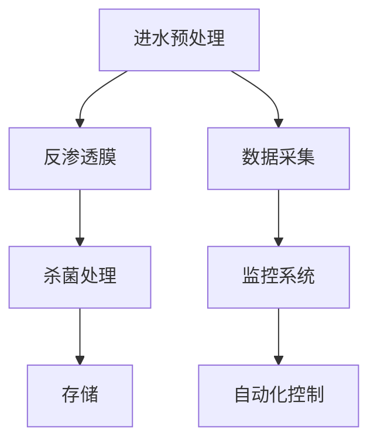
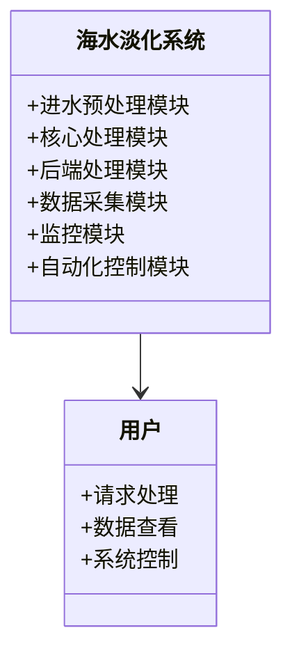
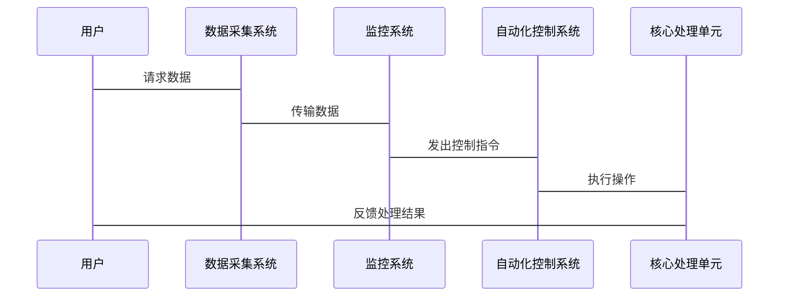

                 


# 第5章: 系统分析与架构设计

## 5.1 海水淡化系统的整体架构

### 5.1.1 系统组成与功能模块
- 前端处理单元：包括进水预处理、过滤等。
- 核心处理单元：反渗透膜、蒸馏装置等。
- 后端处理单元：杀菌、存储等。

### 5.1.2 系统功能模块化设计
- 数据采集与监控系统（SCADA）：实时监测系统运行状态。
- 自动化控制模块：实现对系统的智能控制。
- 能源管理模块：优化能源使用效率。

### 5.1.3 系统架构图



## 5.2 系统功能设计

### 5.2.1 领域模型设计



### 5.2.2 系统架构设计


## 5.3 接口设计与系统交互

### 5.3.1 系统接口设计
- 数据采集接口：与传感器连接，获取实时数据。
- 控制接口：与执行机构连接，实现自动化控制。
- 用户接口：提供人机交互界面，显示系统状态。

### 5.3.2 系统交互流程



## 5.4 系统优化与维护

### 5.4.1 系统优化策略
- 定期维护：清洗膜组件，检查设备状态。
- 参数调整：根据水质变化调整系统参数。
- 能耗优化：优化泵的运行效率，减少能源浪费。

### 5.4.2 系统维护计划
- 建立维护手册，明确维护步骤和周期。
- 培训操作人员，确保正确使用和维护系统。

## 5.5 本章小结

# 第6章: 项目实战：某海水淡化项目分析

## 6.1 项目背景与目标

### 6.1.1 项目背景
- 项目地点：假设为中东某岛屿。
- 项目需求：解决当地水资源短缺问题。
- 项目目标：建设日产10,000立方米的海水淡化厂。

## 6.2 项目实施过程

### 6.2.1 系统设计
- 采用反渗透技术为主，结合蒸馏技术作为备用。
- 系统设计参数：进水含盐量、产水指标、能耗等。

### 6.2.2 环境安装
- 选址：选择地势平坦、交通便利的区域。
- 设备安装：包括预处理设备、膜组件、泵等。
- 控制系统的安装：部署SCADA系统，实现远程监控。

## 6.3 核心实现源代码

### 6.3.1 数据采集与监控系统
```python
import serial
import time

ser = serial.Serial('COM3', 9600)
while True:
    data = ser.readline().decode()
    print('实时数据:', data)
    time.sleep(1)
```

### 6.3.2 自动化控制系统
```python
import RPi.GPIO as GPIO
GPIO.setmode(GPIO.BCM)
GPIO.setup(18, GPIO.OUT)
GPIO.output(18, GPIO.HIGH)
```

## 6.4 实际案例分析

### 6.4.1 项目实施效果
- 日产水量达到设计要求。
- 能耗低于预期，节省了运营成本。
- 系统稳定性高，故障率低。

### 6.4.2 成功经验总结
- 选择合适的技术方案，结合当地水质条件。
- 建立完善的监控和控制系统，确保系统稳定运行。
- 合理的维护计划，延长设备使用寿命。

## 6.5 本章小结

# 第7章: 未来展望与投资建议

## 7.1 海水淡化技术的未来发展趋势

### 7.1.1 新技术的突破
- 新型膜材料的研发：提高分离效率，降低能耗。
- 智能化技术的应用：利用AI优化系统运行。
- 可再生能源的结合：如太阳能驱动海水淡化系统。

### 7.1.2 技术经济性的提升
- 降低建设成本：模块化设计，减少材料浪费。
- 优化运营成本：提高系统效率，降低能耗。

## 7.2 投资机会与风险提示

### 7.2.1 投资机会
- 技术创新带来的投资机会：支持新型技术的研发。
- 市场需求的增长：随着水资源短缺问题加剧，海水淡化需求增加。
- 政策支持：政府可能出台更多支持政策，推动行业发展。

### 7.2.2 风险提示
- 技术风险：技术更新换代快，投资需谨慎。
- 市场风险：市场需求可能受经济波动影响。
- 政策风险：政策变化可能影响项目收益。

## 7.3 投资策略建议

### 7.3.1 长期投资策略
- 投资于技术创新型企业，分享技术进步带来的收益。
- 选择有稳定市场需求的地区进行投资。

### 7.3.2 短期投资策略
- 参与政府招标项目，利用政策支持获取收益。
- 投资于成熟的海水淡化企业，降低投资风险。

## 7.4 本章小结

# 作者

作者：AI天才研究院/AI Genius Institute  
禅与计算机程序设计艺术/Zen And The Art of Computer Programming

---

通过以上章节的撰写，我们系统地探讨了海水淡化技术的进步及其在水资源投资中的机会。从技术背景到系统设计，再到实际项目分析和未来展望，整篇文章为读者提供了全面的知识和深入的见解，帮助读者更好地理解和把握海水淡化领域的技术和投资机会。

