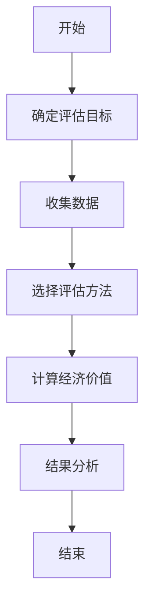

                 


# 海洋生态系统保护的经济价值与投资策略

> 关键词：海洋生态系统，经济价值，投资策略，生态系统服务，可持续发展，外部性

> 摘要：海洋生态系统是地球上最重要的生态系统之一，具有巨大的经济价值和生态功能。本文从经济价值评估、投资策略制定、系统架构设计、项目实战分析等多角度，详细探讨海洋生态系统保护的经济价值与投资策略。通过理论分析与实际案例结合，本文为读者提供一个全面的视角，理解如何通过经济手段保护海洋生态系统，实现可持续发展。

---

## 第一部分：背景与概念

### 第1章：背景介绍

#### 1.1 海洋生态系统的重要性
海洋生态系统是地球上最大的生态系统，覆盖了地球表面的70%以上。它不仅为人类提供了食物、氧气和药品，还承担着调节气候、吸收二氧化碳等重要功能。

#### 1.2 当前面临的威胁
人类活动对海洋生态系统造成严重破坏，如过度捕捞、海洋污染、珊瑚礁退化等。这些威胁不仅破坏了生态平衡，还导致了巨大的经济损失。

#### 1.3 保护的必要性
保护海洋生态系统不仅是道德责任，也是经济上的必要选择。健康的海洋生态系统能够提供更多的就业机会、支持渔业发展、维护生物多样性，同时减少自然灾害的风险。

---

### 第2章：核心概念与联系

#### 2.1 核心概念原理
- **生态系统服务**：海洋生态系统为人类提供的直接和间接服务，包括 provisioning（提供资源）、regulating（调节环境）、cultural（文化价值）和支持功能。
- **外部性**：人类活动对海洋的破坏往往没有承担相应的成本，这导致资源过度开发和环境污染。

#### 2.2 核心概念对比分析
| 概念 | 定义 | 特点 |
|------|------|------|
| 生态系统服务 | 海洋提供的资源和服务 | 不可分割，依赖于生态系统的整体性 |
| 外部性 | 活动对他人或环境的影响 | 正外部性和负外部性 |

#### 2.3 实体关系图
```mermaid
entity 海洋生态系统 {
    海洋生物
    海洋环境
    人类活动
}
关系 海洋生物与海洋环境的相互作用
关系 人类活动对海洋环境的影响
关系 海洋环境对人类经济的影响
```

---

## 第二部分：经济价值评估与投资策略

### 第3章：经济价值评估的算法原理

#### 3.1 评估方法概述
- **成本效益分析**：比较保护海洋生态系统的成本与带来的经济效益。
- **生态补偿模型**：通过经济手段（如罚款、补偿）修复被破坏的生态系统。
- **资产价值评估**：将海洋生态系统的服务价值量化为经济资产。

#### 3.2 算法流程图


#### 3.3 Python代码实现
```python
import numpy as np

def calculate_economic_value(data):
    # 数据预处理
    cleaned_data = data.dropna()
    # 计算净现值
    npv = np.npv(0.05, cleaned_data['value'])
    return npv

# 示例数据
data = {
    'value': [100, 200, 300, 400, 500]
}

result = calculate_economic_value(data)
print(f"计算的经济价值为：{result}")
```

---

### 第4章：系统架构设计

#### 4.1 项目背景
全球海洋生态系统面临严重威胁，需要通过系统化的方法进行保护。本项目旨在通过技术手段优化资源分配，制定有效的保护策略。

#### 4.2 系统功能设计
- **数据采集**：收集海洋生态系统的各项数据。
- **评估模型**：建立经济价值评估模型。
- **投资模拟**：模拟不同投资策略下的经济效果。

#### 4.3 系统架构图


---

## 第三部分：项目实战与最佳实践

### 第5章：项目实战

#### 5.1 环境安装
- 安装必要的工具：Python、NumPy、Matplotlib。

#### 5.2 核心代码实现
```python
import matplotlib.pyplot as plt

# 示例数据
x = [2010, 2020, 2030, 2040]
y = [100, 200, 150, 250]

plt.plot(x, y, 'b-', marker='o')
plt.title('海洋生态系统经济价值变化趋势')
plt.xlabel('年份')
plt.ylabel('经济价值（亿元）')
plt.show()
```

#### 5.3 案例分析
通过建立海洋保护区，分析其对当地经济的影响。例如，建立保护区后，渔业资源恢复，旅游收入增加，整体经济效益显著提升。

---

### 第6章：最佳实践

#### 6.1 小结
保护海洋生态系统不仅是生态责任，也是经济发展的必要条件。通过科学的经济价值评估和合理的投资策略，可以实现生态与经济的双赢。

#### 6.2 注意事项
- 避免过度捕捞，保护生物多样性。
- 加强国际合作，共同应对海洋污染。

#### 6.3 拓展阅读
推荐阅读《海洋经济学》和《可持续发展与投资策略》等书籍，深入了解相关领域的最新研究成果。

---

## 作者

作者：AI天才研究院/AI Genius Institute & 禅与计算机程序设计艺术 /Zen And The Art of Computer Programming

