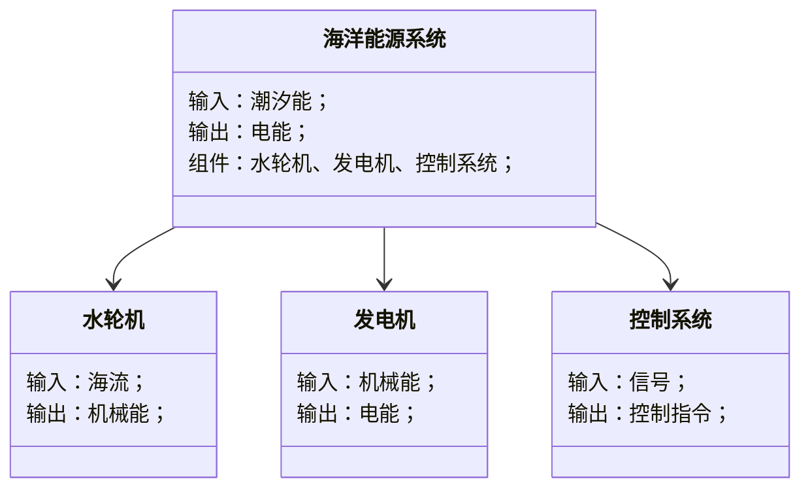
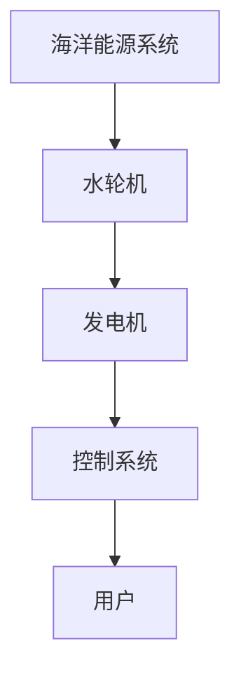
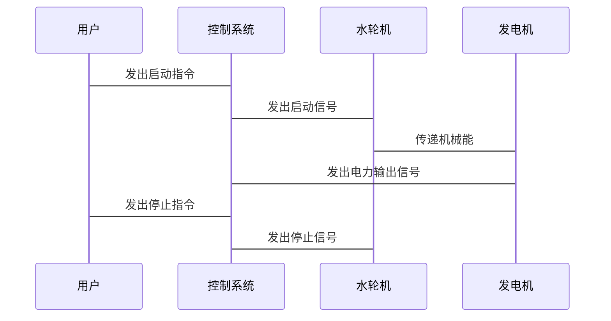

                 

# 海洋能源开发的技术进步与投资机会

**关键词**：海洋能源、潮汐能、波浪能、海流能、投资机会、技术创新

**摘要**：  
海洋能源作为可再生能源的重要组成部分，正逐渐成为全球能源结构转型的关键领域。本文从海洋能源的定义、分类和技术发展现状入手，详细分析了潮汐能、波浪能和海流能等主要海洋能源的技术原理、优缺点及其应用案例。同时，探讨了海洋能源开发中的技术创新，包括新型材料的应用、能源转换效率的提升和智能化监控系统的应用。此外，本文还深入分析了海洋能源的投资机会，包括全球市场现状、主要投资模式和成功案例，并结合实际项目案例，详细讲解了项目规划、系统设计和实施过程。最后，本文展望了海洋能源的未来发展趋势，为投资者和技术开发者提供了有益的参考。

---

# 第1章: 海洋能源开发的背景与概述

## 1.1 海洋能源的定义与分类

### 1.1.1 海洋能源的定义  
海洋能源是指利用海洋中的可再生能源，包括潮汐能、波浪能、海流能、温差能和盐差能等。这些能源具有分布广泛、储量丰富、可持续性强的特点。

### 1.1.2 海洋能源的主要分类  
海洋能源主要分为以下几类：  
1. **潮汐能**：利用潮汐的涨落产生的能量。  
2. **波浪能**：利用海洋波浪的动能和热能。  
3. **海流能**：利用海水流动的能量。  
4. **温差能**：利用海水温度差产生的能量。  
5. **盐差能**：利用海水盐度差产生的能量。

### 1.1.3 海洋能源的重要性与潜力  
海洋能源是未来能源的重要组成部分，具有清洁、可再生、分布广等特点。全球海洋能源的潜在储量巨大，尤其是在沿海国家和地区，海洋能源开发具有重要意义。

## 1.2 海洋能源开发的历史与现状

### 1.2.1 海洋能源开发的历史回顾  
海洋能源的开发历史可以追溯到古代，但真正意义上的现代海洋能源开发始于20世纪中期。早期的技术主要用于科研和实验，随着技术的进步，海洋能源的商业化开发逐渐展开。

### 1.2.2 当前海洋能源开发的现状  
目前，海洋能源的开发主要集中在潮汐能、波浪能和海流能等领域。各国在技术研发和项目实施上取得了不同程度的进展，但整体仍处于起步阶段。

### 1.2.3 全球海洋能源开发的趋势  
随着全球能源需求的增加和环保意识的增强，海洋能源开发正逐渐成为各国能源战略的重要组成部分。未来，海洋能源的技术进步和商业化应用将加速。

## 1.3 海洋能源开发的技术挑战与解决方案

### 1.3.1 技术挑战  
海洋能源开发面临技术复杂性高、成本高、环境适应性差等挑战。

### 1.3.2 技术解决方案  
通过技术创新、材料改进和系统优化，逐步解决技术难题。

### 1.3.3 技术进步对海洋能源开发的推动  
技术进步显著提升了海洋能源的开发效率和经济性，为商业化应用奠定了基础。

## 1.4 本章小结  
本章介绍了海洋能源的定义、分类及其重要性，回顾了海洋能源开发的历史与现状，并分析了技术挑战与解决方案。

---

# 第2章: 海洋能源开发的核心技术分析

## 2.1 潮汐能开发技术

### 2.1.1 潮汐能的定义与特点  
潮汐能是利用海水潮汐的涨落产生的能量，具有周期性、稳定性等特点。

### 2.1.2 潮汐能发电的技术原理  
潮汐能发电主要通过潮汐水位变化驱动水轮机发电。其技术原理包括潮汐流的捕获、能量转换和电力输出等环节。

### 2.1.3 潮汐能发电的优缺点  
- **优点**：能量稳定，技术相对成熟。  
- **缺点**：受地理位置限制，初期投资高。

### 2.1.4 潮汐能发电的实际应用案例  
全球多个国家和地区已建成潮汐能发电项目，如法国的拉西米耶潮汐电站。

## 2.2 波浪能开发技术

### 2.2.1 波浪能的定义与特点  
波浪能是利用海洋波浪的动能和热能，具有分布广、能量密度高的特点。

### 2.2.2 波浪能发电的技术原理  
波浪能发电主要通过波浪能捕获装置将机械能转化为电能。其技术原理包括波浪能的捕获、能量转换和电力输出等环节。

### 2.2.3 波浪能发电的优缺点  
- **优点**：分布广，能量潜力大。  
- **缺点**：技术复杂性高，可靠性较差。

### 2.2.4 波浪能发电的实际应用案例  
全球多个国家正在试验和推广波浪能发电项目，如英国的“波浪能实验室”。

## 2.3 海流能开发技术

### 2.3.1 海流能的定义与特点  
海流能是利用海水流动的能量，具有持续性强、稳定性好的特点。

### 2.3.2 海流能发电的技术原理  
海流能发电主要通过水轮机捕获海流的动能并转化为电能。其技术原理包括海流的捕获、能量转换和电力输出等环节。

### 2.3.3 海流能发电的优缺点  
- **优点**：能量稳定，技术潜力大。  
- **缺点**：受海流速度和分布的影响较大。

### 2.3.4 海流能发电的实际应用案例  
全球多个国家正在试验和推广海流能发电项目，如苏格兰的“海流能试验场”。

## 2.4 其他海洋能源技术

### 2.4.1 温差能  
温差能是利用海水表层和深层的温度差产生的能量，具有能量密度高的特点。

### 2.4.2 盐差能  
盐差能是利用海水盐度差产生的能量，具有潜力大的特点。

### 2.4.3 海底热液矿床能  
海底热液矿床能是利用海底热液喷口的热能和化学能，具有技术复杂性高的特点。

## 2.5 本章小结  
本章详细分析了潮汐能、波浪能和海流能等主要海洋能源的技术原理、优缺点及其应用案例，介绍了其他海洋能源技术的潜力和特点。

---

# 第3章: 海洋能源开发的技术创新与进步

## 3.1 新型海洋能源技术的创新

### 3.1.1 新型材料的应用  
新型材料的应用显著提升了海洋能源装置的耐腐蚀性和机械性能。

### 3.1.2 能源转换效率的提升  
通过技术创新，海洋能源的能源转换效率不断提高，降低了能源浪费。

### 3.1.3 智能化监控系统的应用  
智能化监控系统能够实时监测海洋能源装置的运行状态，提高了系统的可靠性和效率。

## 3.2 技术创新对海洋能源开发的影响

### 3.2.1 技术创新对能源转换效率的提升  
技术创新显著提高了海洋能源的能源转换效率，降低了能源浪费。

### 3.2.2 技术创新对海洋能源开发成本的降低  
通过技术创新，海洋能源的开发成本逐步降低，提高了项目的经济性。

### 3.2.3 技术创新对海洋能源开发的可持续性推动  
技术创新推动了海洋能源的可持续开发，为未来的商业化应用奠定了基础。

## 3.3 未来海洋能源技术的发展方向

### 3.3.1 新型能源转换技术的研发  
未来将重点研发新型能源转换技术，进一步提高海洋能源的利用效率。

### 3.3.2 智能化与数字化技术的应用  
智能化与数字化技术的应用将推动海洋能源开发的自动化和智能化。

### 3.3.3 绿色能源技术的整合  
未来将推动海洋能源与其它绿色能源技术的整合，形成更加高效和可持续的能源系统。

## 3.4 本章小结  
本章分析了海洋能源开发中的技术创新，探讨了这些创新对海洋能源开发的影响，并展望了未来的技术发展方向。

---

# 第4章: 海洋能源开发的投资机会与风险分析

## 4.1 全球海洋能源市场现状

### 4.1.1 市场规模与增长趋势  
全球海洋能源市场正在快速增长，未来几年市场规模将显著扩大。

### 4.1.2 主要市场区域  
海洋能源开发主要集中在欧洲、亚洲和北美洲等地。

### 4.1.3 市场驱动因素  
政策支持、技术进步和能源需求增长是推动海洋能源市场发展的主要因素。

## 4.2 海洋能源开发的投资模式

### 4.2.1 政府主导型投资  
政府主导型投资是海洋能源开发的重要模式，通常用于大型项目。

### 4.2.2 企业主导型投资  
企业主导型投资是海洋能源开发的重要模式，通常用于技术创新和商业化应用。

### 4.2.3 公私合作模式  
公私合作模式是海洋能源开发的新兴模式，能够有效整合资源和优势。

## 4.3 海洋能源开发的风险分析

### 4.3.1 技术风险  
技术复杂性和不确定性是海洋能源开发的主要技术风险。

### 4.3.2 市场风险  
市场需求的不确定性和价格波动是海洋能源开发的市场风险。

### 4.3.3 环境风险  
环境影响和生态破坏是海洋能源开发的环境风险。

## 4.4 成功案例分析

### 4.4.1 欧洲海洋能源开发的成功经验  
欧洲在潮汐能和海流能开发方面取得了显著成就。

### 4.4.2 亚洲海洋能源开发的成功经验  
亚洲在波浪能和盐差能开发方面取得了显著成就。

## 4.5 本章小结  
本章分析了全球海洋能源市场的现状和投资机会，探讨了不同投资模式的风险与收益，并结合成功案例分析了投资的关键因素。

---

# 第5章: 海洋能源开发的项目实战

## 5.1 项目背景与目标

### 5.1.1 项目背景  
本项目旨在开发一个小型潮汐能发电系统，用于解决偏远地区的能源供应问题。

### 5.1.2 项目目标  
通过技术研发和系统设计，实现潮汐能的高效利用和商业化应用。

## 5.2 项目系统设计

### 5.2.1 领域模型类图  
以下是项目领域的领域模型类图：  

### 5.2.2 系统架构设计  
以下是项目的系统架构图：  

### 5.2.3 接口设计  
以下是项目的接口设计：  

## 5.3 项目实施与经验总结

### 5.3.1 项目实施过程  
项目实施包括前期调研、系统设计、设备采购、安装调试和运行测试等阶段。

### 5.3.2 项目经验总结  
项目实施过程中，技术创新和团队协作是项目成功的关键。

## 5.4 本章小结  
本章通过实际项目案例，详细讲解了海洋能源开发的系统设计和实施过程，并总结了项目经验。

---

# 第6章: 未来展望与投资建议

## 6.1 未来海洋能源技术的发展趋势

### 6.1.1 新型能源转换技术的研发  
未来将重点研发新型能源转换技术，进一步提高海洋能源的利用效率。

### 6.1.2 智能化与数字化技术的应用  
智能化与数字化技术的应用将推动海洋能源开发的自动化和智能化。

### 6.1.3 绿色能源技术的整合  
未来将推动海洋能源与其它绿色能源技术的整合，形成更加高效和可持续的能源系统。

## 6.2 未来海洋能源投资的动向

### 6.2.1 新技术的研发投资  
未来将加大对新型海洋能源技术的研发投资。

### 6.2.2 项目规模化发展  
未来将推动海洋能源项目的规模化发展，降低单位成本。

### 6.2.3 国际合作与共享  
国际合作与共享将推动海洋能源技术的全球发展。

## 6.3 投资建议

### 6.3.1 关注技术创新  
投资者应关注海洋能源领域的技术创新和专利布局。

### 6.3.2 选择优质项目  
投资者应选择地理位置优越、技术成熟、市场潜力大的项目进行投资。

### 6.3.3 加强国际合作  
投资者应加强国际合作，充分利用全球资源和技术优势。

## 6.4 本章小结  
本章展望了海洋能源技术的未来发展趋势，分析了投资动向，并提出了具体的投资建议。

---

# 第7章: 结论

## 7.1 全书总结  
本书系统介绍了海洋能源开发的技术进步与投资机会，分析了主要海洋能源技术的原理、优缺点及其应用案例，探讨了技术创新对海洋能源开发的推动作用，并结合实际案例分析了投资机会和风险。

## 7.2 未来研究方向  
未来研究方向包括新型能源转换技术的研发、智能化监控系统的优化和海洋能源与其他绿色能源的整合。

## 7.3 投资建议  
投资者应关注技术创新、选择优质项目、加强国际合作，充分利用全球资源和技术优势。

## 7.4 作者寄语  
海洋能源是未来能源的重要组成部分，其开发和应用将为全球能源结构转型和可持续发展做出重要贡献。

---

**作者**：AI天才研究院/AI Genius Institute & 禅与计算机程序设计艺术/Zen And The Art of Computer Programming

